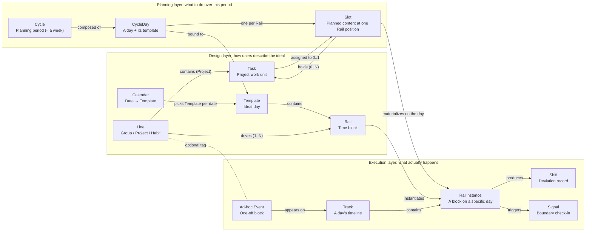

# DayRail Product Design Document (ERD)

> **Status**: living document — any decision here can be overturned. Last updated 2026-04-19 (v0.4 implementation pass · self-use MVP ready). See `docs/ROADMAP.md` for the current-state snapshot and parked-work list. Session summary (post-habit-binding-refactor): (1) `rail.recurrence` **removed** — Template + CalendarRule + `HabitBinding.weekdays` are the three canonical filter layers; the rail-level weekday filter produced empty-intersection traps. (2) Multi-task per `(rail, date)` slot is now fully honoured end-to-end — CycleCell stacks per-task pills, Today Track renders per-task rows with independent state + actions, Pending acts on each task individually, §4.1 invariant is visible in UI. (3) §5.5.0 B rhythm-strip click-to-backfill wired. (4) §10.3 config-change purge live with confirm + Edit Session batching (HabitDetail binding edits + Template Editor rail delete). (5) Backlog drawer lifted to App shell — `g b` shortcut, SideNav entry, in-drawer quick-create with Line picker. (6) `scheduleTaskToRail` / `scheduleTaskFreeTime` auto-flip `deferred → pending` on new slot. (7) Review gains period-over-period match% delta + per-row stats + per-phase band stats; HabitDetail rhythm strip gets matching phase-band overlay + per-phase match%. (8) Cycle cells are draggable for reschedule. (9) Backup export/import round-trip via snapshot write + OPFS reset (Settings → Advanced). (10) 35 vitest cases across three suites cover materializer + §10.3 purge + timeline/check-in/pending selectors. Later history entries below capture earlier decisions. Last updated 2026-04-19 (v0.4 habit-binding refactor + task editing surface). Four bundled changes: (1) New `HabitBinding` entity (habitId + railId + optional weekdays filter) replacing the old `Rail.defaultLineId === habit.id` binding mechanism. Fixes the structural awkwardness of "two habits on the same time-slot different weekdays stack as two overlapping rails in one template". (2) `Rail.defaultLineId` is removed outright — its two jobs are absorbed by `HabitBinding` and "re-add with a real picker if needed" respectively. Cycle-View quick-create defaults to Inbox. (3) Today Track RailCard and Cycle View slot popover both gain a path into `TaskDetailDrawer` for inline edits of note / sub-items / milestone / schedule. (4) Auto-task editability matrix is fixed: title / schedule / milestone are read-only (they are habit-level properties); note / sub-items are editable (they are per-occurrence context). Renaming a habit only affects future auto-tasks; historical ones keep their name thanks to materializer idempotency. §5.5.0 / §10.2 / §10.3 / §10.4 / §5.2 / §5.3 all updated in this pass. History: 2026-04-19 (major data-model consistency pass · v0.4 foundation). Six changes bundled: (1) §10 gains a **three-axis overview** + **completion-status ownership rule** — Line / Rail-Template-Time / Task are three orthogonal axes, `Task.status` is the sole source of truth for all completion semantics, and RailInstance narrows to a "wall-clock log" (actualStart/End + Shift tags). This closes the v0.3 cracks where `Task.status` and `RailInstance.status` both existed and could drift apart ("ticked done in Tasks but Today Track still shows pending"). (2) Habit "each occurrence" becomes an **auto-task** (idempotent id `task-auto-{habitId}-{date}`, `lineId = habitId`, `title = habit.name`). Habit Line gains the hard "no hand-built Tasks" constraint; NewTaskInput never renders for habits. Habit and Project converge on the same completion path — Today Track / Pending / Review all query Task.status. (3) §10.2 fixes the auto-task materialization strategy at Ⅱ · **on-demand**, triggered by: Today Track boot / Cycle View switch / rhythm strip open / Calendar month page / Review scope switch / rhythm-strip click-to-backfill. Each `(habitId, cycleId)` materializes once and is marked; idempotent ids prevent duplicate rows. (4) §10.3 defines habit configuration-change rules: when a Rail's recurrence / time / templateKey / defaultLineId changes, we scan `[today, end of furthest materialized cycle]` and **only touch** auto-tasks matching `status='pending' AND plannedStart > now` (purge + top up under the new config); completed / skipped / archived ones stay. All three event types (task.purged + task.created + rail.updated) sit under one Edit Session for one-click undo. Confirm dialog before save. (5) §5.5.0 adds **A+B rhythm-strip interactions**: A is read-only, B lets the user click any cell for `done / skipped / shifted / clear`, upserting (materializing on demand) as needed. Primary path (today) is Today Track; safety net (missed / forgot / retroactive) is inline on the strip. (6) §5.5.0 **explicitly closes** the open question on "collapse habit and Rail into one entity" — the current three-axis separation is a feature: Template = structurally different days, a habit is "an activity scheduled *into* a day" not "a cron over the calendar", and re-planning habits when adding a new template is *the point* of having Templates. The three old framings ("cross-template means copying rails", "sick-day flip makes habit not fire", "new template requires manual migration") all invert: these are not pain points, they are the design. §5.6 / §5.7 / §5.8 write paths are all updated to read/write Task.status; `RailInstance.status` is deprecated in v0.4 and scheduled for cleanup in v0.5. History: 2026-04-18 (§5.5.0 Habit view mental-model correction (v0.4 anchor): from the user's perspective **a habit is one recurring thing**, not a bucket of Tasks. A Project aggregates N Tasks toward a goal; a Habit is one thing with recurrence. Habit Lines gain a hard "hold zero Tasks" constraint; the habit detail page is de-Project-ified — NewTaskInput / FilterBar / GroupedTaskList are removed and replaced with name+color+current-phase → 14-day rhythm strip → bound Rails list → phase timeline → notes → Danger. The previously-discussed "folded Tasks drawer under habit" (Option B) is explicitly rejected — the mental-model cost of a mixed surface outweighs the "where do buy-shoes go" ergonomic. Whether `Line.kind='habit'` eventually collapses into Rail (habit = a Rail family with phase/color, no Line) stays a deferred schema-level open question and is not part of this change. History: 2026-04-18 (§5.5.0 Habits go live (v0.3.3): habits split into two tiers — "simple habits" (default, fixed-intensity, phase concept stays hidden) and "progressive habits" (opt-in; after `+ 启用 phase 追踪` the user can add any number of time-segment labels). HabitPhase is a user-defined time-segment label (`{ name, description?, startDate }`) — no endDate, no preset enum, no auto-advance, no streak / completion-rate derivation (that's v0.4 Review work). Enabled/disabled is derived from count of associated HabitPhase records (≥ 1 = enabled); no `Line.phaseEnabled` flag. §10 replaces the earlier over-engineered `type Phase` (with `advanceRule` / `railOverrides`) with `type HabitPhase`; `type Line` drops the inline `phases` / `currentPhaseId` / `tasks` fields in favor of `kind` as the union discriminator + associated entities; `Line.createdAt` / `archivedAt` / `deletedAt` normalize to `number` (epoch ms) matching the implementation. New events `habit-phase.upserted` / `habit-phase.removed`. History: 2026-04-18 (§5.3.1 Edit Session expanded to Cycle View in v0.3: entering `/cycle` opens an implicit session; CycleDay template switches, Slot drag-drop scheduling / unscheduling, slot-popover "Remove" and "Mark done", quick-create tasks, and orphan-guard batch unscheduling all tag the same `sessionId`; the top bar carries a persistent "⤺ Undo this edit · N" button that rolls the whole batch back in one click (leave / 15-min idle closes the session). Core-side: `overrideCycleDay` / `clearCycleDayOverride` / `scheduleTaskToRail` / `unscheduleTask` / `createTask` / `updateTask` all gain an optional `sessionId` param — `appendEvent` carries it through, and `undoEditSession`'s drop-session-events walker reverts the lot. Per-action rollback entries (slot popover Remove, CycleDay popover Restore default) stay as a finer-grained safety net. History: 2026-04-18 (§5.4 CalendarRule v0.3 advanced rules go live: typed `value` variants for `weekday` / `cycle` / `date-range` + resolver + UI all landed. Resolver walks rules by priority desc (single-date 100 > date-range 50 > cycle 30 > weekday 10), falling back to the built-in heuristic only when every rule misses. Weekday rules are seeded on first boot (workday covers Mon–Fri / restday covers weekends) — behavior matches the old hardcoded heuristic, so no breaking change and OPFS doesn't need wiping. The "Advanced Calendar Rules" drawer returns: four sections (single-date / date-range / cycle / weekday) with list + create-form + delete per section; v0.3 uses a "delete + re-create" edit model (in-place edit lands in v0.3.1); the drawer **does not** enter the §5.3.1 Edit Session — same immediate-apply stance as Cycle View. §10 `type CalendarRule` gains typed value variants + v0.3 implementation notes; §5.4 drawer subsection tightened to match. History: 2026-04-18 (Routing library + URL scheme locked in: v0.2 uses `react-router-dom` v6, not `@tanstack/router` — the typed-params upside is priced above its current complexity payoff. URL scheme: `/` / `/cycle` / `/tasks` + `/tasks/inbox` / `/tasks/line/:lineId` / `/tasks/archived` / `/tasks/trash` / `/review` / `/pending` / `/calendar` / `/templates` / `/templates/:key` / `/settings` / `/settings/:section`. What goes in the URL: Tasks selection, Settings section, Template tab. What stays in component state: search query, filter chips, Cycle View anchorDate — complexity vs payoff doesn't clear the bar for v0.2. See `docs/v0.2-plan.md §3`. History: 2026-04-18 (§5.3 Cycle View top-DAYS block folded into the section mini-headers: the former "top-level day header (single, spans all sections)" is retired; each section mini-header is now the **sole** CycleDay template-switch entry — every date cell is itself the trigger, opening the same popover (template list + a "Restore default" footer when the day is overridden). The overridden indicator dot moves from the top DayButton into the mini-header's date cell. Rationale: two DAYS rows duplicated information and the top block + sticky summary strip ate vertical space; "one action, one entry point" is preserved — the entry just moved from "one top-level master" to "each section's own days within its mini-header". History: 2026-04-18 (§5.3 Cycle View orphan-task guard on template switch: flipping a CycleDay's template could silently orphan Tasks scheduled to the old template's Rails (`task.slot` still pointed at a Rail the new template doesn't render). Now gated: N=0 flips silently; N>0 triggers a small confirm `Switching will remove N scheduled tasks · Continue / Cancel`, which on continue batch-unschedules those Tasks before writing the rule. "Restore default" follows the same guard. §5.5 Tasks view list shape change: Status chips are gone from the top row; the list body now renders as two collapsible groups — "Open" (expanded) and "Completed" (collapsed by default). Open being empty flips Completed open automatically and shows "All clear ✓" in Open's slot. Archived / Trash still live only in the left-column nav; an active search expands both groups. History: 2026-04-18 (Cycle View CalendarRule persistence: §5.3's CycleDay template switch now writes `calendar-rule.upserted` / `calendar-rule.removed` events instead of living in local state, deduplicated by `cr-single-{date}` id; §5.3.1 Edit Session scope for v0.2 narrows to Template Editor only — Cycle View's session-level undo pushes to v0.3, with in-view mistakes walked back via the Slot popover's "Remove assignment" + CycleDay popover's "Restore default" as single-action rollbacks; §10 CalendarRule gains a v0.2-implementation note — only `single-date` kind is live, id convention + priority=100 + event shapes). History: 2026-04-18 (§5.5 refactored from `Projects / Lines View` → `Tasks View`, positioned as the primary task-management surface — left-column nav tree (Inbox + Projects + Habits + Trash) + cross-Project task list with search / filter + a scheduling popover offering two modes (Bind-to-Rail · default / Free-time · escape hatch); a built-in Inbox Line (`isDefault: true`, undeletable) becomes the default container for tasks created without a Project; comprehensive reversibility + soft-delete model (Task / Line / AdhocEvent `status` gains `'deleted'`, Trash entry + a confirmed `*.purged` hard delete); `AdhocEvent` gains `taskId` to back the free-time scheduling mode; Project progress bar becomes conditional (only rendered when at least one task has a milestone), task count always visible; open-ended Projects (missing `plannedEnd`) are explicitly NOT a risk signal; §10 Task/Line/AdhocEvent types updated; terminology audit: `Chunk` renamed to `Task` end-to-end (types + events + schema + UI + ERD) to retire an internal-only jargon term; `Line` stays as an internal umbrella type (`kind: 'project' \| 'habit' \| 'group'`) but **the word "Line" never appears in UI copy** — surfaces always show the concrete Project / Habit / Tag; the `Pending` view is renamed `待决定 / Unresolved` so it no longer overloads the `status='pending'` enum; §5.7 Pending drops its 24h aging filter — it's now the complete "awaiting a decision" set, with the check-in strip serving as the "last-24h" subset view). History: 2026-04-17 (check-in action set simplified: the old four-button `Done / Skip / Shift / Ignore` + four-sub-action sheet collapses into three buttons `Done / Later / Archive`; `RailInstance.status` becomes `pending / done / deferred / archived` (`active` and `skipped` retired — "currently happening" is wall-clock-derived); Shift sheet replaced by a 6-second Reason toast (3 quick-reason tag chips + Undo, no mandatory reason); Postpone / Replace / Swap / Resize removed from the Shift types — within-day postponing is handled by Cycle-View drag, the rest deferred to v0.3; Pending queue renamed and now absorbs both explicit `deferred` items and stale-`pending` items > 24h — two sources, one exit; §5.8 Review heatmap's three-part hatching semantics rebound to `deferred / archived / pending-stale`). History: 2026-04-16 (Group A UI baseline: sync-status badge, Now-View rhythm bar, Ad-hoc overlay, generalized Edit Sessions, Cycle notation → C1, per-view date-format table; Group B Now-View structure: multi-task pill row, three Slot shapes, Next-Rail visual spec, removal of the left rail visualizer, `CURRENT RAIL` chip, Now top-bar `Now` + Mono subtitle; Group C Today-Track Shift interactions: Skipped state via hatching, desktop hover-revealed action bar, Active main CTA → tonal `Done`, unified Shift-tag sheet, single timeline with no bento; Group D Cycle-View skeleton: per-template stacked sections, top day-header as the sole template-switch entry, Cycle pager picker, summary-strip aggregates, `⤺ Undo this edit` button, three-part hatching semantics, Backlog as split drawer; Group E Template Editor: no Save button + first-run inline banner, Radix 10-color popover, sticky tab bar + 2px color strip + dashed `+ New template`, summary strip, card-style Rail row + time-pill popover picker, inter-row gap chip `+ Fill Rail`, `⋯` row menu carrying Line binding / check-in toggle; notification rework: drop OS push / Capacitor notifications / permission pipeline, Signal collapses to a `showInCheckin` boolean, §5.6 and §5.7 unified — the check-in strip and the pending-decisions queue are two tenses of one mechanism; Group F missing screens: Projects / Settings share the master-detail form, Review per-scope waterfall + rhythm-match heatmap (state tints + the three-part hatching semantics), pending-decisions queue is date-reverse grouped with four inline actions per row and the side-nav shows a `·` dot without a number, Calendar is a standard month grid + per-date popover + Advanced-rules drawer with four sections, new §5.9 Settings defines five sections + a three-way theme toggle defaulting to follow-system + Language in Appearance / Time format + AI output-locale in Advanced; Group G design language: Terracotta CTA uses `orange-9/10/11` three solid tones (no gradients); No-Line Rule with explicit whitelist (decorative color strips + sticky hairline + focus rings); four-tier Surface tokens `sand-1..4` replace `border`-based hierarchy; radius tokens `sharp / sm / md / lg` = `0 / 6 / 10 / 16`; zero glassmorphism app-wide; Intentional Asymmetry as the default layout principle. Visual-implementation adjustments: Rail palette drops `olive / mauve / gray` (visually too close to sage / slate, or identity-less), swaps in `grass / indigo / plum` to fill the missing saturated-green / cool-blue / creative-purple slots — still 10 colors but every one perceptibly distinct. CN primary font swapped PingFang → Noto Sans SC (Source Han Sans SC) for cross-platform consistency. Terracotta CTA re-bound from `orange-9` to `bronze-9` — `orange-9` read as SaaS-vivid on screen; `bronze-9` sits much closer to the ERD's original #C97B4A "warm terracotta" intent).
>
> This describes DayRail's product logic, interaction design, and tech choices. It is not a final blueprint — it captures intent and trade-offs (including paths we considered and rejected) so contributors can see *why* the code looks the way it does.
>
> **Want to push back or weigh in?** §11 lists the questions that are still open — each one is a valid issue / discussion topic. "This rule feels wrong" and "here's a case you didn't list" are both welcome.

---

## 1. Core Philosophy

> **Be kinder to yourself. Keep moving, gently.**

Being hard on yourself doesn't make tomorrow better — it only exhausts you. Environmental friction and random disruption are unavoidable; we can let them in the way we let in a breath. That is not giving up on self-discipline; it's the recognition that **permitting deviation is what lets the rhythm continue at all**.

Under that: **Routine is the default, not a cage.** DayRail believes a good daily rhythm isn't built by rigidly executing a schedule, but by laying down a comfortable track — doing roughly the same things at roughly the same times each day. The track gives you direction and certainty, but you can switch lanes, slow down, or skip at any moment. No explanations needed. No "failure" label.

Three layers:

1. **Order is a starting point, not a goal.** Deviation (Shift) is a first-class action.
2. **Repetition produces rhythm; rhythm produces freedom.** Templated Tracks remove daily decision fatigue.
3. **Tools should be quiet.** No leaderboards, no achievements, no streak-break notifications. Only a gentle question at each block boundary: continue, adjust, or skip? Then silence.

Analogy: most schedulers are **coaches** — telling you what to do and scolding you when you don't. DayRail is a **railway** — laid quietly in the ground. Step on and you move forward. Step off anytime. The rails don't disappear; they'll be there tomorrow.

If your daily behavior can't follow a pattern, DayRail won't judge you — the pattern probably just doesn't suit you. A small tweak (different time, different activity) is often all it takes.

---

## 2. Positioning & Differentiation

### 2.1 Who it's for

DayRail targets people who:

- **Plan ahead** (set next week on Sunday night, not on the fly)
- **Have a similar daily rhythm** (wake, work, exercise, read — roughly the same times)
- **But need flexibility** (refuse to let a single deviation collapse the whole plan)

They don't lack planning ability. They lack a **plan container that absorbs deviation**.

### 2.2 Versus typical tools

| Scenario | Normal TODO / calendar app | DayRail |
| --- | --- | --- |
| Long-term goal breakdown | Manually split into many TODOs, set times one by one | Lines describe long arcs natively; AI can decompose into Rails |
| Task slipping | Adjust each TODO's time manually, or push everything back | One Shift; downstream Rails handled automatically |
| Daily repetition | Recreate or use coarse "recurring task" support | Template + Track; edits on a day don't mutate the template |
| Deviation feedback | Red overdue labels, pile-up, broken streaks | Shift is a neutral record; no failure semantics |
| Weekly planning | Copy-paste day by day | Cycle View lays down a full cycle at once; one click undoes the whole session |

### 2.3 Boundaries

| Dimension | DayRail is | DayRail is not |
| --- | --- | --- |
| View of time | Soft-structured timeline | Rigid calendar / meeting scheduler |
| Target user | Individuals building sustainable routines | Team collaboration / project management users |
| Core action | Design an "ideal day/week" + adjust as it happens | Note-taking / to-do list / GTD |
| Feedback | Light-touch Signal + gentle AI review | Streaks, badges, reminders, nagging |
| Data ownership | Local-first, fully user-controlled | Cloud-centralized, account-bound |

**Deliberately not built**: streak counts, failure prompts, social ranking, aggressive reminders, complex priority systems.

> "Complex priority systems" = scoring engines, auto-reshuffle based on weights, priority-driven reminder escalation. The single-value `P0 / P1 / P2` hint on `Task` (§5.5) is **not** what this clause rejects — it's a passive visual tag the user sets by hand; it does not drive any scheduler, check-in boost, or notification.

---

## 3. User Stories

These stories act as a design touchstone — any new feature should plug naturally into at least one of them.

### A — Meiyu, the planning-ahead grad student

> Second-year Master's student. Plans her week on Sunday night.
>
> 9pm Sunday, she opens DayRail, switches to Cycle View, and starts planning the next Cycle. She replaces the 19:00–21:00 "Leisure Rail" with a "Review Rail" across five days in one drag. Wednesday she learns a paper draft is due — she swipes left on Thursday's "Morning Run" to skip it. Friday an impromptu advisor meeting comes up; she adds a 14:00 Ad-hoc Event on the Calendar — no template is touched. End of the Cycle, the review page shows this Cycle's plan hit 87%. If she'd changed her mind on Monday, "undo this planning session" would've reverted all five replacements at once. The next Cycle is the default rhythm again.

### B — Yang, the on-and-off runner

> Engineer whose morning-run habit keeps collapsing into meetings.
>
> He creates a Habit Line "Morning Run" with two Phases: 30 min for two weeks, then 40 min. Mon–Wed: done. Thu he oversleeps — he tags the Shift `low energy` and moves on. Fri: skip, "too-early meeting." A month later AI Review says: "Thursday runs were skipped 3 of 4 weeks. Want to move Thursday to an 8pm evening run?" He accepts; the Template tweaks; the Line's Phase-2 Thursday Rail follows.

### C — Ann, the group project student

> Junior, three weeks to deliver a group report.
>
> She creates a Project "Market research report" (planned window 2026-04-20 → 2026-05-10) and breaks it into Tasks: "Pick a topic 20%", "Send out survey 50%", "Analyze data 80%", "First draft 100%", plus a few supplementary items without a milestone percent ("tidy references", "format check"). She drags each Task into a Slot on a specific CycleDay + Rail ("Analyze data" goes into next Wednesday 14:00–16:00). A teammate delay slips "Send out survey" by two days — she clicks "Later" on that RailInstance (`status → deferred`), it joins the Pending queue, then in Cycle View she drags it to Friday, which resets plannedStart/End back to `pending`. Other Tasks are unaffected. When the 100% Task is marked done, the Project auto-archives.

### D — Lin, the no-AI minimalist

> No interest in AI; loves the railway metaphor.
>
> At first launch the AI intro card shows; she taps "later." Everything runs locally — no account, no network, no AI. She uses only Template + Track + Shift. That's always enough.

### E — Kai, the cross-device power user

> Frontend engineer: macOS at home, iPhone on commute, Windows at work.
>
> Sets up Templates and two Lines on Web (Windows), enables sync in settings, picks Google Drive, one-click OAuth. Home on the Mac desktop app: enable sync, authorize the same Google Drive account, enter the encryption passphrase once — both his Rail data and his settings (OpenRouter key, theme, fallback chain) flow in from the same Drive folder. One sync channel, nothing else to configure.

---

## 4. Core Concept Model

### 4.1 Entities

- **Rail**: A recurring time block. Fields: name, start/end, color/icon, recurrence, default action, Signal permission, optional Line link.
- **Template**: The "ideal version" of a Track / CycleDay. Users can have many. MVP ships two built-ins: `workday` and `restday`, freely editable. Applied to dates via the **Calendar**.
- **Cycle**: A contiguous planning period. Default length 7 days (Mon–Sun), **extendable for long-holiday scenarios**; the next Cycle starts the day after and defaults to running through the next Sunday (or the user adjusts). The Cycle is the organizing unit of the planning view (§5.3).
- **CycleDay**: One day within a Cycle, bound to a `templateKey` (MVP defaults to toggling between `workday` / `restday`; other templates also allowed), containing one Slot per Rail.
- **Slot**: The **planning-side content container** for one Rail position on one CycleDay. Can hold both:
  - Optional `taskName` (free text) — for one-off items that don't warrant a Project ("call mom").
  - Ordered `taskIds` — Task assignments belonging to some Project.
  The Slot is design-time (what you plan for this position); on that day it materializes into a **RailInstance** (run-time).
- **Track**: One day's timeline, composed of RailInstances. Generated from that day's CycleDay + template; edits made on Today Track do not mutate the template or its CycleDay.
- **RailInstance**: The run-time instance of a Rail on a specific day, carrying `status` (pending / done / deferred / archived), `plannedStart` / `plannedEnd`, optional `actualStart` / `actualEnd`, per-day overrides, and (if any) the `sessionId` of its planning session. "Currently happening" (current rail) is NOT a separate status — it's purely derived from wall-clock position (`plannedStart ≤ now ≤ plannedEnd` with `status='pending'`).
- **Shift**: A record of a `pending → *` transition on a RailInstance. v0.2 keeps two types: `defer` (Later; lands in Pending) and `archive` (no more scheduling). May optionally carry tags from a global shared library (see §5.7). Within-day postponing is handled by Cycle-View drag; `swap / resize / replace` are deferred to v0.3.
- **Signal**: Lightweight check-in at a Rail boundary — named after the railway signal at each crossing: it lights up, it doesn't command. `continue` / `adjust` / `skip`.
- **Ad-hoc Event**: A one-off time block not belonging to any template. Higher priority than template resolution. Optionally attached to a Line.
- **Line (internal container type · never in UI copy)**: DayRail's only multi-Rail / Task grouping concept, forming a continuum. `Line` exists only in types / schema / event log — UI views / menus / copy always show the concrete shape per `kind`: `Project` / `Habit` / `Tag` (formerly "Group").
  - **Three states**: `status: 'active' | 'archived' | 'deleted'`. `archived` is a user-intentional terminal state (restorable); `deleted` is a soft delete (visible in Trash, restorable; hard delete only via an explicit "permanently delete" confirmation).
  - **Inbox is a built-in singleton Line**: `id = 'line-inbox'`, `kind = 'project'`, `isDefault: true`, undeletable and uneditable. Every task the user creates without picking a Project lands here (see §5.5.1).
  - No phases, no tasks → **Pure group (tag-like)**. Just for labeling (e.g., "Work", "Medical").
  - With phases → **Habit Line (UI: "Habit")**. Open-ended, evolves by phases (duration, target params, advance rules: by days / completions / manual). The home for **daily recurring things** (morning run, English reading) — high-frequency recurrence is not a Project, it's a Habit.
  - With tasks → **Project Line (UI: "Project")**. Finite but append-extensible. See the Task entry below.
  - **Line ↔ Rail is one-to-many**: a single Line can drive multiple Rails (group assignment split into 5 independently Shift-able Rails).
  - A Phase / Task may target all Rails in the Line or specific Rail IDs.
  - Lines can be decomposed manually or with AI assistance (§6).
- **Task**: The execution unit of a Project Line. Fields:
  - `title`, `subItems` (internal checklist, not scheduled individually), `status` (pending / in\_progress / done), `order` (draggable).
  - **Optional** `milestonePercent` (0–100): tasks with a percentage are *milestones*; tasks without are *supplementary items*. Projects support **unbounded appending** of tasks (including new milestones) until archived.
  - **Task completion is global**: a Task goes into at most one Slot (Task ↔ Slot is 1:1; one Slot can hold many Tasks). The Slot just says "this is where I plan to advance it"; marking it done at any Slot flips the Task globally to `done`, reflected everywhere.
  - **Project progress**: the **max** `milestonePercent` among done Tasks (not a weighted sum; Tasks without a `milestonePercent` don't affect progress but count toward "items done").
  - **Archive trigger**: when a Task with `milestonePercent === 100` transitions to `done`, the Project auto-archives. Users can also archive manually at any time. No unarchiving; use **clone-to-new** for a "v2" — avoids long-tail zombies.
  - **Planned window** (Project-level): optional `plannedStart` / `plannedEnd`, used as soft hints — assigning a Task to a date outside the window warns but doesn't block.
  - **Priority (lightweight hint)**: optional `priority: 'P0' | 'P1' | 'P2'` (unset = no priority). **Passive**: does not drive any scheduler, check-in weighting, notification escalation, or auto-reshuffle — the "complex priority systems" §2 rejects. **Active** as a sort / group / filter key in Cycle-View task lists and any future list surface (so the user can "show me P0 only", "sort P0 → P2", "group by priority"). Rendered in the UI as a small chip on each Cycle-View task pill (`P0` = red, `P1` = amber, `P2` = slate); editable via the per-pill popover and the `TaskDetailDrawer`. Habit auto-tasks can carry priority too (inherits/defaults to unset; user can set per-occurrence via the detail drawer).
- **Planning session** *(internal)*: A burst of Cycle-View edits performed in one sitting; their RailInstance overrides share an internal `sessionId`, enabling "undo this planning session" as an atomic action. Not a user-facing noun — there is no Plan page, no naming, no promotion flow. For recurring multi-week patterns (exam week, travel week), users build a dedicated Template and apply it via the Calendar.

### 4.2 Concept Overview (Mermaid)



> A burst of Cycle-View edits is an internal "planning session" — all overrides in it share a `sessionId` for atomic undo, but the session is not surfaced as a named entity.

### 4.3 Relationships (text)

```
Template      ──materializes──▶ CycleDay.templateKey
Cycle         ──contains ─────▶ CycleDay[]
CycleDay      ──has ──────────▶ Slot[] (one per Rail)
Slot          ──holds ────────▶ Task[] (0..N, one-to-many)
Task         ──assignedTo ───▶ Slot (0..1, at most one)
Task         ──belongsTo ────▶ Line (Project variant)
Line          ──drives ───────▶ Rail[] (1..N)
Line(Project) ──progress ─────▶ max(milestonePercent of done Tasks)

CycleDay      ──generates ────▶ Track (one per day)
Track         ──contains ─────▶ RailInstance
RailInstance  ──reflects ─────▶ Slot content (taskName + tasks)
RailInstance  ──produces ─────▶ Shift (zero or more)
RailInstance  ──triggers ─────▶ Signal (zero or more)
Calendar      ──resolves ─────▶ Template (or Ad-hoc Event) for a date
sessionId     ──groups ───────▶ one planning session's overrides (internal)
```

### 4.4 State Machine (RailInstance)

```
               ┌── Done ────────────▶ done       (terminal)
               │
   pending ────┼── Archive ─────────▶ archived   (terminal)
               │
               └── Later (defer) ───▶ deferred   (semi-terminal · lands in §5.7 Pending)
                                          │
                                          └── Dragged to some day in Cycle View ──▶ pending
                                                                      (plannedStart/End reset)
```

- **`pending`** is the initial + recoverable state; "future", "current", and "past-unmarked" are all wall-clock shades of it, not separate statuses.
- **`deferred`** is semi-terminal: it sinks into the Pending queue, and **Cycle View can drag it back to a day** (giving it fresh `plannedStart/End`), returning to `pending`.
- **`done`** / **`archived`** are terminal. Review reads history from the event log, not current status.

Any `pending → *` transition emits a Shift record (optional tags + optional reason). Shifts are history — they never penalize future days.

---

## 5. Key Interactions

### 5.0 App Shell

Every view shares a fixed shell: left nav (desktop) / bottom tab bar (mobile) + top title bar. The shell carries no business logic — it's just the "always-there" scaffolding of the app.

**Desktop · left fixed nav** (~64–72px wide):

- **Top**: inline-SVG `<DayRailMark />` + sub-title `STAY ON THE RAIL` (all-caps, **not** translated with UI locale; see §9.6 Logo & mark).
- **Middle** (vertical list, icon + short label): `Now` / `Today` / `Cycle` / `Projects` / `Review` / `Calendar` / `Settings`. The current view gets a 2px primary-color bar down its left edge.
- **Bottom**: the **sync-status badge** (see below). **No avatar / name / plan tier** — DayRail has no account, and showing one would just invite the question "do I have an account?".
- There is no global `Save` / `New…` CTA in the shell — each view decides for itself whether to expose a primary action.

**Mobile**: bottom tab keeps five frequent entry points (`Now` / `Today` / `Cycle` / `Projects` / `Review`); `Calendar` and `Settings` live under the top-right `⋯` menu. The logo doesn't render on the mobile home (content gets the space).

**Top title bar**: left = current view title; the exact format varies per view (Today / Cycle use the single-line context form `Today · Apr C1 · Thu`; Now View uses a `Now` primary + Mono subtitle "present-moment" form — see §5.1). Right = view-scoped secondary actions (Cycle View's `Next Cycle ▶`, Today's `Reset to template`, Template Editor's `⋯` menu, …).

**Sync-status badge** (bottom of left nav / first item inside mobile `⋯`):

| State                | Visual                                                      | Meaning                                                                                                        |
| -------------------- | ----------------------------------------------------------- | -------------------------------------------------------------------------------------------------------------- |
| `◉ Local only`       | slate step-9 dot + muted caption                            | User has never enabled sync. This is the default, **not an error state**.                                      |
| `⟳ Synced · 2m ago`  | teal step-9 dot + relative time                             | Relative time since the last successful sync; hover reveals exact timestamp + backend (Drive / iCloud / WebDAV …). |
| `⚠ Sync paused`      | amber step-9 dot + short reason (offline / auth / key clash) | Sync temporarily unavailable. Click opens a detail page; **never interrupts the current view, never a modal**. |

The badge is always visible and always restrained. **Never red** — local data is always complete; sync is optional, so there's no "failure" semantics to communicate.

### 5.1 First Screen: Now View

Within 1 second:

1. **Slot content for the current Rail** (large type, in the main content column). A small Mono 9px uppercase wide-letter-spacing chip sits above the headline — the label is always **`CURRENT RAIL`** (not `CURRENT TASK`; the semantic unit of focus is the Rail, Tasks are the concrete actions inside it). Below the headline, rendering depends on the Slot's shape — three variants:

   - **With Tasks**: the first unfinished Task's title is the **headline**. When multiple Tasks are present, a small subtext line reads `1 of 3 tasks` under the headline; below that, a **compact pill row** lists the remaining Tasks by `order` — each pill = 4px Project color bar + Task title + optional `milestonePercent` badge; **completed Tasks are struck through**; tapping a pill jumps to the Task detail inside its Project Line. Pills **do not carry a "mark done" action** — the primary "Done" button always advances the first unfinished Task, one at a time. This prevents "cherry-pick completion" patterns.
   - **With only `taskName`**: the `taskName` is the headline; a small chip `Quick task` hangs beneath (JetBrains Mono 9px, uppercase, wide letter-spacing — same style as the ADHOC chip; slate step 3 bg + step 11 text). The chip makes it explicit: "this is not a Project Task and leaves no trace on any Project's progress".
   - **Neither**: the headline slot shows a huge `—`; a single restrained subline reads `This block is open. Rest, think, or pick something up.` **No "+ Add" button** — adding content in the moment is not the Now View's job; go through Today Track (§5.2) or Cycle View (§5.3).

   Next to the headline (or below, depending on viewport width), three elements render: **remaining time** (Mono large `45m`) + end clock (small Mono `ends 16:30`) + a time-progress bar (driven by Rail duration, **not Task progress**).

2. **Next Rail card**: visual rules match a Today Track row — a 4px left color bar taken from the next Rail's own Radix step-9 color; **deliberately not tertiary terracotta** as the "Next" accent (tertiary is reserved for the current Rail and primary actions only, §9.6). Card content:
   - Top-left: a Mono small chip `COMING UP NEXT` (same style as `CURRENT RAIL`) + Mono countdown `in 32m` (refreshes at per-minute granularity).
   - Rail name (mid-size type).
   - Slot preview summary (small subtext, listing the first two Tasks' title + percentage, e.g., `Warmup 20%, Cardio 50%`). If the Slot is `taskName`-only, the subtext = the `taskName` + `Quick task` chip; if empty, subtext is `—`.

3. **A pair of primary buttons**: `Done / Skip`. "Done" marks the first unfinished Task in the current Slot as `done` (completion is global — completing at any Slot completes the Task everywhere). If the Slot has only `taskName` and no Tasks, "Done" transitions the RailInstance to `done`. The Now View deliberately omits an "Adjust" entry — rescheduling / swapping content happens through the row-level interactions on Today Track (§5.2), so the moment of decision isn't saddled with another choice.

**Top bar (the Now-View variant of the §5.0 rule)**: primary `Now` (Inter font-bold) + a smaller Mono subtitle `14:28 · Thu Apr 16`. The clock uses Intl and refreshes at per-minute granularity (second-level would create too much visual noise and adds no value for the Now context); the subtitle **carries no Cycle notation** — the Now View is moment-focused, not cycle-focused.

**The right column carries only `Goal Context`** — background info for the Project / Line that owns the Tasks in the current Slot (progress, planned window, the most recent Shift summary). **Deliberately excluded**: decorative imagery, inspirational quotes, "Today's momentum 65%" counters, any streak / achievement metric. Decoration and motivation clash with §1's core philosophy. When the Slot is `taskName`-only or empty, the right column shows a neutral note (e.g., `No long-running goal attached to this block. It's fine to slow down.`) instead of a blank space that pressures the user to find something to fill it.

**The main content area deliberately does not carry a left-side "rail visualizer"** (a vertical-dots / vertical-axis "day-shape" subview). Today's shape is carried entirely by the bottom rhythm bar — two timelines on one screen only dilute attention, and a vertical form can't express state-colored rhythm density as cleanly as the horizontal bar.

**Bottom rhythm bar**: a horizontal strip across the Now View footer, one segment per Rail on today's Track, colored by RailInstance state — `pending · future` slate step 6 / `pending · current` primary step 9 / `done` sage step 9 / `deferred` slate step 4 hatched / `archived` slate step 4 hatched + line-through. **No numbers, no percentages**, and even when today is completely clean there is no "all done" prompt — neutral retrospection belongs to the dedicated **"Today's Review"** (the day scope of Review, §5.8). The rhythm bar's only job is "see the shape of today at a glance", not to be a wall of stamps.

**Two restrained first-screen slots are reserved**:

- Top (conditional): the Pending-queue bar (§5.7) — dismissable, non-blocking.
- Bottom (one-shot): the AI intro card (§6.4) — appears once on first launch, dismissable.

On first launch, the user lands in a **preset default weekday template** they can edit in place (not an empty canvas, not a setup wizard). This gives newcomers something to react to immediately — tweak the times, rename a Rail, delete what doesn't apply — instead of staring at "now what?" or being asked to make decisions before any trust is built. No login, no splash, no daily summary dialog.

### 5.2 Today Track

Vertical timeline of every RailInstance for today. **Per-Rail visual rules**:

- **Row height proportional to duration** (1h and 2h Rails are not the same height) — rhythm density visible at a glance.
- **4px color bar on the left edge**, drawn from the Rail's Radix step-9 color (or, if the RailInstance has an override, the overridden color).
- **Five-state tint** (four statuses plus a purely derived "current"):
  - `pending` · future — normal bg (surface-1) + step 11 text + step 9 color bar.
  - `pending` · **current** (wall-clock between plannedStart/End) — primary step 3 bg + step 12 text, bar bolded to 6px (see "Current Rail special form" below).
  - `pending` · **past-unmarked** — surfaces in the §5.6 check-in strip; not rendered as a standalone row in the main timeline.
  - `done` — bar fades to step 6 + line-through title + content `opacity-70` + small check glyph.
  - `deferred` — bar stays step 9 + 2px diagonal hatching at Rail step 6 + a top-right `Later` pill (Mono 2xs). **Still visible on the timeline** so the user sees at a glance "what today was meant to be, now pushed aside."
  - `archived` — bar fades to step 7 + 2px diagonal hatching at Rail step 7 + line-through title + `opacity-60` + top-right `Archived` pill. **Tertiary terracotta is deliberately not used** — per §9.6 tertiary belongs to current rail and primary CTA only; archived speaks through *texture + desaturation*, avoiding the "red = failure" judgment feeling.
- **Shift traces**: if the instance has a Shift (defer / archive) recorded today, a short inline caption at the row bottom shows `· <first tag>` (e.g. `· weather` / `· meeting conflict`); click to expand the Shift's tag set + optional reason **inline, no modal**.

**Current Rail special form**:

- Background, text, and bar go up one tier to "current" (primary step 3 / step 12 / 6px bar); a small Mono `CURRENT RAIL` pill sits at top-right (pulsing a cta-soft dot).
- **Primary CTA = `✓ Done`**, tonal style: `bg-ink-primary` + `text-surface-0`, **not gradient**. Per §9.6 gradient is reserved for rarer celebratory states (e.g. "all Rails done today"), never for everyday buttons.
- **Secondary actions** sit inline = `Later` / `Archive` buttons. They reveal on hover or keyboard focus, matching the action bar on non-current rows.
- **"Finish early" is not a new concept**: pressing `✓ Done` sets `RailInstance.status → 'done'` + `actualEnd = now()`. If `actualEnd < plannedEnd`, the Rail finished early. Review aggregates on the delta directly — **no new `earlyFinish` field**.

**Three actions (shared by check-in strip and timeline hover bar)**:

- **`✓ Done`** — primary action. `status → done`, immediate.
- **`Later (defer)`** — `status → deferred`. The rail drops out of today's live rendering (or fades into hatching) and lands in the §5.7 Pending queue. The original slot keeps a dashed outline as a trace of "what was meant to be here".
- **`Archive`** — `status → archived`, terminal. For recurring Rails (recurrence ≠ `one-shot`) a 3s toast also appears: `Archived today's Morning Run; tomorrow's will still be generated.` Prevents users from mistaking "archive instance" for "disable Rail itself".

All three actions flow through the **Reason toast** below (no sheet).

**Reason toast — lightweight undo-toast, replacing the old Shift-tag sheet**:

After any action, a slim 6-second toast slides in at the bottom of the page (or inline):

```
Later · "Morning Run"  ·  Add a tag?   [🌧️ weather]  [😴 tired]  [🤝 meeting]  [Undo]
```

- **Three quick-reason chips**: this Rail's top-3 tags by historical frequency; cold-start falls back to a static `weather / tired / meeting`. Tapping a chip attaches the tag to the just-written Shift and **keeps the toast visible through the countdown** in case the user wants to pick a second tag.
- **Undo**: rolls `status` back to `pending` and removes the just-written Shift + Signal events (session-scoped undo, scoped only to the last action).
- **Auto-dismisses after 6 seconds**. If the user doesn't pick a chip or press Undo, the Shift persists without tags.
- **No free-text reason field**: the 500-char reason from ERD-early was rarely used in practice (high-frequency scenarios like "didn't run this morning" are fine with just a tag). Users who really want to write something visit the §5.7 Pending queue detail page (v0.3).
- **An empty toast expiring is fully allowed** — no required reason, consistent with the "No guilt design" promise in §1 / §9.

Keyboard: `1` / `2` / `3` select the corresponding chip; `u` = undo; `Esc` = close toast immediately.

**Top toolbar**: `[Reset to template]` + `[+ Today's Ad-hoc]`. "Reset to template" applies only to today and never to other dates; clicking shows a confirmation listing how many overrides would be discarded.

**Visual overlay rules for Ad-hoc Events**: Ad-hoc Events share the timeline with Rails, but **their visual semantics differ — they are Track overlays, not Rail substitutes**.

- **Default look**: 1.5px **dashed** outline + slate step 2–3 very-light fill + a neutral slate step-9 color bar. **The tertiary terracotta accent is deliberately not the default** — it is reserved for the current rail and primary CTA only.
- **Line color inheritance**: if `lineId` points to a Line that has a `color`, the **outline inherits that Line color (still dashed)**, but the fill stays neutral — Ad-hoc must not visually outrank a Rail.
- **`ADHOC` chip**: a small pill `临时 / ADHOC` (JetBrains Mono, 9px, all-caps, wide letter-spacing) sits at the row's top-right, making "this didn't come from a template" legible.
- **Rail vs Rail is never side-by-side**: two Rails cannot occupy the same time band (already enforced at the Template level). Ad-hoc events are overlays, not side-by-side slots either.

> The v0.2-early "Replace Shift" overlay (original Rail dashed + replacement rendered as Ad-hoc) is retired from the §5.2 action set; that intent is now expressed as two steps — archive today's Rail + create an Ad-hoc — with a dedicated Replace action re-evaluated in v0.3.

**No "bento future blocks"**: Today Track is a single timeline end-to-end; future Rails continue on the main track as `pending` rows — **no separate card grid** for afternoon slots or "distant" Rails. Reason: the DayRail data model has no fields for "participant avatars / focus intensity", so a bento would only add decorative noise. A single timeline also keeps the visual system aligned with Now View §5.1 and Cycle View §5.3.

**Task-detail editing** (v0.4 add): clicking a RailCard opens the `TaskDetailDrawer` (same component as §5.5) for inline edits of note / sub-items / milestone / schedule. **For auto-tasks**, the edit permissions follow §5.5.0 "Auto-task editability" — title / schedule / milestone are read-only; note / sub-items stay editable. Clicking a bare rail (no carrying Task) does nothing. Inline badges on the RailCard (「N/M 子任务」, "has notes") let the user scan the state without opening the drawer.

### 5.3 Cycle View (planning mode)

For **forward planning** and **overview**. Organized around the **Cycle** — by default 7 days, but **extendable for long-holiday scenarios** (the next Cycle defaults to running from the day after through the next Sunday).

**Top-bar layout (left to right)**:

- App title `Cycle View` (Inter bold, consistent with other views).
- **Cycle picker (pager form)**: `< Apr C1 · 04/07–04/13 · current >`. `<` / `>` are discrete pager buttons; the middle label mixes Inter month + Mono date range, with a `current` pill (Mono 9px) appended on the Cycle that contains today. **`C` not `W`**, deliberately avoiding ISO week-number collisions (see §9.7 Cycle-notation rule). Clicking the middle label opens a popover: Cycle list grouped by month (scrollable) + start/end date editors (type `YYYY-MM-DD` directly; saving cascades future Cycles via the "next day → next Sunday" rule) + a `Back to current Cycle` button.
- Right end: settings / account icons (same as other views' top bars).

(**v0.3 onward: Cycle View enters the §5.3.1 Edit Session.** Opening the page opens an implicit session; every planning mutation made during that visit — CycleDay template switches, Slot drag-drop scheduling / unscheduling, slot-popover "Remove" and "Mark done", quick-create tasks, orphan-guard batch unscheduling — is tagged with the same `sessionId`. The top bar carries a persistent "⤺ Undo this edit · N" button that rolls back the full batch in one click; leaving the view or 15 min of idle closes the session. Per-action rollbacks (slot popover "Remove", CycleDay popover "Restore default") continue to exist as finer-grained alternatives.)

**Summary strip below the top bar** (≈ 16px tall, `surface-container-low` background, 6px horizontal padding):

- Left end: `This Cycle: N projects` (Inter small type + numeric Mono).
- Middle: **top-3 Project inline progress bars** (8px rounded-full bars, each with a Project color swatch at the left + small Project name + Mono `12/20` or percent at the right; ranked by "most Tasks already slotted"); any extras collapse behind `+N more` → click opens a popover listing every Project + progress.
- Right end: `backlog N →` button, N = total Tasks not yet assigned to any Slot; click opens the Backlog drawer (see below).

**Main body: stacked mini-grids, one per Template**:

Core rule: **however many Templates this Cycle actually uses, that's how many sections are drawn**. Example: 5 workdays + 2 restdays → two stacked sections; a pure-workday week → one section; a three-template Cycle (workday / restday / travel-day) → three sections. A single section's internals:

- **Section left 8px label strip**: runs vertically the full height of the section; text reads `workday · sand` (template name + Radix scale name) in Mono 9px, uppercase, wide letter-spacing; background = Template step 2, text = Template step 11.
- **Section mini-day-header** (24px tall):
  - Leftmost cell is a `[color strip] TEMPLATE · N days` label (template name + day count).
  - Each remaining cell is one day this Template is active on, showing weekday abbreviation + day number (`Mon 12` / `Tue 13` / …). Today's cell gets a primary step 2 background + 2px primary step 9 top strip; overridden days (`calendar-rule.upserted`) get a small dot to the right of the date. **One stacked section per Template the Cycle actually uses**; days belonging to other Templates live in those sections, never duplicated here.
  - This row **is** the sole CycleDay template-switch entry (there is no separate top-level DAYS block anymore). Clicking a date cell opens a popover listing every template the user has created, each row as `radio + Template color bar + name`, with `+ New template` at the bottom. Selecting one emits `calendar-rule.upserted` (`kind: 'single-date'`, id deduplicated via `cr-single-{date}` so flipping the same day repeatedly updates in place); if the day is currently overridden, the popover grows a `Restore default` footer that emits `calendar-rule.removed` and falls back to §5.4's weekday heuristic. Switching makes every section's mini-header and cells redraw immediately (the day disappears from the old section and appears in the new one).
  - **Weekends are no longer specially tinted** — whether a day is a restday is entirely determined by the Template the user chose for it. Stitch's Sat/Sun tertiary tinting is explicitly rejected.
- **Section body grid**: rows = each Rail in this Template; columns = the days this Template is active on (already fixed by the section mini-header above). Left column (≈ 160px wide) shows `[4px Rail own-color bar] Mono time range 08:00–12:00 + small Rail name`. Each cell aligns with that Rail's Slot for that day.
- **Orphan-task guard on template switch**: if N tasks are already bound to this day's Rails under the old template (`task.slot.date === this day`) and the new template has no Rails with matching ids, flipping would silently orphan them — `task.slot` still points at a Rail that no longer renders on this day, so they reappear only if the user flips back. So the switch is gated: N = 0 → flip silently; N > 0 → small confirm `Switching to restday will remove the N tasks already scheduled on this day; you can drag them back from Backlog later · Continue / Cancel`. Continue issues `task.unscheduled` for all N tasks (slot → undefined) — they fall back into the Backlog drawer — before `calendar-rule.upserted` is written. "Restore default" honors the same guard when the heuristic-picked template lacks the Rails currently holding tasks.

**Cell (Slot) editability**:

Cells don't have a single popover for the whole `(date, rail)` tuple. Each task pill owns its own popover, and the cell carries a separate lightweight "add one more" affordance — this keeps clicks precise when a slot holds multiple tasks (e.g. habit auto-task + a hand-scheduled item on the same rail/day).

- **Empty Slot** (Template active, no task): dashed border placeholder; hover turns solid. Clicking anywhere in the cell opens a compact popover with an inline `QuickCreate` input (Enter = append a new pending Task to the current `(date, rail)`; pointer-out-of-cell = cancel). No `[New Task in Project]` / `[Pick existing Task]` sub-menu — that was over-engineered for the ~95% case. Pick existing lives in the Backlog drawer; new-in-project lives on the Tasks page.
- **Filled Slot** (1+ tasks):
  - Tasks render as a vertical stack of pills, sorted by: state rank (`pending < done < deferred < archived`) → priority rank (`P0 < P1 < P2 < unset`) → stable insertion order.
  - **Each pill is its own click target** with its own popover. The popover is strictly a **status-on-this-occurrence** surface — the actions change depending on the task's current state:
    - `pending` → `[Mark done] · [Archive] · [Sub-items checklist with per-row toggle] · [Detail] · [Open project] · [Remove scheduling]`
    - `done` → `[Undo done] · [Detail] · [Open project] · [Remove scheduling]` (the undo flips `status` → pending + clears `doneAt`, routed through the Edit Session so the ⤺ button can take it back with the rest of the batch)
    - `deferred` / `archived` → `[Detail] · [Open project] · [Remove scheduling]`
  - **Task-config edits (title · priority · note · milestone · sub-item rename / add / delete) do not appear in this popover** — they live in the shared `TaskDetailDrawer`. The popover is for "what's the state of this occurrence, right now?" The picker grew in an early draft and was removed because muddling config edits with state flips made misclicks cost more.
  - **Sub-items in the popover**: if the task has sub-items, the list renders inline with checkbox toggles. Toggling commits a `task.updated` with a fresh `subItems` array (session-tagged). Useful for auto-habit tasks whose per-occurrence breakdown (stretch / run / cool-down) the user ticks through without opening the detail drawer.
  - **Pill color recipe** (see also §9.6 palette):
    - `pending` → background = Rail-color step 3 (soft tint), text = ink-primary, left 1px step-9 accent bar. No extra color dot.
    - `done` → background = **neutral** `surface-2`, text = ink-tertiary, **strong strikethrough** on the title, whole pill at opacity ≈ 0.7. A thin step-6 rail accent bar on the left preserves the rail's identity for scanning. Rationale: users asked for done to read as "inert, ignore me" at a glance, not as a rail-colored celebration — the step-9 solid variant failed that read.
    - `deferred` → background = Rail-color step 7.
    - `archived` → hatched step 6 with strike-through title.
  - **Hover preview on each pill** (adaptive tooltip / popover, 200 ms open delay): full title · owning Line · priority (if set) · milestone % · sub-items progress + an inline sub-items list (up to 6 rows, surplus as `… +N more` with done-state glyph per row). The hover layer replaces the old `·备` / `·N/M` in-pill badges — the cell stays visually calm and the dense data only shows on demand.
    - **No note → Radix tooltip** (narrow, read-only): carries all the meta above.
    - **Has a note → Radix popover (hover-triggered)**: carries the same meta plus a Markdown-rendered note body (`prose` styling, max-width ≈ 360px, max-height ≈ 280px, scrolls on overflow). Unlike a tooltip the popover lets the cursor enter for scrolling/selection; close delay 200 ms so moving the pointer from pill to popover body doesn't flicker-close. Implementation details in §5.5.4. **Why the split**: a 120-char truncated raw Markdown blob in a tooltip loses all structure (headings, lists, code all collapse to character soup); a popover with real rendering preserves information.
  - **Hover-reveal "+ add" row at the stack bottom**: only visible while the cell (or one of its pills) is hovered. Dashed, full-cell-width, same step-3 tint. Click → inline `QuickCreate` input same as the empty-slot flow. Consistent visual vocabulary: the dashed row reads as "another slot, not yet filled".
  - **Drag source**: every pill is draggable; `TASK_DRAG_MIME` payload = taskId. Dragging between cells fires `scheduleTaskToRail`, which reassigns the `slot` in place. A pill dragged back onto its own `(date, rail)` is a no-op (short-circuit to avoid a useless event). A `deferred` task rescheduled via drag flips back to `pending` (same behavior as backlog → cycle drop).
  - **Drop affordance**: while a drag hovers a valid cell, two scopes of feedback render simultaneously so the user can never misread where the task will land. (1) The **target cell** gets a `cta-soft/30` ring. (2) The **entire destination Rail row** tints `cta-soft/25` across its label column + cells (soft at `cta-soft/15` for the non-hovered cells in the same row), and the rail's left color bar bumps from 1px × 24px to 1.5px × 28px with a small `→` glyph in the label — the row-scope highlight was added after user feedback that the cell-only ring wasn't enough to answer "which Rail am I dropping into?" on rails with many columns.
- **"Rail not applicable" cell** (column Template isn't active → every cell down the column): **Rail step 4** 2px-spaced diagonal hatching + a Mono `—` in the center + `cursor: not-allowed`. Step 4 (lighter than Skipped's step 6) communicates "this Rail doesn't exist here" rather than "you abandoned something here".
- **Three-part visual semantics** (app-wide): **solid = normal content** / **dashed = add-here or Ad-hoc overlay** / **hatching = demoted state (Skipped / not applicable)**. Any new interaction must fall into one of these three — no fourth category.

**Other planning operations**:

- Bulk operations: copy Task assignments across days, drag to reschedule, bulk-skip a Rail across the Cycle.
- "Scatter" a Line across future days (AI can suggest a distribution).

**Backlog drawer (split-drawer form)**:

- **Collapsed by default**: clicking `backlog N →` on the summary strip slides a 320px drawer in from the right, covering the right-most column or two of the main grid; ESC / clicking the scrim / clicking the button again closes it.
- **Pin**: a 📌 button at the top-right of the drawer converts it into a **permanent sidebar** (the main grid auto-reflows to leave 320px of right padding; the drawer stops being an overlay). Clicking 📌 again unpins. Pinned state persists in local UI settings (**not synced** — it's a device-level preference, not planning data).
- **Responsive collapse**: lg and below force the drawer form regardless of pin state; xl and above honor the user's pin.
- **Contents**: Project / Task list grouped by Project, with Tasks draggable into Slots. Complements the standalone Projects view in §5.5 (tab + drawer — two entry points for the same data).
- **Group-by switch** (above the list, next to search): three-way segmented `None / Priority / Project`. `None` = flat list sorted by (deferred first · priority rank · order). `Priority` = section per `P0 / P1 / P2 / 未设`, empty priorities hidden. `Project` = section per Line, Inbox pinned first, then alphabetical. Ephemeral state (device-local, not synced). The switch exists so the §5.5 Task.priority hint actually pays off — without it, priority was a visual chip that didn't affect where the user looked.

#### 5.3.1 Edit Sessions: a general batch-undo mechanism

We deliberately do **not** introduce "Plan" or "EditMode" as user-facing nouns. Instead, there is an **internal, invisible-to-users mechanism** called an "Edit Session". Rationale: giving users a new noun to name and manage just so grouped undo can exist creates more cognitive load than the feature saves.

**Session model**:

- Entering any "deep-edit" view (v0.3 scope: Template Editor, Cycle View; the mechanism extends to Line editing, Calendar rule editing, etc. in later versions) opens an **implicit session**.
- Every persisted mutation produced during that session (RailInstance overrides, Template Rail CRUD, Slot bindings, Template metadata changes, …) shares a `sessionId` — an internal field, never named or surfaced.
- The view pins one button in its top bar or `⋯` menu: **"Undo this edit session"** — reverts every mutation from the current session in one stroke.
- Leaving the view (or 15-minute idle timeout) closes the session; the batch-undo option is gone, though individual mutations remain editable via normal per-day means.

**Scope & boundaries**:

- **Cycle View** (v0.3 live): the planning session covers every CalendarRule write (CycleDay template switches) + Slot content edit (drag-drop scheduling, slot-popover Remove / Mark done, quick-create, orphan-guard batch unscheduling). Session opens on page entry and closes on leave or 15-min idle; the top bar carries a persistent "⤺ Undo this edit · N" button to roll back the full batch. Single-action rollbacks (slot popover Remove, CycleDay popover Restore default) stay around as a finer-grained safety net next to the session undo.
- **Template Editor**: an edit session covers all Rail CRUD plus metadata changes (color, name, description) to the current Template. "Undo this edit session" lets users experiment freely — delete the wrong Rail, drag to the wrong slot, one click and it's back.
- Per-day tweaks made in Today Track *after* planning produce standalone mutations, unassociated with any session.
- **For recurring patterns** (exam week, travel week, holiday week), build a dedicated **Template** and apply it via the Calendar's date-range rule — that's the right home for reusable multi-week arrangements. There is no "save this plan" flow.

**Why this matters for the Template Editor**: because Template Editor is local-first with realtime persistence (no "Save" button; see §5.4), the edit session is its safety net — users never need to worry "did my half-done edit get saved?" (it did) or "how do I undo this mess?" (press Undo this edit session).

**No Cmd+Z binding** (v0.2 decision): session-level undo wipes N changes in one stroke, so binding Cmd+Z to it invites accidental full wipes. Binding Cmd+Z to a per-step undo violates the atomic-batch semantics of this section and doubles the undo infrastructure. So the only entry point is the explicit `⤺ Undo this edit session` button — slightly higher learning curve in exchange for zero-misfire. Per-step undo may return as a §11 open question in v0.3+ if user feedback demands it.

Net effect: the user-facing vocabulary stays Template / Track / Rail / Shift / Line / Signal / Project / Task / Slot — no management page, no promotion flow, just one "take it back" button.

### 5.4 Template Editor + Calendar

**Template Editor** is DayRail's densest editing surface — optimized for desktop, with a two-column body under a sticky tab bar and a sticky summary strip. **There is no "Save" button — all edits are written through to local storage in real time (local-first)**. The safety net is the Edit Session defined in §5.3.1: the top-right corner carries a persistent edit-session indicator (`N changes · ⤺ Undo this edit`), with the `⋯` menu backing the low-frequency actions. **On first entry to the Template Editor**, a dismissible (`✕`) inline guide banner appears at the top of the content area: "*Edits save as you type. Need to take it back? Hit ⤺ Undo this edit.*"

- **Top tab bar (sticky)**: spans the editor's full width. Each tab = template name + a 2px under-tab color strip derived from `Template.color` (same token as the Cycle View column-header tint and Group-D mini-grid section label strip); active state bumps the strip to 3px and text to weight 500. MVP ships `workday` (defaults to `slate`) and `restday` (defaults to `sage`); users can add custom templates. A dashed `+ New template` tab sits at the tail. When templates overflow width → the tab bar scrolls horizontally (with a fading mask signaling scrollability), never wrapping. Keyboard ←/→ switching and Esc dismissal are inherited from shadcn Tabs + Radix Primitives.
- **Summary strip (36px, sticky) below the tab bar**: Mono, auto-derived live: `5 Rails · 10.5h total · 08:00 → 18:30 · 3 gaps (1.5h)`. Numbers tick in real time as you edit any Rail (JetBrains Mono keeps widths stable). No interactions — it's pure readout; shares its design grammar with the Cycle View D5 Top-3 Line progress strip ("every main view carries a zero-click slice of its current state at the top").
- **Left column (sticky, ~120px)**: a vertical timeline 06:00–24:00 linearly mapped, each Rail rendered as a block colored by its `color` token (step 9) with a truncated name label. On the axis, a **focus arrow `▶`** tracks the Rail currently focused in the main column — scrolling / clicking a Rail row in the main list moves the arrow to its block; the reverse also works (clicking a block on the left scrolls the main list to that Rail). Below the axis, a **gap summary** list (`10:00–11:00 · 11:30–12:00 · 14:00–14:15`) stays passive / non-interactive, for at-a-glance readout of which time bands are unplanned.
- **Right column (main)**: the Rail list, auto-sorted by start time ascending. Each Rail card = `border-l-4` accent (taking `Rail.color` step 9) + 4px left color strip + inline-edit title + optional subtitle + right-aligned **time pill** (`08:00 → 10:00`, Mono) + color dot + row-level `⋯` menu.
  - **Time pill click → popover two-field picker** (start / end): conflict detection runs live while typing, Esc cancels, Enter commits; on overlap the pill dyes a warning color with a tooltip naming which Rail it collides with.
  - **Color dot click → popover 2×5 Radix palette grid** (the 10 step-9 tokens, 28px dots with 12px gap), hover reveals the color name (`Sand` / `Sage` / `Slate` / `Clay` / `Apricot` / `Seafoam` / `Dusty Rose` / `Grass` / `Indigo` / `Plum`); the current color has a ring outline; selecting commits and closes the popover.
  - **Row `⋯` menu**: `Delete Rail` / `Duplicate Rail` / `Set default Line...` (opens a searchable Line-picker popover; empty = no soft binding) / `Show on check-in strip` (checkable menu item, toggled in place — see the rewritten §5.6).
  - **Reordering**: a Rail's "position" is its time. To move a 10:00–12:00 block to 14:00, edit the numbers. MVP provides no drag reorder. **Dragging the pill along the left timeline** (preserving duration, snapping into gaps, blocking on conflict) is reserved as a v1.x pure-gesture enhancement, never the sole entry.
  - **Inter-row gap chip**: whenever a gap exists between adjacent Rails → an inline chip `10:00–11:00 · 1h · + Fill Rail` (Mono) appears in the gap between rows. Clicking `Fill Rail` → creates a Rail whose duration equals the gap, auto-picking a color different from both neighbors (reusing the §9.6 palette rule).
  - **Fixed dashed `+ Add Rail` row at the list tail** — manual creation auto-picks the largest remaining gap as the position and auto-picks a color.
- **Top-right `⋯` menu** (deliberately no "Save" / "New Template" primary CTA):
  - `Undo this edit session` — rolls back the current edit session, see §5.3.1.
  - `Reset to default` — **enabled only for built-in templates** (`workday` / `restday`); disabled for custom ones.
  - `Duplicate to new` — copies the current template as a new one auto-named `{name} copy`, switches to the new tab.
  - `Delete this template` — **disabled for built-ins**; for custom templates it double-confirms, warning if any CycleDay currently references it ("N days will fall back to the default weekday template").
- **Calendar**: standalone view, a **standard month-grid layout**, labels which template applies to each date.
  - **Top bar**: `Mar 2026 ← →` month switcher (or year-month picker popover) + top-right `Advanced Calendar rules` button → right-slide drawer.
  - **Date cell**: background tinted with the applicable `Template.color` step 2; date number + weekday abbreviation (Mono, step 11). Today gets a 2px border in step 11 (**not terracotta** — terracotta is reserved for Current Rail / primary CTA / Replace); top-right small dot marks an Ad-hoc Event (the Event's own color token, also not terracotta); top-left small `●` marks an active override (color = the overriding template's color) with a tooltip `Overridden as restday`.
  - **Click a cell → popover**: `Apply template: [tonal button group; the active one wears a ring]` + `+ Add Ad-hoc Event today` + `Clear override for this day` (only shown when overridden).
  - **Drag-select / shift + click**: enters the range-override shortcut — auto-jumps to the drawer's "date-range override" form, start / end prefilled.
  - Default rules: by weekday (Mon–Fri → weekday, Sat/Sun → weekend)
  - **Arbitrary cycle rules** *(folded behind an "Advanced Calendar rule" drawer, hidden from the 99% weekday user)*: for users who don't live on a 7-day rhythm (shift workers on 4-on-3-off, artists on 10-day blocks), a rule can specify a `cycleLength` (N days) + a starting anchor date + a per-position template mapping. Example: `{cycleLength: 7, anchor: "2026-01-05", mapping: ["work", "work", "work", "work", "off", "off", "off"]}`. **Fixed precedence** when a cycle rule and a weekday rule both match a date: cycle wins (no user-visible ordering UI — one less knob to explain).
  - Override rules: date range / single date, higher priority
  - Conflict: "smallest scope wins" (Ad-hoc Event > single-date > date-range > cycle > weekday > default)
- **Advanced Calendar Rules drawer**: right-slide, ~420px. Top hint: `Rules resolve in order Ad-hoc > single-date > date-range > cycle > weekday > default`. Four sections, each with a `+ New` entry:
  - **Weekday rules** (seeded on first boot: workday covers Mon–Fri / restday covers weekends — behavior identical to the legacy hardcoded heuristic, just sourced from events now).
  - **Cycle rules** (empty by default; new form: `cycleLength` / `anchor date` / `mapping[]`).
  - **Date-range overrides** (lists existing ranges; new form + delete).
  - **Single-date overrides** (same; the high-frequency path; dragging on the month grid also flows here).
  - Closing the drawer commits immediately — no Save button (drawer **does not** enter the §5.3.1 Edit Session; rules changes are considered settings-tier and walk back per-row via Remove / re-Edit).
  - **Edit strategy**: each row carries a ✎ icon from v0.3.1 onward; clicking opens the form in-place with current values pre-filled, Save dispatches the kind's `upsert*` action with the row's own id (so the row stays stable). `single-date` rules don't get a ✎ in the drawer — the Calendar / Cycle-Day popovers already offer "tap the day and pick a new template" as a more natural in-place edit; the drawer only offers Remove for single-date.
- **CalendarRule v0.3 implementation notes** (aligned with §10 `type CalendarRule`):
  - **Typed `value` variants**: `weekday` → `{ weekdays: number[], templateKey }` | `date-range` → `{ from, to, templateKey, label? }` | `cycle` → `{ cycleLength, anchor, mapping: TemplateKey[] }` | `single-date` → `{ date, templateKey }` (already live since v0.2).
  - **ID convention**: `weekday` id = `cr-weekday-{templateKey}` (one rule per template, multiple weekdays in the `weekdays` array); `single-date` id = `cr-single-{date}` (one rule per day); `date-range` / `cycle` use ULIDs.
  - **Priority**: single-date 100 · date-range 50 · cycle 30 · weekday 10. Miss all rules → fall back to the built-in heuristic.
  - **Resolver**: iterate rules by priority desc, return the first match. No user-facing rule-ordering UI — priority is a stable internal constant.
  - **Events**: `calendar-rule.upserted` (payload = full CalendarRule) / `calendar-rule.removed` (payload = `{ id }`) — the two event types shipped in v0.2 continue to carry every kind in v0.3.
- **Ad-hoc Event**: added directly on the Calendar; independent of any template.

### 5.5 Tasks View

> v0.2.1 refactor: the section formerly titled `Projects / Lines View` is renamed `Tasks`. "Projects" was too narrow — what users actually need is a **primary task-management surface** that combines the core TODO-tool capabilities (create / delete / complete / restore / search / filter) with DayRail's scheduling semantics (Rail / Cycle / Slot). Project remains a first-class grouping dimension, just not the top-level view name.

**Philosophical position**: Tasks is the underlying "TODO management" layer; Rail / Cycle / Template is the "scheduling philosophy" layered on top. The two are **not mutually exclusive** — most tasks get scheduled onto a Rail (to ride the day's rhythm), a minority of one-off events (medical appointments, travel) take the free-time path (backed by an Ad-hoc Event). Both paths are legal; Rail is the default.

**Desktop layout**:

- **Left column (256 px · nav tree)**:
  - 📥 **Inbox** — default container for tasks that don't belong to any Project (see §5.5.1)
  - **Projects** group — ordered by `createdAt` desc; each item shows color strip + name + unfinished count
  - **Habits** group — v0.4; MVP placeholder
  - Footer: `+ New Project / Habit`
  - Bottom: `📦 Archived` / `🗑 Trash` — collapsed by default
- **Main (right)**:
  - Top bar: search field + filter chips + a persistent `+ New task` input (Enter commits at the selected location; falls back to Inbox)
  - List: filters by current left-nav selection and renders as **two collapsible groups — "Open" and "Completed"** (`Open (12) ▾` expanded, `Completed (47) ▸` collapsed by default). When Open is empty, Completed auto-expands and Open's slot shows a brief "All clear ✓". An active search expands both groups. Archived / Trash never appear in the list — they live behind the left-column `📦 Archived` / `🗑 Trash` entries.
- **Mobile**: collapses to a two-level page (nav → list).

**Task row anatomy**:

```
[●] Wire data layer to store   📅 Wed · Work · Code   [DayRail]  ⋯
 ↑                            ↑ schedule info          ↑ Project badge
 status icon                    (first-class, not meta)  (cross-Project lists only)
```

- **Status icon**: `○` pending / `◎` in-progress / `✓` done / `🗑` deleted. Single click toggles pending ↔ done.
- **Title**: single line truncated; hover / click opens a detail drawer.
- **Schedule info (center, first-class, not metadata)**:
  - Rail-bound: `📅 Wed · Work · Code` (date + Rail name; `⚠` if past without completion)
  - Free-time Ad-hoc: `🕒 Wed 14:30–16:00`
  - Unscheduled: `— Not scheduled` (visually faintest)
  - Click → opens the scheduling popover (see §5.5.2)
- **Project pill**: shown in Inbox / "All tasks" / search results; hidden when already inside a Project detail (redundant).
- **Hover actions**: Complete · Archive · Schedule… · Delete · ⋯

**Filter chips (top row)**:

- **Status** no longer lives in the chip row — it is expressed by the two collapsible list groups "Open" / "Completed". Archived and Trash stay reachable only through the left-column entries.
- **Schedule** (mutex): `Any` / `Scheduled` / `Unscheduled` / `Today` / `This week` / `Overdue`
- **Ownership**: Project pills, multi-select (intersects with left-nav selection)
- **Search field**: substring match on `title` + `note`; a non-empty query expands both collapsed groups.

**Project header (when a Project is selected, above the list)**:

- Color strip + name + status badge (active / archived)
- **Task count always visible**: `7 / 15 tasks`
- **Progress bar is conditional**: rendered **only if** at least one task in the Project has `milestonePercent` set (bar width = max `milestonePercent` among done tasks). A Project without any milestone never shows a progress bar — avoids "progress stuck at 0%" confusion.
- Time window: shown only if `plannedStart` / `plannedEnd` exist; **a missing `plannedEnd` is not a risk signal** — open-ended Projects are legitimate and should not be visually demoted.
- `⋯` menu: Rename / Recolor / Edit time window / Archive / Delete (soft).
- **Project description (Markdown)**: rendered directly below the header and above the FilterBar — backed by `Line.note` (see §5.5.4). Optional; when empty, shows a faint `+ Add description` placeholder that clicks into edit mode. Inbox (`isDefault`) does not render this block.
- **Inline title rename** (Project / Habit share the same header; Inbox excluded): hovering `<h2>{title}</h2>` on an editable Line reveals a small `Pencil` icon on the right; clicking the icon or **double-clicking the title** swaps the heading for an `<input>` in place (autofocus + select-all). Enter commits; Esc discards; blur commits; only fires an event when the trimmed value is non-empty and differs from the current name. Duplicate names are not blocked (id is the real key). The `⋯` menu's Rename item stays as a keyboard / touch fallback — its action is now "enter header edit mode" rather than popping a prompt. **`window.prompt()` is retired from this surface.**

#### 5.5.0 Habits (v0.3.3 goes live; v0.4 deepens)

**User mental model** (pinned in v0.4): **a habit is one recurring
thing, not a bucket of things**. A Project aggregates N Tasks toward
a goal; a Habit is **one thing that repeats**. "Morning run" is just
morning run — the same thing, every day — you shouldn't be looking
at a task list of "buy running shoes / check heart rate" *under* the
habit.

##### Hard constraints and data shape

- `Line.kind='habit'` **holds no hand-built Tasks**. The habit
  detail never surfaces a NewTaskInput. Ad-hoc related items (buy
  shoes / check heart rate) go to Inbox or to a user-created
  Project — the habit is not an attachment point.
- A habit's "each occurrence" materializes as an **auto-task**
  (`id = task-auto-{habitId}-{date}`, `lineId = habitId`,
  `title = habit.name`). Auto-tasks share the same `Task.status`
  lifecycle as hand-built Tasks (`pending / in-progress / done /
  archived / deleted`).
- A habit's cadence is described by **`HabitBinding` records**
  (v0.4 correction): each binding = habit + existing Rail +
  optional `weekdays` filter. One habit can have multiple bindings
  covering "cross-template / cross-slot" cadences (workday 06:30
  morning-run + weekend 07:30 morning-run). See §10.4 / §10.2.
- **The `Rail.defaultLineId` field is removed in v0.4.** It used
  to do double duty ("habit binding" + "default Line for quick-
  scheduled Project tasks"). The first is now `HabitBinding`; the
  second was never functional without a proper Line picker, so we
  drop it altogether. Cycle-View quick-create defaults to Inbox.
  If "Rail → Project default" turns out to be needed, it gets a
  new dedicated field + a real picker later.
- **Completion status source of truth** = `Task.status` (see
  §10.1). Today Track check-in / habit rhythm strip / Pending
  queue / Review all read and write the auto-task's status —
  RailInstance.status is no longer consulted.

##### Auto-task editability

Auto-tasks behave like hand-built Tasks almost everywhere. The only
difference is **which fields are editable**:

| Field | Hand-built | Auto-task |
|---|---|---|
| `title` | editable | **read-only** — always equals `habit.name`. Renaming the habit only affects future auto-tasks; historical ones keep their original title (materializer is idempotent, never rewrites). |
| `note` | editable | **editable** — "felt tired today" and similar per-occurrence context. |
| `subItems` | editable | **editable** — "stretch 5m / run 20m / cool down 5m" and similar per-occurrence breakdowns. |
| `slot` (schedule) | editable | **read-only** — the schedule IS the HabitBinding rule. Edit cadence by editing the binding. |
| `milestonePercent` | editable | **hidden** — habits don't carry a milestone concept. |
| `status` | editable | editable (via check-in / Pending paths). |
| Archive / delete | yes | yes (but archiving a single occurrence doesn't stop tomorrow's from materializing). |

##### Habit schedule riding Template is a feature, not debt

Binding habits to specific Rails, which means "each new template
requires re-planning where the habit goes", is a direct consequence
of DayRail's core philosophy — not tight coupling:

- Template = what this day looks like; workday and restday are not
  "labels on a day" but **structurally different days**.
- A habit is "an activity scheduled *into* a day", not "a cron
  riding *over* the calendar".
- Creating a new template = reconsidering "how do morning run /
  breakfast / English reading fit into this day" — that's the
  point of having a template.
- Ad-hoc template switch (sick on Wednesday → flip today to
  restday) = user explicitly saying "today is not a regular
  workday" → habit not firing is correct.

This reframes several "pain points" from earlier drafts:

| Old framing | v0.4 stance |
|---|---|
| Cross-template habit requires multiple rails, tedious copying | This is planning multiple day shapes; the work is intrinsic |
| Sick-day template flip makes the habit not fire | User already changed the day's structure; not firing is correct |
| Every habit needs manual migration when adding a new template | New template = new structure; migration is *the* point of Template |

##### Auto-task materialization strategy · Ⅱ (on-demand)

See §10.2. Key points:

- Triggers: Today Track boot / Cycle View switch / rhythm strip
  open / Calendar month page / Review scope switch / rhythm-strip
  click-to-backfill.
- **Materialized `(habitId, cycleId)` is marked and never
  recomputed** — prevents a config change from later adding a pile
  of historical auto-tasks.
- Idempotent ids make repeated triggers a no-op.

##### Habit configuration-change rules

See §10.3. **One-line rule**: when you change a Rail's recurrence /
start time / duration / templateKey / defaultLineId, only **unstarted**
auto-tasks (`status='pending' AND plannedStart > now`) are
affected; completed / skipped / archived ones are kept. A confirm
dialog fires before save.

##### Two tiers (kept from the v0.3.3 decision):

- **Simple habit** (default): fixed intensity (daily 30-min run
  for general wellness), no progression goal. **Phase is not
  exposed**. The detail page shows: name / color / rhythm strip /
  bound Rails / notes.
- **Progressive habit** (opt-in): staged goals (race training,
  return-to-sport). In the detail page you `+ 启用 phase 追踪`,
  then add phase records; the page starts rendering the phase
  timeline as soon as the first record lands.

**Habit detail page layout** (fixed in v0.4):

```
┌───────────────────────────────────────┐
│  ● <habit name>                       │  ← name + color strip + current-phase subtitle
├───────────────────────────────────────┤
│  Rhythm                               │  ← recent 14-day mini heatmap (single RhythmHeatmap row)
│  ▣▣▢▣░▢▣▣▣ ...                     │     states: done / shifted / skipped / unmarked / empty
├───────────────────────────────────────┤
│  Schedule                             │  ← bound Rails list
│  Weekdays · 06:30-07:00 (workday)     │
│  Weekends · 07:30-08:00 (restday)     │
│  [+ Add cadence → Template Editor]    │
├───────────────────────────────────────┤
│  Phases (only when enabled)           │  ← v0.3.3 PhaseForm / list, untouched
├───────────────────────────────────────┤
│  Notes (Markdown)                     │  ← long-form Line.note, added in v0.4; rendered as Markdown (§5.5.4)
├───────────────────────────────────────┤
│  Danger: Archive / Delete             │
└───────────────────────────────────────┘
```

**Does NOT render**: NewTaskInput, FilterBar (schedule chips),
GroupedTaskList. Those are Project idioms.

##### Rhythm-strip interactions (A+B · read + click-to-backfill)

Cell mapping:

| Visual | Condition |
|---|---|
| Green fill · done | auto-task.status = 'done' |
| Hatching · shifted | auto-task has an associated Shift and status ≠ 'pending' |
| Hatching · skipped | auto-task.status = 'archived' (skipped this occurrence) |
| Empty · unmarked | auto-task.status = 'pending' AND plannedStart ≤ now (should have happened, not marked) |
| Grey · empty | Rail doesn't fire that day (recurrence doesn't cover / template mismatch / rail didn't exist yet) |

**A · Read-only strip** (v0.4 required): states above are
read-only. Today's check-in goes via the Today Track strip.

**B · Click-to-backfill** (v0.4 required): click any non-empty cell
→ small menu `done / skipped / shifted / clear`. On choice, upsert
the auto-task (materialize on the fly if needed; id is idempotent)
and set status. Empty cells are inert (the rail doesn't fire that
day — setting a status is meaningless).

**Why both**: A is the primary path (today's occurrence is marked
from Today Track); B is the safety net (forgot to mark / missed
opening the app / retroactive entry). Putting B inline on the
rhythm strip (rather than a separate "edit record" surface) is
deliberate — the user recognizes "I forgot that day" *while
looking at the strip*; editing where you see is the natural flow.

**HabitPhase data** (see §10): a pure time-segment label — no
streak / completion-rate derivation. Each phase is `{ name,
description?, startDate }`; there's no endDate — the next phase's
startDate is the implicit cut-off. "Current phase" = the phase
with `startDate <= today` and the largest `startDate`.

**Enabled / disabled is derived**: no `Line.phaseEnabled` flag.
**Associated HabitPhase records ≥ 1 = enabled; = 0 = disabled**.
Deleting the last phase flips the habit back to simple mode.

**SideNav Habits group** (one row per habit):

| State | Row display |
|---|---|
| No phases | Habit name |
| 1+ phases | Habit name + current-phase subtitle |

**Events**:
- `habit-phase.upserted` (payload = full HabitPhase) /
  `habit-phase.removed` (payload = `{ id }`). ULID ids.
- Auto-tasks reuse `task.created` / `task.updated` / `task.purged`;
  payload carries `source: 'auto-habit'` for audit (doesn't affect
  reducer semantics).

**Out of scope (v0.4)**:
- No auto-advance / suggestion. Phase transitions are entirely
  user-driven; no "you've been consistent for 14 days, ready to
  level up?" magic.
- No streak / completion-rate derivation. The Review view's habit
  rhythm already covers that (§5.8); the habit detail only shows
  a recent mini-strip, it doesn't duplicate.
- No preset phase enum. Users name their own phases (热身期 /
  基础期 / 冲刺期 / 恢复期 — whatever fits).
- No "folded Tasks drawer under habit". Option B from the earlier
  discussion is explicitly rejected — directional inconsistency.
- **Collapsing habit and Rail into one entity** (removing
  `Line.kind='habit'`, making habit = Rail family) — **rejected**.
  The current three-axis separation is a feature, not debt (see the
  "habit schedule riding Template is a feature" section above);
  collapsing is premature abstraction that doesn't solve a real
  problem. The previously-open question is closed.

#### 5.5.1 Inbox

- **System built-in, global singleton, undeletable.** id fixed as `line-inbox`; `Line.isDefault: true`; UI offers no rename / recolor / delete.
- **Auto-seeded on first launch** alongside sample templates. Even if the user clears every other Line, Inbox persists.
- **Placement rule**: new task without a picked Project → `lineId = 'line-inbox'`.
- **Exit**: the user drags an Inbox task onto any Project; `lineId` is updated, the task re-homes.
- Inbox tasks support the exact same schedule / complete / archive / delete actions as Project tasks — **zero mental-model shift**.

#### 5.5.2 Two scheduling modes (Rail default, free-time escape hatch)

Clicking "Schedule…" on any task row opens the popover:

```
┌──────────────────────────────────────┐
│  To date:    [📅 2026-04-22]        │
│                                      │
│  Time slot:                          │
│  ◉ Bind to a Rail         ← default │
│     [⏳ Work · Code  14:00–16:00 ▾] │
│  ○ Free time                        │
│     [14:30] → [16:00]                │
│                                      │
│               [Cancel]   [Schedule] │
└──────────────────────────────────────┘
```

**Mode A · Bind to Rail** (default):
- The dropdown lists every Rail on that day's Template.
- Confirm → write / update a Slot (`cycleId, date, railId`) and point the task's `slot` at it. Multiple tasks can share one Slot (`taskIds` is an array).
- If the day has no Template (or the Template has no Rails) → the option is disabled with a hint: "No Rails on this day's template — use free time, or set the template in Cycle View first."

**Mode B · Free time**:
- The user picks start + end directly.
- Confirm → create an `AdhocEvent` (`date, startMinutes, durationMinutes, taskId`); the task's own `slot` stays empty.
- The Ad-hoc renders with the standard 1.5px dashed outline in Today Track / Cycle View (§5.2 overlay rules).
- Use cases: medical appointments, travel blocks, one-off fixed-time commitments.

**Unschedule** (going from scheduled back to unscheduled):
- Mode A: remove this task from the Slot's `taskIds` (drop the row if empty).
- Mode B: soft-delete the backing AdhocEvent.
- **Both paths have no side effects** — no Shift record, no task-status change.

**Why Mode A is the default**: Rail rhythm is DayRail's distinguishing value. Mode A keeps the schedule legible. Mode B is an escape hatch, not a recommended path. Both are always available; defaulting to A serves the 95% case without blocking the 5%.

#### 5.5.3 Reversibility & soft delete

Every destructive action defaults to **soft delete**, with Trash as the recovery surface. The only hard-delete path is "Delete permanently" from within Trash (confirmed dialog).

| Action | Kind | Undo path |
|---|---|---|
| Complete task | Status toggle | Click status icon again / "Mark as open" |
| Archive task | Status toggle | "Restore to active" |
| Delete task | Soft (`Task.status = 'deleted'`) | Trash filter → Restore (returns to pre-delete status) |
| Purge task | Hard (emits `task.purged`, DB row removed) | **None** — confirmation dialog says so explicitly |
| Delete Project (Line) | Soft (`Line.status = 'deleted'`) | Same as above |
| Delete AdhocEvent | Soft | Same as above |
| Delete Rail (template) | v0.2.1 still archive-only | Un-archive |

**Cascade for deleted tasks**: any existing schedule is released (clear `slot` or soft-delete the backing Ad-hoc). SubItems are preserved. **Restore does not re-establish the schedule** — the user can re-schedule from Trash.

**Event log**: `task.deleted` / `task.restored` / `task.purged`; `line.deleted` / `line.restored`; `adhoc.deleted` / `adhoc.restored`. Edit Session undo covers `*.deleted`; `*.purged` is explicitly out of session scope.

---

**Projects in Cycle View**: the existing Backlog drawer (§5.3) stays — its role is "drag a task from backlog onto a slot". Tasks view and the drawer are complementary surfaces (manage-tasks vs plan-time).

**Habit / Phase transitions** still live on Habit Lines (§4.1) and land in v0.4. In Tasks view they sit in the `Habits` nav group with their own list rules (rhythm tracking, not task-pile management) — see §5.5.0 for the v0.4 habit detail layout.

#### 5.5.4 Markdown long-form fields (notes / descriptions)

There are exactly **two** Markdown-rendered long-form fields in DayRail:

| Field | Location | UI entry point |
|---|---|---|
| `Line.note` | Every Line (`project` / `habit` both enabled; Inbox / Archived / Trash bucket selections do not expose editing) | Project detail — below the header; Habit detail — the Notes section (§5.5.0 v0.4 layout) |
| `Task.note` | Hand-built Tasks + auto-tasks | TaskDetailDrawer's "Notes" field |

**Not Markdown**: `HabitPhase.description` is a single-line "goal tagline" and stays **plain text** — Markdown would add noise for zero value on a one-line field.

##### Rendering (shared `MarkdownField` component)

- **Display mode**: `react-markdown` + `remark-gfm` rendering a GFM subset — headings / ordered & unordered lists / task lists / links / fenced code blocks / inline code / blockquotes / tables / strikethrough / horizontal rules. **Raw HTML is disabled** (safety + visual consistency).
- **Empty state**: a faint single-line placeholder `+ Add description` / `+ Add notes` that clicks straight into edit mode.
- **Entering edit mode**: clicking the display block or the placeholder focuses a textarea.
- **Saving**: autosave on blur (trim → write; empty string normalizes to `undefined`). `Cmd/Ctrl + Enter` saves and exits immediately.
- **Esc = commit + exit** (same as blur; no in-place discard). The only destructive-revert surface is the `↶ Discard` button inside the fullscreen Dialog — avoids the single-keystroke "nuke a paragraph" footgun.
- **Large-canvas entry point**: a `Maximize2` icon button in the top-right of the edit pane opens the fullscreen Dialog (detailed below).

##### Editor key bindings (Markdown-aware `<textarea>`, no heavyweight editor dependency)

| Key | Behavior |
|---|---|
| `Tab` (no selection) | Insert two spaces at the caret |
| `Tab` (selection) | Indent every selected line by 2 spaces |
| `Shift + Tab` | Dedent every selected line (or the current line) by up to 2 spaces |
| `Enter` (at end of `- ` / `* ` / `1. ` / `> ` / `- [ ] ` line) | New line, continue the same prefix; ordered-list numbers increment |
| `Enter` (on an empty list / quote line) | Strip the prefix and exit the continuation (the "second Enter" heuristic) |
| `Cmd/Ctrl + B` | Wrap the selection in `**…**` (no selection → insert a placeholder with caret between the stars) |
| `Cmd/Ctrl + I` | Wrap the selection in `*…*` |
| `Cmd/Ctrl + Enter` | Save and exit edit mode |
| `Cmd/Ctrl + Shift + E` | Toggle the fullscreen Dialog (in-place edit → open; inside Dialog → close and return to in-place) |
| `Cmd/Ctrl + P` | Inside the fullscreen Dialog: toggle **split-pane preview** on / off |
| `Esc` (in-place) | Commit and exit (matches blur; does NOT discard) |
| `Esc` (fullscreen Dialog) | Close the Dialog; unsaved edits are committed (same as backdrop-click / X) |

**Why not CodeMirror / Milkdown / TipTap**: bundle cost (CodeMirror 6 + markdown lang ≥ 120KB gzip) and interaction-learning overhead exceed the payoff for a single-user tool's notes box. A smart textarea covers ~95% of daily authoring.

##### Fullscreen editor Dialog (split-pane preview)

The in-place editor suits short notes; long-form content (Project descriptions often run several hundred to a thousand-plus characters) needs more canvas + a rendering reference. `MarkdownField` ships a built-in "fullscreen mode":

- **Trigger**: the `Maximize2` icon in the in-place edit pane, or `Cmd/Ctrl + Shift + E`
- **Container**: Radix Dialog, modal, centered; width `min(1040px, 94vw)`, height `88vh`
- **Layout (split-pane on by default)**: 50/50 left/right, 1px draggable divider in the middle (drag range 20%–80%)
  - **Left pane**: `MarkdownEditorTextarea` — the same instance backing in-place editing, key bindings are identical
  - **Right pane**: `MarkdownView`, live-rendering the left pane's contents (`prose-sm`, scrolls independently on overflow)
  - Scroll sync is **not implemented** — a single-user tool doesn't warrant the effort; manual scrolling is fine
- **Header**: title (context-aware copy: `Project description` / `Notes` / …) + preview toggle (`👁 Split` / `✎ Editor only`, bound to `Cmd/Ctrl + P`) + close `X`
- **Footer**: a subtle row of shortcut hints (`⌘+Enter` save · `Esc` close · `⌘+P` toggle preview)
- **Save semantics** (identical to in-place, no second state machine):
  - `Cmd/Ctrl + Enter`: save and close the Dialog (return to in-place display)
  - Clicking backdrop / `Esc` / `X`: close the Dialog; **unsaved changes are committed** (matches the optimistic-write posture of in-place blur). Avoids the "I edited a bunch, clicked outside, lost everything" footgun
  - Explicit discard: a small `↶ Discard` button top-right of the Dialog, visible only when dirty (click = revert to prior value and close)
- **Relationship with in-place**: while the Dialog is open, the in-place block enters a "mirror" state (non-interactive static preview) so edits don't race in two places. Closing the Dialog restores it.

**Editor-only (single-pane) mode**: `Cmd/Ctrl + P` or the header toggle hides the right pane and lets the textarea fill the Dialog width. Useful for "write first, look at structure after".

**Why split-pane, not "tab between edit and preview"**: DayRail already has plenty of tab-toggled panels (Pending / Review / Calendar drawer). For long-form authoring the more-wanted affordance is "see the structure shift while typing" — split-pane gets you there in one step.

##### Note hover popover (shared by CycleCell / RailCard)

Cycle View pills and Today Track's RailCard badges may both surface a note preview on hover. **Not a tooltip** (tooltips can't carry Markdown) but a dedicated `NoteHoverPopover` component:

- **Trigger**: a pill with a note (the note-branch of the CycleCell pill hover) / a RailCard `· Note` badge → opens on hover after 200 ms, closes 200 ms after pointer-out; pausing close while the pointer is over the popover body (to allow scrolling / selection)
- **Content**: a compact meta row on top (same shape as today's tooltip in the CycleCell case; RailCard case just the Markdown body since meta already lives on the card) + the Markdown body (`prose-sm`, max 360 × 280px, scrolls on overflow) + optional sub-items list at the bottom (CycleCell case only)
- **Pills without a note still use the Radix tooltip** (narrow, read-only); RailCard doesn't render the `· Note` badge when the task has no note, so no change there
- **Styling**: faint surface fill + hairline border, weaker shadow than TaskDetailDrawer so it doesn't steal focus

Implementation uses the already-installed `@radix-ui/react-popover`; hover-trigger is hand-rolled via `onMouseEnter` / `onMouseLeave` controlling `open` (Radix popover defaults to click-trigger).

##### Search and compatibility

- §5.5's search box substring-matches `title` + `note` against the **raw** Markdown source — no syntax stripping. Searching for `**important**` hitting `**important**` is the intended behavior.
- Plain text written into `note` before v0.3 remains valid Markdown; no migration required.

#### 5.5.6 Overdue-shift Review accounting (v0.4.1+)

**Why this chapter exists**: pre-v0.4.1, `Shift` records only arose from `defer` / `archive` on the check-in strip or Pending queue. Two other mutations on an **already-overdue** Task were silently lost:

- **Moving it to another day** via `scheduleTaskToRail` / `scheduleTaskFreeTime` (addressed in v0.4.1).
- **Clearing its schedule entirely** via `unscheduleTask` — i.e. the `取消排期` button in the Schedule popover (addressed in v0.4.2).

Both ran their own event vocabulary (`task.scheduled` / `task.unscheduled`) but produced **no Shift**. Review's heatmap derives from `Task.slot.date`, so after the mutation the original date silently regressed from `unmarked` (stale-pending) to `empty` (rail never applied). Review missed the action itself AND the prior-overdue trace.

That's exactly the signal Review exists to surface ("how much got pushed or dropped this cycle / what's chronically slipping"). We need it back.

##### Trigger rules

Two trigger points share one gate:

```text
priorDate   = task.slot?.date ?? activeAdhoc(task.id)?.date
todayIso    = toIsoDate(new Date())
isAutoHabit = task.source === 'auto-habit'

Common gate (both types):
  !isAutoHabit
  priorDate != null
  priorDate < todayIso      // genuinely overdue
```

- **`reschedule`** — emitted by `maybeEmitReschedule` inside `scheduleTaskToRail` / `scheduleTaskFreeTime` after the binding mutation commits. Extra condition: `nextDate != priorDate` (same-day swaps don't fire).
- **`unschedule`** — emitted by `maybeEmitUnschedule` inside `unscheduleTask` after the slot / adhoc clear commits. No `next*` condition; the task is headed to nowhere.

**Does NOT fire** (spelled out so implementation boundaries can't drift):
- Acting on a future-dated task (`priorDate >= todayIso`) — planning, not slippage.
- First-time scheduling (`priorDate == null`).
- Within-day rail swap (reschedule only, `nextDate == priorDate`).
- Auto-habit tasks — their `slot` is read-only in the habit detail surface (ERD §5.5.0); neither path is opened in v0.4.1/v0.4.2.
- `deleteTask` (soft delete has its own Trash vocabulary and a different review surface; see "out of scope" below).

##### Shift shape

```text
{
  id:      ulid-like,
  taskId:  <task>,
  type:    'reschedule' | 'unschedule',
  at:      ISO now,
  payload: {
    // common (both types):
    fromDate,
    fromRailId?,   // set when the prior binding was a Rail slot
    fromAdhocId?,  // set when the prior binding was an Ad-hoc
    // reschedule only:
    toDate?,
    toRailId?,     // set when the new binding is a Rail slot
    toAdhocId?,    // set when the new binding is an Ad-hoc
  },
  tags: [],        // starts empty; Reason toast appends via shift.tags_updated
}
```

`ReschedulePayload` carries both `from*` and `to*`; `UnschedulePayload` carries only `from*`.

##### Reason toast

Reuses the §5.2 `ReasonToast`:

- `action='reschedule'` → copy `"已改期 · {taskTitle} → {toDate}"`
- `action='unschedule'` → copy `"已取消排期 · {taskTitle}"`

Both follow the same flow:

- Trigger: after the Shift is persisted, the store sets `pendingShiftPrompt` (rename from the v0.4.1 `pendingReschedulePrompt`) to the Shift record. A shell-level `useShiftPrompt` hook subscribes and opens the toast.
- Tag-pick: `setShiftTags(shiftId, tags)` — a `shift.tags_updated` event (payload `{id, tags}`). Reducer merges with the existing tag set (Set-union; replay-commutative).
- Close (X / Esc / auto-timeout 6 s): if any tags were picked, commit them first, then `ackShiftPrompt(shiftId)` clears the queue.
- **No Undo button** (`showUndo === false`). The mutation is already committed; the inverse is re-scheduling via the Schedule popover / drag, which direct manipulation does faster than any toast button would.

##### Review consumption

`reviewFromStore.ts` builds one shared set during heatmap derivation:

- Scan `state.shifts`; for every shift with `type` ∈ `{'reschedule', 'unschedule'}` and both `payload.fromRailId` and `payload.fromDate` present, and `fromDate` inside the review window, add `'{fromRailId}|{fromDate}'` to a set `shiftedFromKey` (rename from the v0.4.1 `rescheduledFromKey`).
- Existing cell logic: when there's no terminal status and no task on the key and `date < today`, assign `unmarked`. **Upgrade**: if the cell is `unmarked` and `shiftedFromKey.has('{rail.id}|{date}')`, promote it to `shifted`.
- `ShiftTagBars` unchanged — `aggregateShiftTags` naturally picks up both `reschedule` and `unschedule` tags. v0.4.2 merges them into the same bars as defer/archive; we don't split the visualization yet.

##### Interaction with other systems

- **Event-log compatibility**: `shift.recorded` payload now covers both `type='reschedule'` (v0.4.1) and `type='unschedule'` (v0.4.2). Pre-v0.4.1 rows are all `defer/archive` — untouched. `shift.tags_updated` is a v0.4.1 event type; v0.4.2 reuses it unchanged.
- **Replay idempotence**: the tags reducer merges as a set, so replaying `shift.tags_updated` any number of times converges to the same state.
- **No DB schema change**: `shifts.type` is already TEXT; `shifts.payload_json` is JSON TEXT.
- **Unschedule-then-reschedule chain**: if the user clears an overdue task's schedule and later reschedules it from Inbox, only the `unschedule` shift is emitted — the reschedule path sees `priorDate == null` (the binding was already cleared) and the gate fails. The `unschedule` record preserves the overdue trace; subsequent scheduling is "new work from a decided state", not a second slip.

##### Deliberately out of scope for v0.4.2

- **Undo shift**: no programmatic reverse for either type. The user rebinds manually via drag or the Schedule popover.
- **Splitting `ShiftTagBars`** into "deferred/archived" vs "rescheduled/unscheduled" segments: extra visual weight without obvious density gain; revisit once we have a few cycles of real data.
- **Auto-habit accounting**: auto-task `slot` is read-only (ERD §5.5.0) — neither path is opened.
- **Terminal deletion tracing**: deleting an overdue task (as opposed to clearing its schedule) is a more decisive action and already has its own Trash/purge event vocabulary. Whether it should also emit a Shift is left open — current thinking is that Trash serves a different review surface ("things I decided weren't worth doing") and doesn't need the heatmap hook.

### 5.6 Signal: the check-in strip on app open

**Design stance**: OS-level push would pull DayRail toward the "app chasing you" posture of Todoist / TickTick, which directly contradicts the "tools should be quiet" core. Hard-alarm cases like medication or morning runs ("if you don't wake me I'll miss it") are better served by system alarms or calendar reminders; DayRail is not competing for that surface.

- **No system notifications, no native push, no notification-permission prompts.** Neither the Capacitor notification module nor the Web Notification API is integrated.
- **Signal's only surface = the check-in strip**: when the user **opens the app** (or a new Rail ends while the app is already in the foreground), Today Track shows at the top:
  `☕ "Deep Work" 09:00–11:00 has ended · Done / Later / Archive`
  - **Trigger condition** (rewritten in v0.4 to match the §10.1 single-source-of-truth rule): for each of today's ended Rails, look at its carrying Task (hand-built Task or a habit's auto-task). A hit is `Task.status = 'pending'` AND `plannedEnd < now` AND `plannedEnd > now - 24h` AND `Rail.showInCheckin = true`. Bare rails (no carrying Task) no longer surface here — "needs marking" is a Task-level concept.
  - **Multiple hits simultaneously** → collapse into a single line `3 ended Rails waiting to be marked ▾`; expanding shows the list. Processing one item does not auto-collapse — the list stays open so batches flow.
  - **Button semantics (identical to the §5.2 hover action bar; v0.4 writes `Task.status`)**:
    - `Done` → `Task.status → done`
    - `Later` → `Task.status → deferred` (a new enum value), lands in §5.7 Pending queue
    - `Archive` → `Task.status → archived`, terminal. Habits' auto-tasks also get a 3s toast `Archived today's <name>; tomorrow will materialize a new auto-task.`
  - **Signal events still recorded** (`signal.acted` payload carrying railInstanceId + response) for audit, but `Task.status` is the authoritative write. RailInstance.status no longer carries semantics.
  - **Reason toast**: after any action, a 6-second undo-toast appears below the row (as defined in §5.2), offering 3 quick-reason chips for optional tagging.
- **Per-Rail `showInCheckin` toggle** (default `true`): flipped from the Template Editor row `⋯` menu (see §5.4). Off = the Rail runs silently, never hitting the check-in strip or the Pending queue (fits purely structural Rails like "lunch break" — nothing to track).
- **No auto-downgrade**: consecutive days of `Done` / `Archive` do not silently turn check-in off. Users can turn it off from Rail settings themselves. Silently deciding "no more check-in" on their behalf would drift from "quiet" into "absent".

### 5.7 Unresolved Queue

§5.6's check-in strip covers the "just-ended" tense. Rails that went **unmarked further in the past** and Rails the user explicitly **deferred** both collect here. Two sources, one exit.

**Sources** (v0.4 queries Task, not RailInstance):

1. **Explicit defer** — the user clicks "Later" in the check-in strip / Today Track. `Task.status → deferred`.
2. **Ended unmarked** — every Task (hand-built or auto-task) with `Task.status = 'pending'` AND `Task.slot.date + Rail.endMinutes ≤ now`. Any age — the previous "> 24h aging" filter is retired.

Pending is the *complete* set of "awaiting a decision"; §5.6's check-in strip is a "last 24h" subset for nudging. The same task appears in both surfaces and acting on either one removes it from both. Deliberate: the Pending list hides nothing, so the user is never in a "where did that go?" state.

**Deliberately rejected design:** "Yesterday's Rail isn't marked — you can't touch today's." This violates the core philosophy (deviation is first-class, archiving has no consequences).

**Chosen design:**

- The queue never blocks current operations — Today Track / Cycle View / Template Editor flows are untouched.
- The system does **not** auto-resolve unmarked items to `archived`. Leave them untouched and they stay — that is the user's call.
- If the same Rail goes unmarked for many days, AI Observe (if enabled) gently suggests adjusting / archiving.
- **Re-schedule**: in **Cycle View, drag a Pending item onto some day / Rail slot** → `Task.status` returns to `pending` and `Task.slot` points at the new (cycleId, date, railId). Drag is the primary "change of mind" entry, not something done from the §5.7 page itself.
- **Bulk-archive older items**: when the queue has grown large, the user can bulk-archive items more than N days old (default threshold **7 days**; configurable in Settings → Advanced). Recent (≤ N days) Rails stay in the queue — they're still worth a decision. **Button copy says exactly what happens**: `Archive items older than 7 days` (not the earlier, poetic "Let these pass"). Confirmation names the impact: *"Archive N undecided items older than 7 days? They stay searchable in history but no longer appear in this queue."* History is not rewritten; only the queue is shortened.

**Page form**:

- **Top bar**: title `Pending` + summary line `47 items · oldest Mar 12`; top-right `Archive items older than 7 days` tonal button (muted; trailed by `(affects 31)` counter; only acts on items > 7 days old).
- **Body**: grouped by date in **reverse order** (most recent on top); each group header `Mar 14 (Fri) · 3 items`; rows list that day's undecided Tasks. `deferred` and stale-`pending` rows look identical apart from a small left-side glyph.
- **Each row**: 4px left color strip (`Rail.color` step 9) + Task title (user-authored for hand-built, habit name for auto-tasks) + original planned time `09:00–11:00` (Mono) + three inline small buttons `Done / Archive / Drag to Cycle →`. The first two write `Task.status` in-place; the third is ghost-styled and nudges the user to Cycle View for re-scheduling.
- **No multi-select, no batch bar**: each decision stands alone; the only batch entry is "Archive items older than 7 days". (Intent: avoid thoughtless "mark everything done" sweeps — that would poison Review data.)
- **Empty state**: `Queue empty · undecided Rails land here 24 h after they end`.
- **Side-nav entry**: the `Pending` item in the app's left nav shows a `·` dot only when the queue is `> 0` (**no number shown** — we don't want to anchor a "47 things you didn't do" anxiety number); hover tooltip reveals the exact count.

### 5.8 Review: Timeline + AI Review

- **Outer layout**: Day / Week / Month are three scopes of the same review. On **desktop**, they render side by side. On **mobile**, a **sticky segmented control pinned to the top of the page** (not the card) switches scope; only one scope renders below at a time. The page-level sticky ensures the control stays visible during long Month scrolls. This keeps the page short (no 3× vertical stacking) without losing context. Tabs-in-header were considered and rejected for being less discoverable on narrow screens.
- **Per-scope internal structure (top-to-bottom waterfall)**: title (e.g. `This week Mar 03 – Mar 09`) → **rhythm-match heatmap** → Top-5 Shift-tag frequency bars → Ad-hoc → Template hint (if any) → AI Observe card (if enabled) → AI Review card (if enabled). AI cards **render nothing at all** when AI is off — no blank placeholders. Gradient is natural: facts first, interpretation after, suggestions sandwiched in between — the natural reading path of a retrospective.
- **Rhythm-match heatmap** (v0.4 queries `Task.status`, not RailInstance.status): rows = Rails that appeared in the scope (sorted by frequency desc); columns = the scope's dates (day-scope columns = the day's Rail time slots; week = 7 columns; month = 5–6 week-columns). Each cell tints by the status of the Task carrying that `(rail, date)` (hand-built Task or habit auto-task):
  - `done` — the Rail's own `color` step 9, solid.
  - `deferred` — step 6 hatching (one of the C-group three-part semantic triad).
  - `archived` — step 7 hatching + a line-through over the cell (a more muted "actively dropped" state).
  - `pending (stale)` — step 4 hatching (a pending cell that stayed undecided for a long time — visually the faintest; distinct from deferred's "explicitly pushed off").
  - Cell hover → tooltip `{Rail name} · {date} · status + first tag (if any)`.
  - When Rails exceed 10 rows (or days exceed grid width) the heatmap scrolls horizontally inside its container (not page-wide jitter).
- **Tag stats**: Top-5 most-used Shift tags for the period as horizontal bars (tag + count + proportion bar). Observational framing only (e.g., "`meeting conflict` appeared 7 times this week").
- **Archived Lines**: included in long-term stats by default (a toggle lives in Settings → Advanced; see §8). Rationale: most users feel that effort already spent should remain visible; power users who want a focused current view can flip it off.
- **Ad-hoc → Template hint**: **during Review only** — if an Ad-hoc Event has repeated on the same weekday for several weeks, the review card may suggest "consider adding this to your template". Never pushed in-the-moment on the Calendar or Today Track.
- **AI Review** (§6):
  - Observe: patterns in the period
  - Review: structured weekly / monthly report
  - All AI runs only when explicitly triggered or enabled.

### 5.9 Settings

**Form**: shares the **same master-detail grammar** as §5.5 Projects — left nav + right content area, collapsing to a single-column push on mobile. Settings and Projects are DayRail's two representatives of "dense multi-section pages"; they reuse one visual vocabulary to avoid new syntax.

- **Left nav (240px)**: section list; each item carries a Lucide icon + label + selected state (step 2 background + step 7 left accent; **not terracotta** — terracotta stays locked to Current Rail / primary CTA / Replace).
- **Right content**: the selected section's detail. Default entry lands on `Appearance` (the lightest section).
- **Mobile**: single-column push, consistent with §5.5 / §5.7 / §5.4 drawer style.
- **No Save button**: settings write through immediately, app-wide consistency.

**Five sections**:

1. **Appearance**
   - `Theme`: three-way segmented `Follow system / Always light / Always dark`, default `Follow system` (CSS `prefers-color-scheme: dark` + manual override class; Radix Colors ships paired `*Dark` scales, no manual derivation).
   - `Language`: `Follow system / 简体中文 / English` (default `Follow system`, see §9.7). Time-format and AI output-locale overrides live under Advanced, not here.

2. **Sync**
   - Shows the current sync backend (Google Drive / iCloud / WebDAV connection-status badge, same data source as the Group-A top-bar sync-status badge).
   - Actions: `Connect / Disconnect / Switch device / Re-enter passphrase / View conflict log`.
   - Detailed sync model (event log + snapshot / compaction) lives in §9.x / §12 roadmap.

3. **AI Assistance**
   - Top master switch: **off by default** (consistent with §6.4). When off, the remaining controls are hidden.
   - `OpenRouter API Key`: user-supplied; paste and verify.
   - `Fallback chain card`: a single card, not a multi-panel config. Pills (model name + free/paid badge) arranged horizontally; drag to reorder; `+` to insert a paid model. Advanced knobs (temperature / max tokens / per-model overrides) fold into "Advanced".
   - Free-model list is a remote JSON (CDN-hosted + a bundled fallback list); see §6.3.

4. **Advanced**
   - `"Let these pass" threshold`: default `7 days`, numeric input.
   - `Archived Lines included in long-term stats`: default on.
   - `Time format`: `Follow locale / 24-hour / AM-PM`, default `Follow locale`.
   - `AI output language`: `Follow UI language / 简体中文 / English`, default `Follow UI language` (see §6.2).
   - `Date-format table`: the per-view date format decisions from Group A — read-only or overridable.
   - All lower-frequency cross-cutting knobs cluster here.

5. **About**
   - DayRailMark logo + subtitle `STAY ON THE RAIL`.
   - Version, source-repo link, contributor list (maintained via PRs).
   - No "Sign in / Account" entry — DayRail has no accounts.

---

## 6. AI Assistance

### 6.1 Three Scenarios

1. **Decompose**: Turn a Line into Phases (Habit) / Tasks (Project — optionally with `milestonePercent`) + Rail configs.
   - **Multi-step Q&A wizard**: AI asks about goal, duration, available time slots, key constraints, then drafts for user confirmation.
   - Users can skip the Q&A anytime and edit the draft directly.
   - The AI's output is **just an initial draft** with no special status — once produced, it's indistinguishable from any user-edited version. We don't keep an "original AI version" for rollback; if the user wants a fresh take, they re-run Decompose. This avoids a layer of "AI vs. mine" history that adds schema weight without a clear win.
2. **Observe**: Detect patterns in Shift / RailInstance history — framed as observations and proposals, never judgmental.
3. **Review**: Structured weekly / monthly retrospective — Line progress, rhythm shifts, template tweak suggestions.

### 6.2 Built-in Prompts (fully invisible to end users)

- Prompts ship with the app version as a **single canonical version (English)** and are **fully invisible to end users**. UI language and AI output language are **decoupled**: the prompt embeds an explicit "respond in `{outputLocale}`" directive, and `outputLocale` **defaults to the UI locale** — we don't second-guess per model. Users who want English output despite a Chinese UI (or vice versa) change it in Settings → Advanced. This avoids a silent "we decided English is better for you on this model" behavior that's hard to explain. Exposing prompts creates pressure ("should I be writing one myself?"), which contradicts "tools should be quiet".
- The prompt files live in the open-source repo — auditable, contributor-editable via PRs — but the product UI provides no editing entry.
- All prompts enforce tone constraints: "observe, don't judge", "propose, don't command", "use few exclamation marks", etc.
- Structured outputs (JSON schemas) ensure AI replies render directly into UI — no free-form text seeps into the database.

### 6.3 Provider: OpenRouter

- A single integration with **OpenRouter** as the LLM gateway.
- **Default to a free model** (OpenRouter's `:free` offerings); with a user-provided OpenRouter API key this costs nothing.
- Users can switch to paid models (GPT-4.x / Claude / Gemini / …) in settings; charges go against the user's OpenRouter balance.
- We do **not** host inference, do **not** bundle any default API key.
- We do **not** support local inference. An earlier proposal (web-llm / llama.cpp) was dropped: high maintenance, inconsistent quality.
- **Model selection & fallback chain**:
  - Presented as **a single card**, not a multi-panel config: "Try these in order. Drag to reorder, tap `+` to insert a paid model." Each row is a pill (model name, free/paid badge, optional cost hint). Advanced knobs (temperature, max tokens, per-model overrides) are folded behind a "Advanced" toggle that's closed by default.
  - The curated **free-model list is remotely configured**: a static JSON manifest served from a plain CDN / GitHub Pages (no backend, no auth). The app fetches it at launch (with a stale-while-revalidate cache) and ships a bundled fallback manifest so offline / first-run still works. This lets us add / retire free models without a release. The manifest is **human-curated** — a maintainer reviews OpenRouter's `:free` listings and updates the JSON via PR. Automated probing is rejected as premature; we'd rather be slightly slow to react than accidentally promote a degraded endpoint.
  - Users **multi-select** from the curated free models and can insert **paid models** anywhere in the chain (paid entries visibly marked). Typical setup: "Free A → Free B → Paid Claude (safety net)".
  - On call, we try in order — any failure (rate limit / error / timeout) auto-falls to the next. All failures surface a clear notice.

### 6.4 Off by Default + One-Time Intro

- All AI features are **disabled by default in Settings**.
- On first launch, the home screen shows a **dismissable intro card**: "DayRail's AI assist helps you decompose goals and reflect on your rhythm. You'll need an OpenRouter API key; the default is a free model. Tap here to enable."
- The card appears **only once**. When the user dismisses it or taps "later", the final line on the card reads: "You can enable this any time in Settings → AI assistance." It never auto-surfaces again.

### 6.5 Privacy & Data Boundaries

- Every AI call shows a summary of the outgoing payload and asks for confirmation before dispatch.
- Only minimal necessary fields are sent (Rail names can be redacted; time data preserved).
- No raw DB upload. OpenRouter's retention policy is user-configurable on their side.

---

## 7. Sync & Storage

### 7.1 No account system — one sync channel for everything

DayRail **does not run an account backend**. There is no DayRail login, no hosted user record, nothing on our servers. A previous draft split storage into two clouds (a lightweight DayRail-hosted account for settings + a user-chosen third-party for data); we collapsed it into a single path because the account layer was a maintenance burden without a load-bearing job — everything it held (OpenRouter key, theme, fallback chain, notification prefs) can ride the same sync channel as Rail data.

- **Default**: everything is purely local. No sync, no network, full product.
- **Optional sync**: the user picks a third-party backend (Google Drive / iCloud / WebDAV). Both **user data** (Rail / Track / Shift / Line / Template) and **synced settings** (OpenRouter key ciphertext, fallback chain, theme, UI prefs, notification prefs, Signal config) live in the same user-chosen folder, in the same encrypted event log.
- **What stays purely local** (never enters the sync stream): the sync backend credentials themselves (Drive OAuth token, WebDAV password) and the encryption passphrase. These are device-scoped on purpose — they are how the device joins the sync stream, not things the stream carries.
- This keeps "local-first" literal: the product has no server to be cut off from, no account to lose, no shutdown risk tied to DayRail the company.

### 7.2 Device onboarding to an existing sync

When a user enables sync on a second device, the flow is: pick the backend → authorize access to the same folder → enter the same encryption passphrase → **device auto-merges with whatever is already in the folder** (pulls the latest snapshot, replays events, reconciles via Yjs + HLC). No DayRail login step, no "existing data found — replace / merge / cancel" prompt. Auto-merge is the right default because the passphrase already gates this — if the user has the passphrase, they're the same user.

### 7.2.1 What gets synced — user choice

Internally the model is simple: **everything rides the same encrypted stream**. But the user-facing sync toggle exposes three modes so they can decide how much of themselves to put in the cloud:

- **Data only**: Rail / Track / Shift / Line / Template events. Settings stay per-device.
- **Settings only**: OpenRouter key ciphertext, theme, fallback chain, notification prefs. Useful for "I want a consistent environment across devices but keep my routine data local to this machine".
- **Everything** (default): both of the above in one stream.

We intentionally do not offer per-setting-level fine-tuning (UI locale sync on, notification prefs sync off, etc.) — the three-mode switch covers the real use cases without pulling us into a matrix of toggles.

### 7.3 Sync Backends (third-party)

Ranked by ease-of-onboarding for ordinary users:

1. **Google Drive**: one OAuth; works everywhere; widest reach. **First to ship**.
2. **iCloud**: zero-config on Apple devices (just logged-in Apple ID), but awkward across Windows / Android. **Second**.
3. **WebDAV**: requires URL / username / password; alien to most users, but invaluable for self-hosters (Nextcloud, etc.). **Advanced option**.
4. **Dropbox**: easy OAuth but declining user base. **Optional / skip**.

**Switching sync backends** (e.g., from Google Drive to WebDAV): **no built-in migration flow** for MVP. Users switch by exporting a local plaintext snapshot (§7.5), disabling the old backend, enabling the new one, and re-importing. Building a one-click cross-backend migration would touch every adapter and is not justified by MVP need.

### 7.4 Conflict Resolution

- We use **Yjs** for decentralized merge of Shifts / Templates / Lines across devices. Yjs has the most mature ecosystem (persistence, y-protocols, awareness), the richest real-world validation, and maps cleanly onto our append-only event log.
- Yjs is **lazy-loaded**: the ~60 KB gzip runtime is fetched only when sync is enabled, keeping single-device / local-only cold start unaffected.
- CRDT gains predictable multi-device behavior: deviations are never dropped by merge conflicts — consistent with the promise that "a Shift is always first-class".
- **Hybrid Logical Clock (HLC) tagging** on each event: Yjs handles structural merge, but "which calendar day a RailInstance belongs to" depends on wall-clock date. A device with a wrong timezone or manually-adjusted clock would otherwise produce overlapping or gapped Tracks. Every event carries an HLC `(physical_ms, logical_counter, nodeId)` tuple. Merge ties break deterministically; display-layer day assignment uses a reconciled max-HLC view, not raw device wall-clock, preventing phantom gaps.
- **Per-Track timezone pinning**: each `Track` is born with the timezone the device was in at the start of that day (`Track.tz`). If the user crosses a timezone boundary mid-day (e.g., flies east-to-west), the day's time axis **does not shift** — the visual order of past Rails stays put. New Tracks created after the change adopt the new tz. This costs one tz field per Track but eliminates a confusing "Rails moving while I look at them" bug.
- **Historical Tracks** created before this design (or on devices with a wrong tz) are left as-is. We deliberately do not ship a "recompute from HLC" repair tool — the extra complexity outweighs the win for a rare edge case.

### 7.5 Storage Shape & Encryption

- Sync file shape: **append-only event log**, not a single encrypted SQLite snapshot. Logs align naturally with CRDT merging and remain simple to reconcile even after many days offline.
- **Snapshot / compaction policy**: generate an encrypted snapshot **every 500 events OR every 14 days**, whichever comes first. Keep the **latest 3 snapshots** (older ones pruned). A new device first pulls the most recent snapshot, then replays only events after that snapshot — avoiding slow first-time sync.
- **Optional local plaintext export** (off by default): because the rolling 3-snapshot window means "lost passphrase weeks later = unrecoverable", users can opt into **scheduled local plaintext exports** (monthly / weekly, user-chosen directory). **Format is user-selectable**: JSON (faithful round-trip, re-importable) or Markdown (human-readable, not guaranteed re-importable) — the chooser makes the trade-off explicit inline. The Settings UI also makes the storage trade-off explicit: "stored unencrypted on your device — protect it yourself". This is a local-only escape hatch; the exports are never uploaded.
- End-to-end encryption is **on by default**; users may explicitly disable it in Settings (not recommended). The encryption is **strict zero-knowledge**:
  - The user sets a passphrase that **is never uploaded**.
  - Server / third-party see only ciphertext.
  - If the passphrase is lost, **the data is unrecoverable**. First-time enablement forces the user to acknowledge this, and prompts them to export a recovery code (printable, stored by the user).
  - **Recovery-code format**: 6 groups of 4 alphanumeric characters (e.g., `A3F9-K2M7-R8X4-W5P1-B6N2-T9Q3`). Shorter and friendlier than BIP-39 mnemonics, while keeping sufficient entropy (~120 bits over a reduced alphabet).
- DayRail itself holds no user data and no settings on any server — the only things on the wire are the user's own uploads to their own backend, which we never see.

**E2E migration (turning encryption on after the fact)**:

A user who initially disabled E2E and later enables it needs all historical events re-encrypted and re-uploaded. The process is **non-blocking, resumable, and safe on flaky mobile networks**:

1. On enable, the passphrase-derived key is generated locally (never leaves the device). The server opens a **new encrypted stream** alongside the existing plaintext stream — a dual-write phase.
2. All events produced from this moment on are written to **both** streams.
3. A background task walks the historical plaintext log in **tasks of ~100 events**: encrypt task → upload → backend acks → advance a **persistent cursor** (stored locally and mirrored into the synced-settings stream as ciphertext). Interruption resumes from the cursor on next launch / network return.
4. Defaults: **Wi-Fi only**, visible progress bar, pausable. Power users can override to allow cellular — and **only in that case** is a one-time **size estimate** shown before the migration starts. The estimate uses the **raw plaintext byte total** (slight over-estimate vs. actual encrypted upload, but honest — no sampling / extrapolation that could lie). Wi-Fi users don't see it; the friction would be wasted on them.
5. When the cursor reaches the log head, the server flips the canonical pointer to the encrypted stream. The plaintext stream enters a **7-day grace period**, then is deleted.
6. If the user disables E2E mid-migration, the encrypted stream is discarded; the plaintext stream remains canonical — no data loss.

**Passphrase change** reuses the same machinery: the new key opens a new encrypted stream; the old-key stream stays canonical during dual-write; a background task re-encrypts history task-by-task against the new key with a persistent cursor; Wi-Fi default; once the cursor reaches head, the pointer flips and the old-key stream enters the 7-day grace period. We explicitly **do not** ship a shortcut "rewrap keys only" path — keeping one code path for key-material transitions buys clarity and forward secrecy (a compromised old key cannot decrypt the new stream once grace expires).

---

## 8. Engineering Principles

1. **Local-first, no account**: all data and core features run locally; there is no DayRail account or server — the product is fully yours from first launch.
2. **AI and sync are optional plugins**: off by default, tucked in Settings; AI gets a one-time intro card on first launch.
3. **Offline-capable**: offline is the default, not a degraded mode.
4. **Cross-platform**: Web (PWA) → Desktop → Mobile, one codebase.
5. **Minimal friction**: cold start to "what's next" under 1 second.
6. **No guilt design**: skip / shift are first-class; no "failed" state; never punish past omissions by blocking current actions.
7. **Silent by default**: notifications, animations, popups, network use all minimized.
8. **Few concepts, plain words**: no forced staged reveal; user-facing copy uses everyday words ("Today", "Template", "Goal"); **internal entity names live only in docs and code**. Any screen should make its purpose obvious at a glance.
9. **One sync channel**: both user data and user settings ride the same user-chosen third-party backend (Google Drive / iCloud / WebDAV). DayRail the company has no backend on the critical path.
10. **MVP first, defer complexity**: when faced with a "do it properly" path that buys correctness at the cost of significant new surface (migration flows, adaptive heuristics, fine-grained budgets, multi-account state, etc.), default to the simplest thing that works and revisit after real usage signals justify it. Open questions that trade simplicity for marginal wins are parked, not solved early.
11. **Settings layered into Basic / Advanced**: the main Settings page shows only the handful of switches a light user actually encounters (theme, notifications, sync on/off, AI on/off). Niche toggles — "include archived Lines in stats", "scheduled plaintext export", "Wi-Fi-only sync", per-Rail Signal overrides — live under **Settings → Advanced**, collapsed by default. This keeps the product surface small for newcomers without sacrificing power-user control.

---

## 9. Tech Stack

### 9.1 Frontend

| Area | Choice | Reason |
| --- | --- | --- |
| Framework | React + TypeScript | Mature, highest cross-platform reuse |
| Build | Vite | Fast, strong PWA plugins |
| Styling | Tailwind CSS | Fast iteration, built-in design tokens |
| State | Zustand + Immer | Lightweight, no boilerplate, easy to persist |
| Routing | React Router | Standard |
| Animation | Framer Motion | Cheap way to keep motion restrained |
| Drag | dnd-kit | Shared across Today / Week / Template editors |

### 9.2 Storage

| Layer | Choice | Notes |
| --- | --- | --- |
| Local storage | SQLite (Web: `wa-sqlite` + OPFS; desktop/mobile: native) | Structured queries, good for time-series. **Web baseline: latest Safari + evergreen Chromium/Firefox** — we do not maintain an IndexedDB fallback path (the doubled persistence maintenance isn't worth it for an edge case that will shrink over time). |
| ORM / Schema | Drizzle ORM | Type-safe, clean migrations |
| Local encryption | SQLCipher (optional on mobile/desktop) | Protects sensitive data |

### 9.3 AI

| Item | Choice |
| --- | --- |
| Gateway | OpenRouter (user BYOK) |
| Default model | An OpenRouter free model + fallback chain |
| Paid options | Any OpenRouter-supported model (GPT / Claude / Gemini / …) |
| Prompt layer | Thin custom wrapper, stable I/O schema, invisible to users |

### 9.4 Sync

| Item | Choice |
| --- | --- |
| Account backend | **None** — DayRail has no server; all sync goes through the user's chosen third-party backend |
| Sync backends | Google Drive (first) → iCloud → WebDAV |
| What syncs | User data (Rail / Track / Shift / Line / Template) **and** synced settings (OpenRouter key ciphertext, theme, fallback chain, notification prefs) — one encrypted event log |
| Stays local only | Backend credentials (OAuth / WebDAV password) and the encryption passphrase |
| Encryption | End-to-end (user holds passphrase) |

### 9.5 Cross-platform

- **Web (PWA)**: first platform. Installable, offline.
- **Desktop**: Tauri (Rust backend, small bundle, good OS integration).
- **Mobile**: Capacitor (reuse web code; background tasks for sync pulls etc. — **no native notifications**, see §5.6).

### 9.6 Visual Design System

#### Component library

- **shadcn/ui** (built on Radix Primitives) + **Radix Colors** (palette tokens) + Tailwind CSS + Lucide Icons. Staying inside the Radix ecosystem keeps components, colors, and accessibility behavior consistent.
- shadcn/ui is copy-source-into-repo, not an npm dependency — which allows seamless customization. Perfect for a product with a distinct feel like DayRail.
- Radix provides keyboard nav, ARIA, focus management — essential accessibility for a long-term companion tool.
- Avoid MUI / Chakra / Mantine — their "admin dashboard" aesthetic conflicts with DayRail's tone.

#### Logo & mark

- **Primary mark**: inline SVG component `<DayRailMark />` (lives in `packages/ui/logo.tsx`). Two equidistant curving rails + a horizon. **Deliberately no raster or third-party-font logo** — a self-drawn mark stays crisp at every scale, in every locale, under every theme, and skirts licensing / font-bundling baggage.
- **Sub-title**: `STAY ON THE RAIL`, all-caps, wide letter-spacing, JetBrains Mono. **Not translated with UI locale** (both the zh-CN and en docs keep the English form). Reason: the sub-title is a visual mark, not functional copy; translating it weakens brand recognition, and "stay on the rail" is the core rail metaphor — any translation flattens it.
- **Where it appears**: top of the desktop sidebar, landing page, onboarding, About. **Does not render on the mobile home** (content gets the space; the logo appears only in Settings → About).

#### Palette

| Role                    | Radix token (same step, light / dark paired) | Use                                                                 |
| ----------------------- | ------------------------------------------- | ------------------------------------------------------------------- |
| Surface 0 / 1 / 2 / 3    | `sand` / `sandDark` step 1–4                 | Page bg → card → nested / hover → drop-target, four tonal tiers; see "Surface tiers" below |
| Primary foreground       | `slate-12` / `slateDark-12`                  | Headings, body text                                                 |
| Secondary foreground     | `slate-11` / `slateDark-11`                  | Subtitles, icons, Mono time pills                                   |
| Tertiary text            | `slate-10` / `slateDark-10`                  | Captions, placeholder, hairline color                               |
| Accent Terracotta        | `orange-9` / `orangeDark-9`                  | **Only** for Current Rail marker and primary action buttons. Three states, see "Terracotta CTA states" below |
| Neutral warn             | `amber-9` / `amberDark-9`                    | Unmarked / pending decisions (never red)                            |

**Hard constraints**:

- **No red for "incomplete / overdue"**. Red evokes failure, breaking No-guilt design.
- **Curated Rail palette**: 10 **low-saturation** colors — users pick from these; free color picker disallowed. Enforces visual coherence.
- Contrast meets **WCAG AA**.

#### Surface tiers (Tonal Layering)

Four surface tokens, all based on Radix `sand` / `sandDark` scales — zero manual dark-mode derivation:

| Token         | Light      | Dark            | Use                                                                                               |
| ------------- | ---------- | --------------- | ------------------------------------------------------------------------------------------------- |
| `--surface-0` | `sand-1`   | `sandDark-1`    | Page background (Today Track / Cycle View / Review / Settings / Calendar / Template Editor page bg) |
| `--surface-1` | `sand-2`   | `sandDark-2`    | Default cards (Rail cards, Line cards, Cycle cells, popover / drawer inner surfaces)              |
| `--surface-2` | `sand-3`   | `sandDark-3`    | Sticky strip bg (Template Editor summary strip, Cycle View top bar), hover cells, Review heatmap hover tips |
| `--surface-3` | `sand-4`   | `sandDark-4`    | Drag drop-target highlight, button active states, currently-selected nav item bg                  |

**Rule**: cards and containers do not express hierarchy via `border: 1px` — they rely on **surface-0 → 1 → 2 → 3 tonal contrast** instead (see "No-Line Rule" below). Four tiers cover every layout in DayRail; nesting deeper than four doesn't occur — if it does, the view structure itself should be split first.

#### No-Line Rule

DayRail expresses hierarchy through **whitespace + surface tiers**, not `border` / `divider-y` structural lines.

**Allowed lines (whitelist)**:

- **Decorative color strips**: the 4px left strip on Rail cards, the 2px `Template.color` strip beneath Template Editor tabs, the Cycle View column-header tint — these carry color semantics and are **not** structural separators.
- **0.5 px hairline between sticky layers and scrolling content**: `slate-10` color, used at the bottom edge of sticky bars (Template Editor summary strip, Cycle View top bar) to signal dimensional separation from the scrolling region below.
- **Focus / active rings**: accessibility essentials; exempt from this rule.

**Forbidden**:

- `divider` solid lines between list rows, between cards, or between sections.
- Full card `border: 1px` (use surface-1 vs surface-0 tonal contrast instead).
- Any purely decorative horizontal rule.

#### Terracotta CTA states

Three-state ramp for the accent (**solid colors, no gradients**):

| State  | Light         | Dark                 |
| ------ | ------------- | -------------------- |
| Default | `orange-9`    | `orangeDark-9`       |
| Hover   | `orange-10`   | `orangeDark-10`      |
| Active  | `orange-11`   | `orangeDark-11`      |

**Why no gradient**: gradients are the "look at me, I matter" SaaS-marketing vernacular. DayRail is a quiet tool — it doesn't shout. Solid step 9 / 10 / 11 provides three clear state cues and stays consistent with the solid-step-9 fill philosophy used on Rails and Templates.

#### Radius tokens

| Token            | px   | Use                                                                 |
| ---------------- | ---- | ------------------------------------------------------------------- |
| `--radius-sharp` | 0    | Timeline Rail blocks, color swatches, color dots. **Intentionally sharp** — "a slice of time cut from the day", printed-schedule feel |
| `--radius-sm`    | 6    | Buttons, chips, pills, time pills, inputs, prompt chips              |
| `--radius-md`    | 10   | Cards (Rail cards, Line cards), drawer inner blocks, popovers         |
| `--radius-lg`    | 16   | Modals / bottom-sheet containers (rare)                              |

**Why not Stitch's default 2 / 4 / 8 / 12**: 2 px is visually indistinguishable from 0 px at normal viewing distance — wastes a token. Rail timeline blocks should be sharp (printed-schedule feel), so making "sharp" a first-class token (not a numeric 0) keeps intent clearer.

#### No glassmorphism

**Zero** `backdrop-filter` / frosted-glass anywhere in the app.

- Glass is "digital luminosity" — directly at odds with the printed-paper aesthetic.
- `backdrop-filter` has real performance cost on mobile.
- The 0.5 px hairline (No-Line Rule) + surface-tier tonal contrast already expresses "this is a floating sticky / popover layer"; glass would be redundant.
- Zero exceptions = simplest rule.

#### Intentional Asymmetry

Master-detail (left list + right detail), single-column lists, left-sticky sidebar + main axis — these are DayRail's default layouts. **No screen-level center symmetry.** Left-aligned text, left-side accent strips, left-side sticky columns form a repeated rhythm across the app — visual weight lives on the left half, echoing the reading path of printed text. Modals, onboarding, and the few "interrupt the main flow" surfaces are allowed to center.


**Rail palette — sourced from [Radix Colors](https://www.radix-ui.com/colors)**:

Instead of hand-picking hex values, we use Radix Colors' naturally muted scales directly. Radix ships paired light/dark scales with WCAG-verified contrast, so we get dark-theme support for free and stay aligned with an actively maintained, accessible color system.

The 10 Rail colors map to **step 9** of the following Radix scales (step 9 is Radix's "solid" color tier, ideal for timeline fills). An earlier draft included `olive / mauve / gray` — visual testing showed olive was near-indistinguishable from sage at step 9, mauve read as the same "cool neutral purple-gray" as slate, and pure gray lost its identity entirely (read as "skipped"). They were replaced with `grass / indigo / plum`, which fill the previously missing "saturated green / cool blue / creative purple" slots.

| Role | Radix scale | Role | Radix scale |
| --- | --- | --- | --- |
| Sand | `sand` | Apricot | `amber` |
| Sage | `sage` | Seafoam | `teal` |
| Slate | `slate` | Dusty Rose | `pink` |
| Clay | `brown` | Grass | `grass` |
|  |  | Indigo | `indigo` |
|  |  | Plum | `plum` |

Balance: 4 natural-muted scales (`sand / sage / slate / brown`) + 6 saturated (`amber / teal / pink / grass / indigo / plum`). The original §9.6 preference — "prefer natural where possible" — is preserved; users can still pick a muted color for calm rails. The palette just no longer contains indistinguishable gray-family members, so Cycle View's multi-Rail grids remain legible.

Dark-theme variants are simply the matching `…Dark` scale (e.g., `sandDark`) at the same step — no manual transformation. Saturated scales on step 9 that have dark backgrounds (teal, pink, indigo, plum) use `sand-1` as their on-solid text color; muted and luminous scales (sand, sage, slate, brown, amber, grass) use `slate-12`. The user-facing "Follow system / Always light / Always dark" three-way toggle lives in the §5.9 Appearance section.

**Template color** — `Template.color` (optional field, see §10) reuses the same 10-color Rail palette tokens. This shared palette surfaces in several places: the 2px strip under Template Editor tabs, Cycle View column-header tint (step 2 bg + step 11 text), Calendar date-cell background, and the color used in the template-switch animation. Built-ins default to `workday` = `slate`, `restday` = `sage` — neighboring naturals in Radix that don't clash. Rails and Templates share one palette because their visual semantics are co-located ("what kind of time is this?"), and splitting them into two token sets would fragment designers' mental model without payoff.

#### Typography

- UI: **Inter** on web / desktop; on mobile, **fall back to the system font** (SF Pro on iOS, Roboto on Android) — avoids the ~300 KB bundle cost and improves cold-start on cellular.
- Time numerals: **JetBrains Mono** (monospaced — avoids jitter between "8:00" and "11:59"). Small enough (~40 KB subset) to bundle on all platforms.
- CJK fallback: PingFang SC / Source Han Sans.

#### Motion

- Respect `prefers-reduced-motion`.
- Transitions ≤ 200ms, mostly `ease-out`.
- Never use bouncy / elastic / celebratory motion.

### 9.7 Internationalization (i18n)

Bilingual from day one (zh-CN + en); architecture assumes further languages will arrive via community contribution.

| Item | Choice |
| --- | --- |
| Library | **react-i18next** + `i18next-icu` (ICU MessageFormat for plurals / dates / gender) |
| Bundling | JSON resource files, one per namespace, lazy-loaded per route (`common`, `rail`, `line`, `settings`, `ai`, `review`, …) |
| Directory | `packages/locales/{zh-CN,en}/{namespace}.json` |
| Date / number | Native `Intl.DateTimeFormat` / `Intl.NumberFormat` — no extra dependency |
| Timezone | `Temporal` polyfill (or `date-fns-tz` as a stopgap) |
| Detection | `navigator.language` on first launch; overridable in Settings |
| Fallback chain | Missing key in `zh-CN` → fall back to `en` → fall back to the key itself in dev (warn) |

**Conventions**:

- **Internal entity names stay English** in code, docs, DB columns, and event payloads (`Rail`, `Track`, `Shift`, …). Only user-facing strings are translated. This keeps the schema language-neutral.
- **A single canonical AI prompt** (English) is shipped, with the output language passed in as a parameter. UI locale and AI output locale are decoupled (see §6.2).
- **RTL languages are deferred** beyond v1.0, but the CSS uses **logical properties** (`margin-inline-start`, `padding-block-end`, etc.) from day one — adding Arabic / Hebrew later costs one class-name sweep, not a rewrite.
- **Pluralization** uses ICU (`{count, plural, one {# Rail} other {# Rails}}`); never string concatenation.
- **Time of day**: 24-hour in `zh-CN`, locale-default elsewhere (AM/PM in `en-US`), user-overridable in Advanced.
- **Community contribution**: a new language = drop a folder under `packages/locales/<tag>/` + a PR. The same bundle supports AI prompt locale additions.

#### Date & time display table

Views vary in how much date information they need. This table pins down the display form per view × per locale so we never reach for string concatenation in the heat of implementation.

| View               | zh-CN example             | en example               | Implementation (`Intl.DateTimeFormat` config)                                                                |
| ------------------ | ------------------------- | ------------------------ | ------------------------------------------------------------------------------------------------------------ |
| Now View header    | `4月 16日 周四 · 14:28`       | `Thu · Apr 16 · 14:28`   | `{month, day, weekday, hour, minute}` (hourCycle from user setting)                                          |
| Today Track header | `今天 · 4月 16日 周四`          | `Today · Thu, Apr 16`    | Same, drop `hour/minute`; "Today / 今天" is derived at the app layer from `Track.tz`                          |
| Cycle selector     | `4月 C1 (04/07~04/13)`     | `Apr C1 (04/07–04/13)`   | Month (zh = `numeric`, en = `short`) + custom `C{n}` ordinal + short-date range `MM/dd`                      |
| Cycle View header  | `4/7 周一` / `4/13 周日`      | `Mon 4/7` / `Sun 4/13`   | `{month: 'numeric', day: 'numeric', weekday: 'short'}`                                                       |
| Review scope       | `2026年4月 · 第 1 周期`        | `Apr 2026 · Cycle 1`     | Year + month + Cycle ordinal; **never ISO week**                                                             |
| Calendar cell      | `16` (digit only)         | `16`                     | Render `day: 'numeric'` only; month comes from view context                                                  |
| Shift timestamp    | `14:28 · 已以后再说`           | `14:28 · Deferred`       | `{hour, minute}` + i18n template string                                                                     |

#### Cycle notation rule (the C1 scheme)

- We use ordinals `C1 / C2 / C3 …`, **`C` not `W`** — deliberately avoiding ISO week numbers, which can drift from DayRail's Cycle boundaries (holiday extensions, manual shifts, `cycleLength` ≠ 7). Using `W` would invite mismatch between DayRail's "week N" and the OS calendar's.
- **A Cycle's month is pinned to its `startDate`**. A Cycle that straddles months (e.g., Mar 30 – Apr 5) is `Mar C5`, not `Apr C1`, even if most of its days fall in April. Reason: in the planner, the Cycle ordinal should match the user's sense of "the month I'm planning right now" — when they open this Cycle on March 30, it should read as "March's last Cycle".
- Intra-month Cycle ordinals (`C1`, `C2`, …) count up from the first Cycle whose `startDate` falls in that month; they do not reset at year-end (the year is supplied by view context, e.g., `Apr 2026 · C1`).

#### Font heuristic (Inter vs JetBrains Mono)

- **Numbers inside prose** (the `16` in "Apr 16", the `30` in "30 min") → **Inter**, breathing with the surrounding text.
- **Numbers that need vertical alignment, change frequently, or must "not jitter"** (clocks like `14:28`, countdowns, durations like `02:15:00`, the small dates in Cycle View column-header corners, Shift timestamps) → **JetBrains Mono**.
- Rule of thumb: **"Will this number change while the user is staring at it?" Yes → Mono. No → Inter.** Covers new cases without needing further debate.

#### Intl hard constraints

These are red-line rules — review will bounce violations:

- **Do not** concatenate date / time strings (like `${month}月${day}日`, `${hour}:${minute}`). Always go through `Intl.DateTimeFormat` or `Temporal.PlainDate.toLocaleString`.
- Weekday abbreviations must come from `Intl` (`formatToParts` → `weekday` part). **No hand-maintained** `['周一', '周二', ...]` table — new locales should not require us to hunt down such a dictionary.
- **"Which day does this RailInstance belong to?" is always determined by `Track.tz`**, never the browser's current timezone — this is what keeps the view stable across timezone travel (see §7.4).
- Memoize `Intl.DateTimeFormat` instances keyed by `(locale, options)` to avoid re-constructing on every render — construction is perceptible cost on older devices.

### 9.8 Repo Structure

- Monorepo: pnpm workspaces
- Layout:
  - `apps/web`, `apps/desktop`, `apps/mobile`
  - `packages/core` (domain: Rail/Track/Shift/Signal/Line/Template)
  - `packages/ui` (shared components + Tailwind preset)
  - `packages/db` (Drizzle schema + migrations)
  - `packages/ai` (OpenRouter client + prompts)
  - `packages/sync` (sync abstraction + third-party adapters)
  - `packages/locales` (i18n resource files, one folder per language)
- License: MIT
- CI: GitHub Actions

---

## 10. Data Model Draft (v0)

### 10.0 Three-axis overview (read this first)

DayRail's 30+ interfaces look like a lot, but at the concept layer
there are only **three orthogonal axes**. Every UI is a projection
of some combination of them.

**Axis 1 · Grouping (Line) — "who owns this thing"**

- `Line` is the internal container. UI always surfaces it as
  Project / Habit / Tag (by `kind`).
- Fields: id / name / color / status (active/archived/deleted) /
  kind / optional plannedStart-End.
- Built-in Inbox Line (`id='line-inbox'`, `isDefault=true`,
  undeletable) — default landing spot for Tasks created without a
  Project.

**Axis 2 · Time (Template → Rail → auto-materialize → RailInstance) — "when does it happen"**

```
Template ──(contains)──► Rail ──(recurrence + CalendarRule pick firing days)──► RailInstance(per date)
                          │
                          └── defaultLineId? (optional bind to a Line)
```

- `Template`: a "day type" — what this kind of day looks like
  (workday / restday / travel / …).
- `Rail`: one time band inside a template. Every rail is anchored
  to exactly one templateKey.
- `CalendarRule`: which template applies to a given date
  (single-date > date-range > cycle > weekday priority).
- `RailInstance`: a Rail materialized on a specific date. **From
  v0.4 its role is narrowed to a "wall-clock log"** (actualStart /
  actualEnd / Shift tags). It is no longer the source of truth for
  completion status.

**Axis 3 · Unit of work (Task) — "what specifically + did it happen"**

- `Task` belongs to a Line (`lineId`). `status` is **the sole source
  of truth for completion semantics**.
- Fields: title / note / order / status / milestonePercent /
  priority / subItems.
- **Two mutually exclusive scheduling modes**:
  - Mode A: `task.slot = { cycleId, date, railId }` — occupies a
    Rail cell on a given date.
  - Mode B: `task.slot = undefined`, with one
    `AdhocEvent.taskId = task.id`.
- Two sources of Tasks:
  - **Hand-built**: Project / Inbox flows, user types the title.
  - **Auto-built** (from v0.4): Habit flows, generated on demand
    by recurrence; id convention `task-auto-{lineId}-{date}`.

### 10.1 Completion-status ownership (critical rule)

From v0.4 DayRail enforces a **single-source-of-truth principle**
for "did this happen":

> **`Task.status` is the sole source of truth for all
> completion / skip / archive semantics.**
> `RailInstance` only carries wall-clock data (actualStart /
> actualEnd) and Shift tags.

Concrete rules:

| Scenario | Completion status lives on | How Tasks are created |
|---|---|---|
| Project scheduled task | `Task.status` | Hand-built |
| Habit daily occurrence | `Task.status` (auto-task) | Recurrence-generated (§5.5.0 / §10.2) |
| Inbox unscheduled wish | `Task.status` (no slot) | Hand-built |

**Why this rule**: before v0.4 `Task.status` and
`RailInstance.status` coexisted and were written independently,
producing inconsistency cracks like "ticked done in Tasks but Today
Track still shows pending". Collapsing them onto Task means Today
Track / Tasks / Pending / Review all read from one place and the
cracks close.

**What RailInstance still does**:
- Wall-clock facts (`actualStart` / `actualEnd`) — "when exactly
  did this actually happen" is a dimension orthogonal to status,
  used by Review's rhythm analysis.
- Anchor for Shifts — "why the deviation" hangs off a RailInstance.

**Habit rides this rule via auto-task**: see §5.5.0 + §10.2. Every
habit occurrence materializes as a `lineId=habitId` auto-task; the
habit detail page's rhythm strip and the Review heatmap both query
auto-tasks.

### 10.2 Auto-task materialization strategy (Ⅱ · on-demand)

Auto-tasks under habits are not pre-generated in one shot, nor
stuffed into the event log by hand. They **materialize on demand
per view**.

**Idempotent id**: `task-auto-{habitId}-{date}`. Multiple triggers
on the same `(habit, date)` only ever produce one row.

**Triggers**:
- Today Track boot → materialize today
- Cycle View opens / switches cycle → materialize [startDate, endDate]
- Habit detail rhythm strip opens → materialize the strip's window
- Calendar month view pages → materialize that month
- Review scope switch → materialize the scope window
- Pending / Tasks views → **do NOT** trigger (they read active data
  only)
- Rhythm-strip click-to-backfill (§5.5.0 A+B) → triggers a single
  `(habit, date)` materialization on click

**"Already materialized" marker**: a marker is recorded per
`(habitId, cycleId)` (field location TBD — may live on Line or as a
standalone entity). **Marked cycles are never re-materialized**,
preventing a habit-config change from later adding a pile of
historical auto-tasks.

**Algorithm (single pass over `[startDate, endDate]`) · v0.4 · walks HabitBinding**:
```
for binding in habitBindings:
  rail = rails[binding.railId]
  habit = lines[binding.habitId]
  if !habit or habit.status != 'active' or !rail: continue

  for date in [startDate .. endDate]:
    if activeTemplate(date) !== rail.templateKey: continue
    if binding.weekdays && !binding.weekdays.includes(dayOfWeek(date)): continue
    if date < dateOf(binding.createdAt): continue  // no retroactive back-populate

    upsert Task {
      id: `task-auto-${habit.id}-${date}`,
      lineId: habit.id,
      title: habit.name,
      slot: { cycleId: cycleIdOf(date), date, railId: rail.id },
      status: 'pending',
      source: 'auto-habit',
    }
  mark (habit.id, cycleId) as materialized for cycles fully inside [startDate, endDate]
```

Note: `upsert` is a no-op when the id already exists. This
idempotency is what guarantees that an auto-task's title (set at
materialization time from `habit.name`) never gets rewritten — the
"title is read-only for auto-tasks" rule in §5.5.0 rests on this
invariant.

**Never-materialized past cycles** (user scrolls back to days they
never opened the app): materialize on view as normal. Backfilling a
status afterwards in the rhythm strip = "a judgment made today
about what happened", not "rewriting history" — the ground truth of
what actually happened lives in the Signal event log.

### 10.3 Habit configuration-change rules (edits that affect auto-task generation)

Two classes of edits can shift which `(habit, date)` pairs should
have an auto-task:

- **Rail-level**: `startMinutes` / `durationMinutes` / `templateKey`.
  (`recurrence` removed in v0.4 — no longer a trigger.)
- **HabitBinding-level**: adding / removing a binding, changing its
  `weekdays` filter.

Both go through the same rule.

**0. Confirm before saving** (only when the edit would change some
habit's future auto-tasks):

```
This change affects the schedule for habit "<habit name>".
  · N unstarted auto-tasks will be regenerated under the new config
  · Completed / skipped / archived ones are kept
  Continue?
```

**1. After confirmation, inside a single Edit Session (§5.3.1)**:
- Scan window: `[today, end of the furthest materialized cycle]`
- Auto-tasks matching `source='auto-habit' AND status='pending' AND plannedStart > now`
  → **hard delete** (`task.purged`, not soft delete — these
  occurrences "never happened")
- Top up missing auto-tasks in the same window under the new config

**2. Untouched**:
- Auto-tasks with `status !== 'pending'` (they're already facts, no
  retroactive rewriting)
- Auto-tasks with `plannedStart <= now` ("today's time-slot has
  passed", pending counted as fact)
- Past cycles that were never materialized (a config change doesn't
  retroactively populate periods that were never computed)
- Any `note` / `subItems` the user wrote on future auto-tasks — they
  are lost in the purge window (they are content attached to "not
  yet happened" events; acceptable loss)

**3. Event-log consequence**:
- A batch of `task.purged`
- A batch of `task.created`
- One `rail.updated` **or** `habit-binding.upserted` / `habit-binding.removed`

All under the same sessionId → one undo rolls back an
accidentally-wrong config change fully.

**Edge cases**:
- Deleting a HabitBinding = future auto-tasks from that binding are
  purged per the rule; nothing is regenerated.
- Changing a HabitBinding's `weekdays` = future dates no longer
  matching are purged; newly matching ones get created.
- habit Line archived / deleted = follows Line lifecycle; all its
  bindings go silent, future auto-tasks stop (past ones kept).

### 10.4 Type definitions

```ts
// Discussion baseline; will iterate.

type TemplateKey = string; // MVP ships 'workday' | 'restday', extensible

type Rail = {
  id: string;
  name: string;
  startMinutes: number; // 0-1439
  durationMinutes: number;
  color: string;            // Radix scale step-9 token (see §9.6)
  icon?: string;
  showInCheckin: boolean;     // true = surfaces on the check-in strip when the app opens (§5.6); false = runs silently, never hitting the strip or the pending queue
  templateKey: TemplateKey; // which template this Rail belongs to
  // v0.4: `defaultLineId` removed. It used to carry two jobs — habit
  // binding (now HabitBinding) and Project quick-schedule default
  // (never wired with a real picker, so we drop it outright).
  // v0.4 second pass: `recurrence` removed. Template + CalendarRule
  // decide which dates the rail belongs to; HabitBinding.weekdays
  // narrows per-habit. Rail-level weekday filter was a third
  // redundant layer that only produced traps (weekdays default into
  // a Restday template → ∅ intersection → no tasks ever). Narrower
  // per-rail schedules can live in a dedicated template + binding
  // weekdays if ever needed.
};

// v0.4 new: habit ↔ rail relationship entity (see §5.5.0 / §10.2).
type HabitBinding = {
  id: string;
  habitId: string;   // references Line.id where kind='habit'
  railId: string;    // references Rail.id
  // Optional weekday filter (0=Sun, 6=Sat). Intersected with the
  // rail's template-active days: a date materializes an auto-task iff
  // the template fires that date AND (weekdays is undefined OR the
  // date's dayOfWeek is in weekdays).
  weekdays?: number[];
  createdAt: number; // epoch ms
};

type Template = {
  key: TemplateKey;
  name: string;
  isDefault: boolean;
  color?: string;   // Radix scale token (shared palette with Rail; see §9.6).
                    // Drives Cycle View column-header tint, Template Editor tab strip,
                    // Calendar date cell background, template-switch animation.
                    // Built-ins: `workday` defaults to 'slate'; `restday` defaults to 'sage'.
};

type Cycle = {
  id: string;
  startDate: string; // YYYY-MM-DD
  endDate: string;   // YYYY-MM-DD — defaults to startDate → next Sunday (inclusive)
  days: CycleDay[];
};

type CycleDay = {
  date: string;             // YYYY-MM-DD
  templateKey: TemplateKey; // which template applies to this day
};

type Slot = {
  // Composite key: cycleId + date + railId is unique
  cycleId: string;
  date: string;       // YYYY-MM-DD
  railId: string;
  taskName?: string;  // one-off items without a Project; optional
  taskIds: string[]; // ordered, 0..N
};

type Track = {
  id: string;
  date: string;     // YYYY-MM-DD in tz below
  tz: string;       // IANA tz pinned at day start, e.g. "Asia/Shanghai"
  templateKey?: TemplateKey;
};

type CalendarRule = {
  id: string;
  kind: 'weekday' | 'cycle' | 'date-range' | 'single-date';
  // Typed `value` per kind (all live since v0.3):
  //   weekday:    { weekdays: number[], templateKey }            // 0 = Sunday; one rule uses its `weekdays` array to cover multiple days
  //   cycle:      { cycleLength: number, anchor: 'YYYY-MM-DD', mapping: TemplateKey[] }  // mapping[i] = template at cycle position i
  //   date-range: { from: 'YYYY-MM-DD', to: 'YYYY-MM-DD', templateKey, label?: string }
  //   single-date:{ date: 'YYYY-MM-DD', templateKey }
  value: unknown;
  priority: number; // higher wins
  createdAt: number; // epoch ms
  // v0.3 implementation notes:
  //   - ID conventions: `weekday` id = `cr-weekday-{templateKey}` (one rule per template) · `single-date` id = `cr-single-{date}` (one rule per day) · `date-range` / `cycle` use ULIDs.
  //   - Priority: single-date 100 · date-range 50 · cycle 30 · weekday 10 (miss all rules → fall back to the built-in heuristic).
  //   - Resolver iterates rules by priority desc, returning the first match.
  //   - Events: `calendar-rule.upserted` (payload = full CalendarRule) / `calendar-rule.removed` (payload = { id }).
  //   - First-boot seed: workday covers Mon–Fri / restday covers weekends, only when templates exist and no weekday rules are present. Behavior matches the v0.2 hardcoded heuristic — no breaking change.
  //   - Calendar drawer supports in-place edit from v0.3.1: `upsertDateRangeRule` / `upsertCycleRule` accept an optional `id` (update when provided — `createdAt` preserved — else ULID mint); weekday is already upsert-by-templateKey; single-date stays remove-only in the drawer (edit via Calendar / Cycle-Day popover instead).
};

type RailInstance = {
  id: string;
  railId: string;
  date: string; // YYYY-MM-DD
  plannedStart: string;
  plannedEnd: string;
  actualStart?: string;
  actualEnd?: string;
  status: 'pending' | 'done' | 'deferred' | 'archived';
  //                 pending   — initial state; future / current / past-unmarked all sit here.
  //                 done      — completed (terminal).
  //                 deferred  — "Later" · semi-terminal; appears in §5.7 Pending queue.
  //                              Dragging it to a day in Cycle View returns it to `pending`
  //                              with fresh plannedStart/End.
  //                 archived  — "Archived" · terminal; won't be rescheduled. A recurring
  //                              Rail's next day is still generated normally by the template.
  // (Note: the v0.2-early 'active' / 'skipped' are retired; "currently happening" is wall-clock-derived.)
  overrides?: Partial<Pick<Rail, 'name' | 'color' | 'icon' | 'durationMinutes'>>;
  sessionId?: string; // internal: mutations produced inside an Edit Session (§5.3.1) share this id for atomic undo.
                      // Not limited to Cycle View — Template Editor and any future deep-edit view use the same mechanism.
                      // Once the session ends (view exit / idle timeout), subsequent mutations carry no sessionId.
};

type Shift = {
  id: string;
  taskId: string;                              // v0.4: anchored to Task (was railInstanceId before).
  type: 'defer' | 'archive' | 'reschedule' | 'unschedule';
  //        defer       — paired with status → deferred (§5.2 / §5.6).
  //        archive     — paired with status → archived.
  //        reschedule  — added in v0.4.1. Emitted automatically when the user moves an
  //                      **already-overdue** Task to **a different day**. See §5.5.6.
  //                      Fires only when (prior slot.date || prior adhoc.date) < today
  //                      AND nextDate != priorDate. Same-day drag / future-task reschedule /
  //                      first-time schedule → no fire.
  //                      Auto-habit tasks are out of scope.
  //        unschedule  — added in v0.4.2. Emitted automatically when the user clears the
  //                      schedule of an **already-overdue** Task (Schedule popover 取消排期).
  //                      Fires only when (prior slot.date || prior adhoc.date) < today.
  //                      Future-dated unschedule / auto-habit / deleteTask → no fire. See §5.5.6.
  // (v0.2-early 'postpone' / 'swap' / 'skip' / 'resize' / 'replace' / 'note' are retired;
  //  within-day drag in Cycle View still does NOT produce a Shift.)
  at: string;
  payload: Record<string, unknown>;
  // `reschedule` payload shape (`ReschedulePayload`):
  //   { fromDate, fromRailId?, fromAdhocId?, toDate, toRailId?, toAdhocId? }
  // `unschedule` payload shape (`UnschedulePayload`):
  //   { fromDate, fromRailId?, fromAdhocId? }   // no to* fields
  // Review uses fromRailId + fromDate to upgrade the original heatmap cell from
  // `unmarked` to `shifted` (see §5.5.6); both types feed the same upgrade path.
  tags?: string[]; // Global shared tags, written by the §5.2 Reason toast's quick-reason chips;
                   // chips are sourced from this Rail's top-3 historical tags, falling back to a static set on cold start.
                   // `reschedule` / `unschedule` shifts are persisted with empty tags first; the toast then appends via
                   // the `shift.tags_updated` event (set-union merge).
  reason?: string; // Not captured in v0.2 — the Reason toast only writes tags.
                   // Free-text reason is deferred to v0.3 (Pending queue detail page).
};

type Signal = {
  // The user's explicit response to a RailInstance via the check-in strip or the Pending queue (§5.6 / §5.7).
  // There is no "fired but unanswered" event — without OS-level push, a Signal does not exist until the user sees the item.
  id: string;
  railInstanceId: string;
  actedAt: string;
  response: 'done' | 'defer' | 'archive';
  surface: 'check-in-strip' | 'pending-queue';
};

type PhaseTransition = {
  id: string;
  lineId: string;
  fromPhaseId: string | null; // null when entering the first phase
  toPhaseId: string;
  at: string;                 // when the transition fired
  reason: 'days' | 'completions' | 'manual';
};

type Line = {
  id: string;
  name: string;
  color?: string;             // Radix scale token (shared palette with Rail)
  kind: 'project' | 'habit' | 'group';
  createdAt: number;          // epoch ms
  archivedAt?: number;
  deletedAt?: number;         // soft-delete timestamp
  status: 'active' | 'archived' | 'deleted';
  isDefault?: boolean;        // Lines with isDefault=true cannot be deleted/renamed/recolored (reserved for Inbox, id='line-inbox')
  plannedStart?: string;      // YYYY-MM-DD, soft window for Project / Habit
  plannedEnd?: string;        // YYYY-MM-DD; a Line without plannedEnd is legitimately open-ended, NOT a risk signal
  note?: string;              // Optional long-form text, rendered as Markdown (see §5.5.4) —
                              //   Project detail surface labels it "Description"; Habit detail surface
                              //   labels it "Notes". Plain text is valid Markdown; no syntax is required.
                              //   Search substring-matches the raw source.
  // `kind='habit'` Lines may associate with any number of HabitPhase
  // records (separate entity, see below). ≥ 1 records = phase-tracking
  // enabled; 0 = simple (non-progressive) habit.
  // `kind='group'` is a pure tag / grouping container — no tasks, no
  // phases.
};

type AdhocEvent = {
  id: string;
  date: string;
  startMinutes: number;
  durationMinutes: number;
  name: string;
  color?: string;     // Optional outline color (Radix scale token). Falls back to `lineId` → Line.color;
                      // if neither is set, neutral slate is used. Visual style is fixed: 1.5px dashed outline
                      // + slate step 2–3 very-light fill; outline color may vary, fill does not (see §5.2).
  lineId?: string;    // Optional grouping: drives whether the Line name renders next to the ADHOC chip and
                      // provides the default outline color.
  taskId?: string;    // §5.5.2 "free-time" scheduling mode: a Task refers back via this field. Soft-deleted when
                      // the Task is unscheduled.
  status: 'active' | 'deleted';   // soft delete
  deletedAt?: string;
};

// HabitPhase (v0.3.3). Time-segment label on a `kind='habit'` Line.
// Manual-only — no preset enum, no auto-advance, no streak / rate
// derivation. Each phase is `{ name, description?, startDate }`; no
// endDate — the next phase's startDate implicitly closes the prior.
// "Current phase" = the phase with `startDate <= today` and the
// largest startDate.
type HabitPhase = {
  id: string;        // ULID
  lineId: string;    // parent Line (must be kind='habit')
  name: string;      // user-defined: 热身期 / 基础期 / 冲刺期 / ...
  description?: string;  // Optional goal tagline — single-line plain text, NOT Markdown (see §5.5.4).
  startDate: string; // YYYY-MM-DD
  createdAt: number;
};

type Task = {
  id: string;
  lineId: string;              // owning Line; tasks without a chosen Project default to 'line-inbox'
  title: string;
  note?: string;               // Markdown notes (see §5.5.4). Search substring-matches the raw source.
  milestonePercent?: number;   // 0–100; if set, this task is a milestone; otherwise an "extra item"
  priority?: 'P0' | 'P1' | 'P2'; // optional lightweight hint (§5.5). Does not drive scheduling / check-in / notifications — only sort / group / filter in list surfaces.
  subItems: SubItem[];         // internal checklist, not independently scheduled
  status:
    | 'pending'
    | 'in_progress'
    | 'done'
    | 'archived'      // §5.5.3 archived — user parked it; restorable
    | 'deleted';      // §5.5.3 soft-deleted — hidden by default; visible in Trash
  doneAt?: string;
  archivedAt?: string;
  deletedAt?: string;
  order: number;               // ordering within the Line (drag to reorder)
  targetRailIds?: string[];    // optional: restrict which Rails' Slots this task can land in (v0.3+)
  railOverrides?: Partial<Rail>;
  // §5.5.2 scheduling — two mutually exclusive modes:
  //   Mode A, bind to Rail ─▶ slot = { cycleId, date, railId }
  //   Mode B, free time    ─▶ slot = empty; an AdhocEvent.taskId points back
  //   Unscheduled          ─▶ slot = empty AND no AdhocEvent references the task
  slot?: { cycleId: string; date: string; railId: string };
};

type SubItem = {
  id: string;
  title: string;
  done: boolean;
};

// ========= Settings =========
// No account entity. Settings are split into device-local (never synced)
// and synced (ride the same encrypted event log as user data).

type DeviceSettings = {
  deviceId: string;                // stable per install
  syncBackend?: 'google-drive' | 'icloud' | 'webdav' | null;
  syncCredentials?: unknown;        // OAuth token / WebDAV creds — device-local ONLY
  passphraseCached?: boolean;       // actual passphrase never stored
  uiLocale?: string;                // can be overridden per device
  updatedAt: string;
};

type SyncedSettings = {
  theme?: string;
  openrouterKeyCiphertext?: string;
  fallbackChain?: Array<{ model: string; paid: boolean }>; // ordered: try top-to-bottom
  encryptionEnabled: boolean;       // default true
  aiOutputLocale?: string;          // decoupled from UI locale
  notificationPrefs?: Record<string, unknown>;
  signalDefaults?: Record<string, unknown>;
  updatedAt: string;
};
```

---

## 11. Open Questions

Open questions are split into two lists. **Now** items affect MVP surface / data model and need a decision before v0.x coding starts. **Later** items are intentionally deferred — we'll revisit them once real usage signals whether they matter (per principle #10, MVP first).

### 11.1 To discuss now

*(No current open items — the last round was fully resolved. Items surface here as new questions emerge during implementation.)*

### 11.2 Later (deferred past MVP)

1. **AI cost cap**: per-day token budget + soft warning in Settings → Advanced. Revisit after we see real user complaints.
2. **Adaptive "Let these pass" threshold**: scale with user's marking frequency instead of a fixed 7 days.
3. **Historical Track timezone repair tool**: one-shot recompute from HLC for pre-design Tracks.
4. **Cross-backend sync migration flow**: one-click Google Drive → WebDAV (etc.). Manual export + re-import is the MVP path.
5. **Tag library ranking / archival**: frequency-based ordering and archival of long-unused tags.
6. **Multi-profile on one device**: side-by-side personal / work DayRail data (different sync folders) without re-onboarding each time.
7. **Sharing / community features**: not on the roadmap for now. If we ever pick this up, without an account system it would likely start as an export-as-link primitive rather than hosted profiles. Parked indefinitely until a concrete user need shows up.
8. **RTL language support**: Arabic / Hebrew. CSS uses logical properties from day one so this is additive later.
9. **Review compact layout on ultra-wide desktops**: today's "side-by-side three scopes" layout may leave too much horizontal whitespace on very wide screens; revisit once real data exists.
10. **AI output language auto-suggest**: silently recommending English when the chosen model is weak in the UI locale. Today we always default to UI locale.

---

## 12. Roadmap (Draft)

- **v0.1 (Web MVP)**: Template (workday / restday), Rail CRUD (slot-overlap validation, left time axis + focus arrow), Cycle / CycleDay / Slot, Now View, Cycle View (per-cycle planner with today-column highlight + cell editability affordance), minimal Project / Task (Projects tab + Cycle-View sidebar dual entry, manual task CRUD, auto-archive on 100% milestone), basic Shift (skip / postpone), local localStorage (SQLite later), **i18n scaffold with zh-CN + en from day one**.
- **v0.2**: Signal, Timeline review, PWA install, Cycle View read-only review mode, tag library, swap localStorage for SQLite.
- **v0.3**: Cycle View planning mode (with session-level undo), Template Calendar, Ad-hoc Events, Pending-decisions queue.
- **v0.4**: Habit Line (Phase evolution + PhaseTransition markers), pure-group Lines, archive + clone-to-new, full Task sub-item editing.
- **v0.5**: AI assistance (OpenRouter, off by default, one-time intro) — Decompose + Observe + Review.
- **v0.6**: Desktop (Tauri).
- **v0.7**: Mobile (Capacitor). Notifications still go only through the in-app check-in strip (§5.6) — no OS push.
- **v0.8**: Sync foundation — Google Drive adapter, encrypted event log, snapshot/compaction, passphrase flow. **Settings ride the same channel** (no separate account backend).
- **v1.0**: Sync hardening — second-device onboarding, E2E migration, recovery code, scheduled local plaintext export.
- **v1.x**: Additional sync backends (iCloud, WebDAV).

---

## 13. Versioning & update delivery (from v0.4.1)

**Why this chapter exists**: DayRail is a PWA and Service Workers cache aggressively. Pre-v0.4.1 feedback was *"had to restart the app several times before the new version showed up"* and *"no idea which version I'm currently on"*. This chapter pins the policy.

### 13.1 Version sources

Vite injects three constants at build time (see `apps/web/vite.config.ts`):

| Constant | Source | Example |
|---|---|---|
| `__APP_VERSION__` | `apps/web/package.json`'s `version` | `"0.4.1"` |
| `__APP_GIT_SHA__` | `git rev-parse --short HEAD` | `"badd560"` |
| `__APP_BUILD_DATE__` | build-time `new Date().toISOString().slice(0,10)` | `"2026-04-22"` |

Human-readable version = `v{version} · {gitSha} · {buildDate}`. The semver says *which milestone*, the git SHA is the actual identity (what the user reports when something looks off).

### 13.2 SW lifecycle stance

**`vite-plugin-pwa`'s `registerType` is `'prompt'`**, not `'autoUpdate'`. Rationale:

- `'autoUpdate'` silently `skipWaiting`s and hands control to the new SW. The current tab's in-memory JS is still the old build — the user has to re-open the tab to see the new version, with zero signal in the meantime.
- `'prompt'` leaves "when to activate" to app code — we show an explicit banner, the user clicks once, we `skipWaiting` + `location.reload()`. **One click, no mystery restarts.**

### 13.3 Top-of-page `UpdateBanner`

- **Trigger**: `registerSW({ onNeedRefresh })` flips `needsRefresh = true`.
- **Appearance**: full-width bar pinned above the app shell (z-index above all views), `surface-2` fill with a `cta` accent.
- **Copy**:
  ```
  ⭡ Update available: {currentSha} → {newSha}   [Update now]  [Later]
  ```
  Note: `newSha` isn't knowable from the `'prompt'` flow (the SW doesn't announce "my SHA is X"). **Fallback**: show "Update downloaded · Restart to apply" + the two buttons, drop the arrow comparison. If we later want the new SHA surfaced we can have the SW fetch a `/__version__.json` and broadcast it; MVP doesn't bother.
- **Update now** → `updateSW(true)` → SW `skipWaiting` → listen for `navigator.serviceWorker.controllerchange` → `location.reload()`.
- **Later**:
  - Hide the banner.
  - **Suppress re-prompt for the remainder of this session** (React state, not storage).
  - Closing + re-opening the tab = fresh state, banner re-appears if still applicable.
  - If a newer SW (different `waiting` reference) appears mid-session, re-prompt — a new version is worth re-asking about.

### 13.4 Auto-check triggers

| Trigger | Behavior |
|---|---|
| App cold-start | vite-plugin-pwa registers once automatically |
| `setInterval(5 min)` | periodic silent `updateSW()` |
| `visibilitychange → visible` | immediate `updateSW()` when user returns to the tab |
| `online` event | immediate `updateSW()` on regaining connectivity |
| Settings "Check for updates" button | manual `updateSW()`; "already up to date" inline toast on miss; banner flows as usual on hit |

**Cost**: `updateSW()` ends up calling `ServiceWorkerRegistration.update()`, which is one conditional GET on `/sw.js` (`If-Modified-Since` / `ETag`). Unchanged → HTTP 304, no body. Changed → a few KB. 5-minute cadence is comfortably in budget; total per-day bandwidth stays well under 100 KB.

### 13.5 Settings "About" block

Lives inside `SettingsSections.tsx` (not a separate file):

```
┌─ About ──────────────────────────────────────┐
│  DayRail  v0.4.1                             │
│  Build    badd560 · 2026-04-22                │
│  Repo     github.com/FreeJolan/dayrail         │
│                                                │
│  [ Check for updates ]    Last checked: 2m ago │
└────────────────────────────────────────────────┘
```

- Version / SHA / date come straight from the Vite-injected constants.
- Clicking "Check for updates" triggers `updateSW()`; an inline "Already up to date" toast (~2s fade) covers the no-op branch; the banner covers the hit branch.

### 13.6 First-time offline-ready toast

`registerSW({ onOfflineReady })` → one-time bottom-right toast "Ready to work offline", auto-dismiss 5s. Fires only on first SW install; silent on every subsequent boot.

### 13.7 Explicitly out of scope

- **Force-update channel** (security-critical "must upgrade immediately"): no business driver yet. If we need it, it's its own design — SW reads `/__force_version__.json`, `{minVersion: "0.5.2"}` overrides the banner and forces `updateSW(true)`. Not in v0.4.1.
- **Delta patching / incremental update**: gzipped bundle is ~240 KB; delta infra complexity > savings.
- **Inline CHANGELOG in Settings**: the Repo link carries the "read the changelog" job for now; we revisit once a proper CHANGELOG machine exists.

---

> This document is the starting point of DayRail's design discussion, not the end. Any decision can be overturned.
