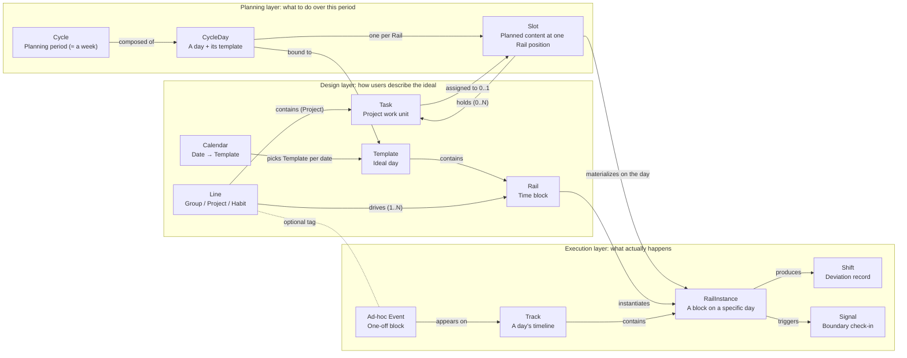

# DayRail Product Design Document (ERD)

> **Status**: living document — any decision here can be overturned. Last updated 2026-05-24 (AI intent decomposition · staging-tray commit model · design locked · §6.7 + §15.10 + Stories F/G). One lockdown this round: the core *new* thing AI should solve inside DayRail is not "a slightly better review" — it's closing the **multi-step manual gap** between "I've already figured out what I want to do" and "it's set up correctly in DayRail" — canonically "I want to meditate 5 min morning and evening", which by hand means creating a habit + two Rails + two bindings + scheduling. **Audience premise nailed shut**: users are Claude Code + Claude subscribers, desktop daily use (stated up front in §6.7). Accordingly, **cut** every branch added for an audience that doesn't exist (multi-provider adapters / fallback chains / onboarding for non-AI users — consistent with ROADMAP's existing ❌). **Unified model**: whether the AI doing the thinking is inside (paste path's internal AI) or outside (Claude Code via MCP), everything converges on one pipeline — natural-language intent → a set of deterministic **add-only** operations → into a **local staging tray (pending proposals)** → I review / adjust (manually or a single-shot internal-AI tweak; can switch "habit ↔ temporary task" shape) → on confirm the whole batch commits to the Y.Doc (one Edit Session · one-click undo). A proposal = "intent spec + shape"; switching shape is a deterministic re-projection of the same spec, no re-call to the AI. **Two entry points**: (1) paste (lands first · zero plumbing) — external Claude emits "DayRail-agnostic" plain natural language / Markdown, I paste it in, the internal AI (via BYOK = the user's Claude proxy, e.g. CLIProxyAPI) parses it into proposals; (2) MCP (desktop-only · lands right after) — §15.10, an MCP server inside the Tauri/Rust process, **read + write** bidirectional: read tools (rails / templates / habits / recent reflections / schedule) let Claude Code see my real rhythm and make grounded proposals (slot meditation right before the existing 7:30 Rail, avoid the Thursday I keep skipping); write tools `propose_*` only drop into the staging tray, never commit directly; confirmation still happens inside the DayRail UI. **Add-only, no modify / delete**: the projector only emits create operations mapped to existing writers (createRail / upsertHabitBinding / createTask / scheduleTaskOccurrence …); modify/delete collide with §10.5 revisions + §10.3 purge and AI gets them wrong (fix-up cost > doing it by hand), so explicitly not done. **Staging tray is local (not in the sync stream · not archived)**: it's a "deal-with-it-now" transient queue, low cross-device value, consistent with §6.1's "AI output is ephemeral" mindset; a proposal is self-contained, goes in and out whole (heeding the §7.9 metadata-data lifecycle-drift lesson). **schema-drift avoidance**: don't repeat v0.8.2's "extract JSON from prose" trap — the paste path uses AI SDK `generateObject` + Zod (a small, closed intent-spec schema) + an endpoint capability gate; the MCP path lets Claude Code use native structured tool-calling, DayRail doesn't parse. **This is the reversal-implementation of §6.1 Decompose**: the original "multi-step Q&A wizard inside DayRail" is rejected in favor of "decomposition happens in Claude Code / externally, DayRail is just the staging + commit target". **#1 daily review (Review) stays as-is**, out of scope this round; it just benefits indirectly once the §15.10 MCP read layer exists. **Explicit non-goals** (anti-四不像 / anti-neither-fish-nor-fowl · full list at the end of §6.7): a generic NL command bar / in-app assistant, turning the staging tray into a workflow system (state machine / assignment / versioning), multi-turn in-app AI chat (real discussion happens back in Claude Code), onboarding for non-AI users, chasing perfect decomposition of any arbitrary intent. See §6.7 (model) + §15.10 (MCP) + Stories F/G. Last updated 2026-05-18 (v0.12 design discussion locked · sync trust model · §7.10). One lockdown this round: sync isn't only a mechanism-correctness problem — it's a trust problem. After §7.9 closed the metadata-drift family, dogfood surfaced something different: "can the user trust the system actually did what it claims", not "is the data safe". New §7.10 introduces a two-layer model — (a) **user-mode layering**: Local-only / Backup-only / Multi-device sync · inferred from count of active devices · **no "long-term / temporary" classification question at connect time** (an early draft offered a three-tier modal, rejected in discussion, see §7.10.1's closing "Why we don't distinguish 'temporary device'") · mode advance can be inferred, regression must be explicit; (b) **trust safety net of five mechanisms**: identity pinning (including `lastKnownMode` invariant field) / departure gate (strong-blocking for sync users + soft toast for backup users) / heartbeat + boot-time reconcile (sync mode only) / duration-aware failure surface (failure duration + pending pile proactive alert) / mode regression guard (data-layer inconsistency doesn't silently downgrade). **Three UX principles crystallized during discussion**: (1) don't presume the user's scenario — every modal must offer "decide later" / "let me look first" escape hatches; the user's actual context outranks the system's guess; (2) keep technical detail out of the main surface — "push failed 401 Unauthorized" folds under "Details ⌄"; the main surface speaks human; (3) **before adding a feature point / branch, ask "what if we don't?"** — avoid piling up cold, niche-and-not-important features (this round's §7.10 design caught three times that "add a special case to handle the new scenario" was the wrong reflex: forced-upgrade modal / temporary-mode read-only 24h / three-tier connect-time choice — every time, the right question was "can we just not distinguish?"; engineering instinct adds branches, product instinct removes them). All three principles archived to `feedback_design_principles.md`. Full design + 5 user stories + worst case A/B/C/D/E + 6-phase PR plan in §7.10. Last updated 2026-05-14 (v0.11 design lock · Task occurrences · splitting the "scheduling atom" off Task). This round locks one thing: `Task` previously carried identity unit / completion source of truth (§10.1) / scheduling atom in one bundle, forcing "one piece of work spread over multiple sittings" into N sibling Tasks. New §10.6 introduces `TaskOccurrence`: a Task carries 0..N occurrences, each independently schedulable, completable, and reschedulable. **Key decisions**: (1) `occurrence.percent` reuses the existing `Task.milestonePercent` semantics (**a milestone marker on the parent Task**, max-of-done aggregation), NOT a weighted share, NOT this occurrence's own progress meter; (2) when a Task is associated with occurrences, `Task.status` is fully derived (§10.1 exception clause), the unit of management drops to the occurrence; (3) the singular `Task.slot` field stays as the simple-path for 0-occurrence Tasks — adding the first occurrence atomically converts an existing slot into a label-less / percent-less first occurrence in the same transaction, zero data loss; (4) legacy `Task.subItems` migrate one-shot to occurrences (label = title, done = done, derived id `occ-{taskId}-{subItemId}` for idempotency), the field stays readable so older clients can keep writing it, new clients dual-read without writing back; (5) new top-level `Y.Map<id, TaskOccurrence>` store, per-element CRDT auto-merge — **incidentally closes** the parking-lot item «`Task.subItems` re-split per-element Y.Array op» from ROADMAP; (6) `.dryj` container version stays put · cross-version protocol is just "new client GCs orphans + dual-reads subItems" — no top-of-screen conflict cards, no read-only mode, no convert-confirmation dialogs; (7) habit auto-task pipeline explicitly untouched this round (keeps `task-auto-{habitId}-{date}`). **Real-data validation**: ran `tools/migrate/dump-tasks.ts` against the user's three local `.dryj` backups (5/11 / 5/13 / 5/14); of 128 tasks, only 1 carried subItems (title "（看子任务）" outs it as test data), `milestonePercent` user count = 0, every edge-case bucket totalled 0 — the cross-version anxiety doesn't have actual data behind it. Discussion record: D1 abstraction, D2 field set, D3 percent = milestone, D4 label = step name, D5 status derived, D6 slot↔occurrence conversion, D7 archive cascade, D8 subItems adoption (a), D9 per-element CRDT, D10 cross-version purely additive, D11 habit untouched, D12 not in §10.5 — all 12 decisions aligned with the ERD. See §10.6 (and the synced amendments in §10.1 / §10.4 / §5.5.6 / §7.7). Last updated 2026-05-08 (v0.9.0 desktop ship · 9 PRs + 3 tag retries before the GitHub Release went live). This entry captures the implementation deltas from the same-day design lock (PR #12) through the published v0.9.0 GitHub Release: (1) **Three §15.2 stack divergences from the design sketch.** Original plan: `tauri-plugin-stronghold` for refresh-token storage + `tauri-plugin-http` for Drive API calls + a deep-link OAuth callback. Implementation swapped all three: `keyring` crate replaced stronghold (a refresh token is a server-revocable capability, not long-lived password material — stronghold's vault + master-password ceremony is overkill; `keyring` is one `Entry::set_password` call onto the OS keychain); `oauth2` + `reqwest` crates run the authorization-code flow inside the Rust process, so the "bypass webview CORS" rationale for `tauri-plugin-http` evaporates (the OAuth flow was never going to live in the webview anyway); `tokio::TcpListener::bind("127.0.0.1:0")` lets the OS pick a free port, replacing the deep-link path (deep links require per-OS plumbing — LaunchServices on macOS, registry on Windows, `.desktop` files on Linux — while loopback is the RFC 8252 native-app pattern with zero registration cost, supported by Google OAuth out of the box). §15.2 / §15.3 updated to match. (2) **Three icon iterations + a macOS HIG lesson.** Round 1: the inherited PWA `icon-512.svg` was math-broken — the inner `<g>` carried `transform="scale(11.43)"` while `stroke-width="20"` was declared on the outer system, so under the scale the strokes effectively rendered at ~228px on the 512 canvas. The three thin rail curves merged into a single dark blob (the user called it "黑屁股" — looks like a butt — when they spotted it in the dock screenshot). Rewriting to a single-coordinate-system SVG made the rail design legible. Round 2: the rounded-rect background filled the SVG canvas edge-to-edge, so DayRail rendered ~1.2× larger than every neighboring app in the dock cell. **The macOS app-icon SVG canvas is not the icon body** — Apple's HIG template puts the icon body in 824 of a 1024 canvas (~9.77% transparent margin per side), letting the OS apply consistent squircle sizing across all apps. Filling the canvas literally bypasses that uniformity. Round 3: inset to `x=50 y=50 w=412 h=412 rx=93` (the Apple template values scaled to 512), warm background `#FBF4EA` to land brand temperature in the visual, and rail composition bumped from 62% to 75% of the body so the design "claims" the icon at dock sizes. Process lesson: **rendering 256/64/32-px PNGs via `rsvg-convert` is order-of-magnitude faster than editing SVG and waiting for cargo to re-embed and rebuild** — iteration loop dropped to seconds. (3) **Three release tag retries.** First push of `v0.9.0` had all four platform jobs fail at `pnpm install --frozen-lockfile` with `ERR_PNPM_LOCKFILE_BREAKING_CHANGE` — `release.yml` had pinned `pnpm/action-setup` at v10 but `pnpm-lock.yaml` is `lockfileVersion: 5.4` (pnpm 7-era format) and `package.json#engines` constrains to `pnpm >= 7`; CI was the outlier. Fixed by pinning CI pnpm to 7 (PR #19). Second attempt: Linux + Windows passed, but both macOS targets failed with `failed to import keychain certificate`. Cause: `release.yml`'s env block forwarded `${{ secrets.APPLE_CERTIFICATE }}`, which evaluates to the **empty string** (not unset) when the secret isn't set; tauri-action treated the empty value as "user provided a cert, please base64-decode and import it" → keychain import on an empty payload failed. **`${{ ... || '' }}` defaults can't save this** because they still emit a set-but-empty variable. The only clean skip is to **delete the six `APPLE_*` env lines from the yaml entirely** (PR #20). Third attempt: 4/4 green → draft release auto-generated with 13 platform binaries + 7 `.sig` files + `latest.json` → `gh release edit v0.9.0 --draft=false --latest` published. All three failures were CI-hygiene problems with zero code/design impact, but they exposed a lot of cross-platform cohabitation assumptions in the release pipeline. (4) **Where to wire Apple signing back in.** The doc-comment block at the top of `release.yml` preserves all six secret names (`APPLE_CERTIFICATE / APPLE_CERTIFICATE_PASSWORD / APPLE_SIGNING_IDENTITY / APPLE_ID / APPLE_PASSWORD / APPLE_TEAM_ID`); once Apple Developer enrollment completes, the restoration is "paste the six env entries back in + populate the matching GitHub Secrets" and the next `v0.9.x` tag auto-signs and notarizes. **The unsigned-to-signed update quarantine path is untested** — but the current user base is one (me), so a real-world test waits until v0.9.1 actually ships signed. (5) **Test baseline unchanged**: 203 vitest cases still green; **no Rust tests added** for the Tauri side — the four `drive_auth.rs` commands have no unit tests because the loopback OAuth flow involves the system browser + Google API + keychain side effects, and constructing those mocks costs more than the test value at this scale. Known debt; revisit before broadening the beta. The "v0.9 desktop direction lock" entry below preserves the original design intent as an archive; this ship-notes block is the actual implementation path that emerged. Last updated 2026-05-07 (v0.9 desktop direction lock · reversing the v0.7-era "Tauri 不做" call). This pass locks one thing: (1) **desktop / Tauri shell flips from "❌ explicitly not doing" to v0.9 main line**. Driver: 1 month of real dogfood since v0.7 ship surfaced a structural UX defect from the joint constraint of PWA + Google Drive + no backend — Google's OAuth implicit flow (the only flow PWAs can use) doesn't issue refresh tokens; access tokens expire in 1 hour; every ~1-hour window forces a GIS token-refresh UI. Even with `use_fedcm_for_prompt: true` softening the popup to a FedCM bottom-bar prompt, the cadence is unacceptable for daily users. Daily users expect "zero re-auth UI after first authorization" — that experience is structurally unreachable in PWA + no-backend architecture. It's an OAuth protocol ceiling, not something prompt-tuning or cache strategy can fix. The Tauri shell moves sync to the desktop OAuth pattern (authorization code flow + PKCE → refresh token → OS keychain via `tauri-plugin-stronghold`) + access token silent refresh = physically eliminates this UI. It's also the umbrella solution for several other PWA constraints (system notifications, file pickers, global hotkeys, background sync). **Auto-update is a hard user requirement** — implemented via `tauri-plugin-updater` + a static manifest JSON hosted on GitHub Pages / Vercel (no DayRail backend, consistent with §7.1). Architecture detail in the new §15 desktop chapter. **WebDAV and other alternative sync backends stay parked** (originally listed in §7.3 as "advanced options" in v0.7; no concrete user demand has surfaced — the "zero-disruption" goal that WebDAV would have served is now answered by desktop + Drive refresh token instead). **The `KEY_CONNECTED` localStorage-cleared-on-SW-upgrade PWA bug is deferred** — once desktop ships, PWA stops being the primary daily path and the bug's impact is downgraded; will fix opportunistically if v0.9 work passes through the SW upgrade path. **Process retro**: the v0.7-era ROADMAP "❌ explicitly not doing" section listed "Tauri desktop shell" alongside "mobile responsive / E2E test framework", justified at the time by "PWA is sufficient for self-use + small-beta scope". After 1 month of real dogfood the justification no longer holds. Lesson: long-standing "not doing" decisions deserve periodic re-challenge instead of accumulating unchecked. Last updated 2026-05-07 (v0.8.2 ship · AI MVP implementation notes). After the design lock landed (PR #9, same day), the code PR (#10) went through several dogfood-driven reversals; the shipped form differs from the locked design in several substantive ways. In rough order: (1) **JSON schema → free Markdown reversal.** The locked `{ headline, observations: [{ claim, from_data }], questions_to_sit_with }` schema was punctured on the very first dogfood call: code-tuned models (`claude-opus-4-7` via `claude-bridge`) kept drifting to lint-style schemas (returning `finding / severity` etc instead of canonical fields). Patching with alias maps + lenient validators + anti-drift few-shot examples accumulated faster than the patches caught new patterns. Whole-cloth reversal: deleted `validateObservationJson` (~150 lines) + alias map + 17 tests + the `extractJsonFromResponse` main path; switched to free-form Markdown prose with an inline `「verbatim quote」` Chinese-bracket citation convention — the user scans the brackets to spot fabrication. `AiObservation` type changed from `{ json: AiObservationJson }` to `{ markdown: string }`. (2) **Vercel AI SDK (`ai` + `@ai-sdk/openai-compatible`) replaced hand-rolled SSE.** The original `consumeSse` + `parseSseBuffer` + `extractContentDelta` + error classification (~120 lines + 30 tests) handed off to the SDK's `streamText({ model: provider(modelId), messages })`. Error classification routes through the SDK's `APICallError` type while preserving our `bodyExcerpt` UX field. The SDK is loaded via **dynamic import** so cold-start bundle stays slim for users who never enable AI: main chunk holds at 973KB / 291KB gzipped (no change), AI SDK occupies a separate ~380KB / ~100KB gzipped async chunk that downloads only on first AI call per session. (3) **System prompt evolved through 5 dogfood rounds to a scene-staged "WeChat reply from a friend" persona.** Each round's output kept reading as "quarterly performance review" (KPI dashboard energy). Round 1: ban corporate vocabulary (黑洞 / 拖低 / 必须 / 下周期建议) — model worked around with "严重欠账". Round 2: ban markdown bold labels (`**主线**` / `**观察**`) — model worked around with standalone short titles ("主线 / 我看到的"). Round 3: added anti-example block showing the bad pattern verbatim — user pushback that this is reverse-poisoning the context (the "don't think about a pink elephant" effect); pulled it. Round 4: persona-driven ("warm friend / counselor / kind elder") with explicit DayRail "missing is allowed" (允许错过) ethos — substance improved meaningfully, structure still skewed toward dashboards. Round 5: scene-staging — escalated persona-as-noun to persona-in-scene: "a few minutes ago your friend sent you a long-ish message in WeChat, you are now typing back" + an explicit ABOUT THE MEDIUM section contrasting chat reply vs report/email. Anchoring the medium constraints output via social conventions of the channel (chat replies don't have ## headers in the model's training data) rather than via a list of bans. The final prompt explicitly carries the "no judgment / no next-period plans / no KPI analysis / offer 2-3 small possibilities + hand the choice back" shape. (4) **All three Review scopes get an AI entry point.** The original spec locked Day + Cycle only; dogfood revealed that having Review · Month without an AI entry was a real UX inconsistency. Added `MonthReflectionAi` reusing the Cycle data-shaping with a synthetic cycle id (`month-${YYYY-MM}`) for cache — incidentally exercised the ERD §10 `Cycle.endDate` "v0.4 custom-length cycles" reservation by adding optional `id` + `endDate` parameters to `upsertCycle`. Also: Day's `DayReflectionAi` no longer returns null when reflection is empty; instead it shows an italic discoverability hint ("✨ 写完反思后，可以让 AI 帮你看看") so users know the feature exists. (5) **Settings UI adds "Refresh model list" + body-excerpt error drawer.** Real dogfood hit a 503 from claude-bridge; the original `[provider-error] Provider returned 503.` was opaque (couldn't see what the bridge actually returned). Added a `<details>` drawer surfacing `bodyExcerpt` (first 500 chars). Model field gains a "Refresh available models" button + `<datalist>` autocomplete (hits OpenAI-compat `/v1/models`; `parseModelList` tolerates `{data:[]}` / `{models:[]}` / bare arrays / bare string arrays). The confirm panel's 「发送」 button was originally styled with `bg-bronze-9` — a non-existent Tailwind class (project uses semantic tokens like `bg-cta`); the button rendered with no fill or text color and looked disabled. Fixed in the same round. (6) **Model-tone compatibility observation (1 dogfood user sample).** `claude-opus-4-7 via claude-bridge` even after 5 rounds of prompt iteration kept skewing toward structured output (standalone short-line section labels never went away). This is an RLHF training ceiling that no prompt can fully override. Switching to OpenRouter's `claude-3-5-sonnet` / `gpt-4o` typically produces flowingly more prose-like output. Sample is currently 1; deciding whether to document a "default model recommendation" in §6.6 waits on broader beta usage. (7) **AI global memory ("the software remembers me") deferred to v0.9 candidate · conclusion undecided.** During dogfood, the product instinct came up that AI should have cross-call memory — remembering long-term facts like "user's back has been hurting", "user is preparing for an exam", "user is in a stressful stretch". Current take: park to v0.9, run v0.8.2 for 2-3 weeks of real usage first to see AI reflection's actual hit rate / value frequency, then decide based on concrete "I want AI to remember X but forget Y" use cases. Current sketch: an `aiMemories` map riding the Y.Doc sync stream with an "want me to remember this?" accept/reject UI surfacing after each AI reflection. But the data model (separate store vs `background` extension) / TTL decay / privacy boundary (default-synced vs local-only) all remain unspecified. See `docs/ROADMAP.md` v0.9+ parking lot. (8) **Test baseline**: 147 → 203 / 13 → 15 suites (+56 cases · +2 suites). New cases concentrate in `aiClient.test.ts` (14 cases for `parseModelList` envelope variance + `listModels` error classification) and `aiPrompts.test.ts` (42 cases for scene-staging / "allow missing" ethos / WeChat-medium framing / persona / citation convention / data-slice fields). `aiValidate.test.ts` (17 cases) was deleted alongside the JSON schema reversal. The "v0.8.2 design lock · AI MVP" entry below preserves the original design intent as an archive; this ship-notes block is the actual implementation path that emerged after. Last updated 2026-05-07 (v0.8.2 design lock · AI MVP). This pass locks four things: (1) **First-ship scenarios converge from "pick Day or Cycle at implementation time" to Day + Cycle shipped together**. Both share the §6.6.1 user-background injection path + the §6.2 built-in English system prompt + the JSON-structured output schema; the only differences are the scenario-specific framing block + the data-slice selectors + UI entry-point location + which entity carries the cache field. Day entry hangs off the §4.1 DailyReflection block bottom + Review · Day; Cycle entry hangs off the Review · Cycle picker chip. Decompose / Observe stay parked to v0.8.3+. Staged ship (Day first, Cycle second) was considered and rejected — the client + system prompt + output schema + UI card rendering are all shared, so splitting into two rounds doubles the ERD work, the PR count, and the regression checklists. (2) **API-key storage location flipped**: the v0.8 design-lock §6.6 table previously wrote "browser memory + Y.Doc `userProfile.aiApiKey` (part of the sync stream)"; this pass changes that to **local-only `localStorage` (key: `dayrail.aiApiKey`), not in the sync stream** — consistent with §7.1's credential mental model, in the same bucket as Drive OAuth tokens / WebDAV passwords. The four "settings inside the channel" (Base URL / Model name / Background / aiEnabled) keep riding the Y.Doc sync stream (same bucket as theme color / `enabledHolidayRegions` / `calendarRuleOrder`). New §6.6 "userProfile field-split policy" section codifies the dichotomy: "if removing it from this device equals losing access to an external service → credential → local only; if removing it just resets a setting to default → setting → sync stream". The `userProfile` Y.Map therefore **only holds syncable settings**; the AI key never touches Y.Doc. (3) **AI output persistence strategy**: chose ephemeral + single-field LWW cache of the most recent observation. Day cache → `DailyReflection.lastAiObservation: { generatedAt, model, json } | undefined`; Cycle cache → `Cycle.lastAiObservation` of the same shape. Tap again, overwrite directly; no history array (consistent with §6.1's "AI output is just a draft, no AI-original retention" stance, and avoids stuffing N entries into the sync stream when the user retaps within a day). Want to keep an observation? Copy-paste the markdown back into the reflection — explicit user action. The cache hangs off reflection / cycle entities rather than a separate store because reflection is already "the day's user free-text" entity and the AI observation is just a derived reading of it; deleting the reflection should naturally drop the AI cache too. Cycle is symmetric. (4) **§6.4 first-launch "dismissable AI intro card" UI parked** to v0.8.3+ (the §6.4 "off by default" toggle policy itself stays). Reasons: v0.8.2 is already shipping three things; users find Settings → AI naturally from the SideNav; an early intro card risks signaling "you have to configure AI for the product to be complete", clashing with the "tools should be quiet" value. Trigger: post-v0.8.2 + 2 weeks, observe AI activation rate; if low, design the surface for v0.8.3. Test baseline expectation: 147 → ~160 (≈13 new cases: client SSE / JSON parsing / error classification + prompt builder × 3 backgrounds × locale + Settings field round-trip). Implementation paths in §6.6 / §6.6.2 rewrites. Last updated 2026-05-06 (v0.8.1 ship notes · §5.4 implementation deltas). After the §5.4 design lock landed, several iterations during the smoke test pass captured these design-level (not purely implementation) deltas: (1) **CalendarRulesDrawer collapsed to a single rule list + condition-group attribute form.** Original plan was incremental — add a top priority section, keep four kind-specific sections below — but user feedback was that sort / add / edit should all live in one place. Deleted the four kind-specific sections from render (helper functions remain in-file as reference), and CRUD now happens inline inside the top "Rules list" section. Within the external-event form, the previous "four kind toggles + region / note-filter floating loose" layout was restructured into a condition-group card layout: 节假日 card (with 假日 / 非假日 sub-multi-select), 调休 card, 我的备注 card (with contains / exact toggle + a `<datalist>` autocomplete pulling existing note labels). Schema unchanged; UI just derives. (2) **"观察日" UI label renamed to "节庆"**. `ExternalEvent.kind = 'observance'` is untouched; the UI layer reads better in Chinese as 节庆 for cultural / traditional dates (Mother's Day, Qixi, Teachers' Day, Christmas). The form's kind picker also merges 节假日 (holiday) + 节庆 (observance) into one parent "节假日" toggle whose secondary multi-select narrows to 假日 / 非假日; underlying `kinds[]` still carries the two-element granularity. (3) **`CalendarRuleExternalEvent.noteLabelFilter`** added: `{ mode: 'contains' | 'exact', query }`, applies only to user-note matching, empty query degrades to "match any note", and exact mode hooks up a `<datalist>` pulling distinct user-note labels for native browser autocomplete (O(N) scan, N is typically tens — cost ignorable). (4) **Drag handlers hoisted to container level.** Per-row dragOver / drop had deadzones above the first row and below the last row; the new container-only handlers compute a drop index against every row's midpoint (range 0..N), giving zero deadzone. Drop also re-derives from the event's `clientY` + `currentTarget.getBoundingClientRect()` rather than reading async React state — WYSIWYG is preserved both ways (the visible insertion line and the actual splice always agree with the cursor's position at release). (5) **Resolver-caller bug fix: missing `userProfile` in the state Pick.** `pickTemplateForDate`'s narrowed Pick type didn't include `userDayNotes` / `userProfile`, so resolver couldn't read `calendarRuleOrder` — drag-to-reorder appeared to have no effect. Widening the type signature surfaced six callers via TypeScript (Calendar / CycleView / Review / SchedulePopover / cycleFromStore / reviewFromStore). Lesson: dependencies missing from a `Pick<...>` contract are only catchable by typecheck; at runtime they degrade silently. (6) **Calendar cell visuals de-saturated.** Cell tint moved step-4 → step-3 (paler), the redundant left strip + top border + filled step-9 template badge are gone, and the badge is now a small color dot + ink-secondary monospaced label. Three layers of redundant color reinforcing the same identity (tint + strip + border + filled pill) read like a 90s spreadsheet heatmap; the refined design keeps glance scannability while dropping the saturation weight. (7) **Off-rail row label column-width overflow fix.** The two-line "未归属 / off-rail · 拖回任意 rail 即可恢复" stack with a dashed border box was wider than the 220px label column under `table-fixed`, pushing the off-rail row's day cells out of alignment. Demoted the subtitle to a `title=` tooltip and kept only "未归属" visible, with `max-w-full overflow-hidden` defending against future copy bloat. This round's test count: 147 / 13 suites (v0.8.0 was 129 / 12; +18 case net for v0.8.1). The v0.8.1 design-lock entry below ("§5.4 CalendarRule refactor") preserves the original design intent; this ship-notes block is the real implementation path that emerged after. Last updated 2026-05-06 (v0.8.1 · §5.4 CalendarRule refactor). This pass locks two things: (1) §5.4 priority moves from hardcoded ranks (`single-date 100 > date-range 50 > cycle 30 > weekday 10`) to a **user-controlled global ordering**: `UserProfile.calendarRuleOrder: string[]` persists the priority chain the user dragged; the resolver walks the order list first, falling back to legacy numeric `priority` + `createdAt` for rules not yet in the list. `CalendarRule.priority` / `CalendarRuleRevision.priority` become optional fields; v0.8.1 writes leave them undefined; pre-v0.8.1 rules keep their numbers until the user touches them (implicit migration). (2) §5.4 gains a **fifth rule kind, `external-event`**: matches dates by §14 ExternalEvent attributes (`match.kinds: ('holiday' | 'observance' | 'makeup-workday' | 'user-note')[]` + optional `match.regions: string[]`), and on hit applies `templateKey`. For example "every statutory holiday → restday" becomes one rule with no need to enumerate dates; once §14.4 ICS subscriptions ship, they're automatically matchable through the same rule kind without resolver changes. New actions `upsertExternalEventRule` / `setCalendarRuleOrder`; the existing 5 upsert actions all maintain the order list (new rule ids prepend to the top); the existing remove action filters them out. CalendarRulesDrawer gains a top "整体优先级" (Priority Order) section with drag-to-reorder across all kinds, and a "属性匹配" (Attribute Match) section at the bottom for external-event editing. Last updated 2026-05-06 (v0.8.0 adds §14.3 user day notes). Single-point extension: v0.8.0 now ships a second source under §14 in addition to the holiday data set — **user-defined day notes**, sharing the §14.1 `ExternalEvent` rendering layer. New §14.3 "v0.8.0 Implementation — User Day Notes" defines `UserDayNote { id, date, label, color?, createdAt, updatedAt }` stored in a top-level `userDayNotes` Y.Map keyed by id; UX surfaces three entries (Calendar month view edit popover / Cycle View date-cell chip stack / Today Track top-bar metadata row · Review Day picks it up too). `ExternalEvent.kind` gains a `'user-note'` variant (outlined + user color, visually distinct from holidays but consistent in chip shape). §14.0 motivation rewritten: "external" is recalibrated to mean "external to the task pipeline" (no materialization / purge / revision), not "external to the user" — both source classes (external-source holidays + internal-source user notes) qualify under that definition and share the same render path. The original §14.3 ICS subscription draft moves to §14.4. Last updated 2026-05-06 (v0.8 design lock · external event sources + AI assistance unparked). See `docs/ROADMAP.md` for the current-state snapshot and parked-work list. This pass locks four things: (1) New §14 **External Event Sources**: introduces an `ExternalEvent` interface; v0.8.0 ships an in-repo holiday data set (bundled JSON · region multi-select); ICS subscriptions stay parked as a §14.3 v0.9+ design draft. (2) §6 AI Assistance leaves the "explicitly not doing" list: new §6.6 **v0.8 implementation note** widens §6.3's OpenRouter-only integration to a **generic OpenAI-compatible client** (Settings → AI takes three fields: base URL / API key / model name), covering OpenRouter / Groq / Anthropic-via-proxy / Ollama / LM Studio / `claude-code-router` / `claude-bridge` and any other compatible endpoint; this explicitly acknowledges the existing ecosystem of users with Claude Code / Cursor subscriptions + CLI bridge software. (3) New §6.6.1 **user background `userProfile.background`**: a single Markdown blob, in the Y.Doc sync stream, prepended to every AI call's system prompt; mental model lifted from Claude Code's `CLAUDE.md`. The "have AI optimize my background" button is parked — we'll see what real users actually write before designing it. (4) §6.6.2 v0.8.0 review scenario v1 (Day vs Cycle) is left to be picked at implementation time; Decompose / Observe stay parked. §9.3 AI tech-stack table is realigned: gateway moves from "OpenRouter" to "OpenAI-compatible protocol (default endpoint OpenRouter, any base URL accepted)"; the fallback-chain UI / remote free-model manifest / multi-provider adapter layer are now explicitly out of scope. Older history entries below preserve earlier decisions. Last updated 2026-04-19 (v0.4 implementation pass · self-use MVP ready). Session summary (post-habit-binding-refactor): (1) `rail.recurrence` **removed** — Template + CalendarRule + `HabitBinding.weekdays` are the three canonical filter layers; the rail-level weekday filter produced empty-intersection traps. (2) Multi-task per `(rail, date)` slot is now fully honoured end-to-end — CycleCell stacks per-task pills, Today Track renders per-task rows with independent state + actions, Pending acts on each task individually, §4.1 invariant is visible in UI. (3) §5.5.0 B rhythm-strip click-to-backfill wired. (4) §10.3 config-change purge live with confirm + Edit Session batching (HabitDetail binding edits + Template Editor rail delete). (5) Backlog drawer lifted to App shell — `g b` shortcut, SideNav entry, in-drawer quick-create with Line picker. (6) `scheduleTaskToRail` / `scheduleTaskFreeTime` auto-flip `deferred → pending` on new slot. (7) Review gains period-over-period match% delta + per-row stats + per-phase band stats; HabitDetail rhythm strip gets matching phase-band overlay + per-phase match%. (8) Cycle cells are draggable for reschedule. (9) Backup export/import round-trip via snapshot write + OPFS reset (Settings → Advanced). (10) 35 vitest cases across three suites cover materializer + §10.3 purge + timeline/check-in/pending selectors. Later history entries below capture earlier decisions. Last updated 2026-04-19 (v0.4 habit-binding refactor + task editing surface). Four bundled changes: (1) New `HabitBinding` entity (habitId + railId + optional weekdays filter) replacing the old `Rail.defaultLineId === habit.id` binding mechanism. Fixes the structural awkwardness of "two habits on the same time-slot different weekdays stack as two overlapping rails in one template". (2) `Rail.defaultLineId` is removed outright — its two jobs are absorbed by `HabitBinding` and "re-add with a real picker if needed" respectively. Cycle-View quick-create defaults to Inbox. (3) Today Track RailCard and Cycle View slot popover both gain a path into `TaskDetailDrawer` for inline edits of note / sub-items / milestone / schedule. (4) Auto-task editability matrix is fixed: title / schedule / milestone are read-only (they are habit-level properties); note / sub-items are editable (they are per-occurrence context). Renaming a habit only affects future auto-tasks; historical ones keep their name thanks to materializer idempotency. §5.5.0 / §10.2 / §10.3 / §10.4 / §5.2 / §5.3 all updated in this pass. History: 2026-04-19 (major data-model consistency pass · v0.4 foundation). Six changes bundled: (1) §10 gains a **three-axis overview** + **completion-status ownership rule** — Line / Rail-Template-Time / Task are three orthogonal axes, `Task.status` is the sole source of truth for all completion semantics, and RailInstance narrows to a "wall-clock log" (actualStart/End + Shift tags). This closes the v0.3 cracks where `Task.status` and `RailInstance.status` both existed and could drift apart ("ticked done in Tasks but Today Track still shows pending"). (2) Habit "each occurrence" becomes an **auto-task** (idempotent id `task-auto-{habitId}-{date}`, `lineId = habitId`, `title = habit.name`). Habit Line gains the hard "no hand-built Tasks" constraint; NewTaskInput never renders for habits. Habit and Project converge on the same completion path — Today Track / Pending / Review all query Task.status. (3) §10.2 fixes the auto-task materialization strategy at Ⅱ · **on-demand**, triggered by: Today Track boot / Cycle View switch / rhythm strip open / Calendar month page / Review scope switch / rhythm-strip click-to-backfill. Each `(habitId, cycleId)` materializes once and is marked; idempotent ids prevent duplicate rows. (4) §10.3 defines habit configuration-change rules: when a Rail's recurrence / time / templateKey / defaultLineId changes, we scan `[today, end of furthest materialized cycle]` and **only touch** auto-tasks matching `status='pending' AND plannedStart > now` (purge + top up under the new config); completed / skipped / archived ones stay. All three event types (task.purged + task.created + rail.updated) sit under one Edit Session for one-click undo. Confirm dialog before save. (5) §5.5.0 adds **A+B rhythm-strip interactions**: A is read-only, B lets the user click any cell for `done / skipped / shifted / clear`, upserting (materializing on demand) as needed. Primary path (today) is Today Track; safety net (missed / forgot / retroactive) is inline on the strip. (6) §5.5.0 **explicitly closes** the open question on "collapse habit and Rail into one entity" — the current three-axis separation is a feature: Template = structurally different days, a habit is "an activity scheduled *into* a day" not "a cron over the calendar", and re-planning habits when adding a new template is *the point* of having Templates. The three old framings ("cross-template means copying rails", "sick-day flip makes habit not fire", "new template requires manual migration") all invert: these are not pain points, they are the design. §5.6 / §5.7 / §5.8 write paths are all updated to read/write Task.status; `RailInstance.status` is deprecated in v0.4 and scheduled for cleanup in v0.5. History: 2026-04-18 (§5.5.0 Habit view mental-model correction (v0.4 anchor): from the user's perspective **a habit is one recurring thing**, not a bucket of Tasks. A Project aggregates N Tasks toward a goal; a Habit is one thing with recurrence. Habit Lines gain a hard "hold zero Tasks" constraint; the habit detail page is de-Project-ified — NewTaskInput / FilterBar / GroupedTaskList are removed and replaced with name+color+current-phase → 14-day rhythm strip → bound Rails list → phase timeline → notes → Danger. The previously-discussed "folded Tasks drawer under habit" (Option B) is explicitly rejected — the mental-model cost of a mixed surface outweighs the "where do buy-shoes go" ergonomic. Whether `Line.kind='habit'` eventually collapses into Rail (habit = a Rail family with phase/color, no Line) stays a deferred schema-level open question and is not part of this change. History: 2026-04-18 (§5.5.0 Habits go live (v0.3.3): habits split into two tiers — "simple habits" (default, fixed-intensity, phase concept stays hidden) and "progressive habits" (opt-in; after `+ 启用 phase 追踪` the user can add any number of time-segment labels). HabitPhase is a user-defined time-segment label (`{ name, description?, startDate }`) — no endDate, no preset enum, no auto-advance, no streak / completion-rate derivation (that's v0.4 Review work). Enabled/disabled is derived from count of associated HabitPhase records (≥ 1 = enabled); no `Line.phaseEnabled` flag. §10 replaces the earlier over-engineered `type Phase` (with `advanceRule` / `railOverrides`) with `type HabitPhase`; `type Line` drops the inline `phases` / `currentPhaseId` / `tasks` fields in favor of `kind` as the union discriminator + associated entities; `Line.createdAt` / `archivedAt` / `deletedAt` normalize to `number` (epoch ms) matching the implementation. New events `habit-phase.upserted` / `habit-phase.removed`. History: 2026-04-18 (§5.3.1 Edit Session expanded to Cycle View in v0.3: entering `/cycle` opens an implicit session; CycleDay template switches, Slot drag-drop scheduling / unscheduling, slot-popover "Remove" and "Mark done", quick-create tasks, and orphan-guard batch unscheduling all tag the same `sessionId`; the top bar carries a persistent "⤺ Undo this edit · N" button that rolls the whole batch back in one click (leave / 15-min idle closes the session). Core-side: `overrideCycleDay` / `clearCycleDayOverride` / `scheduleTaskToRail` / `unscheduleTask` / `createTask` / `updateTask` all gain an optional `sessionId` param — `appendEvent` carries it through, and `undoEditSession`'s drop-session-events walker reverts the lot. Per-action rollback entries (slot popover Remove, CycleDay popover Restore default) stay as a finer-grained safety net. History: 2026-04-18 (§5.4 CalendarRule v0.3 advanced rules go live: typed `value` variants for `weekday` / `cycle` / `date-range` + resolver + UI all landed. Resolver walks rules by priority desc (single-date 100 > date-range 50 > cycle 30 > weekday 10), falling back to the built-in heuristic only when every rule misses. Weekday rules are seeded on first boot (workday covers Mon–Fri / restday covers weekends) — behavior matches the old hardcoded heuristic, so no breaking change and OPFS doesn't need wiping. The "Advanced Calendar Rules" drawer returns: four sections (single-date / date-range / cycle / weekday) with list + create-form + delete per section; v0.3 uses a "delete + re-create" edit model (in-place edit lands in v0.3.1); the drawer **does not** enter the §5.3.1 Edit Session — same immediate-apply stance as Cycle View. §10 `type CalendarRule` gains typed value variants + v0.3 implementation notes; §5.4 drawer subsection tightened to match. History: 2026-04-18 (Routing library + URL scheme locked in: v0.2 uses `react-router-dom` v6, not `@tanstack/router` — the typed-params upside is priced above its current complexity payoff. URL scheme: `/` / `/cycle` / `/tasks` + `/tasks/inbox` / `/tasks/line/:lineId` / `/tasks/archived` / `/tasks/trash` / `/review` / `/pending` / `/calendar` / `/templates` / `/templates/:key` / `/settings` / `/settings/:section`. What goes in the URL: Tasks selection, Settings section, Template tab. What stays in component state: search query, filter chips, Cycle View anchorDate — complexity vs payoff doesn't clear the bar for v0.2. See `docs/v0.2-plan.md §3`. History: 2026-04-18 (§5.3 Cycle View top-DAYS block folded into the section mini-headers: the former "top-level day header (single, spans all sections)" is retired; each section mini-header is now the **sole** CycleDay template-switch entry — every date cell is itself the trigger, opening the same popover (template list + a "Restore default" footer when the day is overridden). The overridden indicator dot moves from the top DayButton into the mini-header's date cell. Rationale: two DAYS rows duplicated information and the top block + sticky summary strip ate vertical space; "one action, one entry point" is preserved — the entry just moved from "one top-level master" to "each section's own days within its mini-header". History: 2026-04-18 (§5.3 Cycle View orphan-task guard on template switch: flipping a CycleDay's template could silently orphan Tasks scheduled to the old template's Rails (`task.slot` still pointed at a Rail the new template doesn't render). Now gated: N=0 flips silently; N>0 triggers a small confirm `Switching will remove N scheduled tasks · Continue / Cancel`, which on continue batch-unschedules those Tasks before writing the rule. "Restore default" follows the same guard. §5.5 Tasks view list shape change: Status chips are gone from the top row; the list body now renders as two collapsible groups — "Open" (expanded) and "Completed" (collapsed by default). Open being empty flips Completed open automatically and shows "All clear ✓" in Open's slot. Archived / Trash still live only in the left-column nav; an active search expands both groups. History: 2026-04-18 (Cycle View CalendarRule persistence: §5.3's CycleDay template switch now writes `calendar-rule.upserted` / `calendar-rule.removed` events instead of living in local state, deduplicated by `cr-single-{date}` id; §5.3.1 Edit Session scope for v0.2 narrows to Template Editor only — Cycle View's session-level undo pushes to v0.3, with in-view mistakes walked back via the Slot popover's "Remove assignment" + CycleDay popover's "Restore default" as single-action rollbacks; §10 CalendarRule gains a v0.2-implementation note — only `single-date` kind is live, id convention + priority=100 + event shapes). History: 2026-04-18 (§5.5 refactored from `Projects / Lines View` → `Tasks View`, positioned as the primary task-management surface — left-column nav tree (Inbox + Projects + Habits + Trash) + cross-Project task list with search / filter + a scheduling popover offering two modes (Bind-to-Rail · default / Free-time · escape hatch); a built-in Inbox Line (`isDefault: true`, undeletable) becomes the default container for tasks created without a Project; comprehensive reversibility + soft-delete model (Task / Line / AdhocEvent `status` gains `'deleted'`, Trash entry + a confirmed `*.purged` hard delete); `AdhocEvent` gains `taskId` to back the free-time scheduling mode; Project progress bar becomes conditional (only rendered when at least one task has a milestone), task count always visible; open-ended Projects (missing `plannedEnd`) are explicitly NOT a risk signal; §10 Task/Line/AdhocEvent types updated; terminology audit: `Chunk` renamed to `Task` end-to-end (types + events + schema + UI + ERD) to retire an internal-only jargon term; `Line` stays as an internal umbrella type (`kind: 'project' \| 'habit' \| 'group'`) but **the word "Line" never appears in UI copy** — surfaces always show the concrete Project / Habit / Tag; the `Pending` view is renamed `待决定 / Unresolved` so it no longer overloads the `status='pending'` enum; §5.7 Pending drops its 24h aging filter — it's now the complete "awaiting a decision" set, with the check-in strip serving as the "last-24h" subset view). History: 2026-04-17 (check-in action set simplified: the old four-button `Done / Skip / Shift / Ignore` + four-sub-action sheet collapses into three buttons `Done / Later / Archive`; `RailInstance.status` becomes `pending / done / deferred / archived` (`active` and `skipped` retired — "currently happening" is wall-clock-derived); Shift sheet replaced by a 6-second Reason toast (3 quick-reason tag chips + Undo, no mandatory reason); Postpone / Replace / Swap / Resize removed from the Shift types — within-day postponing is handled by Cycle-View drag, the rest deferred to v0.3; Pending queue renamed and now absorbs both explicit `deferred` items and stale-`pending` items > 24h — two sources, one exit; §5.8 Review heatmap's three-part hatching semantics rebound to `deferred / archived / pending-stale`). History: 2026-04-16 (Group A UI baseline: sync-status badge, Now-View rhythm bar, Ad-hoc overlay, generalized Edit Sessions, Cycle notation → C1, per-view date-format table; Group B Now-View structure: multi-task pill row, three Slot shapes, Next-Rail visual spec, removal of the left rail visualizer, `CURRENT RAIL` chip, Now top-bar `Now` + Mono subtitle; Group C Today-Track Shift interactions: Skipped state via hatching, desktop hover-revealed action bar, Active main CTA → tonal `Done`, unified Shift-tag sheet, single timeline with no bento; Group D Cycle-View skeleton: per-template stacked sections, top day-header as the sole template-switch entry, Cycle pager picker, summary-strip aggregates, `⤺ Undo this edit` button, three-part hatching semantics, Backlog as split drawer; Group E Template Editor: no Save button + first-run inline banner, Radix 10-color popover, sticky tab bar + 2px color strip + dashed `+ New template`, summary strip, card-style Rail row + time-pill popover picker, inter-row gap chip `+ Fill Rail`, `⋯` row menu carrying Line binding / check-in toggle; notification rework: drop OS push / Capacitor notifications / permission pipeline, Signal collapses to a `showInCheckin` boolean, §5.6 and §5.7 unified — the check-in strip and the pending-decisions queue are two tenses of one mechanism; Group F missing screens: Projects / Settings share the master-detail form, Review per-scope waterfall + rhythm-match heatmap (state tints + the three-part hatching semantics), pending-decisions queue is date-reverse grouped with four inline actions per row and the side-nav shows a `·` dot without a number, Calendar is a standard month grid + per-date popover + Advanced-rules drawer with four sections, new §5.9 Settings defines five sections + a three-way theme toggle defaulting to follow-system + Language in Appearance / Time format + AI output-locale in Advanced; Group G design language: Terracotta CTA uses `orange-9/10/11` three solid tones (no gradients); No-Line Rule with explicit whitelist (decorative color strips + sticky hairline + focus rings); four-tier Surface tokens `sand-1..4` replace `border`-based hierarchy; radius tokens `sharp / sm / md / lg` = `0 / 6 / 10 / 16`; zero glassmorphism app-wide; Intentional Asymmetry as the default layout principle. Visual-implementation adjustments: Rail palette drops `olive / mauve / gray` (visually too close to sage / slate, or identity-less), swaps in `grass / indigo / plum` to fill the missing saturated-green / cool-blue / creative-purple slots — still 10 colors but every one perceptibly distinct. CN primary font swapped PingFang → Noto Sans SC (Source Han Sans SC) for cross-platform consistency. Terracotta CTA re-bound from `orange-9` to `bronze-9` — `orange-9` read as SaaS-vivid on screen; `bronze-9` sits much closer to the ERD's original #C97B4A "warm terracotta" intent).
>
> This describes DayRail's product logic, interaction design, and tech choices. It is not a final blueprint — it captures intent and trade-offs (including paths we considered and rejected) so contributors can see *why* the code looks the way it does.
>
> **Want to push back or weigh in?** §11 lists the questions that are still open — each one is a valid issue / discussion topic. "This rule feels wrong" and "here's a case you didn't list" are both welcome.

---

## 1. Core Philosophy

> **Be kinder to yourself. Keep moving, gently.**

Being hard on yourself doesn't make tomorrow better — it only exhausts you. Environmental friction and random disruption are unavoidable; we can let them in the way we let in a breath. That is not giving up on self-discipline; it's the recognition that **permitting deviation is what lets the rhythm continue at all**.

Under that: **Routine is the default, not a cage.** DayRail believes a good daily rhythm isn't built by rigidly executing a schedule, but by laying down a comfortable track — doing roughly the same things at roughly the same times each day. The track gives you direction and certainty, but you can switch lanes, slow down, or skip at any moment. No explanations needed. No "failure" label.

Three layers:

1. **Order is a starting point, not a goal.** Deviation (Shift) is a first-class action.
2. **Repetition produces rhythm; rhythm produces freedom.** Templated Tracks remove daily decision fatigue.
3. **Tools should be quiet.** No leaderboards, no achievements, no streak-break notifications. Only a gentle question at each block boundary: continue, adjust, or skip? Then silence.

Analogy: most schedulers are **coaches** — telling you what to do and scolding you when you don't. DayRail is a **railway** — laid quietly in the ground. Step on and you move forward. Step off anytime. The rails don't disappear; they'll be there tomorrow.

If your daily behavior can't follow a pattern, DayRail won't judge you — the pattern probably just doesn't suit you. A small tweak (different time, different activity) is often all it takes.

---

## 2. Positioning & Differentiation

### 2.1 Who it's for

DayRail targets people who:

- **Plan ahead** (set next week on Sunday night, not on the fly)
- **Have a similar daily rhythm** (wake, work, exercise, read — roughly the same times)
- **But need flexibility** (refuse to let a single deviation collapse the whole plan)

They don't lack planning ability. They lack a **plan container that absorbs deviation**.

### 2.2 Versus typical tools

| Scenario | Normal TODO / calendar app | DayRail |
| --- | --- | --- |
| Long-term goal breakdown | Manually split into many TODOs, set times one by one | Lines describe long arcs natively; AI can decompose into Rails |
| Task slipping | Adjust each TODO's time manually, or push everything back | One Shift; downstream Rails handled automatically |
| Daily repetition | Recreate or use coarse "recurring task" support | Template + Track; edits on a day don't mutate the template |
| Deviation feedback | Red overdue labels, pile-up, broken streaks | Shift is a neutral record; no failure semantics |
| Weekly planning | Copy-paste day by day | Cycle View lays down a full cycle at once; one click undoes the whole session |

### 2.3 Boundaries

| Dimension | DayRail is | DayRail is not |
| --- | --- | --- |
| View of time | Soft-structured timeline | Rigid calendar / meeting scheduler |
| Target user | Individuals building sustainable routines | Team collaboration / project management users |
| Core action | Design an "ideal day/week" + adjust as it happens | Note-taking / to-do list / GTD |
| Feedback | Light-touch Signal + gentle AI review | Streaks, badges, reminders, nagging |
| Data ownership | Local-first, fully user-controlled | Cloud-centralized, account-bound |

**Deliberately not built**: streak counts, failure prompts, social ranking, aggressive reminders, complex priority systems.

> "Complex priority systems" = scoring engines, auto-reshuffle based on weights, priority-driven reminder escalation. The single-value `P0 / P1 / P2` hint on `Task` (§5.5) is **not** what this clause rejects — it's a passive visual tag the user sets by hand; it does not drive any scheduler, check-in boost, or notification.

---

## 3. User Stories

These stories act as a design touchstone — any new feature should plug naturally into at least one of them.

### A — Meiyu, the planning-ahead grad student

> Second-year Master's student. Plans her week on Sunday night.
>
> 9pm Sunday, she opens DayRail, switches to Cycle View, and starts planning the next Cycle. She replaces the 19:00–21:00 "Leisure Rail" with a "Review Rail" across five days in one drag. Wednesday she learns a paper draft is due — she swipes left on Thursday's "Morning Run" to skip it. Friday an impromptu advisor meeting comes up; she adds a 14:00 Ad-hoc Event on the Calendar — no template is touched. End of the Cycle, the review page shows this Cycle's plan hit 87%. If she'd changed her mind on Monday, "undo this planning session" would've reverted all five replacements at once. The next Cycle is the default rhythm again.

### B — Yang, the on-and-off runner

> Engineer whose morning-run habit keeps collapsing into meetings.
>
> He creates a Habit Line "Morning Run" with two Phases: 30 min for two weeks, then 40 min. Mon–Wed: done. Thu he oversleeps — he tags the Shift `low energy` and moves on. Fri: skip, "too-early meeting." A month later AI Review says: "Thursday runs were skipped 3 of 4 weeks. Want to move Thursday to an 8pm evening run?" He accepts; the Template tweaks; the Line's Phase-2 Thursday Rail follows.

### C — Ann, the group project student

> Junior, three weeks to deliver a group report.
>
> She creates a Project "Market research report" (planned window 2026-04-20 → 2026-05-10) and breaks it into Tasks: "Pick a topic 20%", "Send out survey 50%", "Analyze data 80%", "First draft 100%", plus a few supplementary items without a milestone percent ("tidy references", "format check"). She drags each Task into a Slot on a specific CycleDay + Rail ("Analyze data" goes into next Wednesday 14:00–16:00). A teammate delay slips "Send out survey" by two days — she clicks "Later" on that RailInstance (`status → deferred`), it joins the Pending queue, then in Cycle View she drags it to Friday, which resets plannedStart/End back to `pending`. Other Tasks are unaffected. When the 100% Task is marked done, the Project auto-archives.

### D — Lin, the no-AI minimalist

> No interest in AI; loves the railway metaphor.
>
> At first launch the AI intro card shows; she taps "later." Everything runs locally — no account, no network, no AI. She uses only Template + Track + Shift. That's always enough.

### E — Kai, the cross-device power user

> Frontend engineer: macOS at home, iPhone on commute, Windows at work.
>
> Sets up Templates and two Lines on Web (Windows), enables sync in settings, picks Google Drive, one-click OAuth. Home on the Mac desktop app: enable sync, authorize the same Google Drive account, enter the encryption passphrase once — both his Rail data and his settings (OpenRouter key, theme, fallback chain) flow in from the same Drive folder. One sync channel, nothing else to configure.

### F — Azhe, deciding inside Claude Code and letting it land in DayRail (v0.13+ · MCP main path)

> DayRail + Claude Code subscriber, desktop daily use.
>
> One evening he's chatting in Claude Code about "wanting to start meditating", and mid-conversation says "add this to DayRail for me". Through DayRail's MCP, Claude Code **first reads** his weekday template, sees a "morning wash-up" Rail at 7:30, and proposes: meditation right before it at 7:25, plus one in the evening at 22:00, 5 minutes each, as a habit. It **writes this into DayRail's "pending proposals" — not the real data**. The DayRail window open on his desktop surfaces the proposal: new habit "Meditation" + two Rails + bindings + effective today. He glances at it, finds 22:00 too early, and edits it to 22:30 right on the proposal (or tells Claude Code "make the evening one 22:30" and it re-calls MCP). He hits "Confirm", the whole batch commits at once, and the top bar offers an "Undo". **He never manually created a single Rail.** Had he been thinking "this is just a few-days trial", he'd switch the proposal's shape from "habit" to "temporary task" — same intent, a different landing shape, no need to talk to the AI again.

### G — Azhe, finishing the chat elsewhere and pasting it back into DayRail (v0.13+ · paste fallback path)

> Same person, but the case where Claude Code isn't at hand.
>
> On his commute he chats with Claude (claude.ai) on his phone about restructuring this semester's study rhythm, and Claude gives him a Markdown to-do list. **This text has nothing to do with DayRail — it's just plain natural language.** At his desk he copies the whole thing, opens DayRail, and pastes it into the "Paste from AI" box. DayRail uses his configured Claude proxy to parse that text into a few proposals, landing in the **same** "pending proposals" tray (sharing the staging tray + commit engine with Story F — only "how things get in" differs). He adjusts, confirms, commits.
>
> Together the two stories draw the precise boundary of this round's AI work: **close the multi-step manual gap between "I've decided to do X" and "X is set up correctly in DayRail".** Not a generic AI assistant, not a replacement for the Claude Code conversation — just this one gap.

---

## 4. Core Concept Model

### 4.1 Entities

- **Rail**: A recurring time block. Fields: name, start/end, color/icon, recurrence, default action, Signal permission, optional Line link.
- **Template**: The "ideal version" of a Track / CycleDay. Users can have many. MVP ships two built-ins: `workday` and `restday`, freely editable. Applied to dates via the **Calendar**.
- **Cycle**: A contiguous planning period. Default length 7 days (Mon–Sun), **extendable for long-holiday scenarios**; the next Cycle starts the day after and defaults to running through the next Sunday (or the user adjusts). The Cycle is the organizing unit of the planning view (§5.3).
- **CycleDay**: One day within a Cycle, bound to a `templateKey` (MVP defaults to toggling between `workday` / `restday`; other templates also allowed), containing one Slot per Rail.
- **Slot**: The **planning-side content container** for one Rail position on one CycleDay. Can hold both:
  - Optional `taskName` (free text) — for one-off items that don't warrant a Project ("call mom").
  - Ordered `taskIds` — Task assignments belonging to some Project.
  The Slot is design-time (what you plan for this position); on that day it materializes into a **RailInstance** (run-time).
- **Track**: One day's timeline, composed of RailInstances. Generated from that day's CycleDay + template; edits made on Today Track do not mutate the template or its CycleDay.
- **RailInstance**: The run-time instance of a Rail on a specific day, carrying `status` (pending / done / deferred / archived), `plannedStart` / `plannedEnd`, optional `actualStart` / `actualEnd`, per-day overrides, and (if any) the `sessionId` of its planning session. "Currently happening" (current rail) is NOT a separate status — it's purely derived from wall-clock position (`plannedStart ≤ now ≤ plannedEnd` with `status='pending'`).
- **Shift**: A record of a `pending → *` transition on a RailInstance. v0.2 keeps two types: `defer` (Later; lands in Pending) and `archive` (no more scheduling). May optionally carry tags from a global shared library (see §5.7). Within-day postponing is handled by Cycle-View drag; `swap / resize / replace` are deferred to v0.3.
- **Signal**: Lightweight check-in at a Rail boundary — named after the railway signal at each crossing: it lights up, it doesn't command. `continue` / `adjust` / `skip`.
- **Ad-hoc Event**: A one-off time block not belonging to any template. Higher priority than template resolution. Optionally attached to a Line.
- **DailyReflection (v0.4.3+)**: One hand-written Markdown blob per calendar date — the user's space for journaling, retrospection, mood, or any free-form note about that day.
  - **Keyed by date**: `date` (`YYYY-MM-DD`, natural day per `Track.tz`) is the primary key; at most one row per day. An empty string means "not written" (`reflection.cleared` on the event log).
  - **Orthogonal to Rail / Task / Habit**: does not feed the heatmap, does not affect Project progress, triggers no scheduling side effects — purely a container for "what I want to say about today." Intentionally absent from the Mermaid diagram to keep it noise-free.
  - **Any date is editable**: not restricted to "today." Past dates (so users can fill in yesterday) and future dates (leave a note for an upcoming day) are both allowed.
  - **Two entry points share one record**: (1) a "Today Reflection" card at the bottom of Today Track, hard-wired to the current date; (2) a collapsible block at the bottom of `/review/day/:anchor`, usable to revisit or edit any date. Both surfaces sync through the event log so the two views stay live-consistent.
  - **Storage**: event-sourced + materialized table (`reflection.upserted { date, content }` / `reflection.cleared { date }`, aggregateId = date). Snapshot gains `reflections: Record<date, DailyReflection>`; participates in session-level undo and cross-device replay just like Habit / Task.
  - **Not in scope**: revision history (the event log is the history), AI summarization, templates/prompts, cross-day search (revisit in v0.5+), word-count caps.
- **Line (internal container type · never in UI copy)**: DayRail's only multi-Rail / Task grouping concept, forming a continuum. `Line` exists only in types / schema / event log — UI views / menus / copy always show the concrete shape per `kind`: `Project` / `Habit` / `Tag` (formerly "Group").
  - **Three states**: `status: 'active' | 'archived' | 'deleted'`. `archived` is a user-intentional terminal state (restorable); `deleted` is a soft delete (visible in Trash, restorable; hard delete only via an explicit "permanently delete" confirmation).
  - **Inbox is a built-in singleton Line**: `id = 'line-inbox'`, `kind = 'project'`, `isDefault: true`, undeletable and uneditable. Every task the user creates without picking a Project lands here (see §5.5.1).
  - No phases, no tasks → **Pure group (tag-like)**. Just for labeling (e.g., "Work", "Medical").
  - With phases → **Habit Line (UI: "Habit")**. Open-ended, evolves by phases (duration, target params, advance rules: by days / completions / manual). The home for **daily recurring things** (morning run, English reading) — high-frequency recurrence is not a Project, it's a Habit.
  - With tasks → **Project Line (UI: "Project")**. Finite but append-extensible. See the Task entry below.
  - **Line ↔ Rail is one-to-many**: a single Line can drive multiple Rails (group assignment split into 5 independently Shift-able Rails).
  - A Phase / Task may target all Rails in the Line or specific Rail IDs.
  - Lines can be decomposed manually or with AI assistance (§6).
- **Task**: The execution unit of a Project Line. Fields:
  - `title`, `subItems` (internal checklist, not scheduled individually), `status` (pending / in\_progress / done), `order` (draggable).
  - **Optional** `milestonePercent` (0–100): tasks with a percentage are *milestones*; tasks without are *supplementary items*. Projects support **unbounded appending** of tasks (including new milestones) until archived.
  - **Task completion is global**: a Task goes into at most one Slot (Task ↔ Slot is 1:1; one Slot can hold many Tasks). The Slot just says "this is where I plan to advance it"; marking it done at any Slot flips the Task globally to `done`, reflected everywhere.
  - **Project progress**: the **max** `milestonePercent` among done Tasks (not a weighted sum; Tasks without a `milestonePercent` don't affect progress but count toward "items done").
  - **Archive trigger**: when a Task with `milestonePercent === 100` transitions to `done`, the Project auto-archives. Users can also archive manually at any time. No unarchiving; use **clone-to-new** for a "v2" — avoids long-tail zombies.
  - **Planned window** (Project-level): optional `plannedStart` / `plannedEnd`, used as soft hints — assigning a Task to a date outside the window warns but doesn't block.
  - **Priority (lightweight hint)**: optional `priority: 'P0' | 'P1' | 'P2'` (unset = no priority). **Passive**: does not drive any scheduler, check-in weighting, notification escalation, or auto-reshuffle — the "complex priority systems" §2 rejects. **Active** as a sort / group / filter key in Cycle-View task lists and any future list surface (so the user can "show me P0 only", "sort P0 → P2", "group by priority"). Rendered in the UI as a small chip on each Cycle-View task pill (`P0` = red, `P1` = amber, `P2` = slate); editable via the per-pill popover and the `TaskDetailDrawer`. Habit auto-tasks can carry priority too (inherits/defaults to unset; user can set per-occurrence via the detail drawer).
- **Planning session** *(internal)*: A burst of Cycle-View edits performed in one sitting; their RailInstance overrides share an internal `sessionId`, enabling "undo this planning session" as an atomic action. Not a user-facing noun — there is no Plan page, no naming, no promotion flow. For recurring multi-week patterns (exam week, travel week), users build a dedicated Template and apply it via the Calendar.

### 4.2 Concept Overview (Mermaid)


```mermaid
flowchart LR
  subgraph Design["Design layer: how users describe the ideal"]
    Template["Template<br/>Ideal day"]
    Rail["Rail<br/>Time block"]
    Line["Line<br/>Group / Project / Habit"]
    Task["Task<br/>Project work unit"]
    Calendar["Calendar<br/>Date → Template"]
  end

  subgraph Plan["Planning layer: what to do over this period"]
    Cycle["Cycle<br/>Planning period (≈ a week)"]
    CycleDay["CycleDay<br/>A day + its template"]
    Slot["Slot<br/>Planned content at one Rail position"]
  end

  subgraph Execution["Execution layer: what actually happens"]
    Track["Track<br/>A day's timeline"]
    RailInstance["RailInstance<br/>A block on a specific day"]
    Shift["Shift<br/>Deviation record"]
    Signal["Signal<br/>Boundary check-in"]
    Adhoc["Ad-hoc Event<br/>One-off block"]
  end

  Template -- contains --> Rail
  Calendar -- picks Template per date --> Template
  Line -- drives (1..N) --> Rail
  Line -- contains (Project) --> Task
  Line -.optional tag.- Adhoc

  Cycle -- composed of --> CycleDay
  CycleDay -- bound to --> Template
  CycleDay -- one per Rail --> Slot
  Slot -- holds (0..N) --> Task
  Task -- assigned to 0..1 --> Slot

  Slot -- materializes on the day --> RailInstance
  Rail -- instantiates --> RailInstance
  Track -- contains --> RailInstance
  Adhoc -- appears on --> Track
  RailInstance -- produces --> Shift
  RailInstance -- triggers --> Signal
```

> A burst of Cycle-View edits is an internal "planning session" — all overrides in it share a `sessionId` for atomic undo, but the session is not surfaced as a named entity.

### 4.3 Relationships (text)

```
Template      ──materializes──▶ CycleDay.templateKey
Cycle         ──contains ─────▶ CycleDay[]
CycleDay      ──has ──────────▶ Slot[] (one per Rail)
Slot          ──holds ────────▶ Task[] (0..N, one-to-many)
Task         ──assignedTo ───▶ Slot (0..1, at most one)
Task         ──belongsTo ────▶ Line (Project variant)
Line          ──drives ───────▶ Rail[] (1..N)
Line(Project) ──progress ─────▶ max(milestonePercent of done Tasks)

CycleDay      ──generates ────▶ Track (one per day)
Track         ──contains ─────▶ RailInstance
RailInstance  ──reflects ─────▶ Slot content (taskName + tasks)
RailInstance  ──produces ─────▶ Shift (zero or more)
RailInstance  ──triggers ─────▶ Signal (zero or more)
Calendar      ──resolves ─────▶ Template (or Ad-hoc Event) for a date
sessionId     ──groups ───────▶ one planning session's overrides (internal)
```

### 4.4 State Machine (RailInstance)

```
               ┌── Done ────────────▶ done       (terminal)
               │
   pending ────┼── Archive ─────────▶ archived   (terminal)
               │
               └── Later (defer) ───▶ deferred   (semi-terminal · lands in §5.7 Pending)
                                          │
                                          └── Dragged to some day in Cycle View ──▶ pending
                                                                      (plannedStart/End reset)
```

- **`pending`** is the initial + recoverable state; "future", "current", and "past-unmarked" are all wall-clock shades of it, not separate statuses.
- **`deferred`** is semi-terminal: it sinks into the Pending queue, and **Cycle View can drag it back to a day** (giving it fresh `plannedStart/End`), returning to `pending`.
- **`done`** / **`archived`** are terminal. Review reads history from the event log, not current status.

Any `pending → *` transition emits a Shift record (optional tags + optional reason). Shifts are history — they never penalize future days.

---

## 5. Key Interactions

### 5.0 App Shell

Every view shares a fixed shell: left nav (desktop) / bottom tab bar (mobile) + top title bar. The shell carries no business logic — it's just the "always-there" scaffolding of the app.

**Desktop · left fixed nav** (~64–72px wide):

- **Top**: inline-SVG `<DayRailMark />` + sub-title `STAY ON THE RAIL` (all-caps, **not** translated with UI locale; see §9.6 Logo & mark).
- **Middle** (vertical list, icon + short label): `Now` / `Today` / `Cycle` / `Projects` / `Review` / `Calendar` / `Settings`. The current view gets a 2px primary-color bar down its left edge.
- **Bottom**: the **sync-status badge** (see below). **No avatar / name / plan tier** — DayRail has no account, and showing one would just invite the question "do I have an account?".
- There is no global `Save` / `New…` CTA in the shell — each view decides for itself whether to expose a primary action.

**Mobile**: bottom tab keeps five frequent entry points (`Now` / `Today` / `Cycle` / `Projects` / `Review`); `Calendar` and `Settings` live under the top-right `⋯` menu. The logo doesn't render on the mobile home (content gets the space).

**Top title bar**: left = current view title; the exact format varies per view (Today / Cycle use the single-line context form `Today · Apr C1 · Thu`; Now View uses a `Now` primary + Mono subtitle "present-moment" form — see §5.1). Right = view-scoped secondary actions (Cycle View's `Next Cycle ▶`, Today's `Reset to template`, Template Editor's `⋯` menu, …).

**Sync-status badge** (bottom of left nav / first item inside mobile `⋯`):

| State                | Visual                                                      | Meaning                                                                                                        |
| -------------------- | ----------------------------------------------------------- | -------------------------------------------------------------------------------------------------------------- |
| `◉ Local only`       | slate step-9 dot + muted caption                            | User has never enabled sync. This is the default, **not an error state**.                                      |
| `⟳ Synced · 2m ago`  | teal step-9 dot + relative time                             | Relative time since the last successful sync; hover reveals exact timestamp + backend (Drive / iCloud / WebDAV …). |
| `⚠ Sync paused`      | amber step-9 dot + short reason (offline / auth / key clash) | Sync temporarily unavailable. Click opens a detail page; **never interrupts the current view, never a modal**. |

The badge is always visible and always restrained. **Never red** — local data is always complete; sync is optional, so there's no "failure" semantics to communicate.

### 5.1 First Screen: Now View

Within 1 second:

1. **Slot content for the current Rail** (large type, in the main content column). A small Mono 9px uppercase wide-letter-spacing chip sits above the headline — the label is always **`CURRENT RAIL`** (not `CURRENT TASK`; the semantic unit of focus is the Rail, Tasks are the concrete actions inside it). Below the headline, rendering depends on the Slot's shape — three variants:

   - **With Tasks**: the first unfinished Task's title is the **headline**. When multiple Tasks are present, a small subtext line reads `1 of 3 tasks` under the headline; below that, a **compact pill row** lists the remaining Tasks by `order` — each pill = 4px Project color bar + Task title + optional `milestonePercent` badge; **completed Tasks are struck through**; tapping a pill jumps to the Task detail inside its Project Line. Pills **do not carry a "mark done" action** — the primary "Done" button always advances the first unfinished Task, one at a time. This prevents "cherry-pick completion" patterns.
   - **With only `taskName`**: the `taskName` is the headline; a small chip `Quick task` hangs beneath (JetBrains Mono 9px, uppercase, wide letter-spacing — same style as the ADHOC chip; slate step 3 bg + step 11 text). The chip makes it explicit: "this is not a Project Task and leaves no trace on any Project's progress".
   - **Neither**: the headline slot shows a huge `—`; a single restrained subline reads `This block is open. Rest, think, or pick something up.` **No "+ Add" button** — adding content in the moment is not the Now View's job; go through Today Track (§5.2) or Cycle View (§5.3).

   Next to the headline (or below, depending on viewport width), three elements render: **remaining time** (Mono large `45m`) + end clock (small Mono `ends 16:30`) + a time-progress bar (driven by Rail duration, **not Task progress**).

2. **Next Rail card**: visual rules match a Today Track row — a 4px left color bar taken from the next Rail's own Radix step-9 color; **deliberately not tertiary terracotta** as the "Next" accent (tertiary is reserved for the current Rail and primary actions only, §9.6). Card content:
   - Top-left: a Mono small chip `COMING UP NEXT` (same style as `CURRENT RAIL`) + Mono countdown `in 32m` (refreshes at per-minute granularity).
   - Rail name (mid-size type).
   - Slot preview summary (small subtext, listing the first two Tasks' title + percentage, e.g., `Warmup 20%, Cardio 50%`). If the Slot is `taskName`-only, the subtext = the `taskName` + `Quick task` chip; if empty, subtext is `—`.

3. **A pair of primary buttons**: `Done / Skip`. "Done" marks the first unfinished Task in the current Slot as `done` (completion is global — completing at any Slot completes the Task everywhere). If the Slot has only `taskName` and no Tasks, "Done" transitions the RailInstance to `done`. The Now View deliberately omits an "Adjust" entry — rescheduling / swapping content happens through the row-level interactions on Today Track (§5.2), so the moment of decision isn't saddled with another choice.

**Top bar (the Now-View variant of the §5.0 rule)**: primary `Now` (Inter font-bold) + a smaller Mono subtitle `14:28 · Thu Apr 16`. The clock uses Intl and refreshes at per-minute granularity (second-level would create too much visual noise and adds no value for the Now context); the subtitle **carries no Cycle notation** — the Now View is moment-focused, not cycle-focused.

**The right column carries only `Goal Context`** — background info for the Project / Line that owns the Tasks in the current Slot (progress, planned window, the most recent Shift summary). **Deliberately excluded**: decorative imagery, inspirational quotes, "Today's momentum 65%" counters, any streak / achievement metric. Decoration and motivation clash with §1's core philosophy. When the Slot is `taskName`-only or empty, the right column shows a neutral note (e.g., `No long-running goal attached to this block. It's fine to slow down.`) instead of a blank space that pressures the user to find something to fill it.

**The main content area deliberately does not carry a left-side "rail visualizer"** (a vertical-dots / vertical-axis "day-shape" subview). Today's shape is carried entirely by the bottom rhythm bar — two timelines on one screen only dilute attention, and a vertical form can't express state-colored rhythm density as cleanly as the horizontal bar.

**Bottom rhythm bar**: a horizontal strip across the Now View footer, one segment per Rail on today's Track, colored by RailInstance state — `pending · future` slate step 6 / `pending · current` primary step 9 / `done` sage step 9 / `deferred` slate step 4 hatched / `archived` slate step 4 hatched + line-through. **No numbers, no percentages**, and even when today is completely clean there is no "all done" prompt — neutral retrospection belongs to the dedicated **"Today's Review"** (the day scope of Review, §5.8). The rhythm bar's only job is "see the shape of today at a glance", not to be a wall of stamps.

**Two restrained first-screen slots are reserved**:

- Top (conditional): the Pending-queue bar (§5.7) — dismissable, non-blocking.
- Bottom (one-shot): the AI intro card (§6.4) — appears once on first launch, dismissable.

On first launch, the user lands in a **preset default weekday template** they can edit in place (not an empty canvas, not a setup wizard). This gives newcomers something to react to immediately — tweak the times, rename a Rail, delete what doesn't apply — instead of staring at "now what?" or being asked to make decisions before any trust is built. No login, no splash, no daily summary dialog.

### 5.2 Today Track

Vertical timeline of every RailInstance for today. **Per-Rail visual rules**:

- **Row height proportional to duration** (1h and 2h Rails are not the same height) — rhythm density visible at a glance.
- **4px color bar on the left edge**, drawn from the Rail's Radix step-9 color (or, if the RailInstance has an override, the overridden color).
- **Five-state tint** (four statuses plus a purely derived "current"):
  - `pending` · future — normal bg (surface-1) + step 11 text + step 9 color bar.
  - `pending` · **current** (wall-clock between plannedStart/End) — primary step 3 bg + step 12 text, bar bolded to 6px (see "Current Rail special form" below).
  - `pending` · **past-unmarked** — surfaces in the §5.6 check-in strip; not rendered as a standalone row in the main timeline.
  - `done` — bar fades to step 6 + line-through title + content `opacity-70` + small check glyph.
  - `deferred` — bar stays step 9 + 2px diagonal hatching at Rail step 6 + a top-right `Later` pill (Mono 2xs). **Still visible on the timeline** so the user sees at a glance "what today was meant to be, now pushed aside."
  - `archived` — bar fades to step 7 + 2px diagonal hatching at Rail step 7 + line-through title + `opacity-60` + top-right `Archived` pill. **Tertiary terracotta is deliberately not used** — per §9.6 tertiary belongs to current rail and primary CTA only; archived speaks through *texture + desaturation*, avoiding the "red = failure" judgment feeling.
- **Shift traces**: if the instance has a Shift (defer / archive) recorded today, a short inline caption at the row bottom shows `· <first tag>` (e.g. `· weather` / `· meeting conflict`); click to expand the Shift's tag set + optional reason **inline, no modal**.

**Current Rail special form**:

- Background, text, and bar go up one tier to "current" (primary step 3 / step 12 / 6px bar); a small Mono `CURRENT RAIL` pill sits at top-right (pulsing a cta-soft dot).
- **Primary CTA = `✓ Done`**, tonal style: `bg-ink-primary` + `text-surface-0`, **not gradient**. Per §9.6 gradient is reserved for rarer celebratory states (e.g. "all Rails done today"), never for everyday buttons.
- **Secondary actions** sit inline = `Later` / `Archive` buttons. They reveal on hover or keyboard focus, matching the action bar on non-current rows.
- **"Finish early" is not a new concept**: pressing `✓ Done` sets `RailInstance.status → 'done'` + `actualEnd = now()`. If `actualEnd < plannedEnd`, the Rail finished early. Review aggregates on the delta directly — **no new `earlyFinish` field**.

**Three actions (shared by check-in strip and timeline hover bar)**:

- **`✓ Done`** — primary action. `status → done`, immediate.
- **`Later (defer)`** — `status → deferred`. The rail drops out of today's live rendering (or fades into hatching) and lands in the §5.7 Pending queue. The original slot keeps a dashed outline as a trace of "what was meant to be here".
- **`Archive`** — `status → archived`, terminal. For recurring Rails (recurrence ≠ `one-shot`) a 3s toast also appears: `Archived today's Morning Run; tomorrow's will still be generated.` Prevents users from mistaking "archive instance" for "disable Rail itself".

All three actions flow through the **Reason toast** below (no sheet).

**Reason toast — lightweight undo-toast, replacing the old Shift-tag sheet**:

After any action, a slim 6-second toast slides in at the bottom of the page (or inline):

```
Later · "Morning Run"  ·  Add a tag?   [🌧️ weather]  [😴 tired]  [🤝 meeting]  [Undo]
```

- **Three quick-reason chips**: this Rail's top-3 tags by historical frequency; cold-start falls back to a static `weather / tired / meeting`. Tapping a chip attaches the tag to the just-written Shift and **keeps the toast visible through the countdown** in case the user wants to pick a second tag.
- **Undo**: rolls `status` back to `pending` and removes the just-written Shift + Signal events (session-scoped undo, scoped only to the last action).
- **Auto-dismisses after 6 seconds**. If the user doesn't pick a chip or press Undo, the Shift persists without tags.
- **No free-text reason field**: the 500-char reason from ERD-early was rarely used in practice (high-frequency scenarios like "didn't run this morning" are fine with just a tag). Users who really want to write something visit the §5.7 Pending queue detail page (v0.3).
- **An empty toast expiring is fully allowed** — no required reason, consistent with the "No guilt design" promise in §1 / §9.

Keyboard: `1` / `2` / `3` select the corresponding chip; `u` = undo; `Esc` = close toast immediately.

**Top toolbar**: `[Reset to template]` + `[+ Today's Ad-hoc]`. "Reset to template" applies only to today and never to other dates; clicking shows a confirmation listing how many overrides would be discarded.

**Visual overlay rules for Ad-hoc Events**: Ad-hoc Events share the timeline with Rails, but **their visual semantics differ — they are Track overlays, not Rail substitutes**.

- **Default look**: 1.5px **dashed** outline + slate step 2–3 very-light fill + a neutral slate step-9 color bar. **The tertiary terracotta accent is deliberately not the default** — it is reserved for the current rail and primary CTA only.
- **Line color inheritance**: if `lineId` points to a Line that has a `color`, the **outline inherits that Line color (still dashed)**, but the fill stays neutral — Ad-hoc must not visually outrank a Rail.
- **`ADHOC` chip**: a small pill `临时 / ADHOC` (JetBrains Mono, 9px, all-caps, wide letter-spacing) sits at the row's top-right, making "this didn't come from a template" legible.
- **Rail vs Rail is never side-by-side**: two Rails cannot occupy the same time band (already enforced at the Template level). Ad-hoc events are overlays, not side-by-side slots either.

> The v0.2-early "Replace Shift" overlay (original Rail dashed + replacement rendered as Ad-hoc) is retired from the §5.2 action set; that intent is now expressed as two steps — archive today's Rail + create an Ad-hoc — with a dedicated Replace action re-evaluated in v0.3.

**No "bento future blocks"**: Today Track is a single timeline end-to-end; future Rails continue on the main track as `pending` rows — **no separate card grid** for afternoon slots or "distant" Rails. Reason: the DayRail data model has no fields for "participant avatars / focus intensity", so a bento would only add decorative noise. A single timeline also keeps the visual system aligned with Now View §5.1 and Cycle View §5.3.

**Task-detail editing** (v0.4 add): clicking a RailCard opens the `TaskDetailDrawer` (same component as §5.5) for inline edits of note / sub-items / milestone / schedule. **For auto-tasks**, the edit permissions follow §5.5.0 "Auto-task editability" — title / schedule / milestone are read-only; note / sub-items stay editable. Clicking a bare rail (no carrying Task) does nothing. Inline badges on the RailCard (「N/M 子任务」, "has notes") let the user scan the state without opening the drawer.

**Today Reflection card** (v0.4.3 add · see §4.1 DailyReflection): a single card pinned to the **bottom** of the page, titled `今日复盘 / Today Reflection`, with the date as subtitle. The card body reuses `MarkdownField` (same component used by Project / Habit notes): auto-grow, Markdown rendering, write-on-blur into the event log; an empty body emits `reflection.cleared`. **Bottom placement is intentional** — reflection is what the user does *after* scanning today, so it must not crowd the main timeline. The card is **hard-wired to today** (no date switcher); to edit other dates use `/review/day/:anchor`. It shares the same record as the Review · Day surface, so writes from either side propagate live.

### 5.3 Cycle View (planning mode)

For **forward planning** and **overview**. Organized around the **Cycle** — by default 7 days, but **extendable for long-holiday scenarios** (the next Cycle defaults to running from the day after through the next Sunday).

**Top-bar layout (left to right)**:

- App title `Cycle View` (Inter bold, consistent with other views).
- **Cycle picker (pager form)**: `< Apr C1 · 04/07–04/13 · current >`. `<` / `>` are discrete pager buttons; the middle label mixes Inter month + Mono date range, with a `current` pill (Mono 9px) appended on the Cycle that contains today. **`C` not `W`**, deliberately avoiding ISO week-number collisions (see §9.7 Cycle-notation rule). Clicking the middle label opens a popover: Cycle list grouped by month (scrollable) + start/end date editors (type `YYYY-MM-DD` directly; saving cascades future Cycles via the "next day → next Sunday" rule) + a `Back to current Cycle` button.
- Right end: settings / account icons (same as other views' top bars).

(**v0.3 onward: Cycle View enters the §5.3.1 Edit Session.** Opening the page opens an implicit session; every planning mutation made during that visit — CycleDay template switches, Slot drag-drop scheduling / unscheduling, slot-popover "Remove" and "Mark done", quick-create tasks, orphan-guard batch unscheduling — is tagged with the same `sessionId`. The top bar carries a persistent "⤺ Undo this edit · N" button that rolls back the full batch in one click; leaving the view or 15 min of idle closes the session. Per-action rollbacks (slot popover "Remove", CycleDay popover "Restore default") continue to exist as finer-grained alternatives.)

**Summary strip below the top bar** (≈ 16px tall, `surface-container-low` background, 6px horizontal padding):

- Left end: `This Cycle: N projects` (Inter small type + numeric Mono).
- Middle: **top-3 Project inline progress bars** (8px rounded-full bars, each with a Project color swatch at the left + small Project name + Mono `12/20` or percent at the right; ranked by "most Tasks already slotted"); any extras collapse behind `+N more` → click opens a popover listing every Project + progress.
- Right end: `backlog N →` button, N = total Tasks not yet assigned to any Slot; click opens the Backlog drawer (see below).

**Main body: stacked mini-grids, one per Template**:

Core rule: **however many Templates this Cycle actually uses, that's how many sections are drawn**. Example: 5 workdays + 2 restdays → two stacked sections; a pure-workday week → one section; a three-template Cycle (workday / restday / travel-day) → three sections. A single section's internals:

- **Section left 8px label strip**: runs vertically the full height of the section; text reads `workday · sand` (template name + Radix scale name) in Mono 9px, uppercase, wide letter-spacing; background = Template step 2, text = Template step 11.
- **Section mini-day-header** (24px tall):
  - Leftmost cell is a `[color strip] TEMPLATE · N days` label (template name + day count).
  - Each remaining cell is one day this Template is active on, showing weekday abbreviation + day number (`Mon 12` / `Tue 13` / …). Today's cell gets a primary step 2 background + 2px primary step 9 top strip; overridden days (`calendar-rule.upserted`) get a small dot to the right of the date. **One stacked section per Template the Cycle actually uses**; days belonging to other Templates live in those sections, never duplicated here.
  - This row **is** the sole CycleDay template-switch entry (there is no separate top-level DAYS block anymore). Clicking a date cell opens a popover listing every template the user has created, each row as `radio + Template color bar + name`, with `+ New template` at the bottom. Selecting one emits `calendar-rule.upserted` (`kind: 'single-date'`, id deduplicated via `cr-single-{date}` so flipping the same day repeatedly updates in place); if the day is currently overridden, the popover grows a `Restore default` footer that emits `calendar-rule.removed` and falls back to §5.4's weekday heuristic. Switching makes every section's mini-header and cells redraw immediately (the day disappears from the old section and appears in the new one).
  - **A reflection chip sits next to each date cell** (v0.4.3+, §4.1 DailyReflection deep-link entry): `NotebookPen` icon, **filled ink-secondary** when the date already has a reflection, **outlined ink-tertiary** otherwise. Click → `navigate('/review/day/<date>')` so the Review · Day card owns the actual read/write. Cycle View intentionally does NOT embed an editor — keeping the editor surfaces to two (Today Track + Review · Day) prevents a "same content writable from three places" truth pollution. The chip is a **sibling** of the date-cell button, not nested, so it never steals the template-switch popover trigger.
  - **Weekends are no longer specially tinted** — whether a day is a restday is entirely determined by the Template the user chose for it. Stitch's Sat/Sun tertiary tinting is explicitly rejected.
- **Section body grid**: rows = each Rail in this Template; columns = the days this Template is active on (already fixed by the section mini-header above). Left column (≈ 160px wide) shows `[4px Rail own-color bar] Mono time range 08:00–12:00 + small Rail name`. Each cell aligns with that Rail's Slot for that day.
- **Orphan-task guard on template switch**: if N tasks are already bound to this day's Rails under the old template (`task.slot.date === this day`) and the new template has no Rails with matching ids, flipping would silently orphan them — `task.slot` still points at a Rail that no longer renders on this day, so they reappear only if the user flips back. So the switch is gated: N = 0 → flip silently; N > 0 → small confirm `Switching to restday will remove the N tasks already scheduled on this day; you can drag them back from Backlog later · Continue / Cancel`. Continue issues `task.unscheduled` for all N tasks (slot → undefined) — they fall back into the Backlog drawer — before `calendar-rule.upserted` is written. "Restore default" honors the same guard when the heuristic-picked template lacks the Rails currently holding tasks.

**Cell (Slot) editability**:

Cells don't have a single popover for the whole `(date, rail)` tuple. Each task pill owns its own popover, and the cell carries a separate lightweight "add one more" affordance — this keeps clicks precise when a slot holds multiple tasks (e.g. habit auto-task + a hand-scheduled item on the same rail/day).

- **Empty Slot** (Template active, no task): dashed border placeholder; hover turns solid. Clicking anywhere in the cell opens a compact popover with an inline `QuickCreate` input (Enter = append a new pending Task to the current `(date, rail)`; pointer-out-of-cell = cancel). No `[New Task in Project]` / `[Pick existing Task]` sub-menu — that was over-engineered for the ~95% case. Pick existing lives in the Backlog drawer; new-in-project lives on the Tasks page.
- **Filled Slot** (1+ tasks):
  - Tasks render as a vertical stack of pills, sorted by: state rank (`pending < done < deferred < archived`) → priority rank (`P0 < P1 < P2 < unset`) → stable insertion order.
  - **User-controlled drag ordering (v0.4.4)**: a 2px highlighted **insertion line** appears between pills on dragover; the drop fixes the position. Backed by `Task.slotOrder?: number` — when **any** task in a slot carries `slotOrder`, the whole slot sorts by `slotOrder` asc (tasks without one fall to the bottom in stable insertion order), entirely overriding the derived sort above. Once the user has arranged a slot, the system never second-guesses. Slots where no task has `slotOrder` keep using the derived sort, so legacy data needs zero migration. Same-slot drags fire `reorderTaskInSlot` (no schedule event); cross-slot drops at a specific position fire `scheduleTaskToRail` with a `position` arg that reseats the destination slot. Both run under the Cycle View Edit Session, so ⤺ Undo rolls the whole batch back.
  - **Each pill is its own click target** with its own popover. The popover is strictly a **status-on-this-occurrence** surface — the actions change depending on the task's current state:
    - `pending` → `[Mark done] · [Archive] · [Sub-items checklist with per-row toggle] · [Detail] · [Open project] · [Remove scheduling]`
    - `done` → `[Undo done] · [Detail] · [Open project] · [Remove scheduling]` (the undo flips `status` → pending + clears `doneAt`, routed through the Edit Session so the ⤺ button can take it back with the rest of the batch)
    - `deferred` / `archived` → `[Detail] · [Open project] · [Remove scheduling]`
  - **Task-config edits (title · priority · note · milestone · sub-item rename / add / delete) do not appear in this popover** — they live in the shared `TaskDetailDrawer`. The popover is for "what's the state of this occurrence, right now?" The picker grew in an early draft and was removed because muddling config edits with state flips made misclicks cost more.
  - **Sub-items in the popover**: if the task has sub-items, the list renders inline with checkbox toggles. Toggling commits a `task.updated` with a fresh `subItems` array (session-tagged). Useful for auto-habit tasks whose per-occurrence breakdown (stretch / run / cool-down) the user ticks through without opening the detail drawer.
  - **Pill color recipe** (see also §9.6 palette):
    - `pending` → background = Rail-color step 3 (soft tint), text = ink-primary, left 1px step-9 accent bar. No extra color dot.
    - `done` → background = **neutral** `surface-2`, text = ink-tertiary, **strong strikethrough** on the title, whole pill at opacity ≈ 0.7. A thin step-6 rail accent bar on the left preserves the rail's identity for scanning. Rationale: users asked for done to read as "inert, ignore me" at a glance, not as a rail-colored celebration — the step-9 solid variant failed that read.
    - `deferred` → background = Rail-color step 7.
    - `archived` → hatched step 6 with strike-through title.
  - **Hover preview on each pill** (adaptive tooltip / popover, 200 ms open delay): full title · owning Line · priority (if set) · milestone % · sub-items progress + an inline sub-items list (up to 6 rows, surplus as `… +N more` with done-state glyph per row). The hover layer replaces the old `·备` / `·N/M` in-pill badges — the cell stays visually calm and the dense data only shows on demand.
    - **No note → Radix tooltip** (narrow, read-only): carries all the meta above.
    - **Has a note → Radix popover (hover-triggered)**: carries the same meta plus a Markdown-rendered note body (`prose` styling, max-width ≈ 360px, max-height ≈ 280px, scrolls on overflow). Unlike a tooltip the popover lets the cursor enter for scrolling/selection; close delay 200 ms so moving the pointer from pill to popover body doesn't flicker-close. Implementation details in §5.5.4. **Why the split**: a 120-char truncated raw Markdown blob in a tooltip loses all structure (headings, lists, code all collapse to character soup); a popover with real rendering preserves information.
  - **Hover-reveal "+ add" row at the stack bottom**: only visible while the cell (or one of its pills) is hovered. Dashed, full-cell-width, same step-3 tint. Click → inline `QuickCreate` input same as the empty-slot flow. Consistent visual vocabulary: the dashed row reads as "another slot, not yet filled".
  - **Drag source**: every pill is draggable; `TASK_DRAG_MIME` payload = taskId. Dragging between cells fires `scheduleTaskToRail`, which reassigns the `slot` in place. A pill dragged back onto its own `(date, rail)` is a no-op (short-circuit to avoid a useless event). A `deferred` task rescheduled via drag flips back to `pending` (same behavior as backlog → cycle drop).
  - **Drop affordance**: while a drag hovers a valid cell, two scopes of feedback render simultaneously so the user can never misread where the task will land. (1) The **target cell** gets a `cta-soft/30` ring. (2) The **entire destination Rail row** tints `cta-soft/25` across its label column + cells (soft at `cta-soft/15` for the non-hovered cells in the same row), and the rail's left color bar bumps from 1px × 24px to 1.5px × 28px with a small `→` glyph in the label — the row-scope highlight was added after user feedback that the cell-only ring wasn't enough to answer "which Rail am I dropping into?" on rails with many columns.
  - **Off-rail row + its drag boundary (hardened in v0.12.5)**: when a Rail isn't rendered in any section on a given day (template switched / rail retired), the tasks still scheduled to it (their `slot.railId` still points at that rail) are no longer silently hidden — they derive into a catch-all "off-rail" (未归属) row at the bottom of that day (`cycleFromStore`'s `offRailByDate`, synthetic `railId = '__offrail__'` — a RENDER-ONLY value, never persisted). That row is a drag **source only, never a drop destination**: dragging an off-rail pill back onto a real Rail reschedules it.
    - **v0.12.5 fixes a silent data-corruption bug** (found by external review): the off-rail pills are wrapped in a `SortableContext`, so they register as droppables, and the pill-preferring collision detection can resolve the drop *destination* to an off-rail pill (itself or a sibling). `handleDragEnd` then writes `slot.railId = '__offrail__'`, **destroying the task's real rail association** — and it's **invisible** because the result still buckets back into the off-rail row (until the original Rail is reactivated and the task fails to return). `scheduleTaskToRail` doesn't validate railId, and the `sameSlot` guard compares the real railId against `'__offrail__'` (not equal) so it waves the bogus "move" through. Fix: `handleDragEnd` **bails without writing** when the final destination `railId === OFF_RAIL_RAIL_ID` (the mirror is already cleared, so the visual reverts); `OFF_RAIL_RAIL_ID` is promoted to a shared constant (`lib/dndContext.ts`) so the producer (CycleSection) and the guard (App) can't drift. Both the task and occurrence drag branches are fixed. **No store-layer guard added**: `'__offrail__'` is a render-only synthetic that only the drag path can produce, and drag-end is the single funnel for all drag writes, so guarding there is complete and correctly layered.
- **"Rail not applicable" cell** (column Template isn't active → every cell down the column): **Rail step 4** 2px-spaced diagonal hatching + a Mono `—` in the center + `cursor: not-allowed`. Step 4 (lighter than Skipped's step 6) communicates "this Rail doesn't exist here" rather than "you abandoned something here".
- **Three-part visual semantics** (app-wide): **solid = normal content** / **dashed = add-here or Ad-hoc overlay** / **hatching = demoted state (Skipped / not applicable)**. Any new interaction must fall into one of these three — no fourth category.

**Other planning operations**:

- Bulk operations: copy Task assignments across days, drag to reschedule, bulk-skip a Rail across the Cycle.
- "Scatter" a Line across future days (AI can suggest a distribution).

**Backlog drawer (split-drawer form)**:

- **Collapsed by default**: clicking `backlog N →` on the summary strip slides a 320px drawer in from the right, covering the right-most column or two of the main grid; ESC / clicking the scrim / clicking the button again closes it.
- **Pin**: a 📌 button at the top-right of the drawer converts it into a **permanent sidebar** (the main grid auto-reflows to leave 320px of right padding; the drawer stops being an overlay). Clicking 📌 again unpins. Pinned state persists in local UI settings (**not synced** — it's a device-level preference, not planning data).
- **Responsive collapse**: lg and below force the drawer form regardless of pin state; xl and above honor the user's pin.
- **Contents**: Project / Task list grouped by Project, with Tasks draggable into Slots. Complements the standalone Projects view in §5.5 (tab + drawer — two entry points for the same data).
- **Inline actions**: hovering / focusing a single Task row or split-task header reveals a Trash action; after a confirmation, it uses the existing `deleteTask` soft-delete semantics (moves to Tasks → Trash, restorable). Split sub-rows remain drag sources; clicking one opens the parent Task detail drawer and scrolls / briefly highlights the matching occurrence so the user can edit its label, percent, note, or schedule in place.
- **Group-by switch** (above the list, next to search): three-way segmented `None / Priority / Project`. `None` = flat list sorted by (deferred first · priority rank · order). `Priority` = section per `P0 / P1 / P2 / 未设`, empty priorities hidden. `Project` = section per Line, Inbox pinned first, then alphabetical. Ephemeral state (device-local, not synced). The switch exists so the §5.5 Task.priority hint actually pays off — without it, priority was a visual chip that didn't affect where the user looked.

#### 5.3.1 Edit Sessions: a general batch-undo mechanism

We deliberately do **not** introduce "Plan" or "EditMode" as user-facing nouns. Instead, there is an **internal, invisible-to-users mechanism** called an "Edit Session". Rationale: giving users a new noun to name and manage just so grouped undo can exist creates more cognitive load than the feature saves.

**Session model**:

- Entering any "deep-edit" view (v0.3 scope: Template Editor, Cycle View; the mechanism extends to Line editing, Calendar rule editing, etc. in later versions) opens an **implicit session**.
- Every persisted mutation produced during that session (RailInstance overrides, Template Rail CRUD, Slot bindings, Template metadata changes, …) shares a `sessionId` — an internal field, never named or surfaced.
- The view pins one button in its top bar or `⋯` menu: **"Undo this edit session"** — reverts every mutation from the current session in one stroke.
- Leaving the view (or 15-minute idle timeout) closes the session; the batch-undo option is gone, though individual mutations remain editable via normal per-day means.

**Scope & boundaries**:

- **Cycle View** (v0.3 live): the planning session covers every CalendarRule write (CycleDay template switches) + Slot content edit (drag-drop scheduling, slot-popover Remove / Mark done, quick-create, orphan-guard batch unscheduling). Session opens on page entry and closes on leave or 15-min idle; the top bar carries a persistent "⤺ Undo this edit · N" button to roll back the full batch. Single-action rollbacks (slot popover Remove, CycleDay popover Restore default) stay around as a finer-grained safety net next to the session undo.
- **Template Editor**: an edit session covers all Rail CRUD plus metadata changes (color, name, description) to the current Template. "Undo this edit session" lets users experiment freely — delete the wrong Rail, drag to the wrong slot, one click and it's back.
- Per-day tweaks made in Today Track *after* planning produce standalone mutations, unassociated with any session.
- **For recurring patterns** (exam week, travel week, holiday week), build a dedicated **Template** and apply it via the Calendar's date-range rule — that's the right home for reusable multi-week arrangements. There is no "save this plan" flow.

**Why this matters for the Template Editor**: because Template Editor is local-first with realtime persistence (no "Save" button; see §5.4), the edit session is its safety net — users never need to worry "did my half-done edit get saved?" (it did) or "how do I undo this mess?" (press Undo this edit session).

**No Cmd+Z binding** (v0.2 decision): session-level undo wipes N changes in one stroke, so binding Cmd+Z to it invites accidental full wipes. Binding Cmd+Z to a per-step undo violates the atomic-batch semantics of this section and doubles the undo infrastructure. So the only entry point is the explicit `⤺ Undo this edit session` button — slightly higher learning curve in exchange for zero-misfire. Per-step undo may return as a §11 open question in v0.3+ if user feedback demands it.

Net effect: the user-facing vocabulary stays Template / Track / Rail / Shift / Line / Signal / Project / Task / Slot — no management page, no promotion flow, just one "take it back" button.

### 5.4 Template Editor + Calendar

**Template Editor** is DayRail's densest editing surface — optimized for desktop, with a two-column body under a sticky tab bar and a sticky summary strip. **There is no "Save" button — all edits are written through to local storage in real time (local-first)**. The safety net is the Edit Session defined in §5.3.1: the top-right corner carries a persistent edit-session indicator (`N changes · ⤺ Undo this edit`), with the `⋯` menu backing the low-frequency actions. **On first entry to the Template Editor**, a dismissible (`✕`) inline guide banner appears at the top of the content area: "*Edits save as you type. Need to take it back? Hit ⤺ Undo this edit.*"

- **Top tab bar (sticky)**: spans the editor's full width. Each tab = template name + a 2px under-tab color strip derived from `Template.color` (same token as the Cycle View column-header tint and Group-D mini-grid section label strip); active state bumps the strip to 3px and text to weight 500. MVP ships `workday` (defaults to `slate`) and `restday` (defaults to `sage`); users can add custom templates. A dashed `+ New template` tab sits at the tail. When templates overflow width → the tab bar scrolls horizontally (with a fading mask signaling scrollability), never wrapping. Keyboard ←/→ switching and Esc dismissal are inherited from shadcn Tabs + Radix Primitives.
- **Summary strip (36px, sticky) below the tab bar**: Mono, auto-derived live: `5 Rails · 10.5h total · 08:00 → 18:30 · 3 gaps (1.5h)`. Numbers tick in real time as you edit any Rail (JetBrains Mono keeps widths stable). No interactions — it's pure readout; shares its design grammar with the Cycle View D5 Top-3 Line progress strip ("every main view carries a zero-click slice of its current state at the top").
- **Left column (sticky, ~120px)**: a vertical timeline 06:00–24:00 linearly mapped, each Rail rendered as a block colored by its `color` token (step 9) with a truncated name label. On the axis, a **focus arrow `▶`** tracks the Rail currently focused in the main column — scrolling / clicking a Rail row in the main list moves the arrow to its block; the reverse also works (clicking a block on the left scrolls the main list to that Rail). Below the axis, a **gap summary** list (`10:00–11:00 · 11:30–12:00 · 14:00–14:15`) stays passive / non-interactive, for at-a-glance readout of which time bands are unplanned.
- **Right column (main)**: the Rail list, auto-sorted by start time ascending. Each Rail card = `border-l-4` accent (taking `Rail.color` step 9) + 4px left color strip + inline-edit title + optional subtitle + right-aligned **time pill** (`08:00 → 10:00`, Mono) + color dot + row-level `⋯` menu.
  - **Time pill click → popover two-field picker** (start / end): conflict detection runs live while typing, Esc cancels, Enter commits; on overlap the pill dyes a warning color with a tooltip naming which Rail it collides with.
  - **Color dot click → popover 2×5 Radix palette grid** (the 10 step-9 tokens, 28px dots with 12px gap), hover reveals the color name (`Sand` / `Sage` / `Slate` / `Clay` / `Apricot` / `Seafoam` / `Dusty Rose` / `Grass` / `Indigo` / `Plum`); the current color has a ring outline; selecting commits and closes the popover.
  - **Row `⋯` menu**: `Delete Rail` / `Duplicate Rail` / `Set default Line...` (opens a searchable Line-picker popover; empty = no soft binding) / `Show on check-in strip` (checkable menu item, toggled in place — see the rewritten §5.6).
  - **Reordering**: a Rail's "position" is its time. To move a 10:00–12:00 block to 14:00, edit the numbers. MVP provides no drag reorder. **Dragging the pill along the left timeline** (preserving duration, snapping into gaps, blocking on conflict) is reserved as a v1.x pure-gesture enhancement, never the sole entry.
  - **Inter-row gap chip**: whenever a gap exists between adjacent Rails → an inline chip `10:00–11:00 · 1h · + Fill Rail` (Mono) appears in the gap between rows. Clicking `Fill Rail` → creates a Rail whose duration equals the gap, auto-picking a color different from both neighbors (reusing the §9.6 palette rule).
  - **Fixed dashed `+ Add Rail` row at the list tail** — manual creation auto-picks the largest remaining gap as the position and auto-picks a color.
- **Top-right `⋯` menu** (deliberately no "Save" / "New Template" primary CTA):
  - `Undo this edit session` — rolls back the current edit session, see §5.3.1.
  - `Reset to default` — **enabled only for built-in templates** (`workday` / `restday`); disabled for custom ones.
  - `Duplicate to new` — copies the current template as a new one auto-named `{name} copy`, switches to the new tab.
  - `Delete this template` — **disabled for built-ins**; for custom templates it double-confirms, warning if any CycleDay currently references it ("N days will fall back to the default weekday template").
- **Calendar**: standalone view, a **standard month-grid layout**, labels which template applies to each date.
  - **Top bar**: `Mar 2026 ← →` month switcher (or year-month picker popover) + top-right `Advanced Calendar rules` button → right-slide drawer.
  - **Date cell**: background tinted with the applicable `Template.color` step 2; date number + weekday abbreviation (Mono, step 11). Today gets a 2px border in step 11 (**not terracotta** — terracotta is reserved for Current Rail / primary CTA / Replace); top-right small dot marks an Ad-hoc Event (the Event's own color token, also not terracotta); top-left small `●` marks an active override (color = the overriding template's color) with a tooltip `Overridden as restday`.
  - **Click a cell → popover**: `Apply template: [tonal button group; the active one wears a ring]` + `+ Add Ad-hoc Event today` + `Clear override for this day` (only shown when overridden).
  - **Drag-select / shift + click**: enters the range-override shortcut — auto-jumps to the drawer's "date-range override" form, start / end prefilled.
  - Default rules: by weekday (Mon–Fri → weekday, Sat/Sun → weekend)
  - **Arbitrary cycle rules** *(folded behind an "Advanced Calendar rule" drawer, hidden from the 99% weekday user)*: for users who don't live on a 7-day rhythm (shift workers on 4-on-3-off, artists on 10-day blocks), a rule can specify a `cycleLength` (N days) + a starting anchor date + a per-position template mapping. Example: `{cycleLength: 7, anchor: "2026-01-05", mapping: ["work", "work", "work", "work", "off", "off", "off"]}`. **Fixed precedence** when a cycle rule and a weekday rule both match a date: cycle wins (no user-visible ordering UI — one less knob to explain).
  - Override rules: date range / single date, higher priority
  - Conflict: "smallest scope wins" (Ad-hoc Event > single-date > date-range > cycle > weekday > default)
- **Advanced Calendar Rules drawer**: right-slide, ~420px. Top hint: `Rules resolve in order Ad-hoc > single-date > date-range > cycle > weekday > default`. Four sections, each with a `+ New` entry:
  - **Weekday rules** (seeded on first boot: workday covers Mon–Fri / restday covers weekends — behavior identical to the legacy hardcoded heuristic, just sourced from events now).
  - **Cycle rules** (empty by default; new form: `cycleLength` / `anchor date` / `mapping[]`).
  - **Date-range overrides** (lists existing ranges; new form + delete).
  - **Single-date overrides** (same; the high-frequency path; dragging on the month grid also flows here).
  - Closing the drawer commits immediately — no Save button (drawer **does not** enter the §5.3.1 Edit Session; rules changes are considered settings-tier and walk back per-row via Remove / re-Edit).
  - **Edit strategy**: each row carries a ✎ icon from v0.3.1 onward; clicking opens the form in-place with current values pre-filled, Save dispatches the kind's `upsert*` action with the row's own id (so the row stays stable). `single-date` rules don't get a ✎ in the drawer — the Calendar / Cycle-Day popovers already offer "tap the day and pick a new template" as a more natural in-place edit; the drawer only offers Remove for single-date.
- **CalendarRule v0.3 implementation notes** (aligned with §10 `type CalendarRule`):
  - **Typed `value` variants**: `weekday` → `{ weekdays: number[], templateKey }` | `date-range` → `{ from, to, templateKey, label? }` | `cycle` → `{ cycleLength, anchor, mapping: TemplateKey[] }` | `single-date` → `{ date, templateKey }` (already live since v0.2).
  - **ID convention**: `weekday` id = `cr-weekday-{templateKey}` (one rule per template, multiple weekdays in the `weekdays` array); `single-date` id = `cr-single-{date}` (one rule per day); `date-range` / `cycle` use ULIDs.
  - **Priority**: single-date 100 · date-range 50 · cycle 30 · weekday 10. Miss all rules → fall back to the built-in heuristic.
  - **Resolver**: iterate rules by priority desc, return the first match. No user-facing rule-ordering UI — priority is a stable internal constant.
  - **Events**: `calendar-rule.upserted` (payload = full CalendarRule) / `calendar-rule.removed` (payload = `{ id }`) — the two event types shipped in v0.2 continue to carry every kind in v0.3.
- **Ad-hoc Event**: added directly on the Calendar; independent of any template.

### 5.5 Tasks View

> v0.2.1 refactor: the section formerly titled `Projects / Lines View` is renamed `Tasks`. "Projects" was too narrow — what users actually need is a **primary task-management surface** that combines the core TODO-tool capabilities (create / delete / complete / restore / search / filter) with DayRail's scheduling semantics (Rail / Cycle / Slot). Project remains a first-class grouping dimension, just not the top-level view name.

**Philosophical position**: Tasks is the underlying "TODO management" layer; Rail / Cycle / Template is the "scheduling philosophy" layered on top. The two are **not mutually exclusive** — most tasks get scheduled onto a Rail (to ride the day's rhythm), a minority of one-off events (medical appointments, travel) take the free-time path (backed by an Ad-hoc Event). Both paths are legal; Rail is the default.

**Desktop layout**:

- **Left column (256 px · nav tree)**:
  - 📥 **Inbox** — default container for tasks that don't belong to any Project (see §5.5.1)
  - **Projects** group — ordered by `createdAt` desc; each item shows color strip + name + unfinished count
  - **Habits** group — v0.4; MVP placeholder
  - Footer: `+ New Project / Habit`
  - Bottom: `📦 Archived` / `🗑 Trash` — collapsed by default
- **Main (right)**:
  - Top bar: search field + filter chips + a persistent `+ New task` input (Enter commits at the selected location; falls back to Inbox)
  - List: filters by current left-nav selection and renders as **two collapsible groups — "Open" and "Completed"** (`Open (12) ▾` expanded, `Completed (47) ▸` collapsed by default). When Open is empty, Completed auto-expands and Open's slot shows a brief "All clear ✓". An active search expands both groups. Archived / Trash never appear in the list — they live behind the left-column `📦 Archived` / `🗑 Trash` entries.
- **Mobile**: collapses to a two-level page (nav → list).

**Task row anatomy**:

```
[●] Wire data layer to store   📅 Wed · Work · Code   [DayRail]  ⋯
 ↑                            ↑ schedule info          ↑ Project badge
 status icon                    (first-class, not meta)  (cross-Project lists only)
```

- **Status icon**: `○` pending / `◎` in-progress / `✓` done / `🗑` deleted. Single click toggles pending ↔ done.
- **Title**: single line truncated; hover / click opens a detail drawer.
- **Schedule info (center, first-class, not metadata)**:
  - Rail-bound: `📅 Wed · Work · Code` (date + Rail name; `⚠` if past without completion)
  - Free-time Ad-hoc: `🕒 Wed 14:30–16:00`
  - Unscheduled: `— Not scheduled` (visually faintest)
  - Click → opens the scheduling popover (see §5.5.2)
- **Project pill**: shown in Inbox / "All tasks" / search results; hidden when already inside a Project detail (redundant).
- **Hover actions**: Complete · Archive · Schedule… · Delete · ⋯

**Filter chips (top row)**:

- **Status** no longer lives in the chip row — it is expressed by the two collapsible list groups "Open" / "Completed". Archived and Trash stay reachable only through the left-column entries.
- **Schedule** (mutex): `Any` / `Scheduled` / `Unscheduled` / `Today` / `This week` / `Overdue`
- **Ownership**: Project pills, multi-select (intersects with left-nav selection)
- **Search field**: substring match on `title` + `note`; a non-empty query expands both collapsed groups.

**Project header (when a Project is selected, above the list)**:

- Color strip + name + status badge (active / archived)
- **Task count always visible**: `7 / 15 tasks`
- **Progress bar is conditional**: rendered **only if** at least one task in the Project has `milestonePercent` set (bar width = max `milestonePercent` among done tasks). A Project without any milestone never shows a progress bar — avoids "progress stuck at 0%" confusion.
- Time window: shown only if `plannedStart` / `plannedEnd` exist; **a missing `plannedEnd` is not a risk signal** — open-ended Projects are legitimate and should not be visually demoted.
- `⋯` menu: Rename / Recolor / Edit time window / Archive / Delete (soft).
- **Project description (Markdown)**: rendered directly below the header and above the FilterBar — backed by `Line.note` (see §5.5.4). Optional; when empty, shows a faint `+ Add description` placeholder that clicks into edit mode. Inbox (`isDefault`) does not render this block.
- **Inline title rename** (Project / Habit share the same header; Inbox excluded): hovering `<h2>{title}</h2>` on an editable Line reveals a small `Pencil` icon on the right; clicking the icon or **double-clicking the title** swaps the heading for an `<input>` in place (autofocus + select-all). Enter commits; Esc discards; blur commits; only fires an event when the trimmed value is non-empty and differs from the current name. Duplicate names are not blocked (id is the real key). The `⋯` menu's Rename item stays as a keyboard / touch fallback — its action is now "enter header edit mode" rather than popping a prompt. **`window.prompt()` is retired from this surface.**

#### 5.5.0 Habits (v0.3.3 goes live; v0.4 deepens)

**User mental model** (pinned in v0.4): **a habit is one recurring
thing, not a bucket of things**. A Project aggregates N Tasks toward
a goal; a Habit is **one thing that repeats**. "Morning run" is just
morning run — the same thing, every day — you shouldn't be looking
at a task list of "buy running shoes / check heart rate" *under* the
habit.

##### Hard constraints and data shape

- `Line.kind='habit'` **holds no hand-built Tasks**. The habit
  detail never surfaces a NewTaskInput. Ad-hoc related items (buy
  shoes / check heart rate) go to Inbox or to a user-created
  Project — the habit is not an attachment point.
- A habit's "each occurrence" materializes as an **auto-task**
  (`id = task-auto-{habitId}-{date}`, `lineId = habitId`,
  `title = habit.name`). Auto-tasks share the same `Task.status`
  lifecycle as hand-built Tasks (`pending / in-progress / done /
  archived / deleted`).
- A habit's cadence is described by **`HabitBinding` records**
  (v0.4 correction): each binding = habit + existing Rail +
  optional `weekdays` filter. One habit can have multiple bindings
  covering "cross-template / cross-slot" cadences (workday 06:30
  morning-run + weekend 07:30 morning-run). See §10.4 / §10.2.
- **The `Rail.defaultLineId` field is removed in v0.4.** It used
  to do double duty ("habit binding" + "default Line for quick-
  scheduled Project tasks"). The first is now `HabitBinding`; the
  second was never functional without a proper Line picker, so we
  drop it altogether. Cycle-View quick-create defaults to Inbox.
  If "Rail → Project default" turns out to be needed, it gets a
  new dedicated field + a real picker later.
- **Completion status source of truth** = `Task.status` (see
  §10.1). Today Track check-in / habit rhythm strip / Pending
  queue / Review all read and write the auto-task's status —
  RailInstance.status is no longer consulted.

##### Auto-task editability

Auto-tasks behave like hand-built Tasks almost everywhere. The only
difference is **which fields are editable**:

| Field | Hand-built | Auto-task |
|---|---|---|
| `title` | editable | **read-only** — always equals `habit.name`. Renaming the habit only affects future auto-tasks; historical ones keep their original title (materializer is idempotent, never rewrites). |
| `note` | editable | **editable** — "felt tired today" and similar per-occurrence context. |
| `subItems` | editable | **editable** — "stretch 5m / run 20m / cool down 5m" and similar per-occurrence breakdowns. |
| `slot` (schedule) | editable | **read-only** — the schedule IS the HabitBinding rule. Edit cadence by editing the binding. |
| `milestonePercent` | editable | **hidden** — habits don't carry a milestone concept. |
| `status` | editable | editable (via check-in / Pending paths). |
| Archive / delete | yes | yes (but archiving a single occurrence doesn't stop tomorrow's from materializing). |

##### Habit schedule riding Template is a feature, not debt

Binding habits to specific Rails, which means "each new template
requires re-planning where the habit goes", is a direct consequence
of DayRail's core philosophy — not tight coupling:

- Template = what this day looks like; workday and restday are not
  "labels on a day" but **structurally different days**.
- A habit is "an activity scheduled *into* a day", not "a cron
  riding *over* the calendar".
- Creating a new template = reconsidering "how do morning run /
  breakfast / English reading fit into this day" — that's the
  point of having a template.
- Ad-hoc template switch (sick on Wednesday → flip today to
  restday) = user explicitly saying "today is not a regular
  workday" → habit not firing is correct.

This reframes several "pain points" from earlier drafts:

| Old framing | v0.4 stance |
|---|---|
| Cross-template habit requires multiple rails, tedious copying | This is planning multiple day shapes; the work is intrinsic |
| Sick-day template flip makes the habit not fire | User already changed the day's structure; not firing is correct |
| Every habit needs manual migration when adding a new template | New template = new structure; migration is *the* point of Template |

##### Auto-task materialization strategy · Ⅱ (on-demand)

See §10.2. Key points:

- Triggers: Today Track boot / Cycle View switch / rhythm strip
  open / Calendar month page / Review scope switch / rhythm-strip
  click-to-backfill.
- **Materialized `(habitId, cycleId)` is marked and never
  recomputed** — prevents a config change from later adding a pile
  of historical auto-tasks.
- Idempotent ids make repeated triggers a no-op.

##### Habit configuration-change rules

See §10.3. **One-line rule**: when you change a Rail's recurrence /
start time / duration / templateKey / defaultLineId, only **unstarted**
auto-tasks (`status='pending' AND plannedStart > now`) are
affected; completed / skipped / archived ones are kept. A confirm
dialog fires before save.

##### Two tiers (kept from the v0.3.3 decision):

- **Simple habit** (default): fixed intensity (daily 30-min run
  for general wellness), no progression goal. **Phase is not
  exposed**. The detail page shows: name / color / rhythm strip /
  bound Rails / notes.
- **Progressive habit** (opt-in): staged goals (race training,
  return-to-sport). In the detail page you `+ 启用 phase 追踪`,
  then add phase records; the page starts rendering the phase
  timeline as soon as the first record lands.

**Habit detail page layout** (fixed in v0.4):

```
┌───────────────────────────────────────┐
│  ● <habit name>                       │  ← name + color strip + current-phase subtitle
├───────────────────────────────────────┤
│  Rhythm                               │  ← recent 14-day mini heatmap (single RhythmHeatmap row)
│  ▣▣▢▣░▢▣▣▣ ...                     │     states: done / shifted / skipped / unmarked / empty
├───────────────────────────────────────┤
│  Schedule                             │  ← bound Rails list
│  Weekdays · 06:30-07:00 (workday)     │
│  Weekends · 07:30-08:00 (restday)     │
│  [+ Add cadence → Template Editor]    │
├───────────────────────────────────────┤
│  Phases (only when enabled)           │  ← v0.3.3 PhaseForm / list, untouched
├───────────────────────────────────────┤
│  Notes (Markdown)                     │  ← long-form Line.note, added in v0.4; rendered as Markdown (§5.5.4)
├───────────────────────────────────────┤
│  Danger: Archive / Delete             │
└───────────────────────────────────────┘
```

**Does NOT render**: NewTaskInput, FilterBar (schedule chips),
GroupedTaskList. Those are Project idioms.

##### Rhythm-strip interactions (A+B · read + click-to-backfill)

Cell mapping:

| Visual | Condition |
|---|---|
| Green fill · done | auto-task.status = 'done' |
| Hatching · shifted | auto-task has an associated Shift and status ≠ 'pending' |
| Hatching · skipped | auto-task.status = 'archived' (skipped this occurrence) |
| Empty · unmarked | auto-task.status = 'pending' AND plannedStart ≤ now (should have happened, not marked) |
| Grey · empty | Rail doesn't fire that day (recurrence doesn't cover / template mismatch / rail didn't exist yet) |

**A · Read-only strip** (v0.4 required): states above are
read-only. Today's check-in goes via the Today Track strip.

**B · Click-to-backfill** (v0.4 required): click any non-empty cell
→ small menu `done / skipped / shifted / clear`. On choice, upsert
the auto-task (materialize on the fly if needed; id is idempotent)
and set status. Empty cells are inert (the rail doesn't fire that
day — setting a status is meaningless).

**Why both**: A is the primary path (today's occurrence is marked
from Today Track); B is the safety net (forgot to mark / missed
opening the app / retroactive entry). Putting B inline on the
rhythm strip (rather than a separate "edit record" surface) is
deliberate — the user recognizes "I forgot that day" *while
looking at the strip*; editing where you see is the natural flow.

**HabitPhase data** (see §10): a pure time-segment label — no
streak / completion-rate derivation. Each phase is `{ name,
description?, startDate }`; there's no endDate — the next phase's
startDate is the implicit cut-off. "Current phase" = the phase
with `startDate <= today` and the largest `startDate`.

**Enabled / disabled is derived**: no `Line.phaseEnabled` flag.
**Associated HabitPhase records ≥ 1 = enabled; = 0 = disabled**.
Deleting the last phase flips the habit back to simple mode.

**SideNav Habits group** (one row per habit):

| State | Row display |
|---|---|
| No phases | Habit name |
| 1+ phases | Habit name + current-phase subtitle |

**Events**:
- `habit-phase.upserted` (payload = full HabitPhase) /
  `habit-phase.removed` (payload = `{ id }`). ULID ids.
- Auto-tasks reuse `task.created` / `task.updated` / `task.purged`;
  payload carries `source: 'auto-habit'` for audit (doesn't affect
  reducer semantics).

**Out of scope (v0.4)**:
- No auto-advance / suggestion. Phase transitions are entirely
  user-driven; no "you've been consistent for 14 days, ready to
  level up?" magic.
- No streak / completion-rate derivation. The Review view's habit
  rhythm already covers that (§5.8); the habit detail only shows
  a recent mini-strip, it doesn't duplicate.
- No preset phase enum. Users name their own phases (热身期 /
  基础期 / 冲刺期 / 恢复期 — whatever fits).
- No "folded Tasks drawer under habit". Option B from the earlier
  discussion is explicitly rejected — directional inconsistency.
- **Collapsing habit and Rail into one entity** (removing
  `Line.kind='habit'`, making habit = Rail family) — **rejected**.
  The current three-axis separation is a feature, not debt (see the
  "habit schedule riding Template is a feature" section above);
  collapsing is premature abstraction that doesn't solve a real
  problem. The previously-open question is closed.

#### 5.5.1 Inbox

- **System built-in, global singleton, undeletable.** id fixed as `line-inbox`; `Line.isDefault: true`; UI offers no rename / recolor / delete.
- **Auto-seeded on first launch** alongside sample templates. Even if the user clears every other Line, Inbox persists.
- **Placement rule**: new task without a picked Project → `lineId = 'line-inbox'`.
- **Exit**: the user drags an Inbox task onto any Project; `lineId` is updated, the task re-homes.
- Inbox tasks support the exact same schedule / complete / archive / delete actions as Project tasks — **zero mental-model shift**.

#### 5.5.2 Two scheduling modes (Rail default, free-time escape hatch)

Clicking "Schedule…" on any task row opens the popover:

```
┌──────────────────────────────────────┐
│  To date:    [📅 2026-04-22]        │
│                                      │
│  Time slot:                          │
│  ◉ Bind to a Rail         ← default │
│     [⏳ Work · Code  14:00–16:00 ▾] │
│  ○ Free time                        │
│     [14:30] → [16:00]                │
│                                      │
│               [Cancel]   [Schedule] │
└──────────────────────────────────────┘
```

**Mode A · Bind to Rail** (default):
- The dropdown **expands only the Rails of the resolved Template** for the picked date (CalendarRule + weekday heuristic).
- A **collapsed "Rails from other templates" group** sits at the bottom (default closed). Expanding it surfaces Rails from any other template — the escape hatch for pinning across templates without first editing the CalendarRule.
- Confirm → write / update a Slot (`cycleId, date, railId`) and point the task's `slot` at it. Multiple tasks can share one Slot (`taskIds` is an array).
- If the day has no Template (or the Template has no Rails) → the active group is empty and the fallback group auto-expands, with a hint: "No Rails on this day's template — use free time, or set the template in Cycle View first."
- v0.11.4 correction: the v0.11 RailPicker implementation lumped every template's Rails together and only highlighted the active group — inconsistent with the "narrow + fallback" spec above. v0.11.4 restores the spec.

**Mode B · Free time**:
- The user picks start + end directly.
- Confirm → create an `AdhocEvent` (`date, startMinutes, durationMinutes, taskId`); the task's own `slot` stays empty.
- The Ad-hoc renders with the standard 1.5px dashed outline in Today Track / Cycle View (§5.2 overlay rules).
- Use cases: medical appointments, travel blocks, one-off fixed-time commitments.

**Unschedule** (going from scheduled back to unscheduled):
- Mode A: remove this task from the Slot's `taskIds` (drop the row if empty).
- Mode B: soft-delete the backing AdhocEvent.
- **Both paths have no side effects** — no Shift record, no task-status change.

**Why Mode A is the default**: Rail rhythm is DayRail's distinguishing value. Mode A keeps the schedule legible. Mode B is an escape hatch, not a recommended path. Both are always available; defaulting to A serves the 95% case without blocking the 5%.

#### 5.5.3 Reversibility & soft delete

Every destructive action defaults to **soft delete**, with Trash as the recovery surface. The only hard-delete path is "Delete permanently" from within Trash (confirmed dialog).

| Action | Kind | Undo path |
|---|---|---|
| Complete task | Status toggle | Click status icon again / "Mark as open" |
| Archive task | Status toggle | "Restore to active" |
| Delete task | Soft (`Task.status = 'deleted'`) | Trash filter → Restore (returns to pre-delete status) |
| Purge task | Hard (emits `task.purged`, DB row removed) | **None** — confirmation dialog says so explicitly |
| Delete Project (Line) | Soft (`Line.status = 'deleted'`) | Same as above |
| Delete AdhocEvent | Soft | Same as above |
| Delete Rail (template) | v0.2.1 still archive-only | Un-archive |

**Cascade for deleted tasks**: any existing schedule is released (clear `slot` or soft-delete the backing Ad-hoc). SubItems are preserved. **Restore does not re-establish the schedule** — the user can re-schedule from Trash.

**Event log**: `task.deleted` / `task.restored` / `task.purged`; `line.deleted` / `line.restored`; `adhoc.deleted` / `adhoc.restored`. Edit Session undo covers `*.deleted`; `*.purged` is explicitly out of session scope.

---

**Projects in Cycle View**: the existing Backlog drawer (§5.3) stays — its role is "drag a task from backlog onto a slot". Tasks view and the drawer are complementary surfaces (manage-tasks vs plan-time).

**Habit / Phase transitions** still live on Habit Lines (§4.1) and land in v0.4. In Tasks view they sit in the `Habits` nav group with their own list rules (rhythm tracking, not task-pile management) — see §5.5.0 for the v0.4 habit detail layout.

#### 5.5.4 Markdown long-form fields (notes / descriptions)

There are exactly **two** Markdown-rendered long-form fields in DayRail:

| Field | Location | UI entry point |
|---|---|---|
| `Line.note` | Every Line (`project` / `habit` both enabled; Inbox / Archived / Trash bucket selections do not expose editing) | Project detail — below the header; Habit detail — the Notes section (§5.5.0 v0.4 layout) |
| `Task.note` | Hand-built Tasks + auto-tasks | TaskDetailDrawer's "Notes" field |

**Not Markdown**: `HabitPhase.description` is a single-line "goal tagline" and stays **plain text** — Markdown would add noise for zero value on a one-line field.

##### Rendering (shared `MarkdownField` component)

- **Display mode**: `react-markdown` + `remark-gfm` rendering a GFM subset — headings / ordered & unordered lists / task lists / links / fenced code blocks / inline code / blockquotes / tables / strikethrough / horizontal rules. **Raw HTML is disabled** (safety + visual consistency).
- **Empty state**: a faint single-line placeholder `+ Add description` / `+ Add notes` that clicks straight into edit mode.
- **Entering edit mode**: clicking the display block or the placeholder focuses a textarea.
- **Saving**: autosave on blur (trim → write; empty string normalizes to `undefined`). `Cmd/Ctrl + Enter` saves and exits immediately.
- **Esc = commit + exit** (same as blur; no in-place discard). The only destructive-revert surface is the `↶ Discard` button inside the fullscreen Dialog — avoids the single-keystroke "nuke a paragraph" footgun.
- **Large-canvas entry point**: a `Maximize2` icon button in the top-right of the edit pane opens the fullscreen Dialog (detailed below).

##### Editor key bindings (Markdown-aware `<textarea>`, no heavyweight editor dependency)

| Key | Behavior |
|---|---|
| `Tab` (no selection) | Insert two spaces at the caret |
| `Tab` (selection) | Indent every selected line by 2 spaces |
| `Shift + Tab` | Dedent every selected line (or the current line) by up to 2 spaces |
| `Enter` (at end of `- ` / `* ` / `1. ` / `> ` / `- [ ] ` line) | New line, continue the same prefix; ordered-list numbers increment |
| `Enter` (on an empty list / quote line) | Strip the prefix and exit the continuation (the "second Enter" heuristic) |
| `Cmd/Ctrl + B` | Wrap the selection in `**…**` (no selection → insert a placeholder with caret between the stars) |
| `Cmd/Ctrl + I` | Wrap the selection in `*…*` |
| `Cmd/Ctrl + Enter` | Save and exit edit mode |
| `Cmd/Ctrl + Shift + E` | Toggle the fullscreen Dialog (in-place edit → open; inside Dialog → close and return to in-place) |
| `Cmd/Ctrl + P` | Inside the fullscreen Dialog: toggle **split-pane preview** on / off |
| `Esc` (in-place) | Commit and exit (matches blur; does NOT discard) |
| `Esc` (fullscreen Dialog) | Close the Dialog; unsaved edits are committed (same as backdrop-click / X) |

**Why not CodeMirror / Milkdown / TipTap**: bundle cost (CodeMirror 6 + markdown lang ≥ 120KB gzip) and interaction-learning overhead exceed the payoff for a single-user tool's notes box. A smart textarea covers ~95% of daily authoring.

##### Fullscreen editor Dialog (split-pane preview)

The in-place editor suits short notes; long-form content (Project descriptions often run several hundred to a thousand-plus characters) needs more canvas + a rendering reference. `MarkdownField` ships a built-in "fullscreen mode":

- **Trigger**: the `Maximize2` icon in the in-place edit pane, or `Cmd/Ctrl + Shift + E`
- **Container**: Radix Dialog, modal, centered; width `min(1040px, 94vw)`, height `88vh`
- **Layout (split-pane on by default)**: 50/50 left/right, 1px draggable divider in the middle (drag range 20%–80%)
  - **Left pane**: `MarkdownEditorTextarea` — the same instance backing in-place editing, key bindings are identical
  - **Right pane**: `MarkdownView`, live-rendering the left pane's contents (`prose-sm`, scrolls independently on overflow)
  - Scroll sync is **not implemented** — a single-user tool doesn't warrant the effort; manual scrolling is fine
- **Header**: title (context-aware copy: `Project description` / `Notes` / …) + preview toggle (`👁 Split` / `✎ Editor only`, bound to `Cmd/Ctrl + P`) + close `X`
- **Footer**: a subtle row of shortcut hints (`⌘+Enter` save · `Esc` close · `⌘+P` toggle preview)
- **Save semantics** (identical to in-place, no second state machine):
  - `Cmd/Ctrl + Enter`: save and close the Dialog (return to in-place display)
  - Clicking backdrop / `Esc` / `X`: close the Dialog; **unsaved changes are committed** (matches the optimistic-write posture of in-place blur). Avoids the "I edited a bunch, clicked outside, lost everything" footgun
  - Explicit discard: a small `↶ Discard` button top-right of the Dialog, visible only when dirty (click = revert to prior value and close)
- **Relationship with in-place**: while the Dialog is open, the in-place block enters a "mirror" state (non-interactive static preview) so edits don't race in two places. Closing the Dialog restores it.

**Editor-only (single-pane) mode**: `Cmd/Ctrl + P` or the header toggle hides the right pane and lets the textarea fill the Dialog width. Useful for "write first, look at structure after".

**Why split-pane, not "tab between edit and preview"**: DayRail already has plenty of tab-toggled panels (Pending / Review / Calendar drawer). For long-form authoring the more-wanted affordance is "see the structure shift while typing" — split-pane gets you there in one step.

##### Note hover popover (shared by CycleCell / RailCard)

Cycle View pills and Today Track's RailCard badges may both surface a note preview on hover. **Not a tooltip** (tooltips can't carry Markdown) but a dedicated `NoteHoverPopover` component:

- **Trigger**: a pill with a note (the note-branch of the CycleCell pill hover) / a RailCard `· Note` badge → opens on hover after 200 ms, closes 200 ms after pointer-out; pausing close while the pointer is over the popover body (to allow scrolling / selection)
- **Content**: a compact meta row on top (same shape as today's tooltip in the CycleCell case; RailCard case just the Markdown body since meta already lives on the card) + the Markdown body (`prose-sm`, max 360 × 280px, scrolls on overflow) + optional sub-items list at the bottom (CycleCell case only)
- **Pills without a note still use the Radix tooltip** (narrow, read-only); RailCard doesn't render the `· Note` badge when the task has no note, so no change there
- **Styling**: faint surface fill + hairline border, weaker shadow than TaskDetailDrawer so it doesn't steal focus

Implementation uses the already-installed `@radix-ui/react-popover`; hover-trigger is hand-rolled via `onMouseEnter` / `onMouseLeave` controlling `open` (Radix popover defaults to click-trigger).

##### Search and compatibility

- §5.5's search box substring-matches `title` + `note` against the **raw** Markdown source — no syntax stripping. Searching for `**important**` hitting `**important**` is the intended behavior.
- Plain text written into `note` before v0.3 remains valid Markdown; no migration required.

#### 5.5.6 Overdue-shift Review accounting (v0.4.1+)

**Why this chapter exists**: pre-v0.4.1, `Shift` records only arose from `defer` / `archive` on the check-in strip or Pending queue. Two other mutations on an **already-overdue** Task were silently lost:

- **Moving it to another day** via `scheduleTaskToRail` / `scheduleTaskFreeTime` (addressed in v0.4.1).
- **Clearing its schedule entirely** via `unscheduleTask` — i.e. the `取消排期` button in the Schedule popover (addressed in v0.4.2).

Both ran their own event vocabulary (`task.scheduled` / `task.unscheduled`) but produced **no Shift**. Review's heatmap derives from `Task.slot.date`, so after the mutation the original date silently regressed from `unmarked` (stale-pending) to `empty` (rail never applied). Review missed the action itself AND the prior-overdue trace.

That's exactly the signal Review exists to surface ("how much got pushed or dropped this cycle / what's chronically slipping"). We need it back.

##### Trigger rules

Two trigger points share one gate:

```text
priorDate   = task.slot?.date ?? activeAdhoc(task.id)?.date
todayIso    = toIsoDate(new Date())
isAutoHabit = task.source === 'auto-habit'

Common gate (both types):
  !isAutoHabit
  priorDate != null
  priorDate <= todayIso     // today or already overdue
```

> **v0.10.x (2026-05-14) gate relaxation**: v0.4.1's original gate
> was `priorDate < todayIso`, so today's task was treated silently
> ("not overdue yet · planning, not slippage"). Half a year of
> dogfood made it clear that **today's reschedule / unschedule is
> just as likely to be a same-day defer as a calendar adjustment**
> ("I'm not getting to this today"). Treating today silently dropped
> half the real defer signal. v0.10.x relaxed the gate to
> `priorDate <= todayIso`; today's actions now surface the toast and
> let the user pick the tag. Strictly-future dates (`priorDate >
> todayIso`) stay silent — no slippage has occurred yet.

- **`reschedule`** — emitted by `maybeEmitReschedule` inside `scheduleTaskToRail` / `scheduleTaskFreeTime` after the binding mutation commits. Extra condition: `nextDate != priorDate` (same-day swaps don't fire).
- **`unschedule`** — emitted by `maybeEmitUnschedule` inside `unscheduleTask` after the slot / adhoc clear commits. No `next*` condition; the task is headed to nowhere.

**Does NOT fire** (spelled out so implementation boundaries can't drift):
- Acting on a **strictly-future**-dated task (`priorDate > todayIso`) — planning, not slippage. Pre-v0.10.x this also included today; v0.10.x now fires for today.
- First-time scheduling (`priorDate == null`).
- Within-day rail swap (reschedule only, `nextDate == priorDate`) — this branch covers today → today rail swaps just like it does past → past rail swaps.
- Auto-habit tasks — their `slot` is read-only in the habit detail surface (ERD §5.5.0); neither path is opened in v0.4.1/v0.4.2.
- `deleteTask` (soft delete has its own Trash vocabulary and a different review surface; see "out of scope" below).

##### Shift shape

```text
{
  id:      ulid-like,
  taskId:  <task>,
  type:    'reschedule' | 'unschedule',
  at:      ISO now,
  payload: {
    // common (both types):
    fromDate,
    fromRailId?,   // set when the prior binding was a Rail slot
    fromAdhocId?,  // set when the prior binding was an Ad-hoc
    // reschedule only:
    toDate?,
    toRailId?,     // set when the new binding is a Rail slot
    toAdhocId?,    // set when the new binding is an Ad-hoc
  },
  tags: [],        // starts empty; Reason toast appends via shift.tags_updated
}
```

`ReschedulePayload` carries both `from*` and `to*`; `UnschedulePayload` carries only `from*`.

**v0.11 amendment (§10.6)**: when the source Task is associated with
occurrences, `Shift` gains an optional top-level `occurrenceId` field;
the write path prefers the occurrence id (anchoring the audit on the
specific occurrence that moved), while `taskId` stays as a fallback.
Tasks with no occurrences (legacy shape) behave as before — only
`taskId` is filled. Review's heatmap cell-upgrade path likewise
prefers occurrence-level aggregation, falling back to Task. Multi-day
work gains its first "Monday's chunk got pushed, Wednesday's chunk
hasn't moved" granularity in the audit.

##### Reason toast

Reuses the §5.2 `ReasonToast`:

- `action='reschedule'` → copy `"已改期 · {taskTitle} → {toDate}"`
- `action='unschedule'` → copy `"已取消排期 · {taskTitle}"`

Both follow the same flow:

- Trigger: after the Shift is persisted, the store sets `pendingShiftPrompt` (rename from the v0.4.1 `pendingReschedulePrompt`) to the Shift record. A shell-level `useShiftPrompt` hook subscribes and opens the toast.
- Tag-pick: `setShiftTags(shiftId, tags)` — a `shift.tags_updated` event (payload `{id, tags}`). Reducer merges with the existing tag set (Set-union; replay-commutative).
- Close (X / Esc / auto-timeout 6 s): if any tags were picked, commit them first, then `ackShiftPrompt(shiftId)` clears the queue.
- **No Undo button** (`showUndo === false`). The mutation is already committed; the inverse is re-scheduling via the Schedule popover / drag, which direct manipulation does faster than any toast button would.

##### Review consumption

`reviewFromStore.ts` builds one shared set during heatmap derivation:

- Scan `state.shifts`; for every shift with `type` ∈ `{'reschedule', 'unschedule'}` and both `payload.fromRailId` and `payload.fromDate` present, and `fromDate` inside the review window, add `'{fromRailId}|{fromDate}'` to a set `shiftedFromKey` (rename from the v0.4.1 `rescheduledFromKey`).
- Existing cell logic: when there's no terminal status and no task on the key and `date < today`, assign `unmarked`. **Upgrade**: if the cell is `unmarked` and `shiftedFromKey.has('{rail.id}|{date}')`, promote it to `shifted`.
- `ShiftTagBars` unchanged — `aggregateShiftTags` naturally picks up both `reschedule` and `unschedule` tags. v0.4.2 merges them into the same bars as defer/archive; we don't split the visualization yet.

##### Interaction with other systems

- **Event-log compatibility**: `shift.recorded` payload now covers both `type='reschedule'` (v0.4.1) and `type='unschedule'` (v0.4.2). Pre-v0.4.1 rows are all `defer/archive` — untouched. `shift.tags_updated` is a v0.4.1 event type; v0.4.2 reuses it unchanged.
- **Replay idempotence**: the tags reducer merges as a set, so replaying `shift.tags_updated` any number of times converges to the same state.
- **No DB schema change**: `shifts.type` is already TEXT; `shifts.payload_json` is JSON TEXT.
- **Unschedule-then-reschedule chain**: if the user clears an overdue task's schedule and later reschedules it from Inbox, only the `unschedule` shift is emitted — the reschedule path sees `priorDate == null` (the binding was already cleared) and the gate fails. The `unschedule` record preserves the overdue trace; subsequent scheduling is "new work from a decided state", not a second slip.

##### Deliberately out of scope for v0.4.2

- **Undo shift**: no programmatic reverse for either type. The user rebinds manually via drag or the Schedule popover.
- **Splitting `ShiftTagBars`** into "deferred/archived" vs "rescheduled/unscheduled" segments: extra visual weight without obvious density gain; revisit once we have a few cycles of real data.
- **Auto-habit accounting**: auto-task `slot` is read-only (ERD §5.5.0) — neither path is opened.
- **Terminal deletion tracing**: deleting an overdue task (as opposed to clearing its schedule) is a more decisive action and already has its own Trash/purge event vocabulary. Whether it should also emit a Shift is left open — current thinking is that Trash serves a different review surface ("things I decided weren't worth doing") and doesn't need the heatmap hook.

### 5.6 Signal: the check-in strip on app open

**Design stance**: OS-level push would pull DayRail toward the "app chasing you" posture of Todoist / TickTick, which directly contradicts the "tools should be quiet" core. Hard-alarm cases like medication or morning runs ("if you don't wake me I'll miss it") are better served by system alarms or calendar reminders; DayRail is not competing for that surface.

- **No system notifications, no native push, no notification-permission prompts.** Neither the Capacitor notification module nor the Web Notification API is integrated.
- **Signal's only surface = the check-in strip**: when the user **opens the app** (or a new Rail ends while the app is already in the foreground), Today Track shows at the top:
  `☕ "Deep Work" 09:00–11:00 has ended · Done / Later / Archive`
  - **Trigger condition** (rewritten in v0.4 to match the §10.1 single-source-of-truth rule): for each of today's ended Rails, look at its carrying Task (hand-built Task or a habit's auto-task). A hit is `Task.status = 'pending'` AND `plannedEnd < now` AND `plannedEnd > now - 24h` AND `Rail.showInCheckin = true`. Bare rails (no carrying Task) no longer surface here — "needs marking" is a Task-level concept.
  - **Multiple hits simultaneously** → collapse into a single line `3 ended Rails waiting to be marked ▾`; expanding shows the list. Processing one item does not auto-collapse — the list stays open so batches flow.
  - **Button semantics (identical to the §5.2 hover action bar; v0.4 writes `Task.status`)**:
    - `Done` → `Task.status → done`
    - `Later` → `Task.status → deferred` (a new enum value), lands in §5.7 Pending queue
    - `Archive` → `Task.status → archived`, terminal. Habits' auto-tasks also get a 3s toast `Archived today's <name>; tomorrow will materialize a new auto-task.`
  - **Signal events still recorded** (`signal.acted` payload carrying railInstanceId + response) for audit, but `Task.status` is the authoritative write. RailInstance.status no longer carries semantics.
  - **Reason toast**: after any action, a 6-second undo-toast appears below the row (as defined in §5.2), offering 3 quick-reason chips for optional tagging.
- **Per-Rail `showInCheckin` toggle** (default `true`): flipped from the Template Editor row `⋯` menu (see §5.4). Off = the Rail runs silently, never hitting the check-in strip or the Pending queue (fits purely structural Rails like "lunch break" — nothing to track).
- **No auto-downgrade**: consecutive days of `Done` / `Archive` do not silently turn check-in off. Users can turn it off from Rail settings themselves. Silently deciding "no more check-in" on their behalf would drift from "quiet" into "absent".

### 5.7 Unresolved Queue

§5.6's check-in strip covers the "just-ended" tense. Rails that went **unmarked further in the past** and Rails the user explicitly **deferred** both collect here. Two sources, one exit.

**Sources** (v0.4 queries Task, not RailInstance):

1. **Explicit defer** — the user clicks "Later" in the check-in strip / Today Track. `Task.status → deferred`.
2. **Ended unmarked** — every Task (hand-built or auto-task) with `Task.status = 'pending'` AND `Task.slot.date + Rail.endMinutes ≤ now`. Any age — the previous "> 24h aging" filter is retired.

Pending is the *complete* set of "awaiting a decision"; §5.6's check-in strip is a "last 24h" subset for nudging. The same task appears in both surfaces and acting on either one removes it from both. Deliberate: the Pending list hides nothing, so the user is never in a "where did that go?" state.

**Deliberately rejected design:** "Yesterday's Rail isn't marked — you can't touch today's." This violates the core philosophy (deviation is first-class, archiving has no consequences).

**Chosen design:**

- The queue never blocks current operations — Today Track / Cycle View / Template Editor flows are untouched.
- The system does **not** auto-resolve unmarked items to `archived`. Leave them untouched and they stay — that is the user's call.
- If the same Rail goes unmarked for many days, AI Observe (if enabled) gently suggests adjusting / archiving.
- **Re-schedule**: in **Cycle View, drag a Pending item onto some day / Rail slot** → `Task.status` returns to `pending` and `Task.slot` points at the new (cycleId, date, railId). Drag is the primary "change of mind" entry, not something done from the §5.7 page itself.
- **Bulk-archive older items**: when the queue has grown large, the user can bulk-archive items more than N days old (default threshold **7 days**; configurable in Settings → Advanced). Recent (≤ N days) Rails stay in the queue — they're still worth a decision. **Button copy says exactly what happens**: `Archive items older than 7 days` (not the earlier, poetic "Let these pass"). Confirmation names the impact: *"Archive N undecided items older than 7 days? They stay searchable in history but no longer appear in this queue."* History is not rewritten; only the queue is shortened.

**Page form**:

- **Top bar**: title `Pending` + summary line `47 items · oldest Mar 12`; top-right `Archive items older than 7 days` tonal button (muted; trailed by `(affects 31)` counter; only acts on items > 7 days old).
- **Body**: grouped by date in **reverse order** (most recent on top); each group header `Mar 14 (Fri) · 3 items`; rows list that day's undecided Tasks. `deferred` and stale-`pending` rows look identical apart from a small left-side glyph.
- **Each row**: 4px left color strip (`Rail.color` step 9) + Task title (user-authored for hand-built, habit name for auto-tasks) + original planned time `09:00–11:00` (Mono) + three inline small buttons `Done / Archive / Drag to Cycle →`. The first two write `Task.status` in-place; the third is ghost-styled and nudges the user to Cycle View for re-scheduling.
- **No multi-select, no batch bar**: each decision stands alone; the only batch entry is "Archive items older than 7 days". (Intent: avoid thoughtless "mark everything done" sweeps — that would poison Review data.)
- **Empty state**: `Queue empty · undecided Rails land here 24 h after they end`.
- **Side-nav entry**: the `Pending` item in the app's left nav shows a `·` dot only when the queue is `> 0` (**no number shown** — we don't want to anchor a "47 things you didn't do" anxiety number); hover tooltip reveals the exact count.

### 5.8 Review: Timeline + AI Review

- **Outer layout**: Day / Week / Month are three scopes of the same review. On **desktop**, they render side by side. On **mobile**, a **sticky segmented control pinned to the top of the page** (not the card) switches scope; only one scope renders below at a time. The page-level sticky ensures the control stays visible during long Month scrolls. This keeps the page short (no 3× vertical stacking) without losing context. Tabs-in-header were considered and rejected for being less discoverable on narrow screens.
- **Per-scope internal structure (top-to-bottom waterfall)**: title (e.g. `This week Mar 03 – Mar 09`) → **rhythm-match heatmap** → Top-5 Shift-tag frequency bars → Ad-hoc → Template hint (if any) → AI Observe card (if enabled) → AI Review card (if enabled). AI cards **render nothing at all** when AI is off — no blank placeholders. Gradient is natural: facts first, interpretation after, suggestions sandwiched in between — the natural reading path of a retrospective.
- **Rhythm-match heatmap** (v0.4 queries `Task.status`, not RailInstance.status): rows = Rails that appeared in the scope (sorted by frequency desc); columns = the scope's dates (day-scope columns = the day's Rail time slots; week = 7 columns; month = 5–6 week-columns). Each cell tints by the status of the Task carrying that `(rail, date)` (hand-built Task or habit auto-task):
  - `done` — the Rail's own `color` step 9, solid.
  - `deferred` — step 6 hatching (one of the C-group three-part semantic triad).
  - `archived` — step 7 hatching + a line-through over the cell (a more muted "actively dropped" state).
  - `pending (stale)` — step 4 hatching (a pending cell that stayed undecided for a long time — visually the faintest; distinct from deferred's "explicitly pushed off").
  - Cell hover → tooltip `{Rail name} · {date} · status + first tag (if any)`.
  - When Rails exceed 10 rows (or days exceed grid width) the heatmap scrolls horizontally inside its container (not page-wide jitter).
- **Tag stats**: Top-5 most-used Shift tags for the period as horizontal bars (tag + count + proportion bar). Observational framing only (e.g., "`meeting conflict` appeared 7 times this week").
- **Archived Lines**: included in long-term stats by default (a toggle lives in Settings → Advanced; see §8). Rationale: most users feel that effort already spent should remain visible; power users who want a focused current view can flip it off.
- **Ad-hoc → Template hint**: **during Review only** — if an Ad-hoc Event has repeated on the same weekday for several weeks, the review card may suggest "consider adding this to your template". Never pushed in-the-moment on the Calendar or Today Track.
- **AI Review** (§6):
  - Observe: patterns in the period
  - Review: structured weekly / monthly report
  - All AI runs only when explicitly triggered or enabled.
- **Daily Reflection block** (v0.4.3+ · see §4.1 DailyReflection): rendered **only in day scope**, as the final waterfall section, titled `今日复盘 / Daily Reflection`. Reuses `MarkdownField` and shares the underlying record with the Today Track bottom card; the key difference is that **the anchor follows the URL** (`/review/day/:anchor`), so the user can revisit or backfill **any date** (past / present / future).
- **Reflection log section (Cycle / Month scope · v0.4.3+)**: when scope ≠ day, the waterfall ends with `复盘记录 / Reflection log` — a **pure navigation section**. It lists the dates in the current scope that already have a reflection, one row each (`YYYY-MM-DD · Wd · first-line preview`), and each row deep-links to `/review/day/<date>`. An empty scope shows one muted line ("no reflection in this period yet"). **No content expansion, no summarization** here — aggregation is deferred to v0.5+; this section only answers "which days were written, take me there to read or write."

### 5.9 Settings

**Form**: shares the **same master-detail grammar** as §5.5 Projects — left nav + right content area, collapsing to a single-column push on mobile. Settings and Projects are DayRail's two representatives of "dense multi-section pages"; they reuse one visual vocabulary to avoid new syntax.

- **Left nav (240px)**: section list; each item carries a Lucide icon + label + selected state (step 2 background + step 7 left accent; **not terracotta** — terracotta stays locked to Current Rail / primary CTA / Replace).
- **Right content**: the selected section's detail. Default entry lands on `Appearance` (the lightest section).
- **Mobile**: single-column push, consistent with §5.5 / §5.7 / §5.4 drawer style.
- **No Save button**: settings write through immediately, app-wide consistency.

**Five sections**:

1. **Appearance**
   - `Theme`: three-way segmented `Follow system / Always light / Always dark`, default `Follow system` (CSS `prefers-color-scheme: dark` + manual override class; Radix Colors ships paired `*Dark` scales, no manual derivation).
   - `UI language`: `Follow system / 简体中文 / English` (default `Follow system`, see §9.7).
   - `Time format`: `Follow locale / 24-hour / AM-PM`, default `Follow locale` (moved here from Advanced in v0.12.x — same "display preference" family as theme / language).
   - `Holiday region`: multi-select chips driving which regions' holiday chips render on Cycle View / Calendar / Today Track.

2. **Sync** · split into 5 sub-tabs starting v0.12.x (see the dedicated paragraph below).

3. **AI Assistance**
   - Top master switch: **off by default** (consistent with §6.4). When off, the remaining controls are hidden.
   - `Base URL` / `API key` / `Model` / `Test connection` / `Refresh available models` (OpenAI-compatible generic client, see §6.6).
   - `AI output language`: `Follow UI / 简体中文 / English`, default `Follow UI` (moved here from Advanced in v0.12.x — all AI knobs cluster together; only visible when AI is enabled).
   - `My background`: Markdown blob prepended into the system prompt at AI-call time (see §6.6.1).

4. **Advanced**
   - `Pending queue · batch-ignore threshold`: default `7 days`, numeric input.
   - `Archived Lines included in long-term stats`: default on.
   - `Date-format table`: the per-view date format decisions from Group A — read-only or overridable.
   - `Upgrade pre-backup preference`: moved here from About in v0.12.x — it's a preference (config), not info.
   - **Desktop** sub-group (Tauri-only, added v0.12.x): `Auto-start at login` toggle. When on, `tauri-plugin-autostart` writes the OS-side autostart entry (macOS Launch Agents / Windows Registry Run / Linux .desktop). The autostarted app launches in the background (dock / menubar icon visible but window hidden); the user clicks the icon to surface the window — avoiding focus contention with Slack / Mail / browser at login. Same rule family as §15.8 "post-update relaunch foreground". Tauri-only; PWA hides this toggle. **Pre-v0.12.x** this row was misplaced under Sync; the code comment even acknowledged "independent from sync with Drive". v0.12.x relocated it here.
   - `Export JSON (human-readable only)`: legacy inspection tool; complete round-trip still uses `.dryj`.
   - `Reset local data` (DangerZone).
   - All lower-frequency / cross-cutting / diagnostic / destructive knobs cluster here.

5. **About**
   - Pure identity + diagnostic + links · no preferences (v0.12.x moved `Upgrade pre-backup preference` to Advanced to enforce this).
   - DayRailMark logo + subtitle `STAY ON THE RAIL`.
   - Version / build / env / license / maintainer (read-only KeyValue).
   - Storage usage / persistence status (read-only diagnostic; PWA shows it, Tauri hides it).
   - `Check for updates`: one-click trigger + last-checked timestamp (OS-app convention, mirrors macOS About → check updates).
   - Source repo / Issue / contribute links (external).
   - No "Sign in / Account" entry — DayRail has no accounts.

**v0.12.x · Sync section sub-tabs**: After v0.12 landed all five trust safeguards, the Sync section ballooned to ~15 rows (`SyncStatusCard` + `RemoteStatePanel` + 8 sync rows + desktop autostart + 3 local-data rows + 3 readable-export rows + dev tools). Even with `hairline-t` dividers + small uppercase overlines splitting sub-groups, the visual texture was uniform and finding the right row meant scrolling. A day or two of dogfooding pushed a switch to `Segmented` with 5 tabs split by user intent (*what am I here to do*) rather than feature taxonomy: **Overview / Connect / Devices / Backup / Export**. Default `Overview` (status + Sync Now + Safe Quit · highest-frequency); `Connect` carries first-time consent / device name / boot-sync choice / disconnect (one-time setup); `Devices` is the standalone home of the §7.10.1 P5 peer-device list; `Backup` collects `.dryj` in/out + Drive history; `Export` holds the readable markdown / csv / ical paths. URL `?tab=...` deep-links let banners / boot reconcile / etc. drop the user onto the right tab. The old `ConnectedSyncControls` wrapper is removed in the same pass. The other four sections (Appearance / AI / Advanced / About) stay single-page · none are dense enough yet to justify a second nav layer.

**v0.12.x · Cross-section relocation (companion to the sub-tab refactor)**: An audit of every Settings row turned up four misplaced items, moved back to their right homes in the same pass: (1) `Auto-start at login` Sync → Advanced (OS lifecycle ≠ sync); (2) `Upgrade pre-backup preference` About → Advanced (preference ≠ info); (3) `AI output language` Advanced → AI Assistance (all AI knobs together); (4) `Time format` Advanced → Appearance (display format, same family as theme / language). Operating principle: **each section's mental model should be coherent** — About is identity / diagnostic only · Sync is Drive-related only, not OS-level lifecycle · Appearance is "how things render" · AI hosts all AI knobs · Advanced is the catch-all (low-frequency / cross-semantic / diagnostic / destructive). Three items intentionally stayed: holiday region remains in Appearance (display filter, not data config); Check-for-updates remains in About (OS app convention); Date-format table remains in Advanced (read-only diagnostic, low-frequency).

---

## 6. AI Assistance

### 6.1 Three Scenarios

1. **Decompose**: Turn a Line into Phases (Habit) / Tasks (Project — optionally with `milestonePercent`) + Rail configs.
   - **Multi-step Q&A wizard**: AI asks about goal, duration, available time slots, key constraints, then drafts for user confirmation.
   - Users can skip the Q&A anytime and edit the draft directly.
   - The AI's output is **just an initial draft** with no special status — once produced, it's indistinguishable from any user-edited version. We don't keep an "original AI version" for rollback; if the user wants a fresh take, they re-run Decompose. This avoids a layer of "AI vs. mine" history that adds schema weight without a clear win.
2. **Observe**: Detect patterns in Shift / RailInstance history — framed as observations and proposals, never judgmental.
3. **Review**: Structured weekly / monthly retrospective — Line progress, rhythm shifts, template tweak suggestions.

### 6.2 Built-in Prompts (fully invisible to end users)

- Prompts ship with the app version as a **single canonical version (English)** and are **fully invisible to end users**. UI language and AI output language are **decoupled**: the prompt embeds an explicit "respond in `{outputLocale}`" directive, and `outputLocale` **defaults to the UI locale** — we don't second-guess per model. Users who want English output despite a Chinese UI (or vice versa) change it in Settings → Advanced. This avoids a silent "we decided English is better for you on this model" behavior that's hard to explain. Exposing prompts creates pressure ("should I be writing one myself?"), which contradicts "tools should be quiet".
- The prompt files live in the open-source repo — auditable, contributor-editable via PRs — but the product UI provides no editing entry.
- All prompts enforce tone constraints: "observe, don't judge", "propose, don't command", "use few exclamation marks", etc.
- Structured outputs (JSON schemas) ensure AI replies render directly into UI — no free-form text seeps into the database.

### 6.3 Provider: OpenRouter

- A single integration with **OpenRouter** as the LLM gateway.
- **Default to a free model** (OpenRouter's `:free` offerings); with a user-provided OpenRouter API key this costs nothing.
- Users can switch to paid models (GPT-4.x / Claude / Gemini / …) in settings; charges go against the user's OpenRouter balance.
- We do **not** host inference, do **not** bundle any default API key.
- We do **not** support local inference. An earlier proposal (web-llm / llama.cpp) was dropped: high maintenance, inconsistent quality.
- **Model selection & fallback chain**:
  - Presented as **a single card**, not a multi-panel config: "Try these in order. Drag to reorder, tap `+` to insert a paid model." Each row is a pill (model name, free/paid badge, optional cost hint). Advanced knobs (temperature, max tokens, per-model overrides) are folded behind a "Advanced" toggle that's closed by default.
  - The curated **free-model list is remotely configured**: a static JSON manifest served from a plain CDN / GitHub Pages (no backend, no auth). The app fetches it at launch (with a stale-while-revalidate cache) and ships a bundled fallback manifest so offline / first-run still works. This lets us add / retire free models without a release. The manifest is **human-curated** — a maintainer reviews OpenRouter's `:free` listings and updates the JSON via PR. Automated probing is rejected as premature; we'd rather be slightly slow to react than accidentally promote a degraded endpoint.
  - Users **multi-select** from the curated free models and can insert **paid models** anywhere in the chain (paid entries visibly marked). Typical setup: "Free A → Free B → Paid Claude (safety net)".
  - On call, we try in order — any failure (rate limit / error / timeout) auto-falls to the next. All failures surface a clear notice.

### 6.4 Off by Default + One-Time Intro

- All AI features are **disabled by default in Settings**.
- On first launch, the home screen shows a **dismissable intro card**: "DayRail's AI assist helps you decompose goals and reflect on your rhythm. You'll need an OpenRouter API key; the default is a free model. Tap here to enable."
- The card appears **only once**. When the user dismisses it or taps "later", the final line on the card reads: "You can enable this any time in Settings → AI assistance." It never auto-surfaces again.

### 6.5 Privacy & Data Boundaries

- Every AI call shows a summary of the outgoing payload and asks for confirmation before dispatch.
- Only minimal necessary fields are sent (Rail names can be redacted; time data preserved).
- No raw DB upload. The provider's retention policy is user-configurable on their side.

### 6.6 v0.8 Implementation Note — OpenAI-compatible Generic Client + User Background

> Status: design locked 2026-05-06, ships in v0.8. Carries forward §6.1's three-scenario framework, §6.2's prompt-design philosophy, §6.4's off-by-default policy, and §6.5's privacy boundaries — those continue to apply. **§6.3's OpenRouter-only integration is unparked in v0.8 and widened into a generic OpenAI-compatible client.** Other parked items (multi-provider adapter layers / fallback-chain UI / per-AI sync toggles under §7.2.1) stay parked; see the end of this section.

**v0.8 trigger**

§6 sat on the "explicitly not doing" list ever since the v0.4 design, on the rationale that sync / data-model / steady-state UX were higher priority. After v0.7, all three of those landed, and Review can only meaningfully grow upward into AI territory — no amount of hand-written summary touches "give me a reading of this calibrated to who I am". A second factor surfaced over the past half year: many users already pay monthly for Claude Code / Cursor and have no appetite for adding a separate OpenRouter subscription just to use DayRail's AI. The OpenAI-compat protocol plus mature CLI-bridge tooling (`claude-code-router` / `claude-bridge` / various local LLM backends) effectively lets users redirect their existing AI capacity into DayRail — an ecosystem that didn't exist when §6.3 was first designed in v0.4. v0.8 redoes the integration layer to ride that wave.

**Integration model · supersedes §6.3**

Settings → AI → three fields, covering every provider:

| Field | Default | Notes |
|---|---|---|
| Base URL | `https://openrouter.ai/api/v1` | Any endpoint compatible with OpenAI's `/chat/completions`. Placeholder cycles a handful of common values (OpenRouter / Groq / local Ollama 11434 / Anthropic-via-proxy). |
| API key | (empty) | **Local-only `localStorage` (key: `dayrail.aiApiKey`), not in the sync stream** (v0.8.2 design lock · credential mental model · consistent with §7.1 · same bucket as Drive OAuth tokens / WebDAV passwords; see "userProfile field-split policy" below). |
| Model name | `meta-llama/llama-3.1-8b-instruct:free` (OpenRouter default free model) | Free-form text, no dropdown — every provider has its own model-id namespace, hardcoding goes stale fast. |

A single `fetch` + SSE parser covers all of: OpenRouter / Groq / Together / Mistral / Anthropic-via-proxy / Ollama / LM Studio / vLLM / `claude-code-router` / `claude-bridge`. **Simpler than locking to OpenRouter**: no OpenRouter-specific fallback-chain metadata to maintain, no per-provider code branches.

**CLI-bridge paths are explicitly supported**: a user can run `claude-code-router` locally to wrap their Claude Code subscription as `localhost:8001/v1/chat/completions`, or run Ollama to expose local models as `localhost:11434/v1`. They paste that URL into Settings; DayRail is none the wiser. The docs include a single line: "If you use a local CLI bridge, make sure it allows CORS from the PWA's origin" — that's an ops detail on the user's side, not ours.

**Fallback-chain UI is explicitly out of scope** — the v0.4 §6.3 design ("multi-select from a curated list, drag to reorder, paid models inserted anywhere") doesn't ship in v0.8. Reasons: (1) once we accept OpenAI-compat, fallback belongs in the endpoint layer (`claude-code-router` does it natively, OpenRouter does it natively) — DayRail rebuilding that layer is duplicate engineering; (2) the UI complexity is unjustified for self-use scope; (3) when failures do happen, a single failure is loud enough on its own — no three-tier safety net needed.

**`userProfile` field-split policy** (v0.8.2 design lock)

The v0.8.2 implementation pass surfaced an internal disagreement between §6.6 and §7.1 — the §6.6 integration table previously wrote `userProfile.aiApiKey` into the Y.Doc sync stream, but §7.1 holds that "the sync backend's credentials themselves (Drive OAuth token / WebDAV password) and the encryption passphrase **stay purely local, never enter the sync stream**". Is the AI key a credential or a setting? v0.8.2 puts it on the **credential** side and applies the following dichotomy across `userProfile`-related fields:

| Sync channel | Mental model | Fields |
|---|---|---|
| **Y.Doc `userProfile` Y.Map (sync stream)** | "settings inside the channel" · low cost to refill on loss, cross-device consistency saves friction | `enabledHolidayRegions` / `calendarRuleOrder` / `aiEnabled` / `aiBaseUrl` / `aiModel` / `background` |
| **Local `localStorage`** | "the key that opens an external service" · credential mental model · consistent with §7.1 | `aiApiKey` (key: `dayrail.aiApiKey`) |

Dichotomy test: **"if this device loses it, the device loses access to an external service"** → credential → local only; **"if this device loses it, the setting just resets to default"** → setting → sync stream. The AI key is a credential (without it the provider can't be reached); theme color / Background / Base URL / Model name are settings (refill if lost). Drive OAuth tokens / WebDAV passwords share the credential bucket with the AI key; future AI-side credentials (OAuth tokens, refresh tokens, etc.) follow the same dichotomy and stay local.

Implementation: `AISection` UI distinguishes the two field classes visually — the API-key field carries a "stored on this device only, not uploaded via sync" hint; the other three sync silently via Y.Doc. `packages/core/src/ai/settings.ts` exposes `getAiApiKey() / setAiApiKey()` against `localStorage`; the rest go through the `userProfile` Y.Map writer.

#### 6.6.1 User Background · `userProfile.background` (new in v0.8)

> Mental model is lifted from Claude Code's `CLAUDE.md`: a single Markdown blob the user maintains, prepended to every AI call's system prompt.

**Why we need it**

§6.1's three scenarios (Decompose / Observe / Review) share a ceiling: without user context, prompts can only frame things in terms of "generic work-life rhythm" common sense. Whether the user is a grad student / full-time parent / runner / exam-prepper / programmer is exactly what determines whether "low completion" should read as "overcommitted" vs. "low motivation". Forcing the AI to back-derive context from task / habit names is high-variance and easy to get insulting — letting the user just tell it directly is the cheapest, most accurate path.

**Shape**

- Settings → AI → "My Background" section · top half: textarea (Markdown); bottom half: preview (react-markdown, same `MarkdownField` component as §5.5.4).
- Defaults to empty. When empty, AI calls take the "no background" path (the placeholder block in the prompt template is omitted).
- A single `userProfile.background: string` field, stored in the top-level `userProfile` Y.Map (alongside `aiEnabled` / `aiBaseUrl` / `aiModel`; **`aiApiKey` is not in this map — it lives in local `localStorage`**, see §6.6 "userProfile field-split policy"); syncs across devices automatically.
- No history / multiple versions / per-context override — one global background covers all §6.1 scenarios; we'll split when there's a real need for scenario-specific overrides.

**Injection point**

Before each AI call, the prompt builder concatenates the system message in this order:

```
[built-in §6.2 system prompt (tone, JSON schema, locale constraints)]
[{outputLocale} translation directive]
---
USER BACKGROUND (if non-empty):
{userProfile.background}
---
[scenario-specific framing: Decompose / Observe / Review]
```

`userProfile.background` is **not** sanitized or truncated before going into the prompt — the user wrote it, the user owns its content; length is uncapped (let the provider enforce its own token limit and surface its own error to the user).

**"Have AI optimize my background" button · parked**

We discussed: user types something casual like "grad student / runs on weekends / studying for exam", taps a button, AI expands it into a structured version. Explicitly **not in v0.8.0 ship**: (1) this is a polish on top of the basic loop, not a basic capability; (2) shipping it early risks making users feel they "have to AI-optimize to get good results", which conflicts with "tools should be quiet"; (3) the privacy implications of an AI-seen vs unseen version (do they need to be stored separately?) deserve their own design pass and shouldn't be rushed. **Trigger condition**: after v0.8.0 ships, look at the actual quality of what users write — if it's universally short / vague / underperforming, design this surface then.

#### 6.6.2 v0.8.2 Review Scenario v1 · Day + Cycle + Month (post-ship implementation notes)

> **Status**: v0.8.2 has shipped. The "post-ship implementation notes" block at the top below captures the final shape after dogfood-driven reversals; the original "design lock" content is preserved underneath as the original-intent archive. Full reversal narrative lives in the ERD History at the top of this file (the v0.8.2 ship-notes entry).

**As shipped (deltas from the design lock)**

- **Output form**: free-form Markdown (no JSON schema). The locked `{ headline, observations: [{ claim, from_data }], questions_to_sit_with }` schema was reversed wholesale on first dogfood — code-tuned models kept drifting to lint-style schemas. The replacement: prose paragraphs with inline `「verbatim quote」` Chinese-bracket citations. `AiObservation` type changed from `{ json: AiObservationJson }` to `{ markdown: string }`.
- **Streaming via Vercel AI SDK** (`ai` + `@ai-sdk/openai-compatible`), loaded dynamically — replaced the original ~120 lines of hand-rolled SSE parsing + ~30 tests. SSE / chunk buffering / encoding edge cases / error categorization are now the SDK's responsibility.
- **System prompt is scene-staged "WeChat reply from a friend" persona**, explicitly carrying DayRail's "missing is allowed" (允许错过) ethos. Final structure: SCENE staging + ABOUT THE MEDIUM (chat reply vs report contrast) + DayRail philosophy (NOT a productivity tracker) + WHAT TO DO three-step (notice warmly / offer 2-3 small possibilities / hand back the choice) + CITATION CONVENTION + worked example. Evolution narrative (5 dogfood rounds) lives in the ship-notes History entry at the top of this file.
- **All three Review scopes have AI entries**: Day (Today Track / Review · Day reflection block bottom + discoverability hint when reflection empty) / Cycle (Review · Cycle) / **Month** (Review · Month — added beyond the original spec; the original locked Day + Cycle but dogfood revealed Review's three-scope inconsistency was a real UX bug).
- **Month cache**: synthetic `Cycle` entity (id `month-${YYYY-MM}`) — `upsertCycle` now accepts optional `id` + `endDate` parameters, finally exercising the ERD §10 `Cycle.endDate` "v0.4 custom-length" reservation.
- **Day discoverability hint**: when `aiEnabled === true` AND reflection content is empty, an italic hint line renders ("✨ 写完反思后，可以让 AI 帮你看看（基于你的反思和这天的数据）"). The original "return null when empty" rendered zero affordance.
- **Settings · "Refresh model list" button**: hits OpenAI-compat `/v1/models`, populates a `<datalist>` autocomplete; free-text input remains canonical.
- **Error display gains body-excerpt drawer**: dogfood hit a 503 where `[provider-error] Provider returned 503.` was opaque; a `<details>` drawer now exposes `bodyExcerpt` (first 500 chars) for any HTTP / SDK error.

**Model-tone compatibility observation (1 dogfood user sample)**

`claude-opus-4-7 via claude-bridge` even after 5 rounds of prompt iteration still skewed toward structured output (standalone short-line section labels like "周期回顾 / 用户的声音 / 我看到的 / 一句话给下周" never went away). This is an RLHF ceiling. OpenRouter's `claude-3-5-sonnet` / `gpt-4o` typically produce more flowingly prose-like output. Sample is currently 1; deciding whether to document a "default model recommendation" in this section waits on broader beta usage.

**Deferred to v0.9 candidate · conclusion undecided**

- **AI global memory** ("the software remembers me") — during dogfood, the product instinct came up that AI should have cross-call memory: remembering long-term facts like "user's back has been hurting", "user is preparing for an exam", "user is in a stressful stretch". Sketch is `aiMemories` sync stream + accept/reject UI after each AI reflection, but data model / TTL decay / privacy boundary all remain unspecified. Park to v0.9 — give v0.8.2 2-3 weeks of real usage, then decide based on concrete use cases. See `docs/ROADMAP.md` v0.9+ parking lot.

**Test baseline**: 147 → 203 / 13 → 15 suites (+56 cases · +2 suites).

***

**The content below is the original design intent at design-lock time (PR #9, the same day), preserved as an archive — the "post-ship implementation notes" above represent the final shipped form after dogfood reversals.**

§6.1 lists three scenarios (Decompose / Observe / Review). v0.8.2 only touches Review, and ships both sub-scenarios at once for one closed loop.

**Shared by both scenarios**

- Built-in English system prompt (`buildSystemPrompt(outputLocale)`) — carries §6.2's tone constraints, JSON-schema constraint, `Reply in {outputLocale}` translation directive, and "Return ONLY a JSON object matching the schema, no other text" structured-output directive.
- §6.6.1 user-background injection (`USER BACKGROUND:` block; rendered only when non-empty).
- Output JSON schema (the v0.8.2 generic shape):

  ```json
  {
    "observation": "string · 2-4 sentence observation-tone summary",
    "patterns": ["string · 0-3 rhythm / completion patterns"],
    "suggestions": ["string · 0-3 non-imperative suggestions"]
  }
  ```

  Rendered as three card sections (observation block + patterns bullets + suggestions bullets), each followed by a small "· for reference" tag.
- The client **does not depend** on provider-specific `response_format: json_object` (OpenRouter / Groq / Anthropic-via-proxy / Ollama all behave differently); instead, the prompt forces it and the client uses `extractJsonFromResponse(text)` as a safety net (strips ` ```json ... ``` ` fences + tolerates leading/trailing prose).
- Pre-call §6.5 privacy confirm modal: shows "About to send ~X k tokens · contains background + data slice + reflection" summary → Send / Cancel.

**Day reflection**

- **Entry points**: (1) "Let AI take a look" button at the bottom of the Today Track DailyReflection block (§4.1 same surface · the user taps it right after writing their daily journal); (2) the same button next to the reflection block in Review · Day. Both entry points share one call path.
- **Data slice**: the day's timeline (completed / deferred / pending tasks · each with title / line / time) + the day's ExternalEvents (§14 holidays + user notes, in a metadata block) + the DailyReflection text.
- **Data-slice selectors**: reuse `selectTodayTimeline` / `selectPendingQueue` / `selectExternalEventsOn(date)` / `selectDailyReflection(date)` — **no new selectors** (these are already revision-aware).
- **Cache field**: `DailyReflection.lastAiObservation: { generatedAt: number; model: string; json: object } | undefined` — Y.Doc LWW, retap overwrites directly. Hangs off the reflection rather than a separate store because the reflection is already "the day's user free-text" entity, and the AI observation co-rises and co-falls with it (delete the reflection and the AI observation should disappear with it — there's nothing left to interpret).

**Cycle reflection**

- **Entry point**: same button next to the Cycle picker chip in Review · Cycle (visually consistent with the Day version).
- **Data slice**: an aggregated view of the whole cycle's timeline (**not a per-day per-task list**, but rolled up by rail · key events · completion stats) + match% per rail / per phase + the multi-day reflection texts concatenated in chronological order, one section per day + a summary of in-cycle ExternalEvents.
- **Prompt-length awareness**: a Cycle data slice can be long; when estimated tokens exceed 8k, the §6.5 confirm modal surfaces "Larger payload · some providers may reject (context limit)" but still lets the user send. Token estimate uses the rough `chars / 4` heuristic — no tokenizer dependency.
- **Cache field**: `Cycle.lastAiObservation: { generatedAt: number; model: string; json: object } | undefined` — same shape and same LWW semantics as Day.

**Why Day + Cycle ship together rather than staged**

We considered shipping Day first (shortest reflection-to-AI loop) and Cycle later, but the only differences between the two are (a) the data-slice shaping function, (b) the entry-point button location, and (c) which entity carries the cache field. The client + system prompt + output schema + UI card rendering are entirely shared. Splitting into two rounds would mean writing the ERD twice, two PRs, two regression checklists. Shipping them together is actually less work. It also avoids a self-imposed limitation — "ship Day first, users get habituated to writing daily journals and never come back to Review · Cycle".

**v0.8.2 explicitly not doing (still parked)**

- §6.1 Decompose / Observe scenarios — neither is disproven, but we'll let v0.8.2 run for 6 weeks before opening another.
- v0.4 §6.3's fallback-chain UI (multi-select + drag-reorder + remote JSON manifest).
- AI multi-provider dedicated clients (hardcoded Anthropic SDK / OpenAI SDK split) — one OpenAI-compat fetch already covers 99%.
- §6.4 first-launch "dismissable AI intro card" UI — post-v0.8.2 + 2 weeks, observe AI activation rate; if low, design the surface for v0.8.3 (the §6.4 "off by default" toggle policy itself stays).
- AI output stored in a Y.Doc history array — chose ephemeral + single-field LWW cache instead (see "Cache field" above).
- §7.2.1 three-tier sync toggle exposing "AI settings only" — AI fields naturally split per §6.6 "field-split policy" (key local / settings synced); no need for a second dimension.
- Routing AI calls through a DayRail-operated backend proxy — browser-direct + user BYOK, the no-backend stance holds in v0.8.
- "Have AI optimize my background" button (see §6.6.1 footer) — trigger condition unchanged: post-v0.8.2 ship, observe real background-text quality.

**v0.4 designs that still apply in v0.8.2**

- §6.1 three-scenario framework — shipping Review (×2) in v0.8.2 doesn't retire Decompose / Observe.
- §6.2 prompt-design philosophy — single canonical English version, ships with releases, invisible to users, JSON-schema constrained, tone-constrained.
- §6.4 off-by-default policy — the AI toggle defaults off in Settings; only the intro-card UI is parked to v0.8.3+.
- §6.5 privacy boundary — pre-call summary / minimal necessary fields / no raw DB upload / `userProfile.background` is treated under the same rules.

### 6.7 AI intent decomposition · staging-tray commit model (v0.13+ · design locked 2026-05-24)

> Corresponds to Stories F / G. This section is the **reversal-implementation of §6.1's Decompose scenario**: the "multi-step Q&A wizard inside DayRail" that §6.1 imagined is rejected, in favor of "decomposition happens externally (Claude Code) or is pasted in, and DayRail is just the **staging + commit target**". The desktop MCP implementation lives in §15.10.

#### 6.7.0 Audience premise (nail it shut, then design)

**Everything in this section targets exactly one kind of user: a Claude Code + Claude subscriber, desktop daily use.** This isn't arrogance, it's the scope brake — we've repeatedly made the mistake of "adding branches to court all sorts of users, diluting the one scenario we meant to solve precisely into a 四不像 (neither-fish-nor-fowl)" (one of our crystallized design principles). Accordingly we **cut outright**: the multi-provider adapter layer, the fallback-chain UI, and onboarding / tutorials / empty-state copy for "users without AI" (all outside the audience, and consistent with ROADMAP's existing ❌).

#### 6.7.1 The scenario being solved (one sentence)

I've **already figured out what I want to do** (usually in the course of chatting with Claude), but turning it into the correct shape in DayRail means clicking through a long sequence: create a habit, create two Rails, bind each, schedule the times… **That multi-step manual stretch between "I decided" and "it's set up in DayRail" is the pain. This round closes only that gap.**

#### 6.7.2 Unified model · one pipeline

Whether the AI doing the thinking is inside (paste path's internal AI) or outside (Claude Code via MCP), everything converges on one pipeline:

```
natural-language intent
   │  (paste → internal AI parses / MCP → Claude Code emits structured directly)
   ▼
a set of "intent spec + shape" proposals  →  into the [local staging tray · pending proposals]
   │  (I adjust manually / single-shot internal-AI tweak / re-ask Claude Code; can switch shape)
   ▼
deterministic projector → a set of "add-only" ops  →  on confirm, batch-commit to the Y.Doc (one Edit Session · one-click undo)
```

**A proposal's data shape = "intent spec + shape"**:

- **Intent spec**: normalized semantic content, decoupled from DayRail entities. Shaped like `{ title/activity, perOccurrenceDuration?, times[], frequency, horizon, note? }`. This is what the AI is actually responsible for producing.
- **Shape**: `habit` (long-term habit) / `task` (a task + optional occurrence splits) / `adhoc` (a temporary item scheduled to specific dates). The projector renders the corresponding entity graph from (intent spec, shape).
- **Switching shape is a deterministic re-projection, no re-call to the AI** — "switch habit to temporary task" in Story F is just re-projecting the same spec under a different shape. This keeps the schema the AI must emit minimal (semantics only), and pushes the complexity of "which entities to produce" into a unit-testable deterministic projector.

#### 6.7.3 Staging tray

- **It's a real, dwellable surface**, not a flash-and-gone modal — especially on the MCP path, where the external AI may drop a proposal while I'm not looking at DayRail, so it must wait there until I come back.
- **Persisted locally, not in the Y.Doc sync stream, not archived.** Three reasons: (1) a proposal is a "deal-with-it-now" transient queue with low cross-device value; (2) consistent with §6.1's "AI output is ephemeral, doesn't enter the sync stream" mindset; (3) a proposal is **self-contained, goes in and out whole**, heeding the §7.9 metadata-data lifecycle-drift lesson — don't split proposal data from its gating state across two media with different lifecycles.
- **Lifecycle**: arrives (paste-parse / MCP write) → adjust (edit spec fields / switch shape / single-shot internal-AI tweak) → **confirm** (project + commit, the proposal is consumed) or **discard**. No state machine, no assignment, no proposal history / versioning — it is not a workflow system.

#### 6.7.4 Commit engine · add-only

- **Add-only, no modify / delete.** The projector emits only create / insert ops, mapped to existing writers: `createRail` / `upsertHabitBinding` / `createTask` / `scheduleTaskOccurrence` / `overrideCycleDay`, etc. `effectiveFrom` defaults to today and is editable on the proposal (ties into the §10.5 revision model).
- **Why not modify / delete**: modify collides with the §10.5 effective-from revision chain, delete collides with the §10.3 purge flow — the two largest blast-radius areas; and the fix-up cost when AI gets a modify/delete wrong exceeds the cost of doing it by hand. Leave modify/delete to manual operation — better on both safety and efficiency. **Explicitly not done.**
- **Confirm = one Edit Session**: the whole batch of ops commits inside one `Y.transact(origin = sessionId)`, reusing §5.3.1's `Y.UndoManager` + the Reason-toast-style "Undo". This yields **two layers of safety net**: review beforehand, one-click undo afterward.

#### 6.7.5 Two entry points

- **Paste (lands first · zero plumbing)**: a "Paste from AI" entry under Settings → AI or the Tasks area. What external Claude emits is **"DayRail-agnostic" plain natural language / Markdown** (no need to teach the external AI any DayRail format); once pasted, the **internal AI parses** it into intent specs. The internal AI runs over the existing BYOK endpoint (§6.6) — which, for a Claude Code subscriber, is naturally their Claude proxy (`claude-code-router` / CLIProxyAPI — that kind of local OpenAI-compatible gateway), so the "internal AI" is also Claude-grade, not a weak model.
- **MCP (desktop-only · lands right after)**: Claude Code calls structured tools to drop proposals directly, and **DayRail does no parsing on this side**. See §15.10.

#### 6.7.6 schema-drift avoidance (don't repeat the v0.8.2 trap)

v0.8.2's lesson was that "having the model emit canonical JSON inside prose and regex it back out" drifts persistently. This round **neither path uses that mechanism**:

- **Paste path**: use AI SDK's `generateObject` / tool-calling + Zod to constrain the **intent spec** (a small, closed schema — far more learnable than the old open-ended observation schema). Apply a **capability gate** on the endpoint: for endpoints without structured-output / tool-calling support, prompt a downgrade (manual create only for now, or suggest switching to a supported endpoint).
- **MCP path**: Claude Code (a strong model) uses native structured tool-calling to fill the fields directly, DayRail doesn't parse — mechanically there's no "extract JSON" step at all.

#### 6.7.7 Explicit non-goals (anti-四不像 · this section's hard boundary)

- ❌ **Multi-provider adapters / fallback chain / provider marketplace** — assume the audience is Claude Code users, don't add branches for an audience that doesn't exist.
- ❌ **A generic NL command bar / all-purpose in-app assistant** — this feature does exactly one thing: turn an already-decomposed plan into add-only entities, on my confirmation.
- ❌ **AI modify / delete** — see §6.7.4.
- ❌ **Turning the staging tray into a workflow system** (state machine / assignment / proposal history / versioning) — it's just a pending tray.
- ❌ **Multi-turn chat in the in-app internal AI** — if I really want back-and-forth I'm already in Claude Code; don't rebuild a Claude Code inside DayRail. The internal AI only does single-shot tweaks.
- ❌ **Onboarding cards / empty-state tutorials / new-user flow for "users without AI"** — outside the audience.
- ❌ **Chasing "perfect decomposition of any arbitrary intent"** — target only DayRail's real shapes (habit / task+splits / adhoc); if the AI proposes something weird, I edit or discard it, no elaborate auto-repair.
- ➖ **#1 daily review (§6.1 Observe / Review) stays as-is**, out of scope this round; it just benefits indirectly once §15.10's MCP read layer lets me chat about reflections with full context in Claude Code.

#### 6.7.8 Rail-aware · grounded parsing (v0.13.1 · fixes "habit lands on workdays only")

> Implementation wording correction: v0.13 landed directly on **native drafts** (task / habit draft) with no separate intent-spec layer; structured output goes through a **forced tool-call** (the bridge doesn't support `generateObject`'s `response_format`), not generateObject; the staging tray is an in-memory tool popup, not persisted, MCP not wired. This subsection describes the v0.13.1 actual shape.

**Origin (bug)**: when the AI parsed a habit, every new Rail was hardcoded into the `workday` template (`commitDraft`'s `DEFAULT_TEMPLATE_KEY`), and the parse layer had no notion of "templates / Rails" at all. So a meditation habit meant to be "every day" only materialized on workdays — the restday template had no Rail, so it structurally could never fire daily. (Natively, a habit firing every day *is* "one Rail per day-template + a binding each" — precisely the manual stretch §6.7.1 means to remove.)

**Core concept alignment**: a Rail = a time segment inside a day-template; both habits and tasks are organized around Rails. Hand that concept to the internal AI (**grounding**) so its output can "point at an existing Rail" or "request a new one (with template)" instead of blindly minting a workday Rail.

1. **Grounding**: before parsing, inject a compact snapshot of the current setup into the parse prompt —
   - Templates: `[{key, name}]` (workday / restday / custom).
   - Rails: `[{id, name, templateKey, HH:MM, durationMin}]` (active rails).
   The AI can thus reference an existing Rail, place a new one in the right template, and know which templates "every day" covers. Small payload (a user has a handful of rails); the review card stays the final confirm gate — AI matches can be wrong.

2. **Habit slot → rail-aware**: each time-slot is one of —
   - bind existing: `{ railId, weekdays? }`.
   - new rail: `{ startMinutes, durationMinutes?, templateKeys?, weekdays? }`:
     - `templateKeys` **omitted ⇒ every day = a Rail in every template** (the fix).
     - explicit workday / restday ⇒ `['workday']` / `['restday']`.
     - `weekdays` (0–6) only when the user restricts specific weekdays.
   `commitDraft` (new habit slot) does `createRail` + bind per target template, expanding "every day" from the store's full template-key set (`CommitOptions.allTemplateKeys`).

3. **Task scheduling (no new rail)**: a one-off task **never creates a rail** — it either binds an existing Rail or takes a free-time block (a specific time + duration). And, aligned with §10.6: **with 切分 present, schedule the steps; only with no steps do we schedule the whole task.**
   - `TaskDraft.schedule` (whole-task, honored **only when there are no steps**): `{mode:'rail', railId, date?}` to bind an existing Rail, or `{mode:'free', startMinutes, durationMinutes?, date?}` for a free-time block (an `adhocEvent`).
   - `TaskStep.schedule` (each step → occurrence): `{railId, date?}` — an occurrence can **only** sit on a Rail (§10.6 `occurrence.slot` is rail-based, no free-time).
   - **Edges**: AI gave steps but I deleted them all → fall back to whole-task scheduling; AI gave none and I added steps → switch to scheduling the steps, not the whole task (commit decides by "are there non-empty steps").
   - `commitDraft`: with steps → per step `addOccurrence` (returns occId) + `scheduleTaskOccurrence`; with none → `scheduleTaskToRail` or `scheduleTaskFreeTime`. The latter gained an optional `sessionId` so the adhoc write lands in the same Edit Session (one-click undo).

4. **Review UI**: the habit slot keeps the new/existing toggle — **new** gains a template picker (multi-select, default "every day / all"), **existing** uses the RailPicker; the task gains an optional "schedule" row (RailPicker + date). Rail / template are native concepts (the Habit detail page already lists rails grouped by template), so this isn't leaking the tech model into the UI.

5. **Parse prompt**: teach the model — a Rail is a time segment inside a day-template; prefer binding an existing Rail when one fits, create new only when none does; a new habit Rail defaults to **every day (all templates)**, narrowing only on an explicit workday / restday / weekday mention; tasks usually bind an existing Rail.

#### 6.7.9 Rail selection UX · template-first, then Rail (v0.14.0 · proposal + native unified)

> §6.7.8 grounded "templates / Rails" for the AI; this is its UI sequel, and it supersedes §6.7.8 point 4's old shape ("existing uses the RailPicker" — a single dropdown grouped by template).

**Origin**: rail selection used a single `RailPicker` with every template's rails in one dropdown, the template only a group header. So when "binding an existing Rail" the template wasn't a choice, just a label — users felt they "couldn't specify the template" (and that grouping was easy to miss in the narrow popover). The proposal-consistency audit found the **native paths had the same flaw**, so proposal + native are fixed together.

**Principle**: when a selection has a hierarchy (scope → item within scope), make the scope an **explicit, external, first step the user takes**, then narrow the item list to it — don't bury the scope as grouping inside a downstream control.

**Two forms**:

- **Habit (no date)**: the template is a free choice — a template `<select>`, then a flat rail list **scoped to it**. Switching template re-seeds the rail to that template's first one. Same in the proposal "existing" mode and native HabitDetail binding.
- **Task / occurrence (date-bound)**: the template is **decided by the date** (calendar resolution, `pickTemplateForDate`) — shown explicitly as a read-only step ("Template X · decided by the date"), then a flat rail list scoped to it. Changing the date to another template's day auto-clears the picked rail, so you can't commit a rail that won't fire that day. Same in SchedulePopover / OccurrenceSlotPicker / the proposal task schedule. When no template resolves, fall back to the all-rails grouped list so the user isn't stuck.

**Implementation**: `RailPicker` gained a `flat` mode (when the caller already filtered `rails` to one template, render a flat list — no group headers, no "other templates" toggle — keeping usage chips + times). The date→template resolution is shared via the `useResolvedTemplateKey(date)` hook.

**Deliberately removed**: task scheduling previously let you reach other templates' rails via the RailPicker's bottom "other templates" fallback; under the new model a rail must belong to the day's template (else it won't fire that day), so that fallback is gone.

---

## 7. Sync & Storage

### 7.1 No account system — one sync channel for everything

DayRail **does not run an account backend**. There is no DayRail login, no hosted user record, nothing on our servers. A previous draft split storage into two clouds (a lightweight DayRail-hosted account for settings + a user-chosen third-party for data); we collapsed it into a single path because the account layer was a maintenance burden without a load-bearing job — everything it held (OpenRouter key, theme, fallback chain, notification prefs) can ride the same sync channel as Rail data.

- **Default**: everything is purely local. No sync, no network, full product.
- **Optional sync**: the user picks a third-party backend (Google Drive / iCloud / WebDAV). Both **user data** (Rail / Track / Shift / Line / Template) and **synced settings** (OpenRouter key ciphertext, fallback chain, theme, UI prefs, notification prefs, Signal config) live in the same user-chosen folder, in the same encrypted event log.
- **What stays purely local** (never enters the sync stream): the sync backend credentials themselves (Drive OAuth token, WebDAV password) and the encryption passphrase. These are device-scoped on purpose — they are how the device joins the sync stream, not things the stream carries.
- This keeps "local-first" literal: the product has no server to be cut off from, no account to lose, no shutdown risk tied to DayRail the company.

### 7.2 Device onboarding to an existing sync

When a user enables sync on a second device, the flow is: pick the backend → authorize access to the same folder → enter the same encryption passphrase → **device auto-merges with whatever is already in the folder** (pulls the latest snapshot, replays events, reconciles via Yjs + HLC). No DayRail login step, no "existing data found — replace / merge / cancel" prompt. Auto-merge is the right default because the passphrase already gates this — if the user has the passphrase, they're the same user.

### 7.2.1 What gets synced — user choice

Internally the model is simple: **everything rides the same encrypted stream**. But the user-facing sync toggle exposes three modes so they can decide how much of themselves to put in the cloud:

- **Data only**: Rail / Track / Shift / Line / Template events. Settings stay per-device.
- **Settings only**: OpenRouter key ciphertext, theme, fallback chain, notification prefs. Useful for "I want a consistent environment across devices but keep my routine data local to this machine".
- **Everything** (default): both of the above in one stream.

We intentionally do not offer per-setting-level fine-tuning (UI locale sync on, notification prefs sync off, etc.) — the three-mode switch covers the real use cases without pulling us into a matrix of toggles.

### 7.3 Sync Backends (third-party)

Ranked by ease-of-onboarding for ordinary users:

1. **Google Drive**: one OAuth; works everywhere; widest reach. **First to ship**.
2. **iCloud**: zero-config on Apple devices (just logged-in Apple ID), but awkward across Windows / Android. **Second**.
3. **WebDAV**: requires URL / username / password; alien to most users, but invaluable for self-hosters (Nextcloud, etc.). **Advanced option**.
4. **Dropbox**: easy OAuth but declining user base. **Optional / skip**.

**Switching sync backends** (e.g., from Google Drive to WebDAV): **no built-in migration flow** for MVP. Users switch by exporting a local plaintext snapshot (§7.5), disabling the old backend, enabling the new one, and re-importing. Building a one-click cross-backend migration would touch every adapter and is not justified by MVP need.

### 7.4 Conflict Resolution

> **Superseded in v1.0**: the "Yjs as cross-device merge engine + HLC field-level LWW" design described in this section is overturned by §7.8. Yjs is retained as local storage + undo engine; cross-device merge moves to snapshot-grain + application-layer smart diff (same-direction fast-forward / orthogonal union / true-conflict UI). This section is kept as historical record and **no longer represents the current design**.

- We use **Yjs** for decentralized merge of Shifts / Templates / Lines across devices. Yjs has the most mature ecosystem (persistence, y-protocols, awareness), the richest real-world validation, and maps cleanly onto our append-only event log.
- Yjs is **lazy-loaded**: the ~60 KB gzip runtime is fetched only when sync is enabled, keeping single-device / local-only cold start unaffected.
- CRDT gains predictable multi-device behavior: deviations are never dropped by merge conflicts — consistent with the promise that "a Shift is always first-class".
- **Hybrid Logical Clock (HLC) tagging** on each event: Yjs handles structural merge, but "which calendar day a RailInstance belongs to" depends on wall-clock date. A device with a wrong timezone or manually-adjusted clock would otherwise produce overlapping or gapped Tracks. Every event carries an HLC `(physical_ms, logical_counter, nodeId)` tuple. Merge ties break deterministically; display-layer day assignment uses a reconciled max-HLC view, not raw device wall-clock, preventing phantom gaps.
- **Per-Track timezone pinning**: each `Track` is born with the timezone the device was in at the start of that day (`Track.tz`). If the user crosses a timezone boundary mid-day (e.g., flies east-to-west), the day's time axis **does not shift** — the visual order of past Rails stays put. New Tracks created after the change adopt the new tz. This costs one tz field per Track but eliminates a confusing "Rails moving while I look at them" bug.
- **Historical Tracks** created before this design (or on devices with a wrong tz) are left as-is. We deliberately do not ship a "recompute from HLC" repair tool — the extra complexity outweighs the win for a rare edge case.

### 7.5 Storage Shape & Encryption

- Sync file shape: **append-only event log**, not a single encrypted SQLite snapshot. Logs align naturally with CRDT merging and remain simple to reconcile even after many days offline.
- **Snapshot / compaction policy**: generate an encrypted snapshot **every 500 events OR every 14 days**, whichever comes first. Keep the **latest 3 snapshots** (older ones pruned). A new device first pulls the most recent snapshot, then replays only events after that snapshot — avoiding slow first-time sync.
- **Optional local plaintext export** (off by default): because the rolling 3-snapshot window means "lost passphrase weeks later = unrecoverable", users can opt into **scheduled local plaintext exports** (monthly / weekly, user-chosen directory). **Format is user-selectable**: JSON (faithful round-trip, re-importable) or Markdown (human-readable, not guaranteed re-importable) — the chooser makes the trade-off explicit inline. The Settings UI also makes the storage trade-off explicit: "stored unencrypted on your device — protect it yourself". This is a local-only escape hatch; the exports are never uploaded.
- End-to-end encryption is **on by default**; users may explicitly disable it in Settings (not recommended). The encryption is **strict zero-knowledge**:
  - The user sets a passphrase that **is never uploaded**.
  - Server / third-party see only ciphertext.
  - If the passphrase is lost, **the data is unrecoverable**. First-time enablement forces the user to acknowledge this, and prompts them to export a recovery code (printable, stored by the user).
  - **Recovery-code format**: 6 groups of 4 alphanumeric characters (e.g., `A3F9-K2M7-R8X4-W5P1-B6N2-T9Q3`). Shorter and friendlier than BIP-39 mnemonics, while keeping sufficient entropy (~120 bits over a reduced alphabet).
- DayRail itself holds no user data and no settings on any server — the only things on the wire are the user's own uploads to their own backend, which we never see.

**E2E migration (turning encryption on after the fact)**:

A user who initially disabled E2E and later enables it needs all historical events re-encrypted and re-uploaded. The process is **non-blocking, resumable, and safe on flaky mobile networks**:

1. On enable, the passphrase-derived key is generated locally (never leaves the device). The server opens a **new encrypted stream** alongside the existing plaintext stream — a dual-write phase.
2. All events produced from this moment on are written to **both** streams.
3. A background task walks the historical plaintext log in **tasks of ~100 events**: encrypt task → upload → backend acks → advance a **persistent cursor** (stored locally and mirrored into the synced-settings stream as ciphertext). Interruption resumes from the cursor on next launch / network return.
4. Defaults: **Wi-Fi only**, visible progress bar, pausable. Power users can override to allow cellular — and **only in that case** is a one-time **size estimate** shown before the migration starts. The estimate uses the **raw plaintext byte total** (slight over-estimate vs. actual encrypted upload, but honest — no sampling / extrapolation that could lie). Wi-Fi users don't see it; the friction would be wasted on them.
5. When the cursor reaches the log head, the server flips the canonical pointer to the encrypted stream. The plaintext stream enters a **7-day grace period**, then is deleted.
6. If the user disables E2E mid-migration, the encrypted stream is discarded; the plaintext stream remains canonical — no data loss.

**Passphrase change** reuses the same machinery: the new key opens a new encrypted stream; the old-key stream stays canonical during dual-write; a background task re-encrypts history task-by-task against the new key with a persistent cursor; Wi-Fi default; once the cursor reaches head, the pointer flips and the old-key stream enters the 7-day grace period. We explicitly **do not** ship a shortcut "rewrap keys only" path — keeping one code path for key-material transitions buys clarity and forward secrecy (a compromised old key cannot decrypt the new stream once grace expires).

### 7.6 v0.6 implementation note — Google Drive · "snapshot redundancy" tier

> Status: design locked 2026-04-28. Ships in v0.6. Sections §7.1 / §7.3 (Drive entry) are honoured as-is; §7.2 device onboarding simplifies because there is no passphrase; §7.4 Yjs / §7.5 encrypted event log / §7.5 recovery codes / §7.2.1 three-mode switch are **explicitly parked** — they defend against multi-user, multi-account, concurrent-edit pressure that DayRail does not yet face. v0.6 ships the snapshot-redundancy tier sufficient for one user, two devices, temporal handoff (work laptop in the day → personal laptop in the evening, single Google account).

**Sync unit · `ExportBundle`**

The existing snapshot bundle from `apps/web/src/lib/exportData.ts` is the on-the-wire unit. Zero data-layer change; `schemaVersion` does not bump. The existing `importLocalData` path (`sessionStorage` stash → OPFS reset → reload) becomes the canonical "apply remote" path. The bundle gains three optional top-level fields, all `?` on read so v0.4 / v0.5 bundles still round-trip:

- `deviceId` — stable per browser-OPFS instance; generated on first sync enable.
- `deviceLabel` — UA-derived default (`"Chrome on macOS"`, `"Edge on Windows"`); user-renamable in Settings → 同步.
- `parentSnapshotId` — the `snapshotId` this bundle was authored on top of. Load-bearing for conflict detection (see "Boot gate" below).

A fourth field `snapshotId` (UUID, generated at upload time) is added so consumers can compare lineage without diffing the whole bundle.

**Backend · Google Drive `appdata`**

- Scope: `https://www.googleapis.com/auth/drive.appdata` — hidden, app-only space under the user's own Google account. Other apps cannot see these files; the user does not see them in Drive UI either.
- Auth: Google Identity Services token client (`google.accounts.oauth2.initTokenClient`). Pure browser OAuth, no DayRail server (consistent with §7.1 "no account backend"). Access tokens are session-scoped (~1h) and refreshed via silent re-auth (`prompt: ''`); no refresh token is ever persisted to disk.

**Auth lifecycle** (load-bearing for the "is OAuth required every sync?" question):

| Layer | Frequency | UX |
| --- | --- | --- |
| **Initial connect** | Once per device | Full Google consent page (account chooser + appData scope grant). Triggered by Settings → 同步 → `连接 Google Drive`. |
| **Access-token refresh** | ~hourly during use | `tokenClient.requestAccessToken({ prompt: '' })` runs in a hidden iframe against the user's existing Google session — **silent, no UI**. The controller calls this lazily: only when a sync attempt finds the cached token expired or about to expire (< 5 min remaining). |
| **Each sync** (push / pull / boot-gate probe) | Per call | Reuse the in-memory access token directly; on `401` or near-expiry, refresh once and retry. **No consent page**, no user interaction. |

Prerequisites for silent refresh: the browser still holds a Google session for that account (long-lived if the user is signed into Gmail / any Google property), and the browser is not blocking the GIS iframe (Safari ITP edge case — DayRail itself is not embedded, so the standard flow works). When silent refresh fails, the controller surfaces it as the **boot-gate offline branch** (splash → `离线 · 使用本地数据` + `重新连接 Google`); the user clicks once, walks the full OAuth flow once, and returns to the silent-refresh cadence.

Cases that force re-consent (rare, not the steady state):
1. User signed out of Google in this browser.
2. User revoked DayRail's authorization from Google's account-permissions page.
3. Google session genuinely expired (browser unused for very long stretches; private/incognito session ended).

Steady-state UX: **connect once, never see a Google sign-in page again** for the lifetime of that browser-account session.

**Why we don't store a refresh_token** (v0.6.2 · 2026-04-28)

The `GIS Token Client` flow Google offers for pure browser SPAs is the **OAuth 2.0 implicit flow**. Implicit flow returns only `access_token + expires_in`; **it never returns a refresh_token**. This is by design — RFC 8252 Section 8.6 + Google's implementation deliberately keep refresh tokens out of browsers because the browser is an environment with no defense against the just-executed code (XSS, malicious extensions, DevTools, service workers); a refresh token there is a perpetual credential one XSS away from compromise.

Refresh tokens are only issued by the **Authorization Code flow with a client secret** (Web app type) or **PKCE without a secret** (Native / Desktop type), neither of which is available to a serverless PWA with no backend on the wire. So when callers ask "why don't we just persist the refresh token?" — the answer is "we don't have one to persist; getting one requires either a backend (where it would live, never on the wire) or a native shell (where it would live in the OS keychain)."

This sets a structural ceiling on what nominal-zero-friction looks like for the current architecture:

**Cold-start coverage with v0.6.2 cache + FedCM**

| Scenario | Chrome / Edge / Chromium PWA | Safari PWA | Firefox PWA |
| --- | --- | --- | --- |
| Reopen within the cached access token's 1 h validity | ✅ silent (cache hit) | ✅ silent (cache hit) | ✅ silent (cache hit) |
| Reopen after 1 h, Google session in browser is alive | ✅ silent (FedCM-eligible refresh) | ❌ reconnect prompt (no FedCM yet) | ❌ reconnect prompt (no FedCM yet) |
| Google session itself expired / user signed out / authorization revoked | ❌ reconnect prompt | ❌ reconnect prompt | ❌ reconnect prompt |

**v0.6.2 ships two stacked optimisations to make the first row trivially common and the second row work on Chromium**:

- **A · Persist the access token across reloads** — write `{ token, expiresAt }` to `localStorage` on every successful `requestToken` resolution; on the first `ensureAccessToken` after page load, hydrate `cachedToken` from `localStorage` if it's still inside its 1 h validity. Reopening within an hour now skips the GIS round-trip entirely. Access tokens are short-lived (1 h max) and scoped to `drive.appdata` only — persisting them is materially equivalent in risk to keeping them in memory while the page is open, and the ergonomic win is large.
- **B · FedCM** — pass `use_fedcm_for_prompt: true` to `initTokenClient`. GIS prefers FedCM (browser-native UI, no popup, no third-party cookies) over the legacy iframe + 3p-cookie path that Chrome's progressive 3p-cookie phase-out has been breaking. On Chrome 117+ this restores silent refresh after the cached token expires; on Safari / Firefox it does nothing because those browsers have not shipped FedCM (Safari "Position: Support", no timeline; Firefox "Worth prototyping").

**Routes that escape the structural ceiling** (not in scope for v0.6.x; documented for future maintainers):

- **Path C · serverless function** — add a single Vercel function (`apps/web/api/google-token.ts`) that holds the refresh token server-side. Bumps OAuth from implicit to Authorization Code + PKCE; refresh token never enters the browser; works on every browser including Safari / Firefox. Cost: breaks ERD §7.1 "no DayRail backend" + ~80 lines + Vercel KV for token storage (free tier covers it indefinitely).
- **Native shell (Tauri / Capacitor / native SDKs)** — go through OAuth in a native runtime, store the refresh token in the OS keychain (macOS Keychain / Windows Credential Manager / iOS Keychain / Android Keystore). Zero browser involvement, zero cold-start prompts. ROADMAP already parks Tauri as the `apps/desktop` slot; reopening that work would solve auth as a side effect.

For DayRail's current self-use scope (one user, two Chrome on macOS browsers), A + B is sufficient — both rows that A+B can't cover collapse to "reconnection roughly never happens unless the user did something to invalidate the Google session".
- File layout in `appdata`:
  - `dayrail-snapshot.json` — canonical "latest"; overwritten on every push.
  - `history/dayrail-snapshot-{yyyymmdd-hhmmss}-{deviceLabel}.json` — rolling history; **14 most-recent retained** (older pruned by oldest `modifiedTime`).
- Both surfaces appear in Settings → 同步 → 备份历史 with one-click 恢复 / 删除 / 下载 actions.

**Push triggers**

1. Debounced **60 s** after any event-log write (idle window keeps the upload off the main interaction path).
2. `visibilitychange === 'hidden'` and `pagehide` (best-effort).
3. `beforeunload` with `fetch(..., { keepalive: true })` (best-effort; not relied upon for correctness — the boot gate of the *other* device is the real correctness guarantee).
4. Manual **立即同步** button in Settings → 同步.

**Pull triggers** (v0.6.1 · added 2026-04-28)

The boot gate alone is insufficient when the user keeps the tab open for hours and another device pushes meanwhile, or when the user first connects a new device that already has data on Drive. Two extra triggers fix both cases; both reuse the boot-gate four-branch decision table but render their dialog as a non-blocking modal overlay instead of a full-screen splash.

1. **Visibility probe** — `visibilitychange === 'visible'` (tab returns to foreground / device wakes from screen lock). 5-second throttle so rapid tab-switching doesn't spam Drive. Only fires when sync is connected; respects the remembered `启动时同步` choice exactly like the boot gate (so the user's "always pull latest" preference applies here too). Outcome handling:
   - `equal` / `no-remote` → silent, no UI.
   - `linear-lead` + remembered `auto-pull` → brief overlay `正在拉取最新数据…` then OPFS reset + reload (same path as boot-gate auto-pull).
   - `linear-lead` + remembered `ask` → modal confirm card (the linear-lead panel from boot gate, repurposed).
   - `diverged` → modal conflict card (the diverged panel from boot gate, repurposed).
   - `offline` → top-bar `⚠ 同步离线` indicator flashes once; no modal.

2. **Connect probe** — fires inside the Settings → Connect Google Drive flow, immediately after `connectDrive()` resolves. Closes the gap where a brand-new device that has not yet booted with Drive enabled would otherwise overwrite the existing remote on its first push. Two branches:
   - **No canonical on Drive** (first-ever device for this Google account) → silent initial push of current local state. `lastPulledSnapshotId` is set from the new push so subsequent diffs are coherent.
   - **Canonical exists** (this is the second / later device) → modal dialog with three buttons: `拉取云端（推荐）` / `用本地覆盖云端` / `取消连接`. Cancel revokes the just-granted token via `disconnectDrive()`. Overwrite forces a push that downloads the remote bundle to Downloads first as `dayrail-remote-conflict-{ts}.json`, mirroring the boot-gate conflict card's reversibility property. **Until the user picks one of the three, the user cannot start editing — the dialog is modal**, otherwise we'd be back in the very failure mode this trigger exists to prevent.

The modal-overlay UI for both probes lives in a new top-level `<RuntimeSyncDialog />` mounted alongside `<App />`. The boot gate keeps its splash form because it must run *before* React routes mount; the runtime probes run *after* mount, so a non-blocking overlay is sufficient and less jarring.

**Boot gate** — load-bearing UX

The React tree (`App.tsx` main routes) does **not mount** until the boot gate resolves. While the gate is pending, a minimal splash (`DayRail` logo + `正在同步…` + spinner) is the only thing on screen. This is the load-bearing guarantee against the "I edited stale data and only found out afterwards" failure mode.

Sequence on every cold start:

1. Probe remote `appdata/dayrail-snapshot.json` meta with **1.5 s soft timeout** (splash flips to `正在拉取最新数据…` if exceeded) and **3.5 s hard timeout** (drop to offline branch).
2. Compare remote `snapshotId` vs local `lastPulledSnapshotId`. Four branches:

| Remote vs local | Action |
| --- | --- |
| Equal | Mount immediately. No UI interruption. |
| Remote ahead **and** local has no unsynced writes (linear lead) | Apply the remembered "boot-sync choice"; default is **silent pull-and-replace then mount**. If user previously chose `每次问我`, show a non-blocking confirm card on top of splash with `拉取最新` (default focused) / `优先用本地（仅本次）`. |
| Remote ahead **and** local has unsynced writes (`parentSnapshotId` ≠ remote `snapshotId` — diverged) | **Forced conflict card**, ignores the remembered choice. See *Conflict UX* below. |
| Remote unreachable (offline / OAuth lapsed / Drive 5xx) | Splash flips to `离线 · 使用本地数据` with `重试` / `继续使用本地` buttons. Continuing mounts the app and pins a red `⚠ 未同步` strip in the top bar until the next successful round-trip. |

**"Remember my choice" UX** (only on the linear-lead branch)

Three-radio chooser inside the boot-gate confirm card:

- ◉ **每次都拉取最新** (recommended · default)
- ○ **每次问我**
- ○ **优先用本地（仅本次）** — non-memoizable on purpose. Choosing this leaves the local fork in place, so the *next* boot lands on the diverged branch and forces the conflict card. We deliberately do **not** let "prefer local" persist; persisting it would silently override remote indefinitely — exactly the failure mode the user flagged ("I don't want to operate on stale data and find out after").

Only the first two options carry a `[✓] 记住我的选择` checkbox. The persisted value surfaces in Settings → 同步 → **启动时同步** with a free path back to `每次问我`.

**Conflict UX** (diverged branch)

Card lists `本地 (last edited HH:mm:ss · this device)` and `云端 (last edited HH:mm:ss · {remote deviceLabel})` side-by-side. Three actions:

- **保留远端、把本地导出留底** — runs `exportLocalData()` to Downloads first (filename `dayrail-local-conflict-{ts}.json`), then pulls remote and replaces.
- **覆盖远端** — **forced**: before pushing, the controller first downloads the remote bundle to `dayrail-remote-conflict-{ts}.json`. One-click reversal, near-zero cost. Confirmed user choice 2026-04-28.
- **取消** — leaves the splash up; user can think; no data moves; navigating away closes the tab.

Conflict cards are **never silenced** by the remembered choice; this is the load-bearing safety property.

**Top-bar sync indicator** — non-blocking strip in the existing top-bar shell:

- `⟳ 同步中`
- `✓ 已同步 · 2m ago · 工作 Mac`
- `⚠ 未同步 · 3 改动` (also shown when boot gate landed in the offline branch)

Click opens Settings → 同步.

**Settings → 同步 wiring** (replaces the v0.4 placeholder UI)

- Connect / disconnect Google account (GIS authorize).
- Device label row — UA-derived default, editable.
- 启动时同步 — radio: 拉取最新 / 每次问我.
- Last sync timestamp + **立即同步** button.
- Devices list — read from history snapshot meta (every distinct `deviceLabel` seen in the last 14 history files).
- 备份历史 list — 14 rows, 一键恢复 / 删除 / 下载.

**Encryption: explicitly skipped in v0.6**

`appdata` scope is private to the OAuth client (DayRail) under the user's own Google account; no other app sees these files. A passphrase layer would add a recovery-code UX, a forgot-passphrase escape hatch, and per-device prompt orchestration — all to defend against a threat model (Google Drive operator reading appdata) that is not the marginal risk for a self-use beta. Reopen when scope expands beyond a single user.

**Why not Yjs in v0.6**

The user's actual workflow is **temporal handoff** (work-machine in the day, personal-machine in the evening), not concurrent editing. `parentSnapshotId` + the forced conflict card cover the "I forgot to close the other tab" edge case explicitly and visibly, with the offending device's `deviceLabel` named in the card. CRDT pays off when concurrent editing is the steady state, which it is not yet. Yjs / HLC merge / encrypted event log remain on the §7.4 / §7.5 roadmap; reopen when DayRail expands beyond a single user.

**Re-confirmed parked from §7** (do not implement in v0.6)

- §7.2.1 three-mode `{data only / settings only / everything}` switch — v0.6 syncs everything the `ExportBundle` carries.
- §7.3 backends beyond Google Drive (iCloud / WebDAV / Dropbox).
- §7.4 Yjs CRDT + HLC merge for runtime events.
- §7.5 encrypted append-only event log + 500-events-or-14-days snapshot cadence + zero-knowledge passphrase + recovery-code UX + dual-write E2E migration.

### 7.7 v0.7 implementation note — Yjs CRDT · field-level merge

> **Partially superseded in v1.0**: the sync path described in this section (using `Y.applyUpdate` for cross-device CRDT merge · HLC embedded in events · field-level silent LWW convergence) is replaced by §7.8 in the v1.0 sync redesign. **Retained**: Yjs as local storage format + UndoManager + Y.encodeStateAsUpdate as the sync transport (snapshot bytes · no longer cross-device merge). **Overturned**: the `Y.applyUpdate(localDoc, remoteUpdate)` merge path · HLC · silent LWW convergence. This section is kept as a historical snapshot of the v0.7 implementation.

> Status: design locked 2026-04-30, ships in v0.7. Inherits the Drive transport, auth lifecycle, push/pull trigger skeleton, and Settings sync layout that landed in §7.6. **The Yjs CRDT parking decision in §7.4 / the §7.6 footer thaws in v0.7**; the rest stays parked (§7.5 encrypted event log / §7.5 passphrase + recovery code + dual-write E2E migration / §7.2.1 three-mode toggle / §7.3 multi-backend). v0.7's scope is "fix the two UX pain points exposed by v0.6"; it deliberately does not expand other dimensions.

**Why v0.7**

Six months of self-use on v0.6 surfaced two steady-state pain points:

1. **Background pull blind spot** — Device B's tab stays visible (laptops aren't powered off, the side display keeps DayRail in view), so the visibility probe never fires. Device A pushes; Device B sees the topbar `⚠ remote ahead` indicator but **has to wait for the next cold start to apply it**. The manual "Sync now" button in v0.6 is push-only, which actively misleads users in this state.
2. **Conflicts can only overwrite wholesale** — when `parentSnapshotId` diverges, the conflict card is "keep remote / overwrite remote", a binary choice on the entire dataset. The most frequent real case is "I marked task X done on Device A, came back on Device B, saw it still open, marked it again" — technically a divergent conflict, semantically a same-direction edit, and ought to auto-resolve silently.

Both point at the same ceiling: snapshot-level LWW + parent comparison cannot carry steady-state multi-device usage. Yjs CRDT was already the §7.4 pick; v0.7 pulls it forward from the v0.7+ roadmap into v0.7 ship.

**Sync unit · Yjs document**

- A top-level `Y.Doc` holds multiple `Y.Map`s, one per existing store: `templates` / `rails` / `lines` / `tasks` / `signals` / `shifts` / `adhocEvents` / `calendarRules` / `cycles` / `habitPhases` / `habitBindings`, plus the v0.5+ revision tables and tombstones · v0.11+ adds `taskOccurrences` (sibling of `tasks`; see §10.6 — new clients filter out occurrences whose `taskId` no longer exists at startup; this is purely additive schema evolution and the `.dryj` container version is not bumped).
- Each entity is a `Y.Map`: scalar fields (string / number / boolean / ISO date strings) as plain values, array fields (e.g. `Task.tags`) as `Y.Array`, nested objects (config blocks) as nested `Y.Map`.
- **Why**: maximum field-level merge surface — edits to different fields of the same entity never conflict; edits to the same field with the same new value collapse silently (the "marked done twice" case above); only "same field, different new values" is a real conflict, and Yjs's internal LWW + Lamport clock decides without any UI.
- v0.5+ entity IDs are already UUIDs, so **Yjs needs no extra ID rework**.

**Why full Yjs (not a graduated path)**

Two compromise paths were considered and rejected: (a) a hand-rolled "snapshot-level three-way LWW + entity-level conflict list", and (b) migrating only the Task entity to Yjs first, leaving others on snapshot. Both lose:
- Hand-rolled three-way merge runs into corner cases (nested array order, tombstone vs. edit, ID reuse) — the cost is non-trivial, the quality bar is shaky, and within a year the experience demand will only push further toward CRDT, making the intermediate work disposable.
- Single-entity-first reduces risk but pays "two coexisting data models" in store-layer and persistence complexity, which is a poor trade at the current user count (just the author).

Yjs's price is reshaping the data model into a CRDT document (persistence + store layer), but **the UI layer is unchanged**. Wiring Zustand to subscribe to Yjs `observe` events is a known community pattern.

**Wire format · `.dryj` container**

Replaces v0.6's `dayrail-snapshot.json`. Drive `appdata` canonical filename: `dayrail-snapshot.dryj` (**.dryj** = DayRail Yjs). Layout:

```
[ 4 bytes ] magic       — ASCII "DRYJ"
[ 2 bytes ] version     — uint16 BE, starts at 1 (container version, not user-data schemaVersion)
[ 4 bytes ] metaLen     — uint32 BE, byte length of meta JSON
[ N bytes ] meta JSON   — UTF-8: { snapshotId, parentSnapshotId?, deviceId, deviceLabel, createdAt, schemaVersion: 2 }
[ remainder ] yjs update — binary output of Y.encodeStateAsUpdate(doc)
```

Design points:
- **magic + container version**: future structural changes (zstd compression, signing, etc.) won't silently break older readers; an old reader hitting an unknown version errors out and points to upgrade, rather than misreading.
- **Meta stays out of the Yjs document**: it's metadata about *this file*, not user data. Folding it into Yjs creates the paradox of "whose `snapshotId` wins on merge". Meta gets LWW (every push replaces it wholesale), matching v0.6's behavior.
- **No JSON-with-base64 envelope**: that is the more "off-the-shelf" Yjs persistence pattern, but carries ~33% size overhead, which contradicts the "single file, as compact as possible" preference. The `.dryj` container is ~20 lines of dependency-free read/write — file framing, not custom algorithm.
- **No upfront gzip / zstd**: `Y.encodeStateAsUpdate` already emits lib0's compact encoding; DayRail's actual data size (a few hundred KB) leaves little compression headroom. Adding a compression layer expands the debug surface for marginal savings. Bump container version when data crosses MB scale.
- **History files**: `history/dayrail-snapshot-{ts}-{deviceLabel}.dryj`. The keep-14 policy is unchanged.

**Conflict merge · CRDT all the way**

`parentSnapshotId` is no longer used to decide UI; it is preserved in meta only as an observable signal for debugging and history-view device chains. Pull path:

1. Download `dayrail-snapshot.dryj`, parse the container, extract the remote update bytes.
2. With a local `Y.Doc` already in memory, run `Y.applyUpdate(localDoc, remoteUpdate)` — Yjs's internal LWW + Lamport clock handles convergence. All non-conflicting and same-direction-conflicting edits merge silently, no UI interruption.
3. **Trigger a push immediately** after apply, so the merged result becomes a new `snapshotId` written back. Other devices' next pull receives the post-merge state, and the merge isn't trapped on a single device.

**The v0.6 conflict card disappears in v0.7**. Yjs cannot produce "two mutually exclusive versions" — every state is a deterministic merge result.

**Safety net retained**: Settings → Sync keeps two escape hatches available indefinitely:
- **Download current snapshot** — exports the local `Y.Doc` as `.dryj` plus a flattened JSON file (semantically equivalent to v0.6 `exportData()`) for a dual-format backup.
- **Import from snapshot** — uploads a `.dryj` and overwrites the local `Y.Doc`. This path **serves three roles**: ① the v0.6 → v0.7 one-shot migration landing point; ② manual recovery from a specific Drive history version; ③ rollback path if Yjs's automatic merge ever produces a surprising result. It is the fallback for true field-level conflicts — if Yjs LWW picks the wrong winner in some case, the user always has "export → edit → re-import to overwrite" to recover.

**Pull triggers · v0.7 addition**

On top of the visibility probe and connect probe that landed in §7.6 v0.6.1, v0.7 adds a **periodic probe** to close the background blind spot:

- **Periodic probe** — `setInterval` every 5 minutes, only when `document.visibilityState === 'visible'` and `navigator.onLine === true`. Reads Drive metadata only (`files.get?fields=appProperties,modifiedTime`, ~1KB), does not download the `.dryj` body. Compares `remote.snapshotId` to `lastPulledSnapshotId`; if remote is ahead, fires a full pull (same code path as RuntimeSyncDialog's linear-lead branch).
  - **Why 5 minutes**: under 1 minute makes Drive metadata calls pile up to a measurable cost (and risks Drive API quota); above 10 minutes lets users perceive the lag. 5 minutes provides clean continuity between "I just switched to this device" and "the other device pushed half an hour ago".
  - **Skip when `document.hidden`**: the visibility probe already covers that transition; no double-trigger needed.
  - **Skip when `navigator.onLine === false`**: avoids accumulating 401/network errors while offline.

- **Online-restoration probe** — `window.addEventListener('online', ...)`, fires a single metadata probe immediately on the event (same decision logic as the periodic probe), with 5-second throttle. Closes the gap "device was offline for N minutes, then came back online" — the periodic probe skips ticks while `navigator.onLine === false`, so after reconnect the worst case waits nearly a full 5 minutes for the next tick. The `online` event triggers at the reconnect moment itself rather than being absorbed by the setInterval cadence. The visibility and periodic probes are "polling / state-rotation" models; this one is an "edge event" model, paired with the visibility probe to cover network-state flips.
  - Only fires when `document.visibilityState === 'visible'`: a truly backgrounded tab is handled by the next visibility probe.
  - Shares the 5-second throttle window with the visibility probe: network flapping (`online` / `offline` rapidly toggling) cannot storm Drive.

**Sync now · bidirectional**

v0.6's "Sync now" button = `runManualPush` (push only), which contradicts the literal expectation of "sync" and made users hesitant to click it precisely when remote was ahead (which is pain point 1's compounding effect). v0.7 reshapes:

- On click → first run a lightweight metadata probe (same as the periodic probe):
  - `remote ≤ local` → run push (identical to v0.6 manual push).
  - `remote > local` → run pull first (Yjs auto-merge); if the local has unpushed changes after merge, run a push.
- The `⚠ remote ahead` indicator on the topbar and the **Sync now** button **link to the same action** — clicking either fires the full bidirectional flow.

**v0.6 → v0.7 one-shot migration**

Current user count is the author plus two macOS Chromes, so **product code does not implement automatic migration** — that avoids dual-write / coexistence complexity. Flow:

1. On the last v0.6 launch, the author manually exports a JSON backup (Settings → Export JSON) to off-app storage.
2. Run the one-shot script `tools/migrate/migrate-json-to-yjs.ts` (executed via `tsx`):
   - Input: `dayrail-snapshot.json` (v0.6 format, `schemaVersion: 1`).
   - Process: walk the JSON per the v0.7 schema and wrap every field into the `Y.Doc` — scalars as plain values, arrays as `Y.Array`, nested objects as nested `Y.Map`. All `updatedAt` / `createdAt` / `id` fields preserve verbatim.
   - Output: `dayrail-snapshot.dryj` (container version 1, meta `schemaVersion: 2`, freshly generated `snapshotId`, `createdAt: now`, placeholder `deviceLabel: "migration"`).
3. Install v0.7 in the browser, Settings → Sync → "Import from snapshot", upload the `.dryj`. Local IndexedDB is rewritten with the new schema → reload.
4. Connect Drive → first push promotes the new format to canonical. The v0.6 `dayrail-snapshot.json` and `history/*.json` on Drive **stay untouched** as fallback; v0.7 onward only reads/writes `.dryj` and ignores the old JSON.
5. Once verified working, the author decides when to delete the local v0.6 backup (the script does not enforce; v0.7 will not read v0.6 format).

**Scope: the script runs once**. Code-wise:
- `tools/migrate/` (in-repo) keeps the script as a reproducible record of the upgrade procedure.
- `apps/web/` product code carries **no** "detect old schema → auto-convert" branch. v0.7 startup that hits a v0.6-shaped IndexedDB store throws an init error and points the user at the "Import from snapshot" flow (which is permanent — part of the safety net above).
- Drive side has no "convert remote old format to new" logic — first push promotes the new canonical, old files age out of history naturally.

**Relationship to the beta compat policy**: the standing "no destructive data-layer migrations" constraint (established during v0.6) is **knowingly waived** for v0.7 on the basis that user count = 1 and the author has explicit double-fallback (manual JSON backup + Drive history preserved). "I'm the only user, and I can take a JSON backup ahead of time" is the author's explicit grant. This window is v0.7-specific; from v0.8 on, if the user base widens, similar destructive upgrades must revert to §7.6-era dual-write / in-product migration paths.

**v0.7 explicitly does not do (still parked)**

- §7.5 encrypted append-only event log: v0.7's wire format is a full `Y.Doc` snapshot, not an update log. Yjs itself can evolve to incremental update protocols — leave that for v0.8+ when bandwidth becomes a real problem.
- §7.5 passphrase / E2E encryption / recovery codes / dual-write E2E migration: `appdata` scope isolation still holds, single-user threat model unchanged.
- §7.2.1 three-mode `{data only / settings only / everything}` toggle.
- §7.3 multi-backend (iCloud / WebDAV / Dropbox).
- A field-level conflict UI (for "same field, different new values") — Yjs LWW + Lamport clock decides the winner, no UI fires. If true conflicts ever degrade UX, design a conflict surface separately; today the "Download current snapshot + Import from snapshot" safety net catches it.

**v0.6 mechanisms still in force in v0.7**

- The full §7.6 auth lifecycle (GIS token client, access token cache, FedCM, no-refresh-token-persistence) is untouched — v0.7 only swaps the wire format, the auth layer is unchanged.
- All four §7.6 push triggers (debounce 60s / `visibilitychange === 'hidden'` / `pagehide` / `beforeunload` keepalive) carry over.
- §7.6 pull triggers (visibility probe / connect probe) carry over; v0.7 adds the periodic probe.
- The §7.6 `RuntimeSyncDialog` component is preserved, with branches simplified: `linear-lead` stays; the `diverged` branch is removed entirely (CRDT cannot diverge); `offline` and `equal` are unchanged.
- The §7.6 topbar sync indicator / Settings sync layout / 14-row backup history are unchanged.
- The §7.6 boot-gate splash + "remember boot-time sync choice" radio are unchanged (the divergent branch simply never fires).

**v0.7 ship reconciliation (2026-04-30 against actual code)**

Where shipped reality diverges from the design above. Worth noting:

- **Pull really doesn't reload.** `applyRemoteDryj` runs `Y.applyUpdate` in memory; the Y.Doc observer rebuilds zustand state and React re-renders. Scroll positions, open dialogs, and in-flight form input survive a remote pull. BootGate's linear-lead branch uses the same path — even the boot-time "apply remote" no longer triggers a reload.
- **dailyReflections is in the synced doc.** Single Y.Doc + single wire format won out over the marginal "private journal" privacy concern; the threat model (single-user appdata scope) is unchanged. If v0.8 expands the user base, revisit with a Yjs sub-document split.
- **Sessions became in-memory + Y.UndoManager.** The SQL `sessions` table is gone. `openEditSession` creates a `Y.UndoManager` with `trackedOrigins = { sessionId }`; every session-aware action calls `doc.transact(..., sessionId ?? actionLabel)` to land its operations in the manager's scope. `undoEditSession` loops `um.undo()` until the stack is empty, then destroys the manager. Equivalent semantics to v0.6's "roll back every event tagged with sessionId," but no reload-persistence — acceptable for the single-user workload.
- **`runManualSync.diverged` outcome removed.** CRDT cannot diverge; "Sync now" no longer has a diverged branch. The `dayrail-sync:show-diverged` CustomEvent listener is gone too.
- **§7.6 conflict card deleted entirely.** `BootGate.DivergedPanel` / `RuntimeSyncDialog.DivergedPanel` / `forcePushOverridingRemote` / `downloadLocalAsBackup` / `downloadRemoteAsBackup` are all gone. "Conflict" in v0.7 vocabulary is "two devices wrote the same field with different values" — Yjs's LWW + Lamport clock decides without UI.
- **§5.5.6 reschedule/unschedule Shifts still emitted from the store.** The pure helpers `detectReschedule` / `detectUnschedule` are unchanged; `persistShiftAndQueuePromptY` writes the shift into the synced `shifts` map after the transact and sets the UI-only `pendingShiftPrompt` directly on zustand.
- **Settings → Sync grew two rows**:
  - **Download local snapshot** — encodes the live Y.Doc as a `.dryj` and downloads it. A backup channel separate from Drive's 14-snapshot rolling history.
  - **Import from snapshot** — file-picker for a `.dryj` that replaces local state via the existing `importLocalData` path (stash + OPFS reset + reload). **This path still reloads** (replace-everything semantics; reuses the existing OPFS-reset infrastructure). Sync pulls do NOT reload (CRDT merge in place); the two paths are deliberately distinct.
- **~4600 lines of code removed net.** The whole SQLite-over-OPFS layer, the event-source reducer, the HLC clock, the sessions SQL table, the snapshot cache. Three deps left with it: drizzle, `@sqlite.org/sqlite-wasm`, `immer`.
- **API kept available as a future hook**: `saveYDocBytes` is `void`-pinned in Settings — the entry point for a future "no-reload import" path that applies the .dryj in memory like the sync pull does.

**Post-ship external-review fixes (2026-04-30)**

An independent code review of the v0.7 stack flagged a few issues that the cutover got wrong; this is the post-fix accounting:

- **Push pulls-and-merges first.** `runPush` now calls `getRemoteMeta()` and, when remote `snapshotId !== lastPulledSnapshotId`, downloads the remote `.dryj` and `applyRemoteUpdate`s it onto the local doc BEFORE encoding the upload. Drive isn't a Yjs server — without the preflight, A's push could overwrite a canonical that already contained B's edits (CRDT still converges in everyone's local Y.Doc eventually, but Drive's snapshot lies in the meantime). `keepalive` pushes skip the preflight (pagehide time budget); other paths all enforce it. Preflight failures fall back to a plain push (degrades to v0.6's wipe-window for one cycle).
- **`Task.subItems` reverted to atomic LWW.** The original `Y.Array` choice was undermined by the action layer's "patch the whole array" calling convention, which degenerates into delete-all-then-push. Concurrent ticks on different subitems then produce duplicates / interleaved garbage *worse* than plain LWW. Reverted to plain JS array (atomic LWW) until the action layer learns to emit per-element ops on the inner Y.Array.
- **§5.5.6 Shifts now session-tracked.** `persistShiftAndQueuePromptY`'s `transact` now uses `sessionId ?? 'persistShiftAndQueuePrompt'` as origin. Previously a hardcoded string, so reschedule/unschedule shifts emitted inside a session weren't tracked by the session's UndoManager — `undoEditSession` rolled back the slot but left orphan shifts behind.
- **Pull does NOT need to clear the pending pushTimer.** Round 3 early attempt used `clearTimeout(pushTimer)` at `runPullFromRemote` entry but in the wrong order (cleared before applyRemoteUpdate fired the observer that *then* re-scheduled). Round 3 late: switched to a transact-origin filter (REMOTE_ORIGIN / OPFS_ORIGIN never bump dirty), addressing the echo at its root. Round 4: replaced the zustand-subscribe dirty-tracker with an inline `doc.on('afterTransaction', tr => ...)` listener so `transaction.origin` lives in the closure, eliminating the global-clobber concern. `pushTimer` doesn't need to be cleared on pull.
- **Revision read-path dedupe.** `appendRevision`'s find-same-id/delete/push is idempotent against the *local* view only. Two devices both appending `rev-{kind}-{id}-{effectiveFrom}` produce two array entries after merge (different `authoredAt`). `readFlatStateFromDoc` now dedups revision arrays by `id`, keeping the entry with max `authoredAt`. Same-id revisions encode identical content (deterministic id schema), so collapsing is safe.
- **Dead-code cleanup.** `replaceYDoc` removed (hydrate uses `getYDoc()` directly); the `void`-pin block of helpers in store.ts removed (every helper is referenced now); empty `packages/db/src/migrations/` directory removed.

**Rounds 5-7 follow-up reconciliation (2026-04-30 cont'd)**

Three more review rounds caught real bugs at the data-flow edges:

- **First-connect replace-vs-merge gate.** Round 5 introduced `replaceFromRemote` / `replaceLocalFromRemote` (clear all top-level Y.Maps then applyUpdate) for the "fresh-install + connect Drive" path so v0.7 sample seeds don't CRDT-merge into the user's actual cloud data and pollute Drive on the next push. Round 5 gated this on `lastPulledSnapshotId === null` — but the migration flow (run script → import .dryj → connect Drive) ALSO leaves lastPulled null with real user data in local. Round 6 replaced the heuristic with a positive `dayrail.sync.samplesOnly` flag (`identity.ts`):
  - `boot.ts.seedFromSamples` sets after seed.
  - `importLocalData` clears at entry (user just imported real data).
  - `syncController.startSyncBackgroundLoop`'s afterTransaction listener clears on the first non-REMOTE / non-OPFS origin transact (any user-authored write).
  - Successful `replaceLocalFromRemote` clears (local now mirrors Drive canonical).
- **Three pull surfaces honor the flag.** `ConnectDrivePanel.onPullRemote` (round 5/6), `BootGate.pullAndMount` (round 6), and `RuntimeSyncDialog.doPull` (round 7) all branch on `isLocalSamplesOnly()` — replace when true, CRDT-merge when false. Round 7 specifically caught the `RuntimeSyncDialog` gap: visibility / periodic / online probes can fire during a samples-only session (boot canonical-peek timed out → seeded → BootGate hard-timeout → user clicked "use local" → app mounts samples-only → network recovers → online event), and without the gate any of those probes silently polluted Drive.
- **`runForcePush` (the "用本地覆盖云端" button).** Round 5 added it: bypasses `runPush`'s preflight pull-merge and uploads the local Y.Doc as a new canonical with no parentSnapshotId (intentionally detached lineage). Round 6 added `clearTimeout(pushTimer)` + `clearTimeout(retryTimer)` + `wantsPushFollowUp = false` at the top — without these, a 60s-stale timer fires after the force-push, takes the runPush preflight pull-merge branch, picks up any third-device push that landed in the gap, and re-merges the rollback away. Round 7 added a `getDirtyCount() === 0` early-return in `runPush` (skipped for `'manual'` triggers) to handle the case where a fresh timer is scheduled DURING the force-push body — that timer would otherwise fire after the force-push cleared dirty=0 and waste a Drive history slot uploading the same state.
- **`runManualSync` 'pulled' → 'pushed' return.** Round 5 added the inline post-pull push (if dirty>0); round 6 made the return reflect that, so the SyncNowRow hint says "merged & pushed" instead of "merged" and the user knows it's safe to close the tab.
- **Boot canonical-peek timeout.** Round 5 wrapped `getRemoteMeta()` in a 1500ms `Promise.race`. Note that `Promise.race` doesn't actually abort the underlying fetch — on timeout, boot falls through to seed, then BootGate's probe runs again. The samples-only flag (round 6) is what makes this safe: if BootGate later finds a remote canonical and merges via `replaceLocalFromRemote`, the seed is wiped before the merge, no pollution.
- **`saveYDocBytes` serialization.** Round 4 added `inFlightSave` chaining. Round 5 fixed a cleanup bug where the `task.finally(...)` callback's `=== task` comparison never matched (finally returns a new promise) — the inFlightSave reference grew unbounded. Now compares against the wrapped promise reference.
- **`dedupRevisions` caveat documented.** Round 2's comment claimed same-id revisions encode identical content "by construction"; round 5 corrected to acknowledge two devices can produce same-id revisions with different bodies (live state stays correct via field-level CRDT, but revision-history fidelity is the casualty). Acceptable for current single-user scale; needs deviceId in id schema if revision-history surfaces ever ship.
- **Test coverage at the system seam is still zero.** Action layer, sync controller, samples-only flag lifecycle — none have automated tests. Across 7 review rounds, two data-destruction-class bugs surfaced: (a) round 3 attempted a fix that didn't address the root cause (round 4 found it), (b) round 5 introduced a NEW data-destruction path (round 6 caught it). The fix-then-regress pattern is exactly what an integration test against the connect-flow would catch. Acceptable for the v0.7 single-user beta where the author validates manually, but the cost-vs-confidence ratio tilts strongly toward landing at minimum a smoke test for `setLocalIsSamplesOnly` lifecycle and a sanity test for `runForcePush` cancellation when the user base widens.

### 7.8 v1.0 implementation note — sync redesign · drop CRDT merge / adopt snapshot smart diff

> Status: 2026-05-11 decision locked (doc-only PR · phased implementation PRs follow). This section **supersedes** §7.4's "Yjs as cross-device merge engine" design and the CRDT-merge sync path in §7.7's v0.7 implementation; §7.6 (Drive channel / auth lifecycle / Settings sync page skeleton) and §7.5's encryption / recovery code parts remain parked and are not in conflict with this section.

**Trigger**

The v0.9.0→v0.9.1 data-loss incident (proximate cause patched in PR #24) surfaced a **deeper architectural problem**: the push path acted server-authoritative (full upload of local state) while the pull path acted peer-to-peer (CRDT merge), with one data flow playing both roles. The root cause was not "the `samplesOnly` flag and its seed data were stored out-of-band and could be lost separately" (that's the proximate cause, already patched). The root cause was **that push could fire during the "local-state-not-yet-trustworthy" window with no data-layer firewall** — BootGate's app-layer convention was insufficient.

Compounded by two observations from six months of dogfooding v0.7:

1. **CRDT's core upside doesn't pay off in single-user scenarios.** Yjs was §7.4's chosen "decentralized merge" answer, premised on concurrent edits auto-merging. In DayRail's actual usage (single user + tiny beta), true concurrent edits are **near-zero frequency** — 99% of "conflicts" come from push-timing lag (device A modified, didn't push within the 60s debounce, device B modified, A then pushes and hits a divergence), not from same-moment concurrency.

2. **Yjs's silent LWW is an anti-feature for single-user.** When two devices change the same field to different values, Yjs picks one winner by Lamport clock and silently discards the other — invisible to the user. **In multi-user collab this is a feature** (auto-convergence, zero interruption). **For a single user, it's a bug** ("I just intentionally overwrote my old value on device B; Yjs's clock ate my change; I never saw it"). Has happened in actual dogfood use.

**Decision · B-revised**

Keep Yjs as the local storage format (rip-out cost is much higher than the upside). Drop CRDT merge semantics from the sync layer — sync moves back to **snapshot-grain + application-layer smart diff**:

1. **Push firewall · HEAD check** (closes the incident root cause)

   Every push first hits the Drive metadata API for the remote `snapshotId`:

   | Remote state | Behavior |
   |---|---|
   | Remote `snapshotId == lastPulledSnapshotId` | Lineage clean · push proceeds |
   | Remote has moved | Push blocked · fall through to pull-then-smart-diff |
   | Remote unreachable | Push blocked · leave dirty for next try |

   This gate **structurally eliminates** "push fires while local state is untrustworthy". The `samplesOnly` flag stops being load-bearing (no longer depends on app-layer convention); it stays as a dead-man-switch.

2. **Pull-then-smart-diff** (closes push-timing conflicts + silent LWW)

   After pulling remote Y.Doc bytes, **do not** call `Y.applyUpdate(localDoc, remoteUpdate)` (that's the v0.7 LWW path). Instead:

   ```
   remoteDoc  = applyUpdate(new Y.Doc(), remoteBytes)
   localDiff  = diff(localDoc,  lastPulledDoc)   // local changes since last sync
   remoteDiff = diff(remoteDoc, lastPulledDoc)   // remote changes since last sync
   ```

   Classify the union of changed entities into three branches:

   | Case | Detection | Behavior |
   |---|---|---|
   | **Same-direction** | `localDiff` ⊆ `remoteDiff` (deep-equal on field values) | Silent fast-forward · replace local with `remoteDoc` · no UI |
   | **Orthogonal** | Entity-id sets disjoint · or same entity but non-overlapping fields | Auto-union merge · push merged snapshot · no UI |
   | **True conflict** | Same entity, same field, different values | Surface conflict card · **field-level** side-by-side · user picks per field · other fields auto-union |

   The same-direction branch handles push-timing conflicts (A is slow; B already wrote the same change to remote; A pulls and finds its local diff is already in remote → silent fast-forward, no card).

   The true-conflict branch fixes silent LWW (same-field different-value → user **sees** and **picks** · no longer adjudicated silently by clock).

3. **Push / Pull trigger tightening** (orthogonal to the sync model · landed in the same milestone)

   - **Push debounce**: 60s → 5-10s (desktop's permanent OAuth + Drive's free quota make API calls cheap; no need to re-throttle)
   - **Tauri window blur**: listen for desktop app focus loss; blur fires a push ("user switched to another app = natural commit point")
   - **Pull triggers**: existing visibility-probe + BootGate retained; add a 5-minute periodic background pull
   - **BroadcastChannel cross-tab**: one tab pulls a new remote → notifies sibling tabs to refresh (avoids stale-state across tabs)

4. **Drive multi-version history · strengthen + surface**

   v0.6 already maintains `appdata/history/dayrail-snapshot-{ts}-{device}.json` rolling 14 files. v1.0 promotes the Settings → Sync → Backup history surface to first-class: each row supports preview (diff vs current) + one-click rollback (auto-dumps current to Downloads before overwriting). The conflict card's "overwrite remote" branch keeps v0.6's "force-dump remote first then push" semantic, and the dump is also written to Drive history (one-click undo via Settings rollback).

**Why not Direction A · "keep CRDT + make Drive authoritative"**

Direction A (keep Yjs CRDT merge but elevate Drive to true authority: pull-before-push + push Yjs deltas + Drive multi-version update log) closes the incident root cause (the pull-before-push firewall is the same as B-revised), but **doesn't fix silent LWW** — CRDT silent merge stays. Complexity-wise it requires maintaining a delta protocol + multi-version update log on Drive. **Cost-benefit doesn't justify it.**

**Why not Direction C · "real backend (PostgreSQL + DayRail accounts)"**

Direction C (break §7.1, add PostgreSQL ground truth + account system) cleanly solves auth refresh, sync model, and future multi-user collab. **Current stage doesn't meet implementation conditions** (personal bandwidth / hosting cost / self-hosted ops / compatibility with the "local-first" stance). **Explicitly parked.** Re-open signals: (1) user base scales to where ops cost amortizes · (2) genuine multi-user concurrent-editing need surfaces · (3) §7.1 itself is explicitly re-litigated.

**Yjs role re-positioning**

| Role | v0.7 design | v1.0 design |
|---|---|---|
| Local storage format (IndexedDB + Y.Map / Y.Array) | ✅ | ✅ retained |
| Local undo / redo (UndoManager) | ✅ | ✅ retained |
| Cross-device sync merge engine (`Y.applyUpdate` on localDoc) | ✅ load-bearing | ❌ **no longer used** |
| HLC (hybrid logical clock) embedded in events | ✅ | ❌ removed (snapshot grain doesn't need HLC · `lastPulledSnapshotId` lineage replaces it) |

Y.Doc serialized bytes remain the sync transport format (`Y.encodeStateAsUpdate(doc)`), but the receiving side applies the remote update to an **isolated remote Y.Doc**, then runs smart diff between local and remote. The resulting snapshot **fully replaces** the local Y.Doc (not a merge).

**Phased PR plan**

| Phase | PR scope | Risk |
|---|---|---|
| P1 · Push firewall | Add HEAD check + pull-before-push gate inside syncController | Low (pure gate add) |
| P2 · Smart diff engine | Entity-level snapshot diff + three-branch classifier + unit tests | Medium (new algorithm code · needs well-tested) |
| P3 · Wire into sync path | Replace `runPush`'s CRDT merge call with smart diff · same-direction/orthogonal silent · true-conflict via new ConflictPanel | Medium (replacing the hot path) |
| P4 · Trigger tightening | debounce 5-10s · Tauri blur listener · periodic pull · BroadcastChannel | Low (independent changes) |
| P5 · History UI | Settings → Sync → Backup history promotion · preview / rollback / undo | Low (pure UI) |

Each phase ships as an independent PR · each PR runs the existing 203 tests + new unit tests + manual dogfood. **P1 is shippable on its own** (no dependency on later phases), as the smallest step that structurally closes the incident root cause.

**Explicit parking (out of scope for v1.0)**

- §7.5 end-to-end encryption + passphrase + recovery code (appdata scope is already user-private · don't re-open until scope expands)
- §7.2.1 three-tier sync toggles (full sync is sufficient)
- §7.3 backends beyond Google Drive (same stance as v0.6 / v0.7)
- Multi-user collaboration (an artifact of Direction C · re-litigating §7.1 must come first)

### 7.9 v0.11.x implementation note — persistence layer refactor · metadata lifecycle co-residency

> Status: locked 2026-05-15 (doc-only PR · single implementation PR · planned for the v0.11.x milestone). This section continues §7.8's repair path and **supersedes** the implicit assumption in §7.8 P1 / P3 that "`lastPulled` and other sync metadata live in localStorage"; the rest of §7.8 (push firewall / smart diff / Drive history UI) remains in effect.

**Trigger**

After §7.8 P1-P5 shipped, dogfood revealed a new symptom on one desktop install upgraded to v0.10.x: empty UI + a sidebar status of "已同步" (in sync) + Drive remote data fully intact. The push firewall correctly held the push direction (remote was not overwritten), but the pull side had a gap — `runBootProbe` compared the local `lastPulled` against the remote `snapshotId`, found them equal, and skipped the pull, locking the empty UI in place.

Root cause trace:

- Y.Doc bytes live in OPFS (macOS: `~/Library/WebKit/<bundle-id>/.../FileSystem/dayrail-state.dryj`)
- `lastPulled` snapshot id lives in localStorage (a SQLite file inside the same WebKit container)
- The two **should share lifecycle** at the WebKit-container level, but `apps/web/src/lib/sync/identity.ts:2-4` explicitly comments that they were **deliberately decoupled** — "so that `resetLocalData()`'s OPFS wipe leaves metadata intact"
- Trigger setup: the unsigned → signed macOS binary upgrade (signing went live 2026-05-13) caused a bundle-identity jump → WKWebView treated the new build as "another app" → opened a fresh sandbox → OPFS appeared "wiped" while localStorage survived. Reproduced once on the desktop install.

**This is the direction §7.8 P1 firewall does not cover**: the firewall guards push ("don't write when remote is invisible"); the pull side has no "local is effectively empty but lastPulled is non-null" sanity gate.

**Root cause · same family as v0.9.0→v0.9.1**

Same shape as the sample-seed incident — **out-of-band metadata drifts away from the data it guards because the two storage media have different lifecycles**. Last time it was `samplesOnly` flag (localStorage) vs seeded data (OPFS) → real data mistaken for sample → re-pushed and overwrote remote. This time it's `lastPulled` (localStorage) vs Y.Doc (OPFS) → empty Y.Doc misjudged as "in sync" → empty UI locks in. In both cases, gating the drift's downstream effects is insufficient — the drift potential itself must be removed at the source.

**Decision**

1. **`YDocStore` abstraction + two backends**

   Extract a store interface that holds the Y.Doc bytes + last-pulled snapshot + every metadata key whose lifecycle is bound to the data, **all in one place**:

   ```typescript
   interface YDocStore {
     loadYDoc(): Promise<Uint8Array | null>;
     saveYDoc(bytes: Uint8Array): Promise<void>;
     deleteYDoc(): Promise<void>;
     loadLastPulled(): Promise<Uint8Array | null>;
     saveLastPulled(bytes: Uint8Array): Promise<void>;
     deleteLastPulled(): Promise<void>;
     loadSyncMeta(): Promise<SyncMeta | null>;
     saveSyncMeta(meta: SyncMeta): Promise<void>;
     reset(): Promise<void>;
   }
   ```

   Two implementations:

   | Backend | When | File location |
   |---|---|---|
   | `OpfsYDocStore` | `!isTauri()` — browser / debug | OPFS · `dayrail-state.dryj` / `dayrail-last-pulled.dryj` / `dayrail-sync-meta.json` |
   | `TauriFsYDocStore` | `isTauri()` — desktop | `app_data_dir()/ydoc/{state.dryj, last-pulled.dryj, sync-meta.json}` |

   Critical property: **both implementations co-locate metadata with the Y.Doc on the same medium**. When OPFS is evicted, both vanish together; when the Tauri FS dir is wiped externally, both vanish together. **Drift is structurally impossible.**

2. **Metadata lifecycle split**

   Not every localStorage key migrates. The split is "data-lineage cursor" vs "device preference":

   | Key | Where | Why |
   |---|---|---|
   | `lastPulledSnapshotId` / `lastSyncAt` / `lastSyncLabel` / `samplesOnly` / `dirtyCount` / `lastPushedCounts` / `bootSyncChoice` | → co-resident store | data-lineage cursors |
   | `deviceId` / `deviceLabel` / `deviceAutoLabel` | stays in localStorage | device identity · not bound to data · "still the same device after a reset" is the right semantic |
   | `driveConnected` / `cachedAccessToken` | stays in localStorage | OAuth state cache |
   | `bootProbeSuppressed` | stays in sessionStorage | session-scoped |

3. **In-memory cache · sync API stays unchanged**

   `identity.ts` keeps every public signature (synchronous getters/setters); the underlying `safeGet` / `safeSet` switches from localStorage to an in-memory cache. The cache is hydrated once at boot via `await store.loadSyncMeta()`; setters update the cache synchronously and enqueue a fire-and-forget async write (writes serialized via the same `inFlightSave` pattern as the Y.Doc). Tauri blur / pagehide / pre-push triggers flush pending writes.

   Result: the 20+ getter/setter call sites in `syncController.ts` need zero changes.

4. **Sanity check · pull-side firewall**

   `runBootProbe` adds a guard:

   ```
   if (remote.snapshotId === lastPulled) {
     if (lastPulled !== null && localLooksEmpty()) {
       return { kind: 'lost-local' };  // force pull
     }
     return { kind: 'equal' };
   }
   ```

   After the architectural fix this branch almost never fires (lastPulled disappears with the Y.Doc → branch goes straight to `linear-lead` and pulls). It stays in as belt-and-suspenders for user-initiated resets and extreme OS-level eviction edge cases.

5. **"In-sync" UI semantic fix**

   `SideNav.describeSyncStatus` adds an in-memory "this session has had a successful round-trip" flag. After cold boot, the status reads "未确认" (unconfirmed) until a push/pull completes this session. The `lastSync` timestamp continues to display as informational ("Last synced: X minutes ago") but no longer drives the "in-sync" judgment — preventing the empty-UI + "in-sync" misleading combination.

6. **One-time localStorage migration**

   On the new version's first boot · if no `sync-meta` exists in the store · read the migrated keys from localStorage · write them to the store · delete the migrated keys from localStorage. Non-migrated keys (`deviceId` etc.) are left alone. **Migration code lifespan**: introduced in v0.11 · removed in v0.14 (device count = 2 · user commits to upgrading both promptly).

7. **`resetLocalData()` wipes via the store · no metadata exemption**

   The `identity.ts:2-4` comment about "intentionally putting metadata in localStorage so it survives an OPFS reset" is removed. `resetLocalData()` becomes `store.reset()` — wipes all co-resident data + metadata; device/auth localStorage is untouched.

**Why not the defense-only path (decisions 4 + 5 alone)**

The sanity check + UI fix alone would heal the current symptom (the other machine would auto-recover on next boot), but it would leave the **family bug exposed for re-emergence**: any future path that re-introduces metadata-data drift (e.g. a new sync cursor accidentally placed in localStorage) reopens the failure mode. The `out-of-band metadata` pattern itself is not eliminated — the next bug is just a question of when.

Same trade-off as cutting the sample seed in v0.9.0→v0.9.1: architectural fix + defense net bundled in one PR · "defense only" is rejected as the sole fix.

**Why no separate fallback for the browser build**

The browser path uses the same store interface — `OpfsYDocStore` is a sibling implementation of the desktop one. When OPFS is evicted, both metadata and Y.Doc are gone together → boot probe hits null → first-connect path → pull from Drive. **The browser build is covered by this fix automatically** · no extra fallback needed.

**Why no OPFS → Tauri FS data migration code**

Device count = 2 · user has explicitly accepted the "Drive overwrites local" semantic. After the upgrade, the desktop install's store has no Y.Doc → boot goes through the first-connect path → pulls from Drive. The other machine is already empty; same behavior. **Writing migration code would add ~150 lines of short-lived code with no payoff.**

**Out of scope**

- ❌ Dual-write / OPFS-and-Tauri-FS mirroring (re-introduces source-of-truth ambiguity)
- ❌ Y.Doc write strategy changes (current 8s debounce + full doc rewrite stays · perf is out of scope here)
- ❌ §7.5 encryption layer (still parked)
- ❌ Drive-side protocol changes (snapshot upload unchanged · consistent with §7.8)

**Implementation · single PR · internal phases (review-friendly)**

| Phase | Content | Key files |
|---|---|---|
| A | `YDocStore` interface + `OpfsYDocStore` (refactor existing OPFS code + pull metadata into the store) | `packages/db/src/yDocStore.ts` · `packages/db/src/opfsYDocStore.ts` |
| B | `TauriFsYDocStore` + Rust commands | `packages/db/src/tauriFsYDocStore.ts` · `apps/desktop/src-tauri/src/ydoc.rs` |
| C | `identity.ts` rewrite: API unchanged · backend switches to in-memory cache + store flush | `apps/web/src/lib/sync/identity.ts` |
| D | `boot.ts` / `lastPulledDoc.ts` / `resetLocalData.ts` route through the store factory | multiple |
| E | One-time localStorage → store migration (introduced v0.11 · removed v0.14) | `boot.ts` early phase |
| F | Sanity check + UI semantic fix | `BootGate.tsx` · `syncController.ts` · `SideNav.tsx` |

Estimated ~400 lines of source change · one ERD section · existing 203 tests + new store unit tests + two-backend dogfood (desktop + browser pass each).

### 7.10 v0.12 implementation note — Sync trust model · three user modes + five-piece safety net

> Status: 2026-05-18 design discussion locked (doc-only PR · phased implementation PRs follow). This section continues the §7.6 → §7.7 → §7.8 → §7.9 repair line: previous sections fixed "the sync mechanism's correctness"; this section fixes **"the user's felt trust when sync goes wrong (or right)"**. **Supersedes** the implicit assumption in §7.6 / §7.8 that "sync = a single mode · UI status = a single dot". Other prior decisions (push firewall / smart diff / co-resident store / Drive history UI) remain in force.

**Trigger · user stories**

After §7.9 closed the metadata-drift family, dogfood surfaced something different from "is the data safe": **"can the user trust the system actually did what it claims"**. Concrete stories that came up in discussion (archived summary):

- **Story 1 · Wrong account on reconnect** (most insidious): when reconnecting Drive, the OAuth account picker defaults to whichever Google account the browser is currently signed in to. A distracted click can route push to the wrong appdata; the original account's snapshot freezes at some old timestamp and the user only notices months later.
- **Story 2 · User doesn't check before leaving**: at 18:30 the user closes the work Mac and heads home. The pagehide push silently fails. Opening the home Mac that evening shows the morning's version — there's no signal reaching the user at all (the user doesn't actively check; the assumption that they will is wrong).
- **Worst case A · Cross-weekend divergence**: Friday push silently fails. Over the weekend the home Mac edits next week's plan based on Friday-morning context. Monday morning, work Mac uploads its Friday-afternoon changes → 12 field-level conflicts to resolve. **Conflict count is linear in elapsed time; cognitive cost is exponential** — memory across 3 days is no longer reliable.
- **Worst case B · Vacation divergence**: work Mac push fails before a 2-week trip; user only uses the home Mac during the trip; on return, 2 weeks of pending vs 2 weeks of new changes collide. Memory is gone; conflict resolution becomes coin-flipping.
- **Worst case C · Long-term identity drift**: Story 1 unfolds over months → two Macs each "syncing successfully" to different accounts → discovery trigger is one device breaking and the user trying to restore from Drive, finding huge swaths of data missing. **Cost = months of irrecoverable data loss** (not conflicts — actual loss, because the other device has been repeatedly overwriting on the wrong basis).

Common root cause: **the current UI expresses "failure state" as an instantaneous boolean — no time dimension, no user-intent layering, no receiver-side visibility, no source-side prevention**.

Plus an observation we hadn't categorized cleanly before: **not all users need sync**. DayRail currently fuses backup and multi-device sync into one mode (Drive connected → full machinery on), which annoys both populations:
- Single-device "backup" users find concepts like ConflictPanel / pull reconcile redundant
- Multi-device sync users find a single green dot insufficient to underwrite worst-case trust

**Decision overview**

Two-layer model ——

1. **User-mode layering** (advancement inferred · regression must be explicit): Local-only / Backup-only / Multi-device sync. Mode is inferred from the count of currently-active devices · no user-facing classification question at connect time · mode is never silently regressed (see §7.10.1).
2. **Trust safety net · five mechanisms** (enabled per mode):
   - Identity pinning · account identity baseline (including `lastKnownMode` invariant)
   - Departure gate · strong (sync users) + soft (backup users)
   - Heartbeat + boot-time reconcile · sync mode only
   - Duration-aware failure surface · how long has it been broken + pending pile alert
   - Mode regression guard · don't silently downgrade when data-layer state is inconsistent

**Why we don't put mode selection in Settings (rejected option X)**

An explicit three-way toggle ("don't sync / backup only / multi-device") makes UX boundaries crisp, but forces users to **classify themselves** and understand the differences. DayRail's §8 No-guilt design + Silent by default has always been "let the system understand the user" not "let the user teach the system" — v0.11 occurrence adoption gate, samples-only flag, §7.9 metadata inference all follow this path. Implicit inference (option Y) is consistent with that. The cost: mode transition timing and notification must be done right (see §7.10.1's "mode upgrade" and "mode downgrade" subsections).

**Why mode cannot silently regress**

Mode advancement can be triggered by "detected a new active device". Regression, however, **must be user-initiated** (Settings → explicit disconnect · or manually remove a device from the device list). If mode can quietly revert to Local-only or Backup-only without the user knowing, this class of accident keeps happening:

- A software bug clears `driveConnected` localStorage → UI switches to Local-only mode → the sync subsystem becomes invisible to the user → user keeps editing, changes accumulate locally, no heartbeat is written, no push fires → other devices can't see this device's work
- The user **has no idea what just happened**, because all the safety mechanisms depend on mode being sync/backup to operate

§7.10.6 Mode regression guard handles exactly this: "if runtime-inferred mode is lower than the mode last confirmed in `IdentityPin` → block with a banner and let the user choose, instead of silently downgrading". This is consistent with §7.9: prevent out-of-band drift at the architectural level, not just patch downstream.

**Why we don't rely on a single colored dot for all surfaces**

Dogfood incidents repeatedly proved that one binary status dot can't distinguish "brief failure" from "multi-day failure", nor can it distinguish "send side" from "receive side". The five mechanisms are five cuts at the same trust problem:
- **Source-side prevention**: departure gate
- **Identity verification**: identity pinning
- **Receiver-side visibility**: reconcile + banner
- **Time dimension**: how long failure has lasted + pending pile growth
- **Data-layer inconsistency guard**: mode regression guard

**No single mechanism replaces the others.**

**About copy style**

All UI copy drafts in this section follow two rules:

1. **Don't presume the user's scenario**: a user's actual situation may not match our top-2 imagined branches. Decision points must offer a way to defer ("decide later" / "let me just look first" / "skip syncing this session") — never force the user's head down onto a single judgment we picked
2. **Don't expose technical detail in the main surface**: the user shouldn't have to read "push failed 401 Unauthorized" in the main UI. Technical detail, when needed, folds behind a "Details ⌄" or hover tooltip — the main surface stays in plain human language

---

#### 7.10.1 User-mode layering · advance is inferred · regression must be explicit

**Three modes**

| Mode | Trigger | UI presence | Active mechanisms |
|---|---|---|---|
| **Local-only** | Drive not connected | Sync subsystem hidden from UI · Settings → Sync shows only "Connect Drive" entry | — |
| **Backup-only** | Drive connected · this is the only active device | "Backup" mindset · coarse duration surface at top · no reconcile banner · no ConflictPanel | identity pinning · coarse duration · soft departure gate |
| **Multi-device sync** | Drive connected · ≥ 2 active devices | "Sync" mindset · boot-time reconcile banner · ConflictPanel · fine-grained duration | full set |

**Connect flow · no device-type classification**

> Design decision: **don't make the user answer "long-term or temporary device" at connect time**. An earlier draft offered a three-tier choice (long-term / temporary primary / temporary read-only); the edge cases each tier tried to solve (friend's laptop / computer-in-repair / public computer / dev Drive) are all already absorbed by other mechanisms. The three-tier modal forced users to answer **a question they don't need to answer at connect time**. See "Why we don't distinguish 'temporary device'" at the end of this section.

Connect is one step:

```
Settings → Sync → "Connect Drive"
→ Google OAuth (standard flow)
→ Done · gentle top toast:

  ✓ Connected to meowjolan@gmail.com · Your data will sync automatically
    [How does multi-device sync work? ⌄]
```

The folded explanation is a single sentence: "When you sign in to the same Drive on multiple devices, DayRail merges their data automatically. A device with no activity for 30 days is removed from the list."

**Mode inference timing**

- After boot-time reconcile pulls every device's heartbeat, decide mode immediately (look only at devices with ≤ 30 days of activity)
- After every successful push, re-evaluate
- Persisted in §7.9 co-resident store as `syncMeta.detectedMode = 'local' | 'backup' | 'sync'`
- Also written to `IdentityPin.lastKnownMode` (§7.10.2) for §7.10.6 guard comparison

**Mode upgrade · gentle notification · not blocking**

When the main device spots a new device's heartbeat (the user completed connect on the new device), the intent is already expressed by the connect itself · the main device **does not block with a modal**:

```
Top toast (shown once per 24h · dismissable):

ℹ Another device joined sync · See what changes ⌄ · [Dismiss]
```

The fold-out is a short note (user reads it if they want), not a forced acceptance.

**Mode downgrade · natural + user-controlled · never silent**

- **Natural path**: a device that hasn't written a heartbeat for 30 days → system treats as "long inactive", greys out in device list · mode may step from sync down to backup (if one active device remains) · single gentle top toast notifies, **non-blocking**
- **User-initiated**: Settings → Sync → device list → "Remove this device" (e.g., the computer is sold / the substitute laptop is no longer in use) · no data is deleted
- **Not automatic**: software bugs / network issues / OAuth failures **will not** silently revert mode — those go through §7.10.6 invariant guard, which requires explicit user choice

**Why we don't distinguish "temporary device"**

> An early draft of the connect flow had a three-tier modal for "this device's intended use" (long-term / temporary primary / temporary read-only). Final decision: reject. The scenarios each tier tried to protect either weren't harmful or were already absorbed by other mechanisms.

| Scenario the tier wanted to protect | What happens if you just connect normally | Mechanism that already covers it |
|---|---|---|
| Computer in repair / temporary primary use for a few days | Connects as a regular device · bidirectional sync · once repair is done, user removes from device list / 30-day auto-archive handles it | **This is the right behavior**, no special mode needed |
| Friend's laptop / quick check | Connects as a regular device · writes one heartbeat · main device's mode briefly upgrades to sync · 30-day auto-archive returns it to backup | Brief mild UI noise · no data risk · user can manually remove anytime |
| Public computer / kiosk briefly | Same as above · plus the usual "sign out of OAuth when done" web hygiene | Security here is about OAuth signout, not a mode flag |
| Accidentally signed in to wrong account | Unrelated to the long-term vs temporary axis | §7.10.2 Identity pinning |
| Dev / staging Drive | Main Drive can't see dev Drive activity · different accounts are naturally isolated | OAuth account boundary, by construction |

**What we're cutting isn't just a modal — it's an engineering instinct**: every time we hit a counter-example, we tend to "add a branch to handle the new scenario" instead of asking "can we just not distinguish?". The connect-time three-tier modal pushed "what is this machine going to be used for in the future?" onto the user, but the 30-day auto-archive + manual remove already cover "later" cleanup. The extra control the tiering offered was a decision **the user can't actually make at connect time** (will the repair take 2 weeks or 2 months? you don't know yet). Not distinguishing actually defers the decision to when the real information is available ("repair done → remove from device list") — closer to the right moment.

---

#### 7.10.2 Identity pinning · shared identity baseline for sync + backup

Targets Story 1 + worst case C at the root.

**Schema**

Stored in §7.9 co-resident store:

```typescript
interface IdentityPin {
  accountEmail: string;             // Drive account email recorded at first connect
  appdataFileId?: string;           // .dryj file id from the first pull (if present)
  lastKnownMode: 'backup' | 'sync'; // last successfully confirmed runtime mode · used by §7.10.6 guard
  pinnedAt: string;                 // ISO timestamp
}
```

**Comparison points**

| Trigger | Call |
|---|---|
| Every token refresh completes | `oauth2/v3/userinfo` returns email · compare to `pin.accountEmail` |
| Every push attempt (folded into §7.8 HEAD check call) | Drive metadata `owners[0].emailAddress` · compare to pin |
| Drive reconnect OAuth completes | Compare immediately |

**Mismatch UX · blocking modal (user-friendly wording)**

```
Is this not the account you wanted?

You were using meowjolan@gmail.com before
You're now signed in to guojunnan@bytedance.com

[Let me pick again]
[Yes, switch to this account]
[Decide later · don't sync for now]

──
Not sure? See what happens ⌄
(folded detail: your previous backup stays in the old account · this device will sync to the new account from now on · data across the two accounts is not auto-merged)
```

Three buttons:
- **"Let me pick again"**: returns to the OAuth account picker (most-likely true intent · escape hatch for misclicks / browser-auto-signed-in-to-wrong-account)
- **"Yes, switch to this account"**: writes a new `IdentityPin` overwriting the old one · `syncMeta` resets to first-connect state (goes through §7.6 + §7.8 first-connect path) · UI enters the new account's sync flow right away
- **"Decide later · don't sync for now"**: sync is suspended for this session (data layer keeps running · local edits work · but no push / no heartbeat) · ask again next launch

Copy avoids tech-y phrases (no "destructive action" / "I know what I'm doing" / "account change detected" system-message tone). Detail is folded. The main surface reads like a question, not a warning.

---

#### 7.10.3 Departure gate

Targets Story 2 + worst case A/B at the source.

**Strong (sync mode) · blocking modal**

Triggers:
- **Tauri**: hook `app.on_close_requested` for user-initiated window close → if pending > 0, block window close → show modal
- **PWA**: `beforeunload` is fire-and-forget · can't truly block · use **an explicit quit flow before leaving** instead — user explicitly clicks Settings → "Safely quit DayRail" to invoke the gate · the browser's own tab-close stays a soft fallback · if the soft fallback fails, the next launch shows it via §7.10.4 reconcile banner + a `pending-departure` marker

Modal state machine:

```
[initial]
   │ push not yet complete
   ▼
[Uploading your recent changes 3/5...] ──── success ────► [auto-close]
   │
   │ failure (network / credential / server)
   ▼
[gentle prompt · not red, not alarmist]
   "5 changes haven't uploaded yet · looks like a network hiccup"
   [Try again]  [Leave it · I'll pick it up next time]
```

The "Leave it" branch: write a `pending-departure` marker to the co-resident store · next launch's reconcile banner gets a priority message: "You had a few changes that didn't upload last time · try now?". Language is sequel-friendly, not blaming — the user shouldn't feel "the software is nagging me", more like "the software remembered this and will help me handle it later".

Technical error detail (401 / 5xx / actual response body) folds under "See details ⌄" below the gentle prompt; the main surface only shows "looks like a network hiccup" in plain language.

**Soft (backup mode) · gentle toast**

Triggers: user-initiated quit / window close · if "more than 3 days since last successful backup" and "has unsynced changes" → bottom-right toast:
```
📦 It's been 5 days · want to back up now? [Back up · ~10s] [Tomorrow]
```
Non-blocking · "Tomorrow" or just-ignoring both let the user proceed. "Tomorrow" writes `skipBackupReminderUntil = today + 1d`, suppressing for 24 hours.

---

#### 7.10.4 Heartbeat + boot-time reconcile · sync mode only

Targets Story 2 + worst case A/B at the receiving side.

**Heartbeat schema**

After every successful push, each device appends `device-heartbeat-{deviceId}.json` to Drive appdata (same folder as the main `.dryj` · sidecar file · not part of the Y.Doc):

```typescript
interface DeviceHeartbeat {
  deviceId: string;              // §7.9 already has this · persisted in localStorage
  deviceName: string;            // user-editable in Settings → Sync → device name
  lastActivityAt: string;        // last time the user edited the Y.Doc
  lastPushedAt: string;          // when this heartbeat was written = last successful push
  lastPushedSnapshotId: string;  // .dryj version uploaded (Drive etag / revision id)
  pendingCount: number;          // pending count at write time · 0 if this push succeeded
  schemaVersion: 1;
}
```

Filename per-deviceId · multi-device conflicts are structurally avoided. Heartbeat is a byproduct of "last successful push" · no independent write trigger · simpler design (a failing push doesn't update the heartbeat · meaning "last-successful-push time" is naturally what the timestamp expresses).

**Boot-time reconcile flow**

After `runBootProbe` (already in §7.8 / §7.9), add a reconcile phase (sync-mode only):

1. List all `device-heartbeat-*.json` files · filter out the local deviceId
2. Compare each heartbeat's `lastActivityAt` to its `lastPushedAt`
3. Pick the banner state (three-way):

   | State | Condition | Main copy |
   |---|---|---|
   | ✓ All caught up | All other-device heartbeats are healthy + local reconcile pulled OK | `✓ All caught up · {other device name} is on the same version as of {time}` |
   | ⚠ Might not be up to date | At least one peer heartbeat has `lastActivityAt > lastPushedAt + 1h` | `⚠ {other device name} was active today, but its latest changes might not be here yet` |
   | ✕ Offline | Local can't reach Drive | `✕ Can't reach Drive right now · showing what's saved on this device (last synced {time})` |

   Banner appears at the top of the main view · ✓ fades after 5s · ⚠ / ✕ stays until state changes or the user dismisses. Technical detail (exact timestamps / push ids / error codes) folds under a "Details ⌄" next to the banner — the main copy is plain language.

**Performance / quota**

Each boot does one list + a few GETs of heartbeat files · Drive API quota usage averages < 50 calls/day per user (number of app opens × device count) · far under the free tier. Heartbeat files are < 1KB · negligible vs. `.dryj` main payload.

**Long-tail unreachable device**

A device that hasn't updated its heartbeat for 30 days:
- Settings → Sync → connected device list shows "inactive for 30 days" · system auto-archives
- Reconcile no longer counts archived devices in banner judgment
- If an archived device writes a heartbeat again someday → auto-revives · triggers §7.10.1 upgrade toast

---

#### 7.10.5 Duration-aware failure surface

Targets the blind spot in worst case A/B/C: "a warn dot lit for 3 minutes vs 3 days looks identical".

**Failure history schema**

Stored in §7.9 co-resident store:

```typescript
interface SyncAttempt {
  at: string;                    // ISO timestamp
  direction: 'push' | 'pull';
  result: 'ok' | 'fail';
  errorCode?: string;            // 'network' | '401' | '5xx' | 'identity-mismatch' | ...
  errorBody?: string;            // first 500 chars · only on fail
}

interface SyncMeta {
  // ... §7.9 fields ...
  recentAttempts: SyncAttempt[];        // most recent 100 entries · ring buffer
  lastSuccessAt: {                      // permanent · not subject to window eviction
    push: string | null;
    pull: string | null;
  };
}
```

**Sync mode fine-grained · SideNav status dot hover tooltip**

Healthy state (main UI is just a quiet green dot · hover reveals detail):
```
✓ All caught up
Last synced 3 min ago
```

Warn state (yellow / red dot · hover reveals duration):
```
⚠ Nothing has uploaded for over 3 days
Last successful upload: Friday 5:14 PM
[Try again]  [See what's going on ⌄]
```

Clicking "See what's going on ⌄" expands to technical detail (attempt count, recent error code, link to Settings → Sync → failure history). **The main tooltip is always the plain-language "nothing has uploaded for N days"** — tech detail does not enter the main hover body.

**Sync mode · long-term silent failure escalation ladder**

> Principle: the longer failure persists, the more visible it gets · but **never block the main UI from opening**. The user's judgment may be better than ours (they know they're on a plane / on a trip), don't make a "I won't let you edit" decision for them.

| Failure duration | UI escalation | Blocking? |
|---|---|---|
| < 1 hour | SideNav dot turns warn · no proactive prompt | No |
| 1-24 hours | Top gentle bar: "Hasn't uploaded for N hours · [Try] [Dismiss]" | No (one-click dismiss · won't reappear this session) |
| 1-3 days | Top distinct bar: "It's been N days since anything uploaded · what you see here might not be the latest · [Try] [Dismiss]" | No |
| > 3 days | Same as above · darker color + on first entry of the session, a gentle toast: "Want to [reconnect Drive] first?" | No |

Why not blocking: the user might know exactly what's happening ("I cut wifi myself" / "I'm editing on a device I don't intend to sync"). Forcing the main UI to block = assuming the user's scenario, which violates **the user's actual context outranks the system's guess**.

**Sync mode · pending pile proactive alert (v0.11 expansion)**

Failure duration alone isn't enough — if the user doesn't hover the SideNav during a long working session, they may be working in the dark, thinking changes are uploading when they aren't. Add:

| Condition | UI |
|---|---|
| pending count > 20 AND time since last successful push > 1 hour | Top gentle bar: "You have 20 recent changes still on this device · nothing has uploaded in about an hour · [Try again] [Dismiss]" |

- "Dismiss" writes `dismissPendingPileUntil = now + 24h`, no reminder for 24h
- Thresholds (20 / 1h) tuned post-dogfood
- How "pending count" is defined internally: Y.Doc state vector compared to "vector at last successful push" · user-facing language is "recent changes" not "transactions" / "events" / other tech jargon

**Backup mode coarse · single top line**

```
📦 Last backup: 14 days ago
```

Color thresholds:
- Green (< 3 days): no banner (avoid noise) · only visible in Settings
- Yellow (3-14 days): gentle yellow top bar
- Red (> 14 days): visible red top bar + a gentle toast 5s after entering DayRail: "Want to back up now (~10s)?" (max once per day)
- Grey (> 30 days): on launch, a gentle reminder card (**non-blocking**, one-click dismissable, but reappears next launch until the user actually backs up once)

Grey-tier design principle: don't force the user to back up immediately, but each launch gently "asks once" until the issue is resolved.

**v0.12.x design correction · failure judgment moves from "push age" to a two-axis model (product spec locked · pending approval to implement)**

> The duration ladder above (duration visible / never blocking) **stays**; only its **judgment input** is flawed. Fixed below; the ladder re-attaches to *real* failures.

**Flaw surfaced by dogfood**: `classifySyncStatus` keys solely off `lastSuccessPushIso` (time since last successful **push**). But push only fires when there are **changes** (8s debounce / lifecycle / manual) — there is **no idle periodic push** (the heartbeat only rides on a successful push). Consequences:

- **Local fully consistent with remote, but idle >1h** (especially right after an upgrade relaunch with no edits yet) → `lastSuccessPushIso` goes stale → **false "同步断开 (sync disconnected)"**, despite 0 pending and nothing wrong.
- Conversely, the **real** risk — **push fresh but the pull probe silently failing so we're behind remote** — is **not** flagged (the push timestamp is fresh).
- I.e. it cries when it shouldn't and stays quiet when it should cry.

**Reframe — a false "disconnected" is itself a false signal**: §7.10's thesis is "sync is a trust problem." Repeatedly false-alarming "disconnected" trains the user to *ignore* the indicator, so when a real disconnect happens nobody believes it — destroying the very trust this safety net exists to protect. So alarm words ("disconnected / failed") are reserved for *real* failures and must never be triggered by *idleness*.

**Two-axis model** — the badge answers only the two things the user actually cares about:

| Axis | User's question | Signal |
|---|---|---|
| Push | Did my changes **get saved** remotely? | `pendingCount` + whether push is **erroring** |
| Pull | Am I seeing the **latest**? | recent **successful pull/probe** + whether pull is erroring |

**Corrected state machine** (badge takes the first match):

| # | State | Trigger | Label | Tone |
|---|---|---|---|---|
| 1 | Not connected | `!connected` | 本地 (Local) | grey |
| 2 | Syncing | a push/pull in flight | 同步中 | neutral |
| 3 | Offline | no network | 离线 | warn-soft |
| 4 | Changes not pushed | `pending>0` AND push persistently erroring | {N} 个改动没传上去 (hover: duration) | warn-strong |
| 5 | Can't reach cloud | pull/probe persistently failing | 连不上云端 (hover: duration) | warn |
| 6 | Queued | `pending>0`, push not erroring | 未同步 · {N} | warn-soft |
| 7 | Synced | `pending==0` AND recent successful pull AND `sessionRoundTripDone` | 已同步 (hover: synced N min ago) | ok |
| 8 | Checking | `pending==0` but pull-freshness unconfirmed (just relaunched / probe not back) | 检查中 | grey-soft |

**"同步断开" retired**, split into three precise states: #4 changes-not-pushed (data genuinely at risk) / #5 can't-reach-cloud (real connectivity failure) / #8 checking (the brief post-relaunch unconfirmed window · **non-alarming**). The duration ladder (1 day / 3 days) is preserved, re-attached to #4/#5.

**"Synced" gate tightened = stronger false-OK protection**: claiming "已同步" now requires `pending==0` (mine are all up) + a recent successful pull (not behind remote) + `sessionRoundTripDone` (this session actually synced once — guards the wipe / empty-DB false-OK). The old code implied OK whenever push was fresh; now it also needs pull-freshness backing — **more** false-OK-proof than before. #7's hover spells out "synced N min ago" so currency is honestly visible (no pretense of millisecond-live).

**Default dials** (tunable): pull-freshness window = 10 min (2× the probe interval · tolerates one missed probe); failure-ladder thresholds keep 1 day / 3 days.

**Scope**: display layer only — change `classifySyncStatus` (`packages/core/src/syncStatus.ts`) + `describeSyncStatus` (`SideNav.tsx`), wiring the **already-present-but-unused** `lastSuccessAt.pull` + `recentAttempts` (the schema above) into the classification inputs. No schema / `.dryj` change. Settings' "已连接" (the consent flag) stays untouched — it should remain separate from "health".

---

#### 7.10.6 Mode regression guard · data-layer inconsistency doesn't silently downgrade

Targets the Q2a class of incidents — software bug / OS-level eviction / cache clear cause mode to drop a tier without the user knowing. This is the landing mechanism for §7.10.1's "mode regression must be explicit" promise.

**Trigger**

On boot:
- Read `IdentityPin.lastKnownMode` (§7.10.2 schema field)
- Read currently runtime-inferred mode (per §7.10.1 inference logic)
- If `pin.lastKnownMode ∈ {backup, sync}` AND `runtime.mode == 'local'` → **data-layer inconsistency** · enter regression guard flow

**UX · blocking banner (user must pick, but options are flexible)**

```
🔌 Looks like the Drive connection dropped

This device was syncing with meowjolan@gmail.com before.
The connection seems to have dropped.
Your local data is fine — you can keep using DayRail as is.

[Reconnect Drive]
[Skip syncing · just use it locally]
[Decide later · ask me next launch]

──
Why does this happen? ⌄
(folded detail: common causes are OS cache eviction / a software upgrade resetting some settings / OAuth credentials expiring · the data itself is fine)
```

Three branches:
- **"Reconnect Drive"**: runs the standard reconnect flow (§7.6) · on success, `IdentityPin` is preserved · runtime mode returns to `pin.lastKnownMode` or higher
- **"Skip syncing · just use it locally"**: explicit downgrade · clears `IdentityPin` · `syncMeta` resets to first-connect state · UI switches to Local-only mode
- **"Decide later"**: skip this boot · main UI proceeds normally · no write / no sync this session · ask again next launch

**Why not silent auto-reconnect**

A silent auto-reconnect would sound "frictionless", but if the reconnect actually fails (the token really is invalid), the result is mode still local, pin still set → next launch hits the same banner again. From the user's perspective it feels like "the software keeps complaining about sync issues". Letting the user **explicitly know** what's happening respects their intent — they may have intended to work offline this session, in which case "Skip syncing" is the right call.

**Backup mode uses the same guard**

If `pin.lastKnownMode == 'backup'` AND `runtime.mode == 'local'`, the same banner appears (just with "syncing" → "backup" in the text). Backup users also need the "I thought I had backup but actually didn't" guardrail — the principle is identical to sync mode.

---

**Phased PR plan**

| Phase | PR scope | Risk | User value |
|---|---|---|---|
| P1 · Identity pinning (incl. `lastKnownMode`) | localStorage pin · post-OAuth comparison · mismatch modal | Low (pure gate addition) | Prevents worst case C data loss |
| P2 · Duration-aware surface · failure history + pending pile alert | Co-resident store add `recentAttempts` · SideNav tooltip · top pending alert · Settings failure history | Low (pure UI + record) | Long-term silent failures + long-session pile-ups become visible |
| P3 · Mode regression guard | On boot, compare `pin.lastKnownMode` vs runtime · blocking banner | Low (pure check + UI) | Prevents Q2a "thought I was syncing but wasn't" |
| P4 · Heartbeat write + boot-time reconcile | Drive sidecar file schema · boot probe pulls heartbeats · banner three-state | Medium (new Drive file + boot flow) | Sync-mode users feel "OK to start editing right away" |
| P5 · Mode inference + device list UI | Heartbeat count → backup/sync auto-toggle · Settings device list · main-device new-device toast | Medium (wrapping layer · determines other mechanisms' visibility) | Backup users aren't polluted with multi-device complexity · users can manage device list |
| P6 · Departure gate · strong + soft | Tauri close listener · modal state machine · soft toast | Medium (Tauri-side + cross-platform behavior difference) | Source prevention for worst case A/B |

Each phase is an independent PR · each PR runs existing 244+ tests + new unit tests + two-platform dogfood. **P1 + P2 + P3 can ship independently** (mutually non-dependent) as the "make failures visible + prevent data loss + prevent silent mode downgrade" minimal step; P4-P6 have dependencies, sequenced.

**v0.12 explicitly parked** (not in scope this round)

- ❌ Sync-mode UX for > 2 devices (banner copy would explode under N devices · simplify to "+ {N-1} other devices active" instead of listing each · revisit when a third device actually appears)
- ❌ Heartbeat data inside Y.Doc / CRDT (kept as sidecar file · avoid sync-path complexity)
- ❌ Cloud-side persistence of failure history (local-only · cross-device failure correlation left for v1.x)
- ❌ §7.5 encryption layer (remains parked)
- ❌ Mode explicit-selection UI (option Y inference · users don't manually switch backup ↔ sync)
- ❌ Replay of "last departure left M unsynced changes" with actual content (schema records count only · see Drive history if you want the actual diff)
- ❌ "Temporary device" / read-only connection / 24h auto-disconnect / other special connection modes (early drafts considered these · rejected · see §7.10.1 "Why we don't distinguish 'temporary device'")

---

## 8. Engineering Principles

1. **Local-first, no account**: all data and core features run locally; there is no DayRail account or server — the product is fully yours from first launch.
2. **AI and sync are optional plugins**: off by default, tucked in Settings; AI gets a one-time intro card on first launch.
3. **Offline-capable**: offline is the default, not a degraded mode.
4. **Cross-platform**: Web (PWA) → Desktop → Mobile, one codebase.
5. **Minimal friction**: cold start to "what's next" under 1 second.
6. **No guilt design**: skip / shift are first-class; no "failed" state; never punish past omissions by blocking current actions.
7. **Silent by default**: notifications, animations, popups, network use all minimized.
8. **Few concepts, plain words**: no forced staged reveal; user-facing copy uses everyday words ("Today", "Template", "Goal"); **internal entity names live only in docs and code**. Any screen should make its purpose obvious at a glance.
9. **One sync channel**: both user data and user settings ride the same user-chosen third-party backend (Google Drive / iCloud / WebDAV). DayRail the company has no backend on the critical path.
10. **MVP first, defer complexity**: when faced with a "do it properly" path that buys correctness at the cost of significant new surface (migration flows, adaptive heuristics, fine-grained budgets, multi-account state, etc.), default to the simplest thing that works and revisit after real usage signals justify it. Open questions that trade simplicity for marginal wins are parked, not solved early.
11. **Settings layered into Basic / Advanced**: the main Settings page shows only the handful of switches a light user actually encounters (theme, notifications, sync on/off, AI on/off). Niche toggles — "include archived Lines in stats", "scheduled plaintext export", "Wi-Fi-only sync", per-Rail Signal overrides — live under **Settings → Advanced**, collapsed by default. This keeps the product surface small for newcomers without sacrificing power-user control.

---

## 9. Tech Stack

### 9.1 Frontend

| Area | Choice | Reason |
| --- | --- | --- |
| Framework | React + TypeScript | Mature, highest cross-platform reuse |
| Build | Vite | Fast, strong PWA plugins |
| Styling | Tailwind CSS | Fast iteration, built-in design tokens |
| State | Zustand + Immer | Lightweight, no boilerplate, easy to persist |
| Routing | React Router | Standard |
| Animation | Framer Motion | Cheap way to keep motion restrained |
| Drag | dnd-kit | Shared across Today / Week / Template editors |

### 9.2 Storage

| Layer | Choice | Notes |
| --- | --- | --- |
| Local storage | SQLite (Web: `wa-sqlite` + OPFS; desktop/mobile: native) | Structured queries, good for time-series. **Web baseline: latest Safari + evergreen Chromium/Firefox** — we do not maintain an IndexedDB fallback path (the doubled persistence maintenance isn't worth it for an edge case that will shrink over time). |
| ORM / Schema | Drizzle ORM | Type-safe, clean migrations |
| Local encryption | SQLCipher (optional on mobile/desktop) | Protects sensitive data |

### 9.3 AI

| Item | Choice |
| --- | --- |
| Protocol | OpenAI-compatible `/v1/chat/completions` + SSE streaming (see §6.6) |
| Default endpoint | OpenRouter (user BYOK); Settings → AI lets the base URL be changed to any compatible endpoint |
| Compatible providers | OpenRouter / Groq / Together / Mistral / Anthropic-via-proxy / Ollama / LM Studio / `claude-code-router` / `claude-bridge` and any other compatible endpoint |
| User background | `userProfile.background` Markdown blob (v0.8+, §6.6.1) — prepended to every AI call's system prompt |
| Prompt layer | Thin custom wrapper, stable I/O schema, invisible to users |

> Pre-v0.8 this section listed OpenRouter-only + a remote free-model manifest + fallback-chain UI; §6.6 widens it to a generic OpenAI-compat protocol, with fallback delegated to the endpoint layer (`claude-code-router` / OpenRouter natively) instead of being rebuilt inside DayRail.

### 9.4 Sync

| Item | Choice |
| --- | --- |
| Account backend | **None** — DayRail has no server; all sync goes through the user's chosen third-party backend |
| Sync backends | Google Drive (first) → iCloud → WebDAV |
| What syncs | User data (Rail / Track / Shift / Line / Template) **and** synced settings (OpenRouter key ciphertext, theme, fallback chain, notification prefs) — one encrypted event log |
| Stays local only | Backend credentials (OAuth / WebDAV password) and the encryption passphrase |
| Encryption | End-to-end (user holds passphrase) |

### 9.5 Cross-platform

- **Web (PWA)**: first platform. Installable, offline.
- **Desktop**: Tauri (Rust backend, small bundle, good OS integration).
- **Mobile**: Capacitor (reuse web code; background tasks for sync pulls etc. — **no native notifications**, see §5.6).

### 9.6 Visual Design System

#### Component library

- **shadcn/ui** (built on Radix Primitives) + **Radix Colors** (palette tokens) + Tailwind CSS + Lucide Icons. Staying inside the Radix ecosystem keeps components, colors, and accessibility behavior consistent.
- shadcn/ui is copy-source-into-repo, not an npm dependency — which allows seamless customization. Perfect for a product with a distinct feel like DayRail.
- Radix provides keyboard nav, ARIA, focus management — essential accessibility for a long-term companion tool.
- Avoid MUI / Chakra / Mantine — their "admin dashboard" aesthetic conflicts with DayRail's tone.

#### Logo & mark

- **Primary mark**: inline SVG component `<DayRailMark />` (lives in `packages/ui/logo.tsx`). Two equidistant curving rails + a horizon. **Deliberately no raster or third-party-font logo** — a self-drawn mark stays crisp at every scale, in every locale, under every theme, and skirts licensing / font-bundling baggage.
- **Sub-title**: `STAY ON THE RAIL`, all-caps, wide letter-spacing, JetBrains Mono. **Not translated with UI locale** (both the zh-CN and en docs keep the English form). Reason: the sub-title is a visual mark, not functional copy; translating it weakens brand recognition, and "stay on the rail" is the core rail metaphor — any translation flattens it.
- **Where it appears**: top of the desktop sidebar, landing page, onboarding, About. **Does not render on the mobile home** (content gets the space; the logo appears only in Settings → About).

#### Palette

| Role                    | Radix token (same step, light / dark paired) | Use                                                                 |
| ----------------------- | ------------------------------------------- | ------------------------------------------------------------------- |
| Surface 0 / 1 / 2 / 3    | `sand` / `sandDark` step 1–4                 | Page bg → card → nested / hover → drop-target, four tonal tiers; see "Surface tiers" below |
| Primary foreground       | `slate-12` / `slateDark-12`                  | Headings, body text                                                 |
| Secondary foreground     | `slate-11` / `slateDark-11`                  | Subtitles, icons, Mono time pills                                   |
| Tertiary text            | `slate-10` / `slateDark-10`                  | Captions, placeholder, hairline color                               |
| Accent Terracotta        | `orange-9` / `orangeDark-9`                  | **Only** for Current Rail marker and primary action buttons. Three states, see "Terracotta CTA states" below |
| Neutral warn             | `amber-9` / `amberDark-9`                    | Unmarked / pending decisions (never red)                            |

**Hard constraints**:

- **No red for "incomplete / overdue"**. Red evokes failure, breaking No-guilt design.
- **Curated Rail palette**: 10 **low-saturation** colors — users pick from these; free color picker disallowed. Enforces visual coherence.
- Contrast meets **WCAG AA**.

#### Surface tiers (Tonal Layering)

Four surface tokens, all based on Radix `sand` / `sandDark` scales — zero manual dark-mode derivation:

| Token         | Light      | Dark            | Use                                                                                               |
| ------------- | ---------- | --------------- | ------------------------------------------------------------------------------------------------- |
| `--surface-0` | `sand-1`   | `sandDark-1`    | Page background (Today Track / Cycle View / Review / Settings / Calendar / Template Editor page bg) |
| `--surface-1` | `sand-2`   | `sandDark-2`    | Default cards (Rail cards, Line cards, Cycle cells, popover / drawer inner surfaces)              |
| `--surface-2` | `sand-3`   | `sandDark-3`    | Sticky strip bg (Template Editor summary strip, Cycle View top bar), hover cells, Review heatmap hover tips |
| `--surface-3` | `sand-4`   | `sandDark-4`    | Drag drop-target highlight, button active states, currently-selected nav item bg                  |

**Rule**: cards and containers do not express hierarchy via `border: 1px` — they rely on **surface-0 → 1 → 2 → 3 tonal contrast** instead (see "No-Line Rule" below). Four tiers cover every layout in DayRail; nesting deeper than four doesn't occur — if it does, the view structure itself should be split first.

#### No-Line Rule

DayRail expresses hierarchy through **whitespace + surface tiers**, not `border` / `divider-y` structural lines.

**Allowed lines (whitelist)**:

- **Decorative color strips**: the 4px left strip on Rail cards, the 2px `Template.color` strip beneath Template Editor tabs, the Cycle View column-header tint — these carry color semantics and are **not** structural separators.
- **0.5 px hairline between sticky layers and scrolling content**: `slate-10` color, used at the bottom edge of sticky bars (Template Editor summary strip, Cycle View top bar) to signal dimensional separation from the scrolling region below.
- **Focus / active rings**: accessibility essentials; exempt from this rule.

**Forbidden**:

- `divider` solid lines between list rows, between cards, or between sections.
- Full card `border: 1px` (use surface-1 vs surface-0 tonal contrast instead).
- Any purely decorative horizontal rule.

#### Terracotta CTA states

Three-state ramp for the accent (**solid colors, no gradients**):

| State  | Light         | Dark                 |
| ------ | ------------- | -------------------- |
| Default | `orange-9`    | `orangeDark-9`       |
| Hover   | `orange-10`   | `orangeDark-10`      |
| Active  | `orange-11`   | `orangeDark-11`      |

**Why no gradient**: gradients are the "look at me, I matter" SaaS-marketing vernacular. DayRail is a quiet tool — it doesn't shout. Solid step 9 / 10 / 11 provides three clear state cues and stays consistent with the solid-step-9 fill philosophy used on Rails and Templates.

#### Radius tokens

| Token            | px   | Use                                                                 |
| ---------------- | ---- | ------------------------------------------------------------------- |
| `--radius-sharp` | 0    | Timeline Rail blocks, color swatches, color dots. **Intentionally sharp** — "a slice of time cut from the day", printed-schedule feel |
| `--radius-sm`    | 6    | Buttons, chips, pills, time pills, inputs, prompt chips              |
| `--radius-md`    | 10   | Cards (Rail cards, Line cards), drawer inner blocks, popovers         |
| `--radius-lg`    | 16   | Modals / bottom-sheet containers (rare)                              |

**Why not Stitch's default 2 / 4 / 8 / 12**: 2 px is visually indistinguishable from 0 px at normal viewing distance — wastes a token. Rail timeline blocks should be sharp (printed-schedule feel), so making "sharp" a first-class token (not a numeric 0) keeps intent clearer.

#### No glassmorphism

**Zero** `backdrop-filter` / frosted-glass anywhere in the app.

- Glass is "digital luminosity" — directly at odds with the printed-paper aesthetic.
- `backdrop-filter` has real performance cost on mobile.
- The 0.5 px hairline (No-Line Rule) + surface-tier tonal contrast already expresses "this is a floating sticky / popover layer"; glass would be redundant.
- Zero exceptions = simplest rule.

#### Intentional Asymmetry

Master-detail (left list + right detail), single-column lists, left-sticky sidebar + main axis — these are DayRail's default layouts. **No screen-level center symmetry.** Left-aligned text, left-side accent strips, left-side sticky columns form a repeated rhythm across the app — visual weight lives on the left half, echoing the reading path of printed text. Modals, onboarding, and the few "interrupt the main flow" surfaces are allowed to center.


**Rail palette — sourced from [Radix Colors](https://www.radix-ui.com/colors)**:

Instead of hand-picking hex values, we use Radix Colors' naturally muted scales directly. Radix ships paired light/dark scales with WCAG-verified contrast, so we get dark-theme support for free and stay aligned with an actively maintained, accessible color system.

The 10 Rail colors map to **step 9** of the following Radix scales (step 9 is Radix's "solid" color tier, ideal for timeline fills). An earlier draft included `olive / mauve / gray` — visual testing showed olive was near-indistinguishable from sage at step 9, mauve read as the same "cool neutral purple-gray" as slate, and pure gray lost its identity entirely (read as "skipped"). They were replaced with `grass / indigo / plum`, which fill the previously missing "saturated green / cool blue / creative purple" slots.

| Role | Radix scale | Role | Radix scale |
| --- | --- | --- | --- |
| Sand | `sand` | Apricot | `amber` |
| Sage | `sage` | Seafoam | `teal` |
| Slate | `slate` | Dusty Rose | `pink` |
| Clay | `brown` | Grass | `grass` |
|  |  | Indigo | `indigo` |
|  |  | Plum | `plum` |

Balance: 4 natural-muted scales (`sand / sage / slate / brown`) + 6 saturated (`amber / teal / pink / grass / indigo / plum`). The original §9.6 preference — "prefer natural where possible" — is preserved; users can still pick a muted color for calm rails. The palette just no longer contains indistinguishable gray-family members, so Cycle View's multi-Rail grids remain legible.

Dark-theme variants are simply the matching `…Dark` scale (e.g., `sandDark`) at the same step — no manual transformation. Saturated scales on step 9 that have dark backgrounds (teal, pink, indigo, plum) use `sand-1` as their on-solid text color; muted and luminous scales (sand, sage, slate, brown, amber, grass) use `slate-12`. The user-facing "Follow system / Always light / Always dark" three-way toggle lives in the §5.9 Appearance section.

**Template color** — `Template.color` (optional field, see §10) reuses the same 10-color Rail palette tokens. This shared palette surfaces in several places: the 2px strip under Template Editor tabs, Cycle View column-header tint (step 2 bg + step 11 text), Calendar date-cell background, and the color used in the template-switch animation. Built-ins default to `workday` = `slate`, `restday` = `sage` — neighboring naturals in Radix that don't clash. Rails and Templates share one palette because their visual semantics are co-located ("what kind of time is this?"), and splitting them into two token sets would fragment designers' mental model without payoff.

#### Typography

- UI: **Inter** on web / desktop; on mobile, **fall back to the system font** (SF Pro on iOS, Roboto on Android) — avoids the ~300 KB bundle cost and improves cold-start on cellular.
- Time numerals: **JetBrains Mono** (monospaced — avoids jitter between "8:00" and "11:59"). Small enough (~40 KB subset) to bundle on all platforms.
- CJK fallback: PingFang SC / Source Han Sans.

#### Motion

- Respect `prefers-reduced-motion`.
- Transitions ≤ 200ms, mostly `ease-out`.
- Never use bouncy / elastic / celebratory motion.

### 9.7 Internationalization (i18n)

Bilingual from day one (zh-CN + en); architecture assumes further languages will arrive via community contribution.

| Item | Choice |
| --- | --- |
| Library | **react-i18next** + `i18next-icu` (ICU MessageFormat for plurals / dates / gender) |
| Bundling | JSON resource files, one per namespace, lazy-loaded per route (`common`, `rail`, `line`, `settings`, `ai`, `review`, …) |
| Directory | `packages/locales/{zh-CN,en}/{namespace}.json` |
| Date / number | Native `Intl.DateTimeFormat` / `Intl.NumberFormat` — no extra dependency |
| Timezone | `Temporal` polyfill (or `date-fns-tz` as a stopgap) |
| Detection | `navigator.language` on first launch; overridable in Settings |
| Fallback chain | Missing key in `zh-CN` → fall back to `en` → fall back to the key itself in dev (warn) |

**Conventions**:

- **Internal entity names stay English** in code, docs, DB columns, and event payloads (`Rail`, `Track`, `Shift`, …). Only user-facing strings are translated. This keeps the schema language-neutral.
- **A single canonical AI prompt** (English) is shipped, with the output language passed in as a parameter. UI locale and AI output locale are decoupled (see §6.2).
- **RTL languages are deferred** beyond v1.0, but the CSS uses **logical properties** (`margin-inline-start`, `padding-block-end`, etc.) from day one — adding Arabic / Hebrew later costs one class-name sweep, not a rewrite.
- **Pluralization** uses ICU (`{count, plural, one {# Rail} other {# Rails}}`); never string concatenation.
- **Time of day**: 24-hour in `zh-CN`, locale-default elsewhere (AM/PM in `en-US`), user-overridable in Advanced.
- **Community contribution**: a new language = drop a folder under `packages/locales/<tag>/` + a PR. The same bundle supports AI prompt locale additions.

#### Date & time display table

Views vary in how much date information they need. This table pins down the display form per view × per locale so we never reach for string concatenation in the heat of implementation.

| View               | zh-CN example             | en example               | Implementation (`Intl.DateTimeFormat` config)                                                                |
| ------------------ | ------------------------- | ------------------------ | ------------------------------------------------------------------------------------------------------------ |
| Now View header    | `4月 16日 周四 · 14:28`       | `Thu · Apr 16 · 14:28`   | `{month, day, weekday, hour, minute}` (hourCycle from user setting)                                          |
| Today Track header | `今天 · 4月 16日 周四`          | `Today · Thu, Apr 16`    | Same, drop `hour/minute`; "Today / 今天" is derived at the app layer from `Track.tz`                          |
| Cycle selector     | `4月 C1 (04/07~04/13)`     | `Apr C1 (04/07–04/13)`   | Month (zh = `numeric`, en = `short`) + custom `C{n}` ordinal + short-date range `MM/dd`                      |
| Cycle View header  | `4/7 周一` / `4/13 周日`      | `Mon 4/7` / `Sun 4/13`   | `{month: 'numeric', day: 'numeric', weekday: 'short'}`                                                       |
| Review scope       | `2026年4月 · 第 1 周期`        | `Apr 2026 · Cycle 1`     | Year + month + Cycle ordinal; **never ISO week**                                                             |
| Calendar cell      | `16` (digit only)         | `16`                     | Render `day: 'numeric'` only; month comes from view context                                                  |
| Shift timestamp    | `14:28 · 已以后再说`           | `14:28 · Deferred`       | `{hour, minute}` + i18n template string                                                                     |

#### Cycle notation rule (the C1 scheme)

- We use ordinals `C1 / C2 / C3 …`, **`C` not `W`** — deliberately avoiding ISO week numbers, which can drift from DayRail's Cycle boundaries (holiday extensions, manual shifts, `cycleLength` ≠ 7). Using `W` would invite mismatch between DayRail's "week N" and the OS calendar's.
- **A Cycle's month is pinned to its `startDate`**. A Cycle that straddles months (e.g., Mar 30 – Apr 5) is `Mar C5`, not `Apr C1`, even if most of its days fall in April. Reason: in the planner, the Cycle ordinal should match the user's sense of "the month I'm planning right now" — when they open this Cycle on March 30, it should read as "March's last Cycle".
- Intra-month Cycle ordinals (`C1`, `C2`, …) count up from the first Cycle whose `startDate` falls in that month; they do not reset at year-end (the year is supplied by view context, e.g., `Apr 2026 · C1`).

#### Font heuristic (Inter vs JetBrains Mono)

- **Numbers inside prose** (the `16` in "Apr 16", the `30` in "30 min") → **Inter**, breathing with the surrounding text.
- **Numbers that need vertical alignment, change frequently, or must "not jitter"** (clocks like `14:28`, countdowns, durations like `02:15:00`, the small dates in Cycle View column-header corners, Shift timestamps) → **JetBrains Mono**.
- Rule of thumb: **"Will this number change while the user is staring at it?" Yes → Mono. No → Inter.** Covers new cases without needing further debate.

#### Intl hard constraints

These are red-line rules — review will bounce violations:

- **Do not** concatenate date / time strings (like `${month}月${day}日`, `${hour}:${minute}`). Always go through `Intl.DateTimeFormat` or `Temporal.PlainDate.toLocaleString`.
- Weekday abbreviations must come from `Intl` (`formatToParts` → `weekday` part). **No hand-maintained** `['周一', '周二', ...]` table — new locales should not require us to hunt down such a dictionary.
- **"Which day does this RailInstance belong to?" is always determined by `Track.tz`**, never the browser's current timezone — this is what keeps the view stable across timezone travel (see §7.4).
- Memoize `Intl.DateTimeFormat` instances keyed by `(locale, options)` to avoid re-constructing on every render — construction is perceptible cost on older devices.

### 9.8 Repo Structure

- Monorepo: pnpm workspaces
- Layout:
  - `apps/web`, `apps/desktop`, `apps/mobile`
  - `packages/core` (domain: Rail/Track/Shift/Signal/Line/Template)
  - `packages/ui` (shared components + Tailwind preset)
  - `packages/db` (Drizzle schema + migrations)
  - `packages/ai` (OpenRouter client + prompts)
  - `packages/sync` (sync abstraction + third-party adapters)
  - `packages/locales` (i18n resource files, one folder per language)
- License: MIT
- CI: GitHub Actions

---

## 10. Data Model Draft (v0)

### 10.0 Three-axis overview (read this first)

DayRail's 30+ interfaces look like a lot, but at the concept layer
there are only **three orthogonal axes**. Every UI is a projection
of some combination of them.

**Axis 1 · Grouping (Line) — "who owns this thing"**

- `Line` is the internal container. UI always surfaces it as
  Project / Habit / Tag (by `kind`).
- Fields: id / name / color / status (active/archived/deleted) /
  kind / optional plannedStart-End.
- Built-in Inbox Line (`id='line-inbox'`, `isDefault=true`,
  undeletable) — default landing spot for Tasks created without a
  Project.

**Axis 2 · Time (Template → Rail → auto-materialize → RailInstance) — "when does it happen"**

```
Template ──(contains)──► Rail ──(recurrence + CalendarRule pick firing days)──► RailInstance(per date)
                          │
                          └── defaultLineId? (optional bind to a Line)
```

- `Template`: a "day type" — what this kind of day looks like
  (workday / restday / travel / …).
- `Rail`: one time band inside a template. Every rail is anchored
  to exactly one templateKey.
- `CalendarRule`: which template applies to a given date
  (single-date > date-range > cycle > weekday priority).
- `RailInstance`: a Rail materialized on a specific date. **From
  v0.4 its role is narrowed to a "wall-clock log"** (actualStart /
  actualEnd / Shift tags). It is no longer the source of truth for
  completion status.

**Axis 3 · Unit of work (Task) — "what specifically + did it happen"**

- `Task` belongs to a Line (`lineId`). `status` is **the sole source
  of truth for completion semantics**.
- Fields: title / note / order / status / milestonePercent /
  priority / subItems.
- **Two mutually exclusive scheduling modes**:
  - Mode A: `task.slot = { cycleId, date, railId }` — occupies a
    Rail cell on a given date.
  - Mode B: `task.slot = undefined`, with one
    `AdhocEvent.taskId = task.id`.
- Two sources of Tasks:
  - **Hand-built**: Project / Inbox flows, user types the title.
  - **Auto-built** (from v0.4): Habit flows, generated on demand
    by recurrence; id convention `task-auto-{lineId}-{date}`.

### 10.1 Completion-status ownership (critical rule)

From v0.4 DayRail enforces a **single-source-of-truth principle**
for "did this happen":

> **`Task.status` is the sole source of truth for all
> completion / skip / archive semantics.**
> `RailInstance` only carries wall-clock data (actualStart /
> actualEnd) and Shift tags.

Concrete rules:

| Scenario | Completion status lives on | How Tasks are created |
|---|---|---|
| Project scheduled task | `Task.status` | Hand-built |
| Habit daily occurrence | `Task.status` (auto-task) | Recurrence-generated (§5.5.0 / §10.2) |
| Inbox unscheduled wish | `Task.status` (no slot) | Hand-built |

**Why this rule**: before v0.4 `Task.status` and
`RailInstance.status` coexisted and were written independently,
producing inconsistency cracks like "ticked done in Tasks but Today
Track still shows pending". Collapsing them onto Task means Today
Track / Tasks / Pending / Review all read from one place and the
cracks close.

**What RailInstance still does**:
- Wall-clock facts (`actualStart` / `actualEnd`) — "when exactly
  did this actually happen" is a dimension orthogonal to status,
  used by Review's rhythm analysis.
- Anchor for Shifts — "why the deviation" hangs off a RailInstance.

**Habit rides this rule via auto-task**: see §5.5.0 + §10.2. Every
habit occurrence materializes as a `lineId=habitId` auto-task; the
habit detail page's rhythm strip and the Review heatmap both query
auto-tasks.

**v0.11 exception (§10.6 / TaskOccurrence)**: when a Task is associated
with occurrences (`taskOccurrences[*].taskId == this`), **`Task.status`
is fully derived** from the occurrences' status rollup — all done =
`done` · mixed done + pending = `in-progress` · all pending = `pending`
· all archived = `archived`; `archived` / `deleted` occurrences are
excluded from the rollup. The unit of management drops to the
occurrence; on this branch `Task.status` is no longer directly
editable. Project progress (the user-visible percent) becomes
`max(occurrence.percent for done occurrences)`, sharing the same
max-of-milestones algorithm as today. See §10.6.

### 10.2 Auto-task materialization strategy (Ⅱ · on-demand)

Auto-tasks under habits are not pre-generated in one shot, nor
stuffed into the event log by hand. They **materialize on demand
per view**.

**Idempotent id**: `task-auto-{habitId}-{date}`. Multiple triggers
on the same `(habit, date)` only ever produce one row.

**Triggers**:
- Today Track boot → materialize today
- Cycle View opens / switches cycle → materialize [startDate, endDate]
- Habit detail rhythm strip opens → materialize the strip's window
- Calendar month view pages → materialize that month
- Review scope switch → materialize the scope window
- Pending / Tasks views → **do NOT** trigger (they read active data
  only)
- Rhythm-strip click-to-backfill (§5.5.0 A+B) → triggers a single
  `(habit, date)` materialization on click

**"Already materialized" marker**: a marker is recorded per
`(habitId, cycleId)` (field location TBD — may live on Line or as a
standalone entity). **Marked cycles are never re-materialized**,
preventing a habit-config change from later adding a pile of
historical auto-tasks.

**Algorithm (single pass over `[startDate, endDate]`) · v0.4 · walks HabitBinding**:
```
for binding in habitBindings:
  rail = rails[binding.railId]
  habit = lines[binding.habitId]
  if !habit or habit.status != 'active' or !rail: continue

  for date in [startDate .. endDate]:
    if activeTemplate(date) !== rail.templateKey: continue
    if binding.weekdays && !binding.weekdays.includes(dayOfWeek(date)): continue
    if date < dateOf(binding.createdAt): continue  // no retroactive back-populate

    upsert Task {
      id: `task-auto-${habit.id}-${date}`,
      lineId: habit.id,
      title: habit.name,
      slot: { cycleId: cycleIdOf(date), date, railId: rail.id },
      status: 'pending',
      source: 'auto-habit',
    }
  mark (habit.id, cycleId) as materialized for cycles fully inside [startDate, endDate]
```

Note: `upsert` is a no-op when the id already exists. This
idempotency is what guarantees that an auto-task's title (set at
materialization time from `habit.name`) never gets rewritten — the
"title is read-only for auto-tasks" rule in §5.5.0 rests on this
invariant.

**Never-materialized past cycles** (user scrolls back to days they
never opened the app): materialize on view as normal. Backfilling a
status afterwards in the rhythm strip = "a judgment made today
about what happened", not "rewriting history" — the ground truth of
what actually happened lives in the Signal event log.

### 10.3 Habit configuration-change rules (edits that affect auto-task generation)

Two classes of edits can shift which `(habit, date)` pairs should
have an auto-task:

- **Rail-level**: `startMinutes` / `durationMinutes` / `templateKey`.
  (`recurrence` removed in v0.4 — no longer a trigger.)
- **HabitBinding-level**: adding / removing a binding, changing its
  `weekdays` filter.

Both go through the same rule.

> **From v0.5, "edit" here means writing a new revision** (§10.5).
> Rail / HabitBinding are no longer mutated in place; the write path
> emits `rail-revision.upserted` / `habit-binding-revision.upserted`
> (the v0.4 `rail.updated` event is kept only for the migration window).
> The purge lower bound becomes `max(today, effectiveFrom)` —
> "the past + the part of today before the new revision takes effect"
> reads the prior revision and is therefore untouched.

**0. Confirm before saving** (only when the edit would change some
habit's future auto-tasks):

```
This change affects the schedule for habit "<habit name>".
  · N unstarted auto-tasks will be regenerated under the new config
  · Completed / skipped / archived ones are kept
  Continue?
```

**1. After confirmation, inside a single Edit Session (§5.3.1)**:
- Scan window: `[today, end of the furthest materialized cycle]`
- Auto-tasks matching `source='auto-habit' AND status='pending' AND plannedStart > now`
  → **hard delete** (`task.purged`, not soft delete — these
  occurrences "never happened")
- Top up missing auto-tasks in the same window under the new config

**2. Untouched**:
- Auto-tasks with `status !== 'pending'` (they're already facts, no
  retroactive rewriting)
- Auto-tasks with `plannedStart <= now` ("today's time-slot has
  passed", pending counted as fact)
- Past cycles that were never materialized (a config change doesn't
  retroactively populate periods that were never computed)
- Any `note` / `subItems` the user wrote on future auto-tasks — they
  are lost in the purge window (they are content attached to "not
  yet happened" events; acceptable loss)

**3. Event-log consequence**:
- A batch of `task.purged`
- A batch of `task.created`
- One `rail.updated` **or** `habit-binding.upserted` / `habit-binding.removed`

All under the same sessionId → one undo rolls back an
accidentally-wrong config change fully.

**Edge cases**:
- Deleting a HabitBinding = future auto-tasks from that binding are
  purged per the rule; nothing is regenerated.
- Changing a HabitBinding's `weekdays` = future dates no longer
  matching are purged; newly matching ones get created.
- habit Line archived / deleted = follows Line lifecycle; all its
  bindings go silent, future auto-tasks stop (past ones kept).

### 10.4 Type definitions

```ts
// Discussion baseline; will iterate.

type TemplateKey = string; // MVP ships 'workday' | 'restday', extensible

// From v0.5, Rail / Template / CalendarRule / HabitBinding split into
// "identity shell + a chain of effective-from revisions". The Rail /
// Template / CalendarRule / HabitBinding types below keep only the
// **identity fields** (id, createdAt, tombstone); every mutable field
// moves to the corresponding *Revision type. Full revision schema +
// read/write/materialization/migration rules live in §10.5.

type Rail = {
  id: string;
  createdAt: number;
  // v0.5: delete = tombstone (do not splice from store), so past dates
  // can still resolve to the last revision.
  tombstone?: { effectiveFrom: string; at: number; sessionId?: string };
};

// v0.4 new: habit ↔ rail relationship entity (see §5.5.0 / §10.2).
// v0.5: pared down to an identity shell — `habitId` / `railId` also
// move to the revision, since a user may want to keep "the same
// binding" but rebind it to a different rail at a future cutover.
// Full fields live on HabitBindingRevision (§10.5).
type HabitBinding = {
  id: string;
  habitId: string;   // references Line.id where kind='habit' — from v0.5,
                     // treat this as a redundant index kept in sync with
                     // the latest revision; the source of truth is
                     // `latest HabitBindingRevision.habitId`.
  createdAt: number;
  tombstone?: { effectiveFrom: string; at: number; sessionId?: string };
};

// v0.5: Template splits into an identity shell + TemplateRevision (§10.5).
// `key` and `isDefault` stay on the shell — `key` is the stable identifier
// and `isDefault` decides whether the template can be deleted (semantics
// preserved); `name` and `color` are user-editable display attributes that
// move to the revision.
type Template = {
  key: TemplateKey;
  isDefault: boolean;
  createdAt: number;
  // Built-in templates (workday / restday) use a sentinel createdAt;
  // user-defined templates take their actual creation timestamp.
  // Built-in templates may not be tombstoned (carries §5.4's
  // "built-in templates cannot be deleted" constraint).
  tombstone?: { effectiveFrom: string; at: number; sessionId?: string };
};

type Cycle = {
  id: string;
  startDate: string; // YYYY-MM-DD
  endDate: string;   // YYYY-MM-DD — defaults to startDate → next Sunday (inclusive)
  days: CycleDay[];
  // v0.8.2+: single-field LWW cache of the most recent Cycle-reflection AI
  // output (§6.6.2). Same shape as DailyReflection.lastAiObservation; lives
  // on the cycle entity so the cache disappears with the cycle. Retap
  // overwrites directly — no history array.
  lastAiObservation?: {
    generatedAt: number;        // wall-clock of the call's completion (epoch ms)
    model: string;              // model name selected at call time (kept for provenance)
    json: object;               // §6.6.2 generic JSON schema output: { observation, patterns, suggestions }
  };
};

type CycleDay = {
  date: string;             // YYYY-MM-DD
  templateKey: TemplateKey; // which template applies to this day
};

type Slot = {
  // Composite key: cycleId + date + railId is unique
  cycleId: string;
  date: string;       // YYYY-MM-DD
  railId: string;
  taskName?: string;  // one-off items without a Project; optional
  taskIds: string[]; // ordered, 0..N
};

type Track = {
  id: string;
  date: string;     // YYYY-MM-DD in tz below
  tz: string;       // IANA tz pinned at day start, e.g. "Asia/Shanghai"
  templateKey?: TemplateKey;
};

// v0.5: CalendarRule splits into an identity shell + CalendarRuleRevision
// (§10.5). `id` and `kind` are stable identity; `value` and `priority` move
// to the revision — editing a weekday rule's `weekdays` array or a cycle
// rule's `mapping` in the drawer no longer overwrites in place; a new
// revision is appended.
type CalendarRule = {
  id: string;
  kind: 'weekday' | 'cycle' | 'date-range' | 'single-date';
  createdAt: number;
  tombstone?: { effectiveFrom: string; at: number; sessionId?: string };
};

// v0.4 retained for reference: the original "flat" CalendarRule shape (kept
// as a bridge type for v0.5's compatibility read paths).
type CalendarRuleFlatV04 = {
  id: string;
  kind: 'weekday' | 'cycle' | 'date-range' | 'single-date';
  // Typed `value` per kind (all live since v0.3):
  //   weekday:    { weekdays: number[], templateKey }            // 0 = Sunday; one rule uses its `weekdays` array to cover multiple days
  //   cycle:      { cycleLength: number, anchor: 'YYYY-MM-DD', mapping: TemplateKey[] }  // mapping[i] = template at cycle position i
  //   date-range: { from: 'YYYY-MM-DD', to: 'YYYY-MM-DD', templateKey, label?: string }
  //   single-date:{ date: 'YYYY-MM-DD', templateKey }
  value: unknown;
  priority: number; // higher wins
  createdAt: number; // epoch ms
  // v0.3 implementation notes:
  //   - ID conventions: `weekday` id = `cr-weekday-{templateKey}` (one rule per template) · `single-date` id = `cr-single-{date}` (one rule per day) · `date-range` / `cycle` use ULIDs.
  //   - Priority: single-date 100 · date-range 50 · cycle 30 · weekday 10 (miss all rules → fall back to the built-in heuristic).
  //   - Resolver iterates rules by priority desc, returning the first match.
  //   - Events: `calendar-rule.upserted` (payload = full CalendarRule) / `calendar-rule.removed` (payload = { id }).
  //   - First-boot seed: workday covers Mon–Fri / restday covers weekends, only when templates exist and no weekday rules are present. Behavior matches the v0.2 hardcoded heuristic — no breaking change.
  //   - Calendar drawer supports in-place edit from v0.3.1: `upsertDateRangeRule` / `upsertCycleRule` accept an optional `id` (update when provided — `createdAt` preserved — else ULID mint); weekday is already upsert-by-templateKey; single-date stays remove-only in the drawer (edit via Calendar / Cycle-Day popover instead).
};

type RailInstance = {
  id: string;
  railId: string;
  date: string; // YYYY-MM-DD
  plannedStart: string;
  plannedEnd: string;
  actualStart?: string;
  actualEnd?: string;
  status: 'pending' | 'done' | 'deferred' | 'archived';
  //                 pending   — initial state; future / current / past-unmarked all sit here.
  //                 done      — completed (terminal).
  //                 deferred  — "Later" · semi-terminal; appears in §5.7 Pending queue.
  //                              Dragging it to a day in Cycle View returns it to `pending`
  //                              with fresh plannedStart/End.
  //                 archived  — "Archived" · terminal; won't be rescheduled. A recurring
  //                              Rail's next day is still generated normally by the template.
  // (Note: the v0.2-early 'active' / 'skipped' are retired; "currently happening" is wall-clock-derived.)
  overrides?: Partial<Pick<Rail, 'name' | 'color' | 'icon' | 'durationMinutes'>>;
  sessionId?: string; // internal: mutations produced inside an Edit Session (§5.3.1) share this id for atomic undo.
                      // Not limited to Cycle View — Template Editor and any future deep-edit view use the same mechanism.
                      // Once the session ends (view exit / idle timeout), subsequent mutations carry no sessionId.
};

type Shift = {
  id: string;
  taskId: string;                              // v0.4: anchored to Task (was railInstanceId before).
  type: 'defer' | 'archive' | 'reschedule' | 'unschedule';
  //        defer       — paired with status → deferred (§5.2 / §5.6).
  //        archive     — paired with status → archived.
  //        reschedule  — added in v0.4.1. Emitted automatically when the user moves an
  //                      **already-overdue** Task to **a different day**. See §5.5.6.
  //                      Fires only when (prior slot.date || prior adhoc.date) < today
  //                      AND nextDate != priorDate. Same-day drag / future-task reschedule /
  //                      first-time schedule → no fire.
  //                      Auto-habit tasks are out of scope.
  //        unschedule  — added in v0.4.2. Emitted automatically when the user clears the
  //                      schedule of an **already-overdue** Task (Schedule popover 取消排期).
  //                      Fires only when (prior slot.date || prior adhoc.date) < today.
  //                      Future-dated unschedule / auto-habit / deleteTask → no fire. See §5.5.6.
  // (v0.2-early 'postpone' / 'swap' / 'skip' / 'resize' / 'replace' / 'note' are retired;
  //  within-day drag in Cycle View still does NOT produce a Shift.)
  at: string;
  payload: Record<string, unknown>;
  // `reschedule` payload shape (`ReschedulePayload`):
  //   { fromDate, fromRailId?, fromAdhocId?, toDate, toRailId?, toAdhocId? }
  // `unschedule` payload shape (`UnschedulePayload`):
  //   { fromDate, fromRailId?, fromAdhocId? }   // no to* fields
  // Review uses fromRailId + fromDate to upgrade the original heatmap cell from
  // `unmarked` to `shifted` (see §5.5.6); both types feed the same upgrade path.
  tags?: string[]; // Global shared tags, written by the §5.2 Reason toast's quick-reason chips;
                   // chips are sourced from this Rail's top-3 historical tags, falling back to a static set on cold start.
                   // `reschedule` / `unschedule` shifts are persisted with empty tags first; the toast then appends via
                   // the `shift.tags_updated` event (set-union merge).
  reason?: string; // Not captured in v0.2 — the Reason toast only writes tags.
                   // Free-text reason is deferred to v0.3 (Pending queue detail page).
};

type Signal = {
  // The user's explicit response to a RailInstance via the check-in strip or the Pending queue (§5.6 / §5.7).
  // There is no "fired but unanswered" event — without OS-level push, a Signal does not exist until the user sees the item.
  id: string;
  railInstanceId: string;
  actedAt: string;
  response: 'done' | 'defer' | 'archive';
  surface: 'check-in-strip' | 'pending-queue';
};

type PhaseTransition = {
  id: string;
  lineId: string;
  fromPhaseId: string | null; // null when entering the first phase
  toPhaseId: string;
  at: string;                 // when the transition fired
  reason: 'days' | 'completions' | 'manual';
};

type Line = {
  id: string;
  name: string;
  color?: string;             // Radix scale token (shared palette with Rail)
  kind: 'project' | 'habit' | 'group';
  createdAt: number;          // epoch ms
  archivedAt?: number;
  deletedAt?: number;         // soft-delete timestamp
  status: 'active' | 'archived' | 'deleted';
  isDefault?: boolean;        // Lines with isDefault=true cannot be deleted/renamed/recolored (reserved for Inbox, id='line-inbox')
  plannedStart?: string;      // YYYY-MM-DD, soft window for Project / Habit
  plannedEnd?: string;        // YYYY-MM-DD; a Line without plannedEnd is legitimately open-ended, NOT a risk signal
  plannedPrecision?: 'day' | 'week' | 'month' | 'range'; // Project expectation input precision; display-only
  note?: string;              // Optional long-form text, rendered as Markdown (see §5.5.4) —
                              //   Project detail surface labels it "Description"; Habit detail surface
                              //   labels it "Notes". Plain text is valid Markdown; no syntax is required.
                              //   Search substring-matches the raw source.
  // `kind='habit'` Lines may associate with any number of HabitPhase
  // records (separate entity, see below). ≥ 1 records = phase-tracking
  // enabled; 0 = simple (non-progressive) habit.
  // `kind='group'` is a pure tag / grouping container — no tasks, no
  // phases.
};

type AdhocEvent = {
  id: string;
  date: string;
  startMinutes: number;
  durationMinutes: number;
  name: string;
  color?: string;     // Optional outline color (Radix scale token). Falls back to `lineId` → Line.color;
                      // if neither is set, neutral slate is used. Visual style is fixed: 1.5px dashed outline
                      // + slate step 2–3 very-light fill; outline color may vary, fill does not (see §5.2).
  lineId?: string;    // Optional grouping: drives whether the Line name renders next to the ADHOC chip and
                      // provides the default outline color.
  taskId?: string;    // §5.5.2 "free-time" scheduling mode: a Task refers back via this field. Soft-deleted when
                      // the Task is unscheduled.
  status: 'active' | 'deleted';   // soft delete
  deletedAt?: string;
};

// HabitPhase (v0.3.3). Time-segment label on a `kind='habit'` Line.
// Manual-only — no preset enum, no auto-advance, no streak / rate
// derivation. Each phase is `{ name, description?, startDate }`; no
// endDate — the next phase's startDate implicitly closes the prior.
// "Current phase" = the phase with `startDate <= today` and the
// largest startDate.

// DailyReflection (v0.4.3+). One hand-written Markdown blob per date.
// See §4.1 for full semantics.
// Primary key = date (natural day per `Track.tz`). An empty content
// is "not written" (event-log: reflection.cleared; the materialized
// row is removed).
// Events:
//   reflection.upserted  payload = { date: 'YYYY-MM-DD', content: string }
//   reflection.cleared   payload = { date: 'YYYY-MM-DD' }
//   Both carry aggregateId = date. HLC last-writer-wins, same as every
//   other entity.
type DailyReflection = {
  date: string;       // YYYY-MM-DD, primary key
  content: string;    // raw user input, rendered as Markdown (no transform beyond sanitize)
  updatedAt: number;  // wall-clock of the latest event (epoch ms)
  // v0.8.2+: single-field LWW cache of the most recent Day-reflection AI
  // output (§6.6.2). Retap overwrites directly; no history array. Hangs off
  // the reflection so it disappears when the reflection is cleared (the
  // reflection is "the day's user free-text" entity; the AI observation is
  // a derived reading of it). Want to keep an observation? Copy the markdown
  // back into `content` — explicit user action.
  lastAiObservation?: {
    generatedAt: number;        // wall-clock of the call's completion (epoch ms)
    model: string;              // model name selected at call time (kept for provenance)
    json: object;               // §6.6.2 generic JSON schema output: { observation, patterns, suggestions }
  };
};

type HabitPhase = {
  id: string;        // ULID
  lineId: string;    // parent Line (must be kind='habit')
  name: string;      // user-defined: 热身期 / 基础期 / 冲刺期 / ...
  description?: string;  // Optional goal tagline — single-line plain text, NOT Markdown (see §5.5.4).
  startDate: string; // YYYY-MM-DD
  createdAt: number;
};

type Task = {
  id: string;
  lineId: string;              // owning Line; tasks without a chosen Project default to 'line-inbox'
  title: string;
  note?: string;               // Markdown notes (see §5.5.4). Search substring-matches the raw source.
  // v0.11+: when a Task has associated TaskOccurrences, the three "scheduling /
  // progress" fields below enter legacy compat mode: milestonePercent collapses
  // to "the whole-Task milestone label when occurrences=empty"; slot / slotOrder
  // are ignored (occurrences are the scheduling source of truth — see §10.6).
  // Legacy tasks (occurrences=empty) keep v0.10 behavior verbatim.
  milestonePercent?: number;   // 0–100; if set, this task is a milestone; otherwise an "extra item"
  priority?: 'P0' | 'P1' | 'P2'; // optional lightweight hint (§5.5). Does not drive scheduling / check-in / notifications — only sort / group / filter in list surfaces.
  expectedWindow?: {          // optional expectation; a Task-owned value overrides its Project
    startDate: string;        // inclusive YYYY-MM-DD boundaries
    endDate: string;
    precision: 'day' | 'week' | 'month' | 'range';
  };
  // v0.11+: subItems are migrated one-shot to TaskOccurrences on v0.11 upgrade
  // (label = title, done = done, no slot / percent). The field stays readable +
  // older clients can still write it; new clients merge subItems with
  // occurrences when reading (subItems render as virtual occurrences, never
  // written back to the occurrence store). See §10.6 cross-version section.
  subItems: SubItem[];         // legacy checklist · v0.11+ new write path goes through TaskOccurrence
  status:
    | 'pending'
    | 'in_progress'
    | 'done'
    | 'archived'      // §5.5.3 archived — user parked it; restorable
    | 'deleted';      // §5.5.3 soft-deleted — hidden by default; visible in Trash
  // v0.11+: when a Task has associated TaskOccurrences, status is fully derived
  // (§10.1 / §10.6): all done = done · mix done + pending = in-progress · all
  // pending = pending · all archived = archived. With occurrences=empty, status
  // remains an explicit field.
  doneAt?: string;
  archivedAt?: string;
  deletedAt?: string;
  order: number;               // ordering within the Line (drag to reorder)
  targetRailIds?: string[];    // optional: restrict which Rails' Slots this task can land in (v0.3+)
  railOverrides?: Partial<Rail>;
  // §5.5.2 scheduling — two mutually exclusive modes:
  //   Mode A, bind to Rail ─▶ slot = { cycleId, date, railId }
  //   Mode B, free time    ─▶ slot = empty; an AdhocEvent.taskId points back
  //   Unscheduled          ─▶ slot = empty AND no AdhocEvent references the task
  // v0.11+: when a Task has TaskOccurrences, the slot field is ignored
  // (occurrences carry scheduling). Going from 0 to first occurrence atomically
  // converts an existing Task.slot into a label-less / percent-less first
  // occurrence in the same transaction. See §10.6.
  slot?: { cycleId: string; date: string; railId: string };
  // v0.4.4 · per-slot user-defined ordering. When any task in a slot
  // carries `slotOrder`, the whole slot sorts by `slotOrder` asc (tasks
  // without one fall to the bottom in stable insertion order); when no
  // task in the slot has it, the §5.3 derived sort (state → priority →
  // insertion) applies. New tasks get no `slotOrder`, so legacy data
  // needs zero migration.
  // v0.11+: with occurrences non-empty, ordering moves onto the occurrence
  // (TaskOccurrence.order).
  slotOrder?: number;
};

type SubItem = {
  id: string;
  title: string;
  done: boolean;
};

// v0.11+: scheduling atom. A Task carries 0..N TaskOccurrences; when
// occurrences are non-empty, the Task's "scheduling / progress / completion"
// semantics all sink into them. See §10.6 for motivation, derivation rules,
// and the cross-version data shape. Storage: a new top-level `Y.Map<id,
// TaskOccurrence>` store (sibling of `tasks`), per-element CRDT auto-merge.
type TaskOccurrence = {
  id: string;                  // ULID or derived ('occ-' + taskId + '-' + subItemId) for migration idempotency
  taskId: string;              // owning Task; orphan occurrences are GCed by the new client at startup when the host Task is deleted
  // Same shape as Task.slot. Empty = unscheduled (visible in the Task detail's checklist block).
  slot?: { cycleId: string; date: string; railId: string };
  label?: string;              // discrete-step mode: "outline" / "draft" / "proofread" / etc.
                               // Render fallback: occurrence.label ?? task.title.
  percent?: number;            // 0–100 · **milestone marker on the parent Task** — finishing this
                               // occurrence pushes the parent Task to the N% milestone. Same semantics
                               // and aggregation as the existing Task.milestonePercent (max of done
                               // occurrences' percent).
  status: 'pending' | 'done' | 'archived';
                               // 'deleted' rides the host Task's delete path (occurrences don't soft-delete on their own).
  order?: number;              // relative order in discrete-step mode (Task detail / Pending sorting);
                               // unimportant in percent-only mode. New occurrences leave this empty;
                               // legacy subItems migration takes the array index.
                               // **TASK-RELATIVE**: one sequence across all of a Task's occurrences,
                               // regardless of which slot each lands in.
  slotOrder?: number;          // v0.13+ · per-SLOT drag order of the occurrence pill in the Cycle grid —
                               // the occurrence-side mirror of Task.slotOrder. **SLOT-LOCAL**: ranks this
                               // occurrence against the other pills (tasks and/or occurrences) sharing its
                               // (railId, date) cell, set on same-slot drag-reorder. Orthogonal to `order`
                               // (task-relative). When no pill in a slot carries slotOrder, the derived
                               // state→priority sort applies — zero migration for legacy data.
  doneAt?: string;             // ISO timestamp
  archivedAt?: string;
  note?: string;               // v0.12.2+ · this occurrence's own Markdown note (rendered per §5.5.4
                               // via the same MarkdownField as Task.note). **Fully independent** of
                               // Task.note: occurrence pills / rows show only this, never falling
                               // back to task.note (see §10.6 v0.12.2 note).
};

// ========= Settings =========
// No account entity. Settings are split into device-local (never synced)
// and synced (ride the same encrypted event log as user data).

type DeviceSettings = {
  deviceId: string;                // stable per install
  syncBackend?: 'google-drive' | 'icloud' | 'webdav' | null;
  syncCredentials?: unknown;        // OAuth token / WebDAV creds — device-local ONLY
  passphraseCached?: boolean;       // actual passphrase never stored
  uiLocale?: string;                // can be overridden per device
  updatedAt: string;
};

type SyncedSettings = {
  theme?: string;
  openrouterKeyCiphertext?: string;
  fallbackChain?: Array<{ model: string; paid: boolean }>; // ordered: try top-to-bottom
  encryptionEnabled: boolean;       // default true
  aiOutputLocale?: string;          // decoupled from UI locale
  notificationPrefs?: Record<string, unknown>;
  signalDefaults?: Record<string, unknown>;
  updatedAt: string;
};
```

### 10.5 Effective-from revision model (since v0.5)

#### Motivation

Before v0.4, Rail / Template / CalendarRule / HabitBinding were all
**current-state entities**. Edits to a rail's time window, color, or
owning template — or tweaks to a cycle rule in the calendar drawer —
would overwrite a single field value. Any read path resolving "the
day-shape on date D" picked up the latest field values, so already-past
dates in the historical Cycle View **followed the current config
backwards**.

Beta feedback shows this violates the user's mental model: editing a
rail is meant to "set up future days like this", not "rewrite how the
past actually went". Already-materialized `Task` records carry frozen
`slot` data and survive (see §10.3 / `purgeFutureAutoTasks`), but the
visuals around them — rail row name / color / time / existence, day-chip
Workday/Restday tint — drift with current state.

§10.5 introduces an **effective-from revision model**: split the four
entity types into "an identity shell + a chain of revisions, each tagged
with the date it takes effect from", and route every read path through
a date-aware selector. "Past = frozen" becomes a data-layer guarantee,
no UI fallback required.

#### Scope

| Entity | Identity shell | Moved to the revision |
|---|---|---|
| `Rail` | `id` / `createdAt` / `tombstone?` | `name` / `startMinutes` / `durationMinutes` / `color` / `icon` / `showInCheckin` / `templateKey` |
| `Template` | `key` / `isDefault` / `createdAt` / `tombstone?` | `name` / `color` |
| `CalendarRule` | `id` / `kind` / `createdAt` / `tombstone?` | `value` (typed per kind) / `priority` |
| `HabitBinding` | `id` / `createdAt` / `tombstone?` | `habitId` / `railId` / `weekdays` |

**Not versioned** (already frozen by other means or semantically not in
need):

- `Slot` — composite key includes `date`; partitioned by date already.
- `RailInstance` — same reasoning, partitioned by `date` + `railId`.
- `Task` — `slot` freezes the schedule decision; the rest (title /
  status / note) is the work-unit's mutable content under the §10.1
  single-source rule.
- `Line` (Project / Habit / Tag) — rename / recolor takes effect
  immediately by design. "Per-day Line label" backfilling is parked in
  §11.2 pending real signal; out of §10.5 scope.
- `HabitPhase` — already a self-versioned entity anchored on
  `startDate`.
- `AdhocEvent` — one-shot, frozen by `date` already.

#### Revision type definitions

```ts
type EffectiveDate = string; // 'YYYY-MM-DD', local-day; no tz.
                             //  Sentinel '1970-01-01' means "in effect from the
                             //  dawn of time" — used during migration.

type RailRevision = {
  id: string;            // ULID
  railId: string;        // refers to identity-shell Rail.id
  effectiveFrom: EffectiveDate;
  // mutable fields (1:1 with the v0.4 Rail's mutable fields)
  name: string;
  startMinutes: number;
  durationMinutes: number;
  color: string;
  icon?: string;
  showInCheckin: boolean;
  templateKey: TemplateKey;
  // bookkeeping
  authoredAt: number;    // epoch ms when the revision was written
  sessionId?: string;    // owning Edit Session (§5.3.1)
};

type TemplateRevision = {
  id: string;
  templateKey: TemplateKey;
  effectiveFrom: EffectiveDate;
  name: string;
  color?: string;
  authoredAt: number;
  sessionId?: string;
};

type CalendarRuleRevision = {
  id: string;
  ruleId: string;        // refers to identity-shell CalendarRule.id
  effectiveFrom: EffectiveDate;
  // typed per kind — same shape as §10.4 CalendarRuleFlatV04.value
  value: unknown;
  priority: number;      // mostly fixed per kind in practice (single-date 100 /
                         // date-range 50 / cycle 30 / weekday 10), but kept on
                         // the revision so future per-date priority overrides
                         // remain possible.
  authoredAt: number;
  sessionId?: string;
};

type HabitBindingRevision = {
  id: string;
  bindingId: string;     // refers to identity-shell HabitBinding.id
  effectiveFrom: EffectiveDate;
  habitId: string;       // refers to Line.id (kind='habit')
  railId: string;        // refers to Rail.id
  weekdays?: number[];   // 0=Sun ... 6=Sat; undefined = no weekday narrowing
  authoredAt: number;
  sessionId?: string;
};
```

In the store, each revision type lives in `Record<entityId, Revision[]>`
(kept ordered by `effectiveFrom asc`) or as a flat table with an
entityId index — implementation detail left to the store layer.

#### Read semantics: `atDate`

```ts
function railAtDate(state, railId, date): RailRevision | undefined {
  const rail = state.rails[railId];
  if (!rail) return undefined;
  if (rail.tombstone && date >= rail.tombstone.effectiveFrom) return undefined;
  const revs = state.railRevisions[railId] ?? [];
  // pick the largest r.effectiveFrom <= date
  let pick;
  for (const r of revs) {
    if (r.effectiveFrom <= date) pick = r;
    else break;
  }
  return pick;
}
```

The same shape applies to all four types: `templateAtDate(key, date)`,
`calendarRuleRevisionsActiveOn(date)`, `habitBindingsActiveOn(date)`.
`activeOn(date)` returns every "exists and not yet tombstoned at D"
entity's latest revision.

**Caller contract**:

- Any "render-by-date" component reads `atDate(date)`; `undefined` means
  "the entity does not exist on that day".
- "Today / future" callers always pass `today` or the target date —
  never read fields directly off the identity shell.
- The notion of "rail's current state" no longer exists as a global
  concept. The closest equivalent is `railAtDate(today)`.

#### Write semantics: `upsertRevision`

Every edit walks the "close prior revision + open a new one" path:

1. **Default `effectiveFrom = today`** (local-day) — the edit takes
   effect immediately for today and onwards; past dates can't see the
   new revision so their rendering doesn't change.
2. If a revision with the same `(entityId, effectiveFrom)` already
   exists, **replace in place** (no new row). This handles "user drags
   a time pill back and forth inside one Edit Session" without
   ballooning the revision count.
3. Otherwise **append** a new revision; the prior revision stays put
   and continues to serve `[oldFrom, newFrom)` reads.
4. Write events: `rail-revision.upserted` /
   `template-revision.upserted` / `calendar-rule-revision.upserted` /
   `habit-binding-revision.upserted`, with the full new revision as
   payload.

**`effectiveFrom` UI options**:

- Default: from today
- Alternatives: from tomorrow / from a custom future date
- Advanced (power-user, hidden by default): "edit the most recent
  revision" — overwrite the currently-active revision in place
  (same id replace), equivalent to "I really do want to rewrite
  the past too". Surfaces as a collapsed inline option in the
  Template Editor / calendar drawer; never a default button.

#### Delete semantics: tombstone

`tombstone: { effectiveFrom, at, sessionId? }` on the identity shell
means "this entity stops existing from that date forward".

- Past dates (`date < tombstone.effectiveFrom`) still find the last
  revision via `atDate`, render normally.
- Today and future (`date >= tombstone.effectiveFrom`) get `undefined`
  from `atDate`; treated as "does not exist" by render.
- Undo = clear the `tombstone`.
- Built-in templates (`isDefault: true`) cannot be tombstoned (carries
  the §5.4 constraint).

#### Create semantics

Create = write the identity shell + a first revision
(`effectiveFrom = today`, or a user-chosen start date). Past dates
return `undefined` from `atDate` — the entity simply did not exist
in the past, so historical Cycle View won't gain an empty rail row.

#### Materialization algorithm (updates §10.2)

```
materialize(startDate, endDate):
  for date in [startDate .. endDate]:
    templateKeyForDate = resolveActiveTemplate(date)
      // internally: calendarRuleRevisionsActiveOn(date) → priority desc → first match

    for binding in habitBindingsActiveOn(date):
      bRev = bindingAtDate(binding.id, date)
      rRev = railAtDate(bRev.railId, date)
      habit = lines[bRev.habitId]
      if !habit or habit.status != 'active' or !rRev: continue
      if rRev.templateKey != templateKeyForDate: continue
      if bRev.weekdays && !bRev.weekdays.includes(dayOfWeek(date)): continue
      if date < dateOf(binding.createdAt): continue

      upsert Task {
        id: `task-auto-${habit.id}-${date}`,
        lineId: habit.id,
        title: habit.name,
        slot: { cycleId: cycleIdOf(date), date, railId: bRev.railId },
        status: 'pending',
        source: 'auto-habit',
      }
    mark (habit.id, cycleId) as materialized for cycles fully inside [startDate, endDate]
```

Key points:

- `templateKeyForDate` and `rRev.templateKey` are both resolved
  per-date; past dates land on the prior revision.
- The "(habitId, cycleId) materialized" marker is keyed on the
  identity-level `habitId` — it's shared across binding revisions.
- `binding.createdAt` lives on the identity shell and continues to
  enforce "do not backfill dates before the binding was created"
  (the invariant survives even if the binding later swaps its
  `railId`).

#### How §10.3 extends in v0.5

The §10.3 purge rule keeps its overall shape under the revision model,
but its trigger surface broadens:

| Edit | Equivalent revision op | Purge scope |
|---|---|---|
| Change a rail's time / template / color | `rail-revision.upserted` (effectiveFrom = D) | Auto-tasks on this rail with `plannedStart >= D AND status='pending'` |
| Delete a rail | `rail.tombstone` (effectiveFrom = D) | All future pending auto-tasks on this rail with `date >= D`, **and** manual tasks' `slot` cleared |
| Edit / delete a calendar rule | `calendar-rule-revision.upserted` or `tombstone` | Auto-tasks in the affected window whose templateKey-fit flips |
| Change a habit binding (railId / weekdays) | `habit-binding-revision.upserted` | Future dates that no longer match are purged; newly matching dates are filled |

**Key delta**: the purge lower bound moves from v0.4's `now()` to
`max(now, effectiveFrom)`. If the user picks "from tomorrow" /
"from next Monday", today's remaining auto-tasks aren't disturbed —
today reads the prior revision and stays on the old config.

**Manual-task unscheduling** (new in v0.5): when a rail is tombstoned,
every manual task with `slot.railId === railId AND slot.date >= effectiveFrom`
has its `slot` cleared and reverts to "unscheduled". Task content
(title / note / subItems) is preserved. Event: `task.unscheduled`,
sharing the same sessionId. The reschedule shift (§5.5.6) does **not**
fire here — `slot.date` is necessarily `>= effectiveFrom >= today`,
so it never falls into the "overdue unschedule" branch.

#### Event log

New event types (compatible with §7 sync):

- `rail-revision.upserted` / `rail-revision.removed`
- `template-revision.upserted` / `template-revision.removed`
- `calendar-rule-revision.upserted` / `calendar-rule-revision.removed`
- `habit-binding-revision.upserted` / `habit-binding-revision.removed`
- `rail.tombstoned` / `rail.tombstone-cleared`
- `template.tombstoned` / `template.tombstone-cleared`
- `calendar-rule.tombstoned` / `calendar-rule.tombstone-cleared`
- `habit-binding.tombstoned` / `habit-binding.tombstone-cleared`

Old events (`rail.updated`, `calendar-rule.upserted` /
`calendar-rule.removed`, `habit-binding.upserted` /
`habit-binding.removed`, ...) **may still appear** in the event log
during migration windows or for older devices syncing in. The reader
normalizes them into "identity shell + single revision" form via the
migration rule below.

#### Data migration (first boot of v0.5)

Per the beta back-compat policy (no destructive migrations, no silent
reinterpretation), run an idempotent migration:

1. For each v0.4 `Rail`:
   - Create the identity shell `Rail` keeping `id`, with
     `createdAt = now() if missing`.
   - Create one `RailRevision`:
     - `effectiveFrom = '1970-01-01'` (sentinel "from the dawn of
       time", so every historical date hits this revision)
     - All mutable fields copied from the old Rail
     - `authoredAt = createdAt ?? now()`
     - `sessionId = undefined`
2. The same rule for `Template` / `CalendarRule` / `HabitBinding`.
3. Emit a `migration.v05-revision-model` event so the sync layer can
   recognize the cutover.

Result: every past date renders identically to v0.4 (because
`'1970-01-01' <= any date`, every `atDate` lands on that single
revision). Subsequent edits start producing new revisions.

Cross-device: the first device to run migration pushes the new events
to sync; pre-v0.5 devices ignore unknown event types (existing
sync-layer rule), so no data loss; once they upgrade, a replay
catches them up.

#### Cycle View / Calendar / Tasks rendering impact

- **Cycle View**: column-header templateKey + day-chip color, rail
  rows' name / color / time / existence — all resolved via
  `atDate(date)`. Within a 7-day window the shape can mix: e.g. "rail
  X did not exist on the first three days, then appeared on day four".
  The render layer hides nonexistent rail rows, not renders them as
  empty.
- **Calendar month view**: each cell's tint is
  `templateAtDate(resolveActiveTemplate(date), date).color`. Color
  discontinuities mid-month (where the user changed a template's
  color) are expected.
- **Tasks list**: the `📅 Wed · Work · Coding` annotation on each row
  resolves "Work / Coding" via
  `railAtDate(slot.railId, slot.date)` +
  `templateAtDate(railRev.templateKey, slot.date)` — every task row
  shows the rail / template label that was in effect on its slot date,
  so renaming a rail later won't visually misalign past rows.
- **Now View / Today Track**: always read today's revision; behavior
  matches v0.4.
- **Review heatmap**: cell-level rail label / color resolves on the
  cell's date, consistent with the task-row behavior.

#### Relationship with §5.3.1 Edit Session

A single batch of edits in the Template Editor or calendar-rules
drawer shares one sessionId; every revision upsert plus the §10.3
purge / topup it triggers carries that id. "Undo this editing session"
becomes:

- New revision (append-style) → delete the revision
- New revision (same-effectiveFrom replace) → restore the prior
  payload (the event payload carries the prior snapshot)
- Tombstone → clear it
- Task purge / topup → run the §10.3 reverse path

Undo is one-shot and atomic; "half-undo" is not allowed.

#### Open questions (carried into §11.1)

- Should `Line` (Project / Habit) rename / recolor be revisioned too?
  Currently no — a Project rename intuitively means "this thing has
  a new label", and showing the old name historically would feel
  weirder than helpful. Re-evaluate after real usage signal.
- Default UI value for `effectiveFrom`: v0.5.0 hardcodes "from today";
  exposing the picker as a Settings preference is parked for the
  next minor.
- High-frequency edits (a user dragging a time window 30 times in
  one Edit Session) and revision-table size: the same-effectiveFrom
  replace already mitigates; if real usage still bloats, introduce
  an end-of-session merge that collapses adjacent same-session
  revisions on the same entity.

### 10.6 Task occurrences (since v0.11 · splitting the scheduling atom)

#### Motivation

Before v0.10, `Task` carried three jobs at once: **identity unit**
("write Chapter 2"), **completion source of truth** (§10.1), and
**scheduling atom** (the smallest placeable unit on a slot). When a
single piece of work naturally spans multiple sittings, those three
jobs swell together — the user's only escape was creating N sibling
Tasks, which produced Project-list noise, fragmented "this one piece
of work" identity, and broke the §10.1 max-milestone progress
aggregation (`Tasks.tsx:978-980`).

v0.11 splits the "scheduling atom" off `Task` into a separate entity
`TaskOccurrence`: a Task carries 0..N occurrences, each independently
schedulable into a slot, completable, and reschedulable. Task remains
the identity unit; its status becomes derived (§10.1 exception).

#### Entity definition

Full schema lives in §10.4 `TaskOccurrence`. Key fields: `taskId`
(foreign key) / `slot?` (same shape as Task.slot) / `label?` (step
name) / `percent?` (milestone marker on the parent Task) / `status`
/ `order?` (task-relative order) / `slotOrder?` (v0.13+ · per-slot
drag order · see the "v0.13" note at the end of this section) /
`note?` (the occurrence's own Markdown note · since v0.12.2 · see the
"v0.12.2" note at the end of this section).

#### Two usage shapes (not mutually exclusive — they compose)

| Shape | Field combo | Example user story |
|---|---|---|
| **Quantitative milestone** | `percent` | "Finishing this pushes the parent Task to 50%" |
| **Discrete steps** | `label` + `order` | "Outline / draft / proofread, in order" |
| **Mixed** | `label` + `percent` | "Finishing the slide deck reaches the 70% milestone" |
| **Placeholder** | neither | "Just push this thing today, no specific target" |

The `percent` field semantics **strictly mirror today's
`Task.milestonePercent`**: it is **a milestone marker on the parent
Task** (NOT this occurrence's own progress meter, NOT a weighted
share). Completing this occurrence ⇒ the parent Task reaches the N%
milestone. Multiple occurrences with the same percent are legal ("two
paths both reach 50%"); no monotonicity requirement; the user writing
50% and 100% without filling the middle is fine.

The user-visible Task progress = `max(occurrence.percent for done
occurrences, 0)` — same shape as the existing max-milestone
algorithm in `Tasks.tsx`.

#### Parent Task status derivation (§10.1 amendment)

When `occurrences` is empty, `Task.status` remains an explicit field
(v0.10 behavior unchanged). **When `occurrences` is non-empty, status
is fully derived**:

| Occurrences rollup | Derived Task.status | Derived doneAt |
|---|---|---|
| All `done` | `done` | `max(occurrence.doneAt)` |
| Mix of `done` + `pending` | `in-progress` | undefined |
| All `pending` | `pending` | undefined |
| All `archived` | `archived` | undefined |

**`percent` and `status` are fully decoupled**. `percent` is just a
**marker** — "completing this occurrence pushes the parent Task to N%";
filling in 100 does NOT auto-complete the occurrence. Done-ness is
driven exclusively by `status === 'done'`, set by the user explicitly
toggling the checkbox. "I'm leaving the 100% chunk for last" is a
legal, long-lived pending state.

`archived` / `deleted` occurrences are excluded from the rollup.

**User decides "I'm done with this whole thing"** → archive the Task
in its detail drawer → cascade `archived` to all pending occurrences
(NOT `done`, preserving "I never actually did them" truth). **No**
escape hatch for "force-mark Task done while occurrences pending" —
that inconsistency would only spawn long-tail Pending / Review bugs.

#### Relationship with the singular `Task.slot` field

`Task.slot` stays as the simple-path for tasks with empty
occurrences; **it is ignored when occurrences are non-empty**.

Edge rule ("schedule first, then split"): when the user already set
`Task.slot = X` and then adds the first occurrence — within the same
transaction, convert `Task.slot` into a **label-less / percent-less**
first occurrence + clear `Task.slot`. Intent is preserved 100%, no
data loss, no confirmation dialog (this is the obvious right answer).

The reverse (deleting back to 0 occurrences) → `Task.slot` stays
empty; the user must manually re-schedule. **No** auto-conversion in
reverse (avoid the surprise of "deleting an occurrence makes a slot
magically reappear").

#### Relationship with `subItems` (one-shot adoption on v0.11 upgrade)

`Task.subItems` migrate one-shot to occurrences on the v0.11 upgrade:

```text
Task.subItems[i] → TaskOccurrence{
  id:     'occ-' + task.id + '-' + subItem.id,   // derived id keeps migration idempotent
  taskId: task.id,
  label:  subItem.title,
  status: subItem.done ? 'done' : 'pending',
  order:  i,
  // slot / percent / doneAt unset
}
```

After migration, `Task.subItems` stays in the schema as a readable
field (for cross-version compat), but **all new write paths in the
new client go through TaskOccurrence**, never writing back to
`Task.subItems`. The Task detail drawer's "subItems" block changes
to "render all occurrences" — unscheduled occurrences still visually
render as a checklist column, body-feel zero diff; the new
affordance is the right-side drag handle (drag onto a Cycle slot to
schedule).

Migration is idempotent: the `occ-{taskId}-{subItemId}` derivation
guarantees re-runs don't duplicate.

#### Materialization / query paths

- **Slot rendering** — `Slot.taskIds` is unchanged; the slot's
  occurrence list is queried by matching `taskOccurrences[].slot`
  (cycleId / date / railId equality) AND `taskOccurrences[].taskId
  ∈ slot.taskIds`. Today Track / Cycle View label fallback chain:
  `occurrence.label ?? task.title`; percent renders as a trailing
  badge (existing `RailCard.tsx` visual).
- **Pending queue** (§5.7) — row-level unit drops from Task to
  occurrence. Multi-day work surfaces "Mon's chunk overdue · Tue/Wed
  not yet" granularity for the first time.
- **Task detail** — lists every occurrence on this Task + sorted
  (unscheduled first by `order`; then scheduled by `slot.date`).
  Each row supports adding percent / label, changing slot, or
  ticking done.
- **Tasks view list / progress** — Tasks view stays Task-aggregated;
  the max-milestone source expands from `tasks[].milestonePercent`
  to `tasks[].milestonePercent ?? max(task.occurrences[done].percent)`.
- **Habit auto-task untouched** — the `task-auto-{habitId}-{date}`
  materialization pipeline keeps its current shape; no occurrence
  introduction. Future convergence to "one Habit-Task + N
  occurrences" is theoretically possible but explicitly out of scope.
- **§10.5 revision out of scope** — occurrences are scheduling state
  (changes apply forward), not "freeze the past" config.

#### CRDT / sync

- **New top-level `Y.Map<id, TaskOccurrence>` store** — sibling of
  `tasks`; per-element CRDT auto-merges concurrent adds / edits.
- **Bonus side-effect** — the parking-lot item «`Task.subItems`
  re-split per-element Y.Array op» is **bypassed** by this design:
  occurrences are per-element CRDT from day one, and legacy
  `Task.subItems` stops being a write path post-migration, so the
  original atomic-LWW pitfall no longer exists. That parking-lot
  entry should close when this design ships.
- **`.dryj` container version stays put** — the new store is purely
  additive schema evolution, fully compatible with the v0.10.0
  container version.

#### Cross-version data shape

The `.dryj` container version does NOT bump. Old and new clients can
read/write the same Y.Doc concurrently. Behaviors:

| Scenario | Old client | New client | Risk |
|---|---|---|---|
| New client writes occurrences | Doesn't see the occurrences; the Task renders as "no subitems" + empty `Task.slot` (since the new client cleared it) | Normal | Low (user-perceives "this task lost its schedule on the old machine" — **NOT** data corruption) |
| Old client edits Task title / note / priority | Yjs field-level merge | Sees the change | None |
| Old client deletes the Task | Task is gone; `taskOccurrences` entries with that `taskId` become orphans | New client GCs orphan occurrences at startup (filter out entries whose `taskId` no longer exists), no write-back | Low (self-healing) |
| Old client sets `Task.slot` on a Task that **already has occurrences** | Believes it scheduled the task | New client silently converts on read into a label-less / percent-less occurrence — i.e. "the old client expressed one occurrence via the singular slot" | Low (semantics preserved) |
| Old client edits `subItems` | Old checklist path | New client reads `subItems` + `taskOccurrences` together (subItems items render as virtual occurrences, never written back to the occurrence store) | Low (dual-read 6-month migration window; once all clients upgrade, the subItems compat read can be removed) |

The new client's two startup behaviors — "GC orphans + dual-read
subItems" — are the entire cross-version protocol. No top-of-screen
conflict cards, no read-only mode, no "convert?" dialogs.

Real-data observation (2026-05-14, ran `tools/migrate/dump-tasks.ts`
across the user's three local backups): of 128 Tasks, only 1
carried subItems (its title "（看子任务）" outs it as test data),
`milestonePercent` user count = 0, every edge-case bucket
(done-but-pending-subItems / archived-with-subItems / duplicate
subItem ids / …) totalled 0. The "old client sets Task.slot on a
Task with occurrences" race scenario can't pre-exist before upgrade
(no occurrences yet); post-upgrade it requires a user keeping one
machine on an older version AND actively scheduling the same Task
twice — data is not corrupted, the user-perceived consequence is
"the older machine doesn't show the splits I made on the newer
one", which the upgrade prompt addresses directly.

#### Existing surface impact (one-line each)

- **Today Track** (§5.2) — RailCard task rows render `occurrence.label
  ?? task.title`, percent reads from occurrence. Done button
  operates on the occurrence.
- **Cycle View** (§5.3) — slot's task pills become occurrence pills;
  drag target is the occurrence. Cross-slot drag → `scheduleTaskOccurrence`;
  **same-slot drag-reorder → writes `occurrence.slotOrder` (v0.13, see
  the note at the end of this section)**. Task detail drawer's "split"
  block manages both scheduled and unscheduled occurrences.
- **Tasks view** (§5.5) — Task list stays Task-aggregated; progress
  reads `max(occurrence.percent)`. The Task detail drawer's old
  "subItems" block renames to "split", unifying occurrence
  management.
- **Pending queue** (§5.7) — row-level unit drops from Task to
  occurrence.
- **Review** (§5.8) — heatmap "shifted" / "completed" count source
  drops from task to occurrence; day-level completion counts inherit
  the same granularity.
- **Reschedule audit** (§5.5.6) — `Shift.taskId` stays for compat;
  new optional `Shift.occurrenceId` field; the write path prefers
  the occurrence id when occurrences exist, falling back to task id.

#### Invariants

- A Task's status derivation depends **only on occurrences with that
  taskId** — no cross-Task linkage.
- An occurrence's `doneAt` typically post-dating its `slot.date` is a
  **user-behavior expectation**, NOT a schema constraint (users can
  back-date a "catch-up" check-off on a past date).
- An occurrence's `percent` and `status` are fully decoupled: filling
  in 100 does NOT auto-complete; while pending, it does NOT contribute
  to the parent's progress high-water mark (`max(occurrence.percent
  for done occurrences)`).

#### v0.11.4 correction · removing the hidden "adoption gate"

The v0.11 implementation added an undocumented gate inside
`isOccurrenceManaged`: the function required at least one occurrence
to carry a `slot` or `percent` before the Task entered managed mode;
otherwise the Task stayed on the legacy path (the parent Task showed
in the Backlog and occurrences degraded into an invisible checklist).

This gate violated the explicit "fully derived when `occurrences` is
non-empty" semantics defined above, producing two user-visible bugs:
(1) after splitting a Task into occurrences on the new build the user
still saw the parent row in the Backlog — felt like the split "did
nothing"; (2) the adoption gate had zero UI feedback, so users had
no way to know they still needed to set a `percent` or schedule one
occurrence to "activate" derivation.

v0.11.4 simplifies `isOccurrenceManaged` to `occurrences.length > 0`,
restoring the section's original intent. The compatibility concern
that motivated the gate (protecting v0.11 hydrate-time `subItems →
occurrence` migrations) doesn't hold on the real data — actual user
count = 1, subItems count = 1 test-data task — so the gate was
over-engineering.

#### v0.11.5 correction · OccurrenceSlotPicker absorbs RailPicker + post-split task-level schedule entry is disabled

v0.11.4 fixed the narrow + fallback behavior in `RailPicker` (§5.5.2
option B), but the **occurrence scheduling UI rides a separate code
path** that wasn't touched:

- `OccurrenceSlotPicker` (`apps/web/src/pages/Tasks.tsx`) was hand-
  rolled with a native `<select>` over `Object.values(railsMap)` in
  the name of "v0.11 occurrence schedule simplification" — every
  template's Rails listed flat, completely disconnected from the
  §5.5.2 narrow + fallback spec.
- After a Task becomes occurrence-managed, the task-level "Schedule…"
  entry in the Task detail drawer **still rendered**, with no
  `isOccurrenceManaged` guard. Clicking it wrote `task.slot`, but
  this section explicitly says `Task.slot` is ignored when
  occurrences are non-empty — the user's action had no visible
  effect (**silent dead-end**). The store's `scheduleTaskToRail` did
  no check either, so any other surface bypassing the UI guard would
  hit the same dead-end.

v0.11.5 fixes both together:

1. **OccurrenceSlotPicker switches to `RailPicker`**, with
   `pickTemplateForDate(state, date)` passed as `activeTemplateKey`
   — occurrence scheduling gets the same narrow + fallback group as
   SchedulePopover.
2. **Post-split task-level schedule entry hides**: the Task detail
   drawer / Tasks list row's "Schedule…" button skips rendering when
   `isOccurrenceManaged(occs)` is true; a neutral hint replaces it
   ("Split · schedule each occurrence below instead"). Store layer
   `scheduleTaskToRail` adds a defensive guard: throws if the Task
   already has occurrences (catches future surfaces that forget the
   UI check).

Both bugs share the v0.11.4 pattern — "an implementation surface
drifted from its own section's spec" — and the section's core
invariant ("`Task.slot` is ignored when occurrences are non-empty")
is now enforced both at the UI and at the data layer.

#### v0.12.2 · per-occurrence note

**Motivation**: `Task` has always had `note` (§5.5.4 Markdown note),
but a split-off occurrence only carried `label` / `percent` / `slot`
/ `status` — nowhere to jot something down per step. When one thing
splits into steps ("build a PC" → "price parts / order / assemble"),
each step often has its **own** context ("this shop has a coupon
until Wednesday" / "waiting on the GPU to ship") that fits neither
in nor alongside the whole-Task note. Give the occurrence a note
field of the same shape as the Task's.

**Field**: `TaskOccurrence.note?: string` (§10.4). Markdown, reusing
the same renderer as `Task.note` / `Line.note` (§5.5.4 `MarkdownView`).
A purely additive optional field.

**Display semantics — occurrence note only, no fallback**: when a
pill / row represents an occurrence, the surface shows **only**
`occurrence.note` and **never falls back to `task.note`**. The two
note layers are fully independent.

> This deliberately **differs** from the label → title fallback
> chain (an occurrence with no label shows task.title). Why notes do
> NOT fall back: attaching "the whole thing's note" to a specific
> split step would create **misleading context** — when the user
> reads the note on the "price parts" step they expect that step's
> business, not the overall "build a PC" blurb. Showing empty when
> there's no occurrence note is the honest answer.

Legacy non-occurrence Tasks (empty `occurrences`) keep showing
`task.note` unchanged.

**Editing affordance — inline disclosure**: in the Task detail
drawer's "split" block (`OccurrenceRow` in `Tasks.tsx`), each row
gains a small note icon — lit when a note exists, dimmed when not.
Clicking expands a `MarkdownField` (the same component as the Task
note, fullscreen-dialog capable) **inline below the row**, collapsed
by default so it doesn't crowd the already-dense occurrence row
(checkbox + label + % + schedule chip + delete).

**Display surfaces (three, unified)**: occurrence notes surface on
the three surfaces where occurrences appear, all reusing
`NoteHoverPopover` (the `· 备注` badge + hover card), so no new
component is needed —
- **Today Track** (`TodayTrack.buildTimelineTask`): the occurrence
  branch's `note` source switches from `task.note` to
  `occurrence.note`.
- **Cycle View** (`cycleFromStore.buildOccurrenceSummary`): same.
- **Pending queue** (§5.7): occurrence rows render `occurrence.note`.

> **On the Pending call** (briefly considered "explicitly out of
> scope", then folded in after discussion): Pending is where you
> **re-decide** a deferred / overdue occurrence, and the per-step
> note ("waiting on the GPU to ship") is exactly the context that
> informs whether to keep deferring — value here is no lower than the
> Today/Cycle hovers. Cost-wise the Pending row already carries
> `row.occurrence`, so the same hover drops right in; it's not a new
> UI. The original "don't" reason (Pending showed no note before, so
> adding one would feel inconsistent) is outweighed by that value
> argument; §7.10 principle #3 is meant to block cold, redundant
> branches, and this one isn't cold.

**Pending aligns to the same note model across all three surfaces**:
to avoid creating a fresh "split rows have notes, whole-task rows
don't" split *inside* Pending, Pending fully mirrors the Today/Cycle
rule — occurrence rows show `occurrence.note`, and **non-occurrence
whole-task rows show `task.note`**. This means Pending now also
starts surfacing task notes (it didn't before); `row.task` /
`row.occurrence` are both already in hand, still through the same
`NoteHoverPopover`. All three surfaces now share one sentence of note
rule: "occurrence row → occurrence.note; whole-task row → task.note;
the two layers never fall back to each other".

**Data layer / compat**: `note` is a purely additive optional field
on the per-element CRDT `TaskOccurrence`; the `.dryj` container
version does not bump; older clients reading a note-bearing
occurrence simply ignore the field (no breakage); the write path
`updateTaskOccurrence` already goes through the generic
`patchEntityYMap`, so writing / clearing needs zero store changes.
Consistent with the beta "data layer is additive-only, never
destructive" policy.

#### v0.12.3 · quick-add shortcut: a bare number becomes a percent

Dogfood feedback: creating a "pure milestone" occurrence (just
`percent`, no label) took two steps — press Enter on the empty add
box to create one, then type the number into that row's `%` field.
The add box is "step name"-oriented, so there was no one-step path.

v0.12.3 adds a lightweight recognition to the add box: a **bare
integer ≤ 100** (i.e. inside the valid 0–100 percent range) creates a
**label-less** occurrence with that `percent` directly; a number
**out of range** (150 / 2024 / …) or any text with non-digits falls
through to a label, so numeric step names still work (e.g. "365-day
streak"); empty stays a blank occurrence (unchanged).

This is "number = progress" plus a range guard: valid percents become
percents in one step, invalid values gracefully fall back to a label.
The escape hatch for naming a step with a pure number still exists —
create the blank occurrence, then type into the row's label field.
The `percent` argument to `addTaskOccurrence` triggers the existing
legacy-slot conversion (§10.6 boundary rule), matching the behavior
of typing a percent by hand.

#### v0.12.4 correction · Tasks page groups by derived status

Dogfood surfaced an occurrence-managed task (1/4 occurrences done)
sitting in the Tasks page's **已完成 (completed)** group — a direct
contradiction of this section's "Task.status is fully derived when
occurrences are non-empty".

Root cause — again "an implementation surface drifted from this
section's spec" (same as v0.11.4 / v0.11.5):

- **`task.status` is never written back.** `completeTaskOccurrence`
  et al. only mutate the occurrence's own status; they **never**
  materialize the derived result onto `task.status` (this section
  says status is "derived on read, not stored"). So an
  occurrence-managed task's raw `task.status` is stale and drifts
  from the rollup.
- **The Tasks page list grouped / filtered / rendered by the raw
  `task.status`**: the 已完成/未完成 split, the overdue filter, the
  row's done glyph + strikethrough, the milestone badge, and the
  PageHeader `N/total` count + progress bar all read the raw field.
  So raw `done` (task ticked before occurrences were added) → wrongly
  in 已完成; raw `pending` (never ticked, all occurrences done) →
  wrongly stuck in 未完成. The `countTasks` / `selectProjectProgress`
  selectors already called `deriveTaskStatus`; only the Tasks page
  list missed it.

Fix (v0.12.4) — the Tasks page now reads `deriveTaskStatus` /
`deriveTaskProgress` everywhere it judges completion/progress (for
occurrence-free tasks both return the raw values verbatim, so legacy
rows are unchanged):

1. Grouping: `doneTasks = derived === 'done'`, `openTasks = derived
   !== 'done'` ("not done" rather than an explicit enum, so the rare
   occurrence-managed "all occurrences archived" edge doesn't vanish
   from both groups).
2. Overdue filter, PageHeader count + progress bar: by derived
   status/progress.
3. Row rendering: done glyph / strikethrough / milestone badge read
   the derived values.
4. **The row's status circle is read-only for occurrence-managed
   tasks** — completion is occurrence-driven, so a task-level toggle
   would write the (ignored) raw status and appear to do nothing.
   The toggle is disabled for those rows, routing completion to the
   detail drawer's 切分 section (same move as v0.11.5 disabling the
   task-level Schedule entry).

**Explicitly not done**: do NOT materialize status back onto
`task.status`. That would contradict this section's "derived, not
stored" and create a drift-prone dual source of truth (exactly the
metadata-vs-data lifecycle anti-pattern). The correct fix is to make
the read sites use the derived functions.

#### v0.12.8 correction · the Backlog selector also reads derived status

v0.12.4 fixed the Tasks page but **missed the Backlog**. Real dogfood
data (2026-05-23 snapshot) surfaced it: an occurrence-managed task
"NNG" had a stale raw status of `done` while still carrying 5 pending,
unscheduled occurrences — and all 5 **vanished from the Backlog**.
`selectBacklogItems` (`apps/web/src/pages/cycleFromStore.ts`) gates each
task *before* walking its occurrences with `if (t.status === 'deleted' |
'archived' | 'done') continue` — still the **raw `task.status`** — so
the whole task was skipped and its unscheduled pieces never reached the
backlog. Same drift class as v0.12.4.

Fix (v0.12.8): that gate now uses `deriveTaskStatus(t, occs)`:
- raw `done`/`archived` but with pending occurrences → derives to
  `in-progress` → not skipped → unscheduled pieces return to the
  backlog.
- `deleted` → derivation short-circuits to `deleted` → still hidden
  (trash semantics, correct); occurrence-free tasks get `task.status`
  verbatim (legacy unchanged).

**Known leftover (not in this change)**: deleting a task does not
cascade-clean its occurrences → a deleted task leaves "orphan" pending
occurrences (in this snapshot, deleted tasks NNG Game / 11111 each
stranded a few). They shouldn't show in the backlog anyway (trash
semantics), so this doesn't affect the fix; cascading occurrence
cleanup on task delete/archive is left as a follow-up data-hygiene item.

#### v0.13 correction · same-slot drag-reorder of occurrence pills now persists

**Bug**: dragging occurrence ("split") pills to reorder them *within
one slot* in the Cycle grid snapped back on release — no effect. Three
compounding breaks: (1) the occurrence branch of `handleDragEnd`
(`App.tsx`) early-returned on a same-slot drop, so it **never reached**
`setSlotTaskOrder`; (2) `buildOccurrenceSummary` (`cycleFromStore.ts`)
deliberately projected no ordering field, its comment claiming splits
"follow the task-relative `order`"; (3) but the slot sort
(`deriveCycleFromStore`) **only reads `slotOrder`, never `order`** — a
pure-occurrence slot has `hasUserOrder=false` and falls back to
state→priority. So the dnd-kit transform you saw during the drag was
overwritten by the re-derived sort on drop. Root cause is **ordering
info stored in the wrong place** (same class as the §10.5
metadata-lifecycle anti-pattern): task order lives in `slotOrder`,
occurrence order was meant to live in `order`, but the read path never
consulted `order` — write, projection, and read were all severed.

**Fix (v0.13, route A · align with the existing task model)**: give
`TaskOccurrence` its own occurrence-side `slotOrder?` (slot-local,
orthogonal to the task-relative `order`).
- Write: `setSlotTaskOrder` (store) routes by rowId — task ids stamp
  `slotOrder` on the `tasks` map, occurrence ids on the
  `taskOccurrences` map. Mixed slots (tasks + splits) and
  pure-occurrence slots both persist. The occurrence branch of
  `handleDragEnd` now calls it on same-slot drops too (cross-slot still
  fires `scheduleTaskOccurrence` first).
- Projection: `buildOccurrenceSummary` projects `occ.slotOrder` into the
  summary.
- Read: the slot sort's `slotOrder` gate already covers tasks AND
  splits — no change to the decision logic.
- **Zero migration**: `slotOrder` is purely additive; legacy
  occurrences without it still sort by state→priority. The
  materializer's habit auto-tasks are `Task`s (not occurrences), so they
  are unaffected and never overwrite it.
- **Unchanged**: the off-rail row (`__offrail__`) and drops on empty
  cell padding stay no-ops (no meaningful order slot / no insertion
  index), matching task behavior. `occ.order` (Task detail / Pending
  ordering) is left untouched.

---

### 10.7 Expected windows and planning visibility (v0.15)

An expected window says when the user hopes to advance or finish something. It does not occupy a Slot and is not a hard deadline. Projects reuse `Line.plannedStart / plannedEnd` and add `plannedPrecision`; Tasks use the optional `expectedWindow`. A Task-owned window wins, otherwise the Task inherits its Project. TaskOccurrences never copy the field and always resolve through their host Task, so later decomposition cannot make the dates drift.

In the Cycle planning context, Backlog defaults to expectation groups: Needs attention, Current cycle, Earlier expectation, Unset, and Later. The current range comes from the cycle currently shown in Cycle View; Backlog opened elsewhere uses the cycle containing today. An incomplete subject with `today > endDate` is overdue; an incomplete schedule dated after `endDate` is scheduled late. Child Tasks inheriting one Project window aggregate into one Project issue, while a Task-owned window produces a separate issue. All reminders are pure derived reads and never write state back.

Calendar's Tasks / Habits layers are local display preferences, with Tasks on and Habits off by default; they are not synced. The Habit layer makes a read-only union of currently planned candidates and already materialized auto-task facts, with the fact winning for the same `(habitId, date, railId)`. Toggling a layer, browsing months, or opening a date must never materialize Tasks. Task Slots, TaskOccurrences, Task-backed Ad-hoc events, and independent Ad-hoc events share up to three agenda rows in a month cell. External events keep their independent display path and do not consume those rows.

Every new field is optional and additive. The `.dryj` container version stays unchanged; older data reads as “no expectation”, and reads must not write defaults back.

## 11. Open Questions

Open questions are split into two lists. **Now** items affect MVP surface / data model and need a decision before v0.x coding starts. **Later** items are intentionally deferred — we'll revisit them once real usage signals whether they matter (per principle #10, MVP first).

### 11.1 To discuss now

*(No current open items — the last round was fully resolved. Items surface here as new questions emerge during implementation.)*

### 11.2 Later (deferred past MVP)

1. **AI cost cap**: per-day token budget + soft warning in Settings → Advanced. Revisit after we see real user complaints.
2. **Adaptive "Let these pass" threshold**: scale with user's marking frequency instead of a fixed 7 days.
3. **Historical Track timezone repair tool**: one-shot recompute from HLC for pre-design Tracks.
4. **Cross-backend sync migration flow**: one-click Google Drive → WebDAV (etc.). Manual export + re-import is the MVP path.
5. **Tag library ranking / archival**: frequency-based ordering and archival of long-unused tags.
6. **Multi-profile on one device**: side-by-side personal / work DayRail data (different sync folders) without re-onboarding each time.
7. **Sharing / community features**: not on the roadmap for now. If we ever pick this up, without an account system it would likely start as an export-as-link primitive rather than hosted profiles. Parked indefinitely until a concrete user need shows up.
8. **RTL language support**: Arabic / Hebrew. CSS uses logical properties from day one so this is additive later.
9. **Review compact layout on ultra-wide desktops**: today's "side-by-side three scopes" layout may leave too much horizontal whitespace on very wide screens; revisit once real data exists.
10. **AI output language auto-suggest**: silently recommending English when the chosen model is weak in the UI locale. Today we always default to UI locale.

---

## 12. Roadmap (Draft)

- **v0.1 (Web MVP)**: Template (workday / restday), Rail CRUD (slot-overlap validation, left time axis + focus arrow), Cycle / CycleDay / Slot, Now View, Cycle View (per-cycle planner with today-column highlight + cell editability affordance), minimal Project / Task (Projects tab + Cycle-View sidebar dual entry, manual task CRUD, auto-archive on 100% milestone), basic Shift (skip / postpone), local localStorage (SQLite later), **i18n scaffold with zh-CN + en from day one**.
- **v0.2**: Signal, Timeline review, PWA install, Cycle View read-only review mode, tag library, swap localStorage for SQLite.
- **v0.3**: Cycle View planning mode (with session-level undo), Template Calendar, Ad-hoc Events, Pending-decisions queue.
- **v0.4**: Habit Line (Phase evolution + PhaseTransition markers), pure-group Lines, archive + clone-to-new, full Task sub-item editing.
- **v0.5**: AI assistance (OpenRouter, off by default, one-time intro) — Decompose + Observe + Review.
- **v0.6**: Desktop (Tauri).
- **v0.7**: Mobile (Capacitor). Notifications still go only through the in-app check-in strip (§5.6) — no OS push.
- **v0.8**: Sync foundation — Google Drive adapter, encrypted event log, snapshot/compaction, passphrase flow. **Settings ride the same channel** (no separate account backend).
- **v1.0**: Sync hardening — second-device onboarding, E2E migration, recovery code, scheduled local plaintext export.
- **v1.x**: Additional sync backends (iCloud, WebDAV).

---

## 13. Versioning & update delivery (from v0.4.1)

**Why this chapter exists**: DayRail is a PWA and Service Workers cache aggressively. Pre-v0.4.1 feedback was *"had to restart the app several times before the new version showed up"* and *"no idea which version I'm currently on"*. This chapter pins the policy.

### 13.1 Version sources

Vite injects three constants at build time (see `apps/web/vite.config.ts`):

| Constant | Source | Example |
|---|---|---|
| `__APP_VERSION__` | `apps/web/package.json`'s `version` | `"0.4.1"` |
| `__APP_GIT_SHA__` | `git rev-parse --short HEAD` | `"badd560"` |
| `__APP_BUILD_DATE__` | build-time `new Date().toISOString().slice(0,10)` | `"2026-04-22"` |

Human-readable version = `v{version} · {gitSha} · {buildDate}`. The semver says *which milestone*, the git SHA is the actual identity (what the user reports when something looks off).

### 13.2 SW lifecycle stance

**`vite-plugin-pwa`'s `registerType` is `'prompt'`**, not `'autoUpdate'`. Rationale:

- `'autoUpdate'` silently `skipWaiting`s and hands control to the new SW. The current tab's in-memory JS is still the old build — the user has to re-open the tab to see the new version, with zero signal in the meantime.
- `'prompt'` leaves "when to activate" to app code — we show an explicit banner, the user clicks once, we `skipWaiting` + `location.reload()`. **One click, no mystery restarts.**

### 13.3 Top-of-page `UpdateBanner`

- **Trigger**: `registerSW({ onNeedRefresh })` flips `needsRefresh = true`.
- **Appearance**: full-width bar pinned above the app shell (z-index above all views), `surface-2` fill with a `cta` accent.
- **Copy**:
  ```
  ⭡ Update available: {currentSha} → {newSha}   [Update now]  [Later]
  ```
  Note: `newSha` isn't knowable from the `'prompt'` flow (the SW doesn't announce "my SHA is X"). **Fallback**: show "Update downloaded · Restart to apply" + the two buttons, drop the arrow comparison. If we later want the new SHA surfaced we can have the SW fetch a `/__version__.json` and broadcast it; MVP doesn't bother.
- **Update now** → does **not** call `updateSW(true)` directly. It enters the §13.8 "backup-before-upgrade" confirmation flow: with preference `'always'` / `'never'` we skip the dialog and proceed straight away; with `'ask'` (default) we render `BackupPromptDialog`. Every branch eventually calls `updateSW(true)` → SW `skipWaiting` → `controllerchange` → `location.reload()`.
- **Later**:
  - Hide the banner.
  - **Suppress re-prompt for the remainder of this session** (React state, not storage).
  - Closing + re-opening the tab = fresh state, banner re-appears if still applicable.
  - If a newer SW (different `waiting` reference) appears mid-session, re-prompt — a new version is worth re-asking about.

### 13.4 Auto-check triggers

| Trigger | Behavior |
|---|---|
| App cold-start | vite-plugin-pwa registers once automatically |
| `setInterval(5 min)` | periodic silent `updateSW()` |
| `visibilitychange → visible` | immediate `updateSW()` when user returns to the tab |
| `online` event | immediate `updateSW()` on regaining connectivity |
| Settings "Check for updates" button | manual `updateSW()`; "already up to date" inline toast on miss; banner flows as usual on hit |

**Cost**: `updateSW()` ends up calling `ServiceWorkerRegistration.update()`, which is one conditional GET on `/sw.js` (`If-Modified-Since` / `ETag`). Unchanged → HTTP 304, no body. Changed → a few KB. 5-minute cadence is comfortably in budget; total per-day bandwidth stays well under 100 KB.

### 13.5 Settings "About" block

Lives inside `SettingsSections.tsx` (not a separate file):

```
┌─ About ─────────────────────────────────────────────┐
│  DayRail  v0.4.1                                    │
│  Build    badd560 · 2026-04-22                       │
│  Repo     github.com/FreeJolan/dayrail                │
│                                                       │
│  [ Check for updates ]  [ Upgrade ]   Last checked... │
│  Backup before upgrade   ◉ Ask  ○ Always  ○ Never     │
└───────────────────────────────────────────────────────┘
```

- Version / SHA / date come straight from the Vite-injected constants.
- Clicking "Check for updates" triggers `updateSW()`; an inline "Already up to date" hint (~2s fade) covers the no-op branch.
- **The "Upgrade" button** is rendered only when `status === 'needs-update'` (CTA-tinted, matching the top banner). Clicking it enters the §13.8 backup-before-upgrade flow. This entry point and the top `UpdateBanner` are interchangeable — either reaches the same flow.
- **The "Backup before upgrade" preference row**: a 3-way radio (`Ask / Always / Never`) bound to the `'ask' | 'always' | 'never'` preference defined in §13.8. Manually flipping it back to `Ask` here resets the dialog behaviour, overriding whatever the "Remember my choice" checkbox previously wrote.

### 13.6 First-time offline-ready toast

`registerSW({ onOfflineReady })` → one-time bottom-right toast "Ready to work offline", auto-dismiss 5s. Fires only on first SW install; silent on every subsequent boot.

### 13.7 Explicitly out of scope

- **Force-update channel** (security-critical "must upgrade immediately"): no business driver yet. If we need it, it's its own design — SW reads `/__force_version__.json`, `{minVersion: "0.5.2"}` overrides the banner and forces `updateSW(true)`. Not in v0.4.1.
- **Delta patching / incremental update**: gzipped bundle is ~240 KB; delta infra complexity > savings.
- **Inline CHANGELOG in Settings**: the Repo link carries the "read the changelog" job for now; we revisit once a proper CHANGELOG machine exists.

### 13.8 Backup before upgrade (from v0.4.4)

**Why this exists**: an upgrade = SW `skipWaiting` + a full reload. In practice it almost never loses data (everything lives in IndexedDB / Zustand persist), but the user's mental model is *"upgrade = risk"*. A cheap "let me grab a local copy first" escape hatch is more useful than repeatedly explaining that the upgrade is safe — and it's the only data-protection hook coupled to the upgrade flow outside the §13.7 force-update branch.

**Preference model**: `localStorage` key `dayrail:upgrade-backup-pref`, values:

| Value | Meaning | Dialog behaviour |
|---|---|---|
| `'ask'` (**default**) | Ask before each upgrade | Show `BackupPromptDialog` |
| `'always'` | Always back up first | Skip dialog; call `exportLocalData()` then `update()` |
| `'never'` | Never back up | Skip dialog; call `update()` directly |

Read/write goes through a thin `lib/upgradePref.ts` (`getUpgradePref()` / `setUpgradePref()`), in the same localStorage style as `lib/theme.ts`. It is **not** part of the Zustand core store — UI preferences aren't domain data, and we don't want this recursive metadata polluting the backup bundle.

**Trigger**: a new `useUpgradeFlow()` hook centralises the entry logic:

```ts
const { requestUpgrade, dialog } = useUpgradeFlow();
// requestUpgrade(): reads pref → 'ask' opens dialog / 'always' backs up then upgrades / 'never' upgrades directly
// dialog: state needed to render <BackupPromptDialog /> (open flag + handlers)
```

Two call sites share it:
- The §13.3 top banner's "Update now"
- The §13.5 Settings About "Upgrade" button

**`BackupPromptDialog` component** (the repo has no Dialog primitive yet; we add one one-off inline modal — `fixed inset-0` translucent overlay + centred panel + `role="dialog"` + `aria-modal="true"` + `Escape` to close + focus trap across the three buttons and the checkbox):

```
┌─ Back up before upgrading? ─────────────────┐
│                                              │
│  A new version is ready. Export a local      │
│  copy of your data before upgrading?         │
│                                              │
│  ☐ Remember my choice                        │
│                                              │
│        [ Cancel ]  [ Upgrade only ]  [ Backup & upgrade ] │
└──────────────────────────────────────────────┘
```

- **"Backup & upgrade"** (primary CTA): calls `exportLocalData()` to fire the browser download → `setTimeout(250ms)` → `update()`. The 250 ms tick is a tiny breathing window so the download stream commits to disk before the SW reload tears the page down. (`exportLocalData()` already does `setTimeout(1000)` before `URL.revokeObjectURL`, but `a.click()` itself is synchronous; 250 ms is enough to hand navigation off to the download.)
- **"Upgrade only"** (secondary): calls `update()` directly.
- **"Cancel"**: closes the dialog and does nothing. The `UpdateBanner` stays exactly as it was — `needsRefresh` is untouched.
- **"Remember my choice" checkbox** (**unchecked by default** — we don't want a first accidental click to permanently pin the preference). When checked, the chosen primary/secondary button persists the matching preference: "Backup & upgrade" → `'always'`, "Upgrade only" → `'never'`. "Cancel" never writes the preference.

**Visibility toast on the `'always'` path**: when the preference is `'always'` the whole sequence is "no dialog → silent download → reload in 250 ms" — the user may not notice the file was downloaded at all. So we insert a short toast after `exportLocalData()` succeeds and before `update()`:

```
✓ Backed up to dayrail-backup-{timestamp}.json · upgrading…
```

- Same toast slot used by §13.6 (bottom-right transient).
- The toast does not block the reload — `update()` still fires after 250 ms; the toast naturally disappears with the page reload (the user perceives "a flash of confirmation → app reloads into the new version", which is enough signal).
- Only the `'always'` path needs this toast. The `'ask'` path already had the user actively pick "Backup & upgrade" in the dialog (no extra confirmation needed); the `'never'` path does no backup at all.

**Recovery / fallback paths**:
- Manually flipping the Settings preference back to `Ask` re-enables the dialog on the next upgrade, overriding any previously stored `'always'` / `'never'`.
- localStorage unavailable / private browsing: `getUpgradePref()` falls back to `'ask'`, i.e. the default behaviour.
- `exportLocalData()` throws: catch and surface a toast "Backup failed; upgrade cancelled". We do **not** proceed to `update()` — picking "Backup & upgrade" binds the two into an atomic action; a failed backup must not silently degrade into a bare upgrade. The `'always'` path applies the same rule: the failure toast replaces the success toast and the update does not happen.

**What we are intentionally not doing**:
- **Not** putting the preference into the Zustand store: it's a UI preference, decoupled from domain data; the backup bundle should not contain recursive metadata about future upgrade behaviour.
- **Not** reusing `window.confirm()`: it can't represent three buttons + a checkbox.
- **Not** pulling in Radix Dialog: the repo doesn't depend on it today, and adding a dependency for one one-shot modal isn't worth it. A plain `fixed inset-0` overlay is sufficient.
- **Not** building scheduled / automatic backups: backup-coupled-to-upgrade is a narrow case; a general backup cadence is a separate product decision and out of scope here.

---

## 14. External Event Sources (from v0.8)

> Status: design locked 2026-05-06; v0.8.0 ships **two sources** under one rendering layer — the bundled holiday data set (§14.2) and user day notes (§14.3); ICS subscriptions stay parked for v0.9+ (draft in §14.4).

### 14.0 Motivation

Every calendar concept in DayRail through v0.7 (Template / CalendarRule / Cycle / DailyReflection) is **data that enters the task pipeline** — affecting Task materialization, completion calculations, and Review stats. v0.8 introduces a class of **annotations that don't enter the task pipeline**: things that "happen on this day" but aren't "things to do". Three sources fall under this class:

- **Holidays** (§14.2 · ships in v0.8.0 · external source) — when a user looks at a date in Cycle View / Calendar, they need to know it's a holiday. That changes how "I didn't get this done" reads (low completion on a holiday shouldn't count as "I'm slipping"). AI reflection (§6.6.2) reads better with holiday context ("you weren't hitting your numbers — it was Mid-Autumn Festival, that tracks").
- **User day notes** (§14.3 · ships in v0.8.0 · internal source) — "next Tuesday is my birthday", "dentist appointment", "mum's birthday". The user wants a marker on the calendar, but these aren't Tasks for Today Track (no check-in / done / completion).
- **ICS subscriptions** (§14.4 · v0.9+ parking) — eventually users will want to subscribe to external calendars (school term schedule / sports schedule / shared meeting-room calendar). Wait until a real non-holiday import need shows up.

Design-wise, all three sources are unified under one `ExternalEvent` interface (§14.1); the render layer only knows that interface, and every Cycle View / Calendar / Today Track / Review surface shares the same chip-rendering path. **"External" in this section means "external to the task pipeline"**, not "external to the user" — a clarification we made when adding §14.3 user notes in v0.8.0.

### 14.1 The `ExternalEvent` interface

```ts
type ExternalEvent = {
  sourceId: string;           // e.g. 'holidays:zh-CN' / 'user:note:<id>' / 'ics:user-defined-1'
  date: string;               // ISO YYYY-MM-DD (event-attribution date, in user's local calendar)
  label: string;              // display text, UI-locale-aware (per-source label rules)
  kind: 'holiday' | 'observance' | 'event' | 'user-note';
  // Affects rendering: holiday solid / observance outlined / event neutral / user-note outlined + user color
  regionCode?: string;        // holidays-source only, distinguishes countries
  meta?: Record<string, unknown>;  // per-source extension slot (user-note carries color / createdAt here)
};
```

**The render layer only knows this interface.** Cycle View date cells / Calendar month cells pull events for a given date from a `selectExternalEventsOn(date)` selector and stack chips. Internally the selector aggregates by source order (holidays first, then user-notes, then future ICS).

**Outside the task materialization pipeline.** ExternalEvents do **not** generate Tasks / RailInstances / auto-tasks; they don't participate in §10.2 materialization, §10.3 purge, or §10.5 revisions. They are pure "labels on the calendar day" — no effect on any status / completion / Review-stat compute path (with the single exception of injecting context into AI reflection prompts).

### 14.2 v0.8.0 Implementation — Bundled Holiday Data Sets (the bundle path)

> Design choice: **bundled JSON data sets in the repo** + **region multi-select**, **not** ICS subscriptions.

**Why bundle, not ICS**

We considered two paths: A — user enters an ICS URL, the app fetches / parses / caches at runtime; B — region-keyed JSON files bundled in the repo, user multi-selects regions.

| Dimension | A · ICS subscription | B · bundled JSON |
|---|---|---|
| Data update frequency | Holidays change once a year | Once a year (December PR adds next year's data) |
| Network dependency | Yes (refresh schedule + error recovery) | No (data is part of the code) |
| CORS exposure | High (most public ICS feeds don't open CORS — needs a self-hosted reverse proxy) | None |
| Parsing complexity | Medium (needs ical.js, RRULE / VTIMEZONE handling) | None (plain JSON) |
| Data trust | Depends on upstream maintainer | Repo-PR review |
| Flexibility | High (any external source) | Low (only what we bundle) |

ICS-subscription complexity is wasted on the holidays use case specifically: holiday data changes once a year, and configurable refresh + ETag + CORS proxy + ical.js parsing are all overhead we don't need. The bundle approach aligns naturally with the data-update cadence (we ship a new release at least once a year anyway).

ICS subscriptions retain their real value (subscribing to arbitrary external calendars), parked for §14.4 v0.9+.

**Data shape**

```
data/holidays/
  zh-CN.json    # Mainland China statutory holidays + traditional festivals
  en-US.json    # US federal holidays
  ja-JP.json    # Japan public holidays
  zh-HK.json    # Hong Kong public holidays
  zh-TW.json    # Taiwan public holidays
  …(extend as needed)
```

Per-region JSON:

```json
{
  "regionCode": "zh-CN",
  "displayName": {
    "zh-CN": "中国大陆",
    "en": "Mainland China"
  },
  "events": [
    { "date": "2026-01-01", "label": { "zh-CN": "元旦", "en": "New Year's Day" }, "kind": "holiday" },
    { "date": "2026-02-17", "label": { "zh-CN": "春节", "en": "Spring Festival" }, "kind": "holiday" }
  ]
}
```

`label` is a locale dictionary (with at least the two UI-locale keys); the renderer reads `label[uiLocale] ?? label['en']` as a fallback.

**Initial coverage**: `zh-CN` (the core self-use case) + `en-US` / `ja-JP` / `zh-HK` / `zh-TW` (high-probability secondary needs). Others added by issue / PR.

**Region multi-select**

Settings → Appearance → Holidays (a new sub-section alongside "Theme / Font size"):

```
┌─ Holidays ────────────────────────────────────┐
│  Show holidays on Cycle View and Calendar:    │
│   ☑ Mainland China                            │
│   ☐ United States                             │
│   ☐ Japan                                     │
│   ☐ Hong Kong                                 │
│   ☐ Taiwan                                    │
│  [ Disable all ]  [ Match system region ]     │
└────────────────────────────────────────────────┘
```

**"Match system region" button**: derives from `Intl.DateTimeFormat().resolvedOptions().locale`; when uncertain, prompts the user to pick manually (does not silently overwrite an existing selection).

Stored as `userProfile.enabledHolidayRegions: string[]` (in the Y.Doc sync stream). An empty array means "no holidays shown".

**Render integration**

- **Cycle View** — top-right of each date cell shows a small dot (solid = `holiday`, outlined = `observance`); hover label gives the full name + region. When multiple regions hit the same day, chips lay out horizontally up to 3; beyond that, fold to `…+N`.
- **Calendar** — month-view cell shows the holiday label below the date number (multiple regions joined by `·`), without crowding out the CalendarRule template-color block.
- **Today Track** — the top bar `Today · 2026-05-01 · Friday · Labour Day` includes the holiday label; only the **first match** across enabled regions is shown (multi-region same-day collisions are rare; UI simplicity wins).
- **Review** — Day / Cycle views show the holiday label in the top-right metadata row, with multiple regions joined by `·`; this also feeds into the AI reflection prompt's `metadata` block (§6.6.2).

**Paths that aren't affected**

- §10.2 auto-task materialization — does not read ExternalEvents.
- §10.3 purge / §10.5 revisions — holidays don't enter the version system.
- §5.4 CalendarRule — a user defining "use restday template across National Day week" still goes through CalendarRule; CalendarRule and ExternalEvent coexist orthogonally.
- check-in / Pending / completion stats — none of these are aware of holidays; everything stays driven by task / habit `status`.

**Data update strategy**

Each December, I (or a contributor) open a PR adding next year's JSON; minor version bump (e.g. 0.8.x → 0.8.{x+1}). No runtime refresh. Users get the new data on their next PWA update.

**Tests**

- JSON-schema validation on `data/holidays/*.json` (runs during lint / typecheck).
- `selectExternalEventsOn(date)` selector unit tests covering region-selection branches / multi-region aggregation / empty-selection paths.
- We don't write per-data-set unit tests — data = code, PR review carries the load.

### 14.3 v0.8.0 Implementation — User Day Notes

> Status: design locked 2026-05-06; ships in **v0.8.0 alongside §14.2 holidays**, sharing the §14.1 `ExternalEvent` rendering layer.

**Motivation**

§14.0 redefines "external" as "external to the task pipeline" (no materialization / purge / revision), not "external to the user". Both holidays and user day notes meet that definition — the former is sourced from the repo, the latter from the user's own pen — but neither affects the task / habit / completion main line.

Concrete cases:

- "next Tuesday is my birthday"
- "dentist appointment"
- "mum's birthday"
- "wedding anniversary"
- "team offsite"

These shouldn't be Tasks in Today Track (no check-in / done / completion), but the user wants a marker on Calendar / Cycle View. **User day notes** is the path for them.

**Boundary with §5.4 CalendarRule**

CalendarRule decides "which template this day uses" (workday / restday / cycle-derived); UserDayNote is just a label — it doesn't affect the template, doesn't affect tasks, doesn't affect completion. The two concepts are fully orthogonal and can stack:

> Example: `use restday template across National Day week` (CalendarRule date-range) + `Oct 1 is National Day` (holiday ExternalEvent) + `Oct 1 team offsite` (UserDayNote) — all three coexist on the same day in Calendar without interference.

**Data shape**

```ts
type UserDayNote = {
  id: string;        // ULID
  date: string;      // ISO YYYY-MM-DD
  label: string;     // user text (single line, suggested < 30 chars)
  color?: string;    // chip color (one of Radix 10); undefined = default neutral
  createdAt: number; // epoch ms
  updatedAt: number; // epoch ms
};
```

Stored in a top-level `userDayNotes` Y.Map keyed by `id`. When multiple notes hit the same day, ordering doesn't need guarantees — render in `createdAt` ascending order.

**Why keyed by id, not by date**

Two devices each create a note on the same day:

- Keyed by date: Yjs `Y.Map.set('2026-05-12', note)` collides on both ends, LWW picks a winner, **the other note silently disappears**.
- Keyed by id (ULID): each note has a unique id, both coexist naturally, CRDT merge is free.

The byproduct: **multiple notes per day** falls out as a natural consequence; the UI just queries by `date` index.

**Mapping into `ExternalEvent`**

```ts
function userNoteToExternal(note: UserDayNote): ExternalEvent {
  return {
    sourceId: `user:note:${note.id}`,
    date: note.date,
    label: note.label,
    kind: 'user-note',
    meta: { color: note.color, createdAt: note.createdAt },
  };
}
```

`selectExternalEventsOn(date)` calls this mapper internally to fold user notes alongside holidays.

**Render style**

§14.1's `kind` enum gains `'user-note'`. Renderer:

- `holiday`: solid fill — unchanged
- `observance`: outlined — unchanged
- `event`: neutral — unchanged
- **`user-note`**: outlined + user color (`meta.color` or default neutral) — visually distinct from holidays (outlined, not solid) but the chip shape stays consistent

**UX entries (the three v0.8.0 surfaces)**

1. **Calendar month view** — clicking a date opens the existing popover, with a "Notes" section above the CalendarRule area:
   - List of existing notes: each is a chip (user-note style); clicking a chip enters edit mode (label textarea + color picker + delete).
   - A "+ Add note" button below the list opens the form (label required + color optional, default neutral) + save.
   - Save / delete take effect immediately (does not enter §5.3.1 Edit Session — same stance as the CalendarRule drawer).

2. **Cycle View date cell** — user-note chips stack alongside holiday chips:
   - Multiple notes are arranged in `createdAt` ascending order; the "max 3 + `…+N` fold" rule from holidays applies across both sources.
   - On hover, the full list shows (holidays + user notes, grouped by source).
   - Clicking a chip jumps to Calendar month view focused on that date (reusing the existing "open Calendar" route); we don't open the editor inline in Cycle View (avoids adding modal complexity to Cycle).

3. **Today Track top bar** — the metadata row carries today's user notes:
   - `Today · 2026-05-12 · Tuesday · Mum's birthday · Dentist`
   - Holidays (if any) precede user notes.
   - Multiple user notes are joined by `·`; > 3 fold to `…+N`.

Bonus (**out of v0.8.0 scope**, but the renderer reserves the hook):

- **Review · Day metadata row**: same shape as Today Track; feeds into the AI reflection prompt's `metadata` block (§6.6.2). **This one also lands in v0.8.0** because the selector is already written, so adding one more rendering call site is free.

**Out of v0.8.0 scope**

- **Long description / Markdown body** — single-line label is enough; for longer content, use §4.1 DailyReflection (anchored to a date for journal-style writing, distinct from the day-tag semantics of user notes). Defer to v0.8.x once we see real usage.
- **Reminders / countdowns / N-day-ahead nudges** — "Birthday in 10 days" proactive reminders aren't on the table. Reason: DayRail doesn't do OS push (§5.6 boundary); a runtime nudge can only land in the Today Track top bar, where the value-to-cost ratio is poor. Defer to v0.8.x.
- **Yearly recurrence ("birthday every year")** — each note is currently single-day. Duplication is the workaround (clicking an old note → "Duplicate to next year same day" button, also deferred to v0.8.x). Build RRULE-style recurrence only when the pain point shows up.
- **AI-suggested candidate notes derived from task / habit names** — no proactive guessing.
- **Bulk edit / multi-day single note** — a 7-day National Day stretch becomes 7 independent notes; we don't ship a "create across 7 days at once" surface.

**Relationship with the §10.5 revision model**

UserDayNote **does not enter** the revision system. The note can update (label / color / date), and updates overwrite the entry directly. Reason: a note has no "the past stays unchanged" semantic (it's just a user-written label, not planning data); §10.5's revision chain exists to ensure "editing a Rail doesn't break past Tasks" — notes don't have this concern.

**Tests**

- `userNoteToExternal` mapping unit test
- `selectExternalEventsOn(date)` aggregation + ordering across multiple sources (holidays + user-notes)
- Y.Doc CRUD: create / update / delete (one case each)
- Concurrent multi-device note creation on the same day — both notes survive (no LWW loss); covered by extending `yjs.test.ts`.

### 14.4 ICS Subscriptions · Parked Draft (v0.9+)

> Out of scope for v0.8. This section captures **trigger conditions** and **design points already thought through**, so when we do open it up, the section can graduate to the v0.9 implementation note without re-deriving anything.

**Trigger condition**: I or a beta user surfaces a real **non-holiday** external-calendar need (school term schedule / sports schedule / shared meeting-room calendar / recurring meetings, etc.). Until then, the bundled holiday data set covers ~90% of actual demand.

**Design points already thought through**

- **Data shape**: in Settings → Sync (or a new "External calendars" sub-section), the user adds an ICS subscription → fills in URL → names it + picks a chip color → saves. In the Y.Doc:

  ```ts
  type IcsSubscription = {
    id: string;                    // ULID
    url: string;                   // ICS feed URL
    label: string;                 // user-chosen name
    color: string;                 // chip color (one of the Radix 10)
    refreshIntervalSec: number;    // default 86400 (1 day)
    lastFetchedAt: number;         // epoch ms
    etag?: string;                 // HTTP ETag, for next If-None-Match
    lastModified?: string;         // HTTP Last-Modified
    cachedEvents: ExternalEvent[]; // parsed events, cached in the Y.Doc
  };
  ```

- **Refresh policy**: when `lastFetchedAt + refreshIntervalSec < now`, attempt a refresh; the HTTP request carries `If-None-Match: <etag>` / `If-Modified-Since: <lastModified>`; 304 is a no-op; 200 reparses and replaces `cachedEvents`. On failure (offline / CORS / 5xx) we keep using the cache and surface "last refreshed N days ago".
- **CORS**: most public ICS feeds don't open CORS, so a Vercel serverless reverse proxy (`/api/ics-proxy?url=<encoded>`) is required. The proxy doesn't cache (browser ETag does that) and doesn't persist (zero PII). Users with their own proxy can paste their own URL into a "custom proxy URL" input.
- **Parser**: `ical.js` (Mozilla-maintained), handles RRULE / VTIMEZONE / DST. Bundle ~80KB gzip, lazy-loaded only when a user adds their first subscription.
- **Mapping into `ExternalEvent`**: each ICS event becomes `{ sourceId: 'ics:<subId>', date: <YYYY-MM-DD>, label: <SUMMARY>, kind: 'event' }`. Multi-day events expand into one single-day event per day (matching how the ICS spec fires them).
- **Y.Doc footprint**: a subscription with thousands of cached events (years of meeting history) inflates the single Y.Doc significantly. Cap design: each subscription retains events only inside `[today-30d, today+365d]`; refresh trims to the window.
- **"Refresh now" button**: per subscription, forces a fetch (ignores `refreshIntervalSec`).
- **Failure visibility**: after 3 consecutive failed refreshes, the subscription entry highlights, the Settings drawer flags it red, and auto-refresh pauses (so we don't get IP-blocked); the user clicks "Retry" to resume.

**Explicitly not doing** (even when v0.9 ships ICS)

- Bidirectional ICS (writing back to Google Calendar etc.) — DayRail is a read-only consumer.
- Field-level CRDT on ICS subscriptions — `cachedEvents` is derived remote data; LWW (whole-list overwrite on each refresh) is fine in the Y.Doc.
- Surfaces for editing complex RRULEs — users can't modify external calendars from here; the only "edit" is unsubscribe + re-subscribe.

---

## 15. Desktop Architecture (from v0.9)

> Status: design lock 2026-05-07 for v0.9. This is an initial architecture sketch; per-submodule ship-notes will be appended in v0.9 implementation rounds (same pattern as §6.6 / §7.6 / §7.7).

### 15.0 Motivation · why the v0.7-era "Tauri 不做" call was reversed

After 1 month of real dogfood post-v0.7 ship, a structural UX defect surfaced from the joint constraint of PWA + Google Drive + no backend:

- Google OAuth implicit flow (**the only flow PWAs can use**) doesn't issue refresh tokens — the OAuth spec restricts refresh tokens to backend clients.
- Access tokens expire in 1 hour → every ~1 hour window the next sync attempt requires a GIS token-refresh round-trip.
- Even with `use_fedcm_for_prompt: true` softening the popup to a FedCM bottom-bar, the cadence is **unacceptable for daily users**.
- Daily users expect "zero re-auth UI after first authorization" — that's structurally unreachable in PWA + no-backend architecture; it's an OAuth protocol ceiling.

Short-term workarounds and why they fail:

| Approach | Verdict |
|---|---|
| Self-host backend to broker refresh tokens | Violates §7.1 "no DayRail backend" core promise; introduces ops + security surface |
| Switch to WebDAV with static credentials | Requires users to know how to configure WebDAV — too high a setup cost for broader beta (decided post v0.8.2 dogfood) |
| Desktop shell + desktop OAuth pattern | One-time architectural investment, physically eliminates the UI, also unlocks other PWA constraints |

Desktop shell is the only solution that **preserves the §7.1 stance + adds no user configuration cost**. Tauri 2 (production-ready since 2024) is the mature choice.

### 15.1 Scope · the PWA stays online

Desktop **does not replace** PWA:

- **PWA**: continues as the public web entry point (anyone can open `dayrail.example` in their browser). Sync continues via GIS implicit flow + FedCM — its disruption cadence is accepted and no further UX optimization is invested here.
- **Desktop**: the **recommended path** for daily users. Install once → system-level experience → permanent Drive authorization → auto-update.

Both paths **share the Y.Doc sync stream** (same Drive `appdata` `.dryj` snapshot under the same Google account). Users can use web + desktop concurrently; Yjs CRDT handles the merge automatically (consistent with v0.7 multi-device CRDT semantics).

### 15.2 Tech stack

- **Tauri 2** — Rust backend process + system webview (macOS WKWebView / Windows WebView2 / Linux WebKitGTK).
- **Reuses Vite output** — `apps/web/` stays untouched; Tauri config sets `frontendDist = "../web/dist"`. Same React / Zustand / Y.Doc.
- **Tauri plugins** + direct crates:
  - `tauri-plugin-updater` + `tauri-plugin-process` — auto-update + relaunch (see §15.4 / §15.8)
  - `tauri-plugin-shell` — opens browser for OAuth consent
  - `tauri-plugin-autostart` (added v0.11.6) — cross-platform autostart-at-login entry (macOS Launch Agents / Windows Registry / Linux .desktop); see §15.8
  - `keyring` crate (no plugin wrapper) — OS keychain (macOS Keychain / Windows Credential Manager / Linux Secret Service via libsecret) for refresh-token storage. Lighter than `tauri-plugin-stronghold`; no master-password ceremony. Refresh tokens are server-revocable capabilities, not long-lived password material — the stronghold vault model is overkill here.
  - `oauth2` + `reqwest` crates — authorization-code flow + token exchange + refresh, run inside the Rust process (not the webview), so `tauri-plugin-http` isn't needed for CORS purposes.
  - `tauri-plugin-notification` — system notifications (v0.9.x optional)

### 15.3 Sync layer adaptation (the core change)

PWA path (preserved):

```
Browser → GIS implicit flow → access token (1h, no refresh) → Drive API
```

Desktop path (new):

```
Tauri Rust backend (drive_connect command)
  1. Generate PKCE challenge
  2. tokio::TcpListener::bind("127.0.0.1:0") → OS picks a free port
  3. Build authorize URL using that port for redirect_uri
     (access_type=offline, prompt=consent, PKCE)
  4. open::that(authorize URL) → opens user's default browser to Google consent page
  5. User grants in browser → Google redirects to http://127.0.0.1:<port>/callback?code=...
  6. listener.accept() reads the HTTP request, parses code (5 min timeout)
  7. exchange_code(code, pkce_verifier) → { access_token, refresh_token, expires_in }
  8. keyring.set_password(refresh_token) → OS keychain
  9. Returns { access_token, expires_at } to frontend
Subsequent Drive API calls:
  Frontend caches access_token; on near-expiry it invokes drive_get_token →
    keyring.get_password() → exchange_refresh_token() → returns new access_token (no UI)
```

Key decisions:

- **OAuth client type**: Google "Desktop app" credential (distinct from Web app's implicit flow). Issues refresh tokens. Per RFC 8252, the desktop "client_secret" is *not* truly confidential (it ships embedded in every distributed binary) — PKCE is what actually protects the auth-code exchange.
- **Where refresh token lives**: OS keychain via the `keyring` crate, **not in the Y.Doc sync stream** (consistent with §6.6 field-split policy — credentials stay local). Each desktop device authorizes once on first launch. Stored as `KEYCHAIN_SERVICE = "app.dayrail.desktop" / KEYCHAIN_USERNAME = "google-drive-refresh-token"`.
- **Frontend uses fetch directly for Drive API calls**: the `drive.appdata` endpoint supports CORS, so the webview can call it just like the PWA does. We don't need `tauri-plugin-http`. The Rust side handles only OAuth (Google's auth/token endpoints don't support CORS, *and* the refresh token has to live in the keychain anyway).
- **Loopback redirect, not custom URL scheme**: deep links (`dayrail://`) require per-OS plumbing (LaunchServices on macOS, registry on Windows, `.desktop` files on Linux). Loopback is the RFC 8252-recommended native-app pattern: OS picks a random port, zero registration, Google OAuth supports it directly.
- **How the frontend knows it's in Tauri**: `isTauriRuntime()` in `apps/web/src/lib/versionUpdateContext.ts` (already used by PR-B for auto-update) checks for `__TAURI_INTERNALS__`. The four public exports of `apps/web/src/lib/sync/driveAuth.ts` (`connectDrive` / `disconnectDrive` / `ensureAccessToken` / `isDriveConnected`) early-return to a desktop variant when this is true. The PWA path is unchanged.
- **`KEY_CONNECTED` localStorage hint stays**: the keychain is the source of truth, but the frontend needs a synchronously-readable "connected" flag to gate UI. `drive_connect` sets `'1'` on success; `drive_disconnect` clears it; `drive_get_token` failure (refresh token revoked) also clears it.
- **Other local-only fields** (`aiApiKey` etc): desktop **does not** migrate these. They stay in `localStorage`. `aiApiKey` is the credential for an OpenAI-compatible endpoint — the blast radius if leaked is "someone burns your LLM credit", not "someone writes to your DayRail data" (Drive `appdata` scope), so the security cost-benefit doesn't justify the migration. Reconsider if a future user signal points the other way.

### 15.4 Auto-update infrastructure

Hard user requirement: "Desktop **must** support auto-update". Tauri 2 standard solution:

- **Manifest**: static JSON file hosted on GitHub Pages / Vercel / Cloudflare Pages, URL hardcoded in Tauri config. Shape:
  ```json
  {
    "version": "0.9.0",
    "notes": "...",
    "pub_date": "2026-05-07T00:00:00Z",
    "platforms": {
      "darwin-aarch64": { "signature": "...", "url": "https://github.com/.../dayrail-0.9.0.app.tar.gz" },
      "darwin-x86_64":  { ... },
      "windows-x86_64": { ... },
      "linux-x86_64":   { ... }
    }
  }
  ```
- **GitHub Releases pipeline**: each release uploads signed dmg / msi / AppImage + updates the manifest JSON.
- **Client check cadence**: at app startup + every N hours (longer than the PWA SW's current 5-minute interval).
- **Update UX**: detect new version → toast "Update now / Later" → user accepts → download + restart → next launch is the new version. Mental model carries over from PWA `useUpgradeFlow`; only the underlying mechanism changes from Service Worker to Tauri updater.

**No DayRail backend**: the manifest is a static JSON + binaries hosted on GitHub Releases, consistent with §7.1.

### 15.5 Code signing + notarization

| Platform | Necessity | Source |
|---|---|---|
| macOS | **Required** | Apple Developer Program ($99/year) → Developer ID Application certificate + notarization via `notarytool`; otherwise Gatekeeper warns "unidentified developer" |
| Windows | Recommended | EV Code Signing certificate (expensive, $200-400/year); without signing, SmartScreen warns and users click "Run anyway" |
| Linux | Not needed | AppImage distribution; package-manager paths (deb / rpm / AUR) handle their own signing |

v0.9 ship path:

1. **First release: unsigned** (macOS / Windows / Linux all unsigned) — first install on macOS requires right-click → "Open" once to bypass Gatekeeper. First-time friction, acceptable.
2. **Once Apple Developer cert is in place** — backfill macOS signing + notarization; subsequent releases auto-sign.
3. **Windows EV cert deferred** — re-evaluate after observing actual distribution volume.

### 15.6 Migration · user paths

**Existing PWA users moving to desktop**:

1. User downloads dmg / msi / AppImage and installs.
2. First launch → guided through Google Drive authorization (auth-code flow) → refresh token written to keychain.
3. Desktop pulls remote `.dryj` snapshot → `applyUpdate` into local Y.Doc.
4. Desktop + web PWA both share the Drive `appdata` snapshot; Yjs CRDT auto-merges concurrent edits.

**Not in v0.9**:

- No forced PWA uninstall / no "install desktop" prompt inside the PWA — users decide.
- No "PWA → desktop" one-click migration tool — Drive sync handles this naturally.

### 15.7 Explicitly not doing (v0.9 scope)

- Native mobile shells (iOS / Android) — mobile responsive remains ❌; native mobile is a v1.0+ consideration.
- DayRail-hosted account system — §7.1 stance unchanged.
- A separate desktop-only data format — desktop shares Y.Doc + `.dryj` with web.
- ~~Auto-start / background daemon — desktop is a passively-launched app, not a service.~~ **Reversed in v0.11.6**: auto-start at login is added (see §15.8). The "no daemon" stance still holds — autostart launches the regular desktop app, not a menubar-resident service.

### 15.8 Startup / relaunch behavior (v0.11.6)

Two independent but semantically-aligned desktop UX rules: **the app foregrounds only when the user explicitly triggered the launch, or context unambiguously expects foreground**. Otherwise it stays in the background and does not steal focus.

**Auto-start at login**

- Controlled by Settings → Sync → "Auto-start at login" toggle (default off). Tauri only — PWA hides it.
- When on, `tauri-plugin-autostart` writes the OS entry:
  - macOS: `~/Library/LaunchAgents/app.dayrail.desktop.plist`
  - Windows: `HKCU\Software\Microsoft\Windows\CurrentVersion\Run`
  - Linux: `~/.config/autostart/app.dayrail.desktop.desktop`
- **Launch behavior = hidden**: when autostart fires, the app process starts but **the main window does not show** — only the dock / menubar / taskbar icon appears. The user clicks the icon to surface the window.
  - Impl: `tauri-plugin-autostart` injects `--autostart` as a launch arg into the OS-side entry (plist `ProgramArguments` / Registry Run value / .desktop `Exec=`). Rust `setup()` checks `std::env::args()` for `--autostart` → skips the default `window.show()`.
- **Rationale**: at login the user is opening Slack / Mail / browser; having DayRail steal focus is an anti-pattern. Autostart's value is "background process ready → instantly available when the user wants it + sync already running", not "force-visible at boot".

**Post-update relaunch foregrounding**

- `tauri-plugin-updater.downloadAndInstall()` completes → `tauri-plugin-process.relaunch()` spawns the new process. macOS does NOT auto-promote relaunched processes to foreground (deliberate anti-focus-theft behavior).
- Pre-v0.11.6 UX: user clicks "Install now" → app exits → new version starts but stays behind other windows → user alt-tabs to find it.
- Fix: set env var `DAYRAIL_RESTART_REASON=update` before `relaunch()`. The new process detects this env var at boot → Rust calls macOS `NSRunningApplication.current.activate(options: .activateIgnoringOtherApps)` + `window.set_focus()` → forces a one-time foreground.
- Doesn't conflict with autostart's hidden behavior: autostart has no `DAYRAIL_RESTART_REASON` env var, so it falls through to the hidden path; the update relaunch path has the env var and foregrounds.

**Full rule table**

| Launch source | Signal | Behavior |
|---|---|---|
| User clicks dock / Finder / Spotlight | (none) | macOS default foreground ✓ |
| `pnpm desktop:dev` | (none) | Dev behavior unchanged ✓ |
| Auto-start at login | argv contains `--autostart` (injected by the autostart plugin) | Hidden (dock icon only) |
| Post-update relaunch | env var `DAYRAIL_RESTART_REASON=update` (set by `relaunch_for_update` before `app.restart()`) | Force foreground |
| Autostart + update relaunch (hypothetical overlap) | both | Foreground wins (explicit update intent) |

### 15.9 The desktop webview doesn't support `window.prompt` (v0.12.6 correction)

Dogfood surfaced: the Tasks page's Projects / Habits "+ 新建" buttons **did nothing** on desktop.

Root cause: Tauri's webview (wry / WKWebView underneath) **does not implement `window.prompt`** (the `runJavaScriptTextInputPanel` hook is unwired) — calling it silently returns `null` with no dialog. The code's `const raw = window.prompt(...); if (raw == null) return;` then bails, so the button looks dead. **Web browsers are fine**, so only the desktop build is affected.

**Key distinction**: `window.alert` / `window.confirm` **are** implemented in wry (both panels are wired), so they work on desktop — delete confirmations / alerts were never broken. **`window.prompt` (text input) is the only gap.**

Fix (v0.12.6): replace all 4 `window.prompt` sites with **in-app inline inputs** (reliable on web and desktop, no dependency on the webview's native dialogs):

- `Tasks.tsx` NavGroup (Projects / Habits create): clicking "+ 新建" reveals an inline input in place — Enter creates, Esc / blur cancels (matching the QuickCreate idiom). `handleCreateProject/Habit` now take a `name` argument instead of prompting.
- `TemplateEditor.tsx` new / duplicate template: a page-level `pendingCreate` state + one shared `TemplateNameInput` inline bar (prefilled + selected so Enter accepts the default in one keypress), opened by both the tabs' "+ 新建模板" and the TopBar "复制".

**Forward constraint**: do NOT use `window.prompt` in the desktop webview; any text entry goes through an in-app input (inline field / Radix Dialog). `alert` / `confirm` still work (wry implements them), but in-app components are more controllable and cross-platform-consistent long term.

### 15.10 MCP server (v0.13+ · desktop-only · read + write tools + staging-tray bridge)

> The MCP entry point for §6.7's unified model. Corresponds to Story F.

**Why desktop-only**: an MCP server needs a resident process to expose tools; the Tauri Rust process is exactly that. A PWA has no persistent process and can't do this — so MCP is desktop-only, and **paste (§6.7.5) is the PWA fallback**. Consistent with §15.1 ("the PWA stays up, but desktop is recommended for daily use").

**Process shape**: the MCP server runs inside the desktop Tauri/Rust process (stdio transport for Claude Code / Claude Desktop; or local loopback HTTP/SSE). **Off by default**, turned on by a toggle under Settings → AI (or next to → Sync); listens on localhost only, nothing exposed outward.

**Read tools — let external Claude see my real rhythm**:

- `get_templates` / `get_rails_for_date(date)`: which Rails exist on a given day / template, and at what times.
- `get_habits`: existing habits + bindings.
- `get_schedule(dateRange)`: scheduling over a date range (occurrences / task slots).
- `get_recent_reflections(n)`: the last n daily reflections (for Claude Code to chat / propose with context).

The read tools are MCP's **core increment over paste**: with my real state in hand, Claude Code's proposals are grounded (slot meditation right before the existing 7:30 Rail, avoid the Thursday I keep skipping) instead of guessing times blind.

**Write tools — drop into the staging tray only, never commit directly**:

- `propose(items)` / `propose_habit(...)` / `propose_task(...)`: Claude Code uses native structured tool-calling to fill in §6.7.2's "intent spec + shape", and the tool **writes the proposal into the local staging tray**, **touching no real data**. Returns something like "submitted to DayRail's staging tray, please confirm in the app".
- Adjustment can also go through MCP: Claude Code calls an update tool to revise a proposal in the tray (Story F's "make the evening one 22:30").

**Bridge mechanism**: the Rust-side MCP handler receives `propose*` → Tauri `emit`s an event to the webview → the front-end listener writes the proposal into the local staging-tray store → the pending proposal appears in the staging UI. **The confirm action still happens manually inside the DayRail UI** (the MCP tool itself never triggers a commit).

**Privacy boundary**: the read tools feed my own data to my own Claude, and **only happen if I deliberately turn this MCP server on in Settings** — consistent with the §6.5 / §7.1 BYOK mindset. The server is localhost-only and exposes no credential-reading tools.

**Explicitly not done**:

- ❌ Modify / delete tools (add-only, consistent with §6.7.4).
- ❌ Tools that read / write credentials (API keys / OAuth tokens).
- ❌ A remote / public-internet MCP server — localhost only.
- ❌ MCP tools committing directly, bypassing the staging tray — commits always go through manual confirmation.

### 15.11 Window-state persistence (v0.14.0)

Adopts the official `tauri-plugin-window-state`: restore on launch, save on exit — size, position (**which monitor the window lands on is just its saved x/y**), maximized, fullscreen.

- **State flags**: `SIZE | POSITION | MAXIMIZED | FULLSCREEN`. **`VISIBLE` is deliberately excluded** — §15.8's autostart hides the window at boot, and persisting visibility would make a subsequent normal launch start hidden too. `DECORATIONS` is excluded as well (never toggled; the config default should always win).
- **Cooperates with §15.8**: the plugin restores geometry on window creation, then setup() does show / hide / foreground by launch source — no conflict.
- **Zero migration**: first launch has no state file → uses the tauri.conf.json defaults (1280×800, not fullscreen); the state file is new and additive.

### 15.12 Auto-backup · configurable directory + retention (v0.14.0)

§7.8's local auto-backups (a `.dryj` snapshot before update / import / force-push / rollback) used to hardcode `app_data_dir/backups` and keep the newest 10. v0.14.0 makes the directory and retention configurable:

- **Frontend owns the settings** (`backupPrefs`, localStorage, mirroring `upgradePref`): `backupDir` (`null` = the default `app_data_dir/backups`), `backupMaxCount` (default **20**, clamped 1–200). Settings → Sync → Local data gains a "Backup directory" row (native folder picker + reset-to-default) and a "Max backups kept" row.
- **Rust commands**: `backup_save / list / read / delete / export_to` gain optional `dir` / `max_count`; `dir=None` → the default dir (installs that never set one are unchanged and keep showing their history). Adds `backup_default_dir`. `list` / GC match only `dayrail-*.dryj`, so unrelated `.dryj` files in a custom dir are never listed or deleted.
- **Desktop no longer leaks into Downloads**: pre-update / pre-rollback backups previously ran the browser `exportDryjSnapshot()` (download into Downloads), duplicating the managed app-dir backup. On desktop they now use only the managed store (pre-update via desktopUpdate's internal `autoBackup('pre-update')`, pre-rollback via `autoBackup('pre-rollback')`). The remaining download entry points (download local snapshot / Drive history export) already used the native save dialog.
- **Compat**: after changing the directory, old backups stay where they were (no auto-migration, consistent with no-destructive-migration); a lowered retention count GCs on the next backup.

### 15.13 Auto-update temp-package cleanup (v0.14.0)

On macOS `tauri-plugin-updater` downloads the `.app.tar.gz` **into memory** (no `.tar.gz` file lingers) and extracts into `temp_dir()`: `tauri_updated_app*` (the new .app) and `tauri_current_app*` (the replaced old .app, kept as a rollback during the swap); on Windows, `DayRail-<ver>-updater-*` / `-installer*`. A clean install RAII-cleans these, but an **interrupted update / forced restart orphans them**, each holding a full app bundle (tens of MB) that accumulates.

The `update_cleanup` module spawns a background thread from setup() that scans `temp_dir()` and removes leftovers by the updater's **own naming prefixes** (`is_updater_artifact` matches only names the updater generates — it never touches other files in temp). Running at launch means this session hasn't triggered an update yet, so it only clears previous-session leftovers; the just-applied update's relaunch lands back here and sweeps its own. Best-effort; failures ignored.

---

> This document is the starting point of DayRail's design discussion, not the end. Any decision can be overturned.
