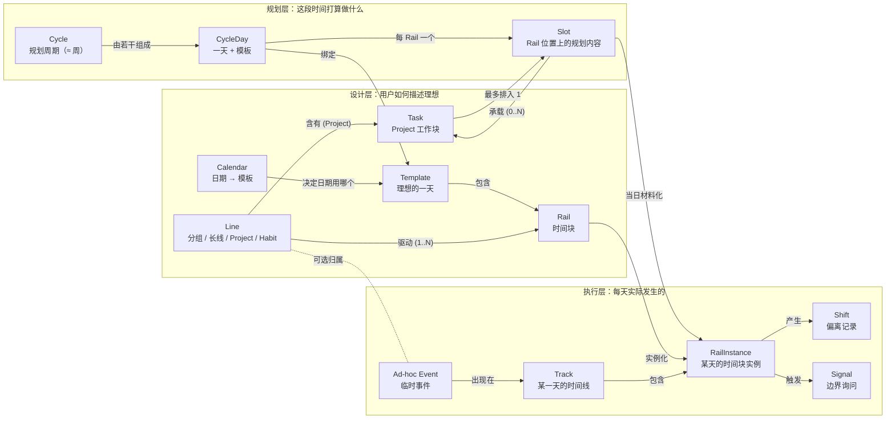

# DayRail 产品设计文档（ERD）

> **状态**：活文档 —— 这里的任何决策都可以被推翻。最近更新 2026-04-19（v0.4 habit 绑定收敛 + Task 编辑面铺开）。四件事一起定：(1) 新增 `HabitBinding` 实体（habitId + railId + 可选 weekdays 过滤器），取代原来 `Rail.defaultLineId === habit.id` 的绑定方式；修掉"两个 habit 同一时段不同 weekday 会在同一 template 里挤两条 rail"的结构性扭曲。(2) `Rail.defaultLineId` 字段彻底删除，曾承担的两个职责分别交给 `HabitBinding` 和"以后真需要再加"。Cycle quick-create 默认落 Inbox。(3) Today Track RailCard + Cycle View slot popover 都接入 TaskDetailDrawer，可以就地改备注 / 子任务 / 里程碑 / 排期。(4) Auto-task 的编辑权限表定稿：title / schedule / milestone 只读（它们是 habit 属性），note / subItems 可改（这是"本次上下文"）；habit 改名只影响未来新物化的 auto-task，老的因 materializer 幂等不会被回写。§5.5.0 / §10.2 / §10.3 / §10.4 / §5.2 / §5.3 一并更新。历史：2026-04-19（数据模型一致性大整理 · v0.4 基石）。合并发布六件事：(1) §10 新增"**三轴速览**" + "**完成状态归属规则**"——Line / Rail × Template × Time / Task 三轴正交，`Task.status` 成为所有完成语义的单一真源，RailInstance 收窄为"墙钟日志"（actualStart/End + Shift 标签），不再和 Task.status 并列承担"做没做"的问题。修掉 v0.3 遗留的"Tasks 页勾完成但 Today Track 仍显 pending"这类一致性裂缝。(2) habit 的"每次发生"改为一条 **auto-task**（幂等 id = `task-auto-{habitId}-{date}`，`lineId = habitId`，`title = habit.name`）。habit Line 硬约束"下不持有手工 Task"；NewTaskInput 永不暴露给 habit 详情页。habit 和 project 完全对齐完成路径 —— Today Track / Pending / Review 全部查 Task.status。(3) §10.2 定下 Auto-task 物化策略 Ⅱ · **按需 on-demand**，触发点：Today Track boot / Cycle View 切换 / 节奏带打开 / Calendar 翻月 / Review 切 scope / 节奏带点回填。每个 `(habitId, cycleId)` 物化一次就打标记，后续不重算；幂等 id 兜底。(4) §10.3 定下 Habit 配置变更规则：改 Rail 的 recurrence / 时间 / templateKey / defaultLineId 之一时，扫 `[今天, 最远已物化 cycle 末尾]`，**只影响** `status='pending' AND plannedStart > now` 的 auto-task（purge + 按新配置补齐），已完成 / 跳过 / 归档的保留。三类事件（task.purged + task.created + rail.updated）在同一个 Edit Session 下，一键回滚。保存前 confirm。(5) §5.5.0 加 **A+B 节奏带交互**：A 只读 + B 点击回填（done / skipped / shifted / clear），点未物化格子现场 upsert。主路（今天）在 Today Track，兜底（忘标 / 漏开 app / 事后补打）在节奏带原地。(6) §5.5.0 **明确关闭** "habit 和 Rail 合并为单一实体"的开放问题 —— 当前三轴分离是特性不是债：Template = 结构不同的一天，habit 是"安排*进*一天的活动"不是"凌驾*于*日历的 cron"，新建模板时重新安排 habit 本来就是 Template 的题中之义。原"跨模板抄很多 rail"、"请病假 habit 不 fire"、"新模板要手动迁移"三个 framing 统一翻转：这些都不是痛点，是设计。§5.6 / §5.7 / §5.8 写路径全部改为读写 Task.status，RailInstance.status 字段在 v0.4 进入 deprecated 状态（保留到 v0.5 清理）。历史：2026-04-18（§5.5.0 Habits 视图心智校正（v0.4 锚点）：用户视角 **habit = 一件反复发生的事**，不是"一堆 Task 的桶"。Project 是 N 个 Task 聚成一个目标；Habit 是 1 件带 recurrence 的事。Habit Line 增加硬约束"不持有 Task"；habit 详情页去 Project 化——去掉 NewTaskInput / FilterBar / GroupedTaskList，改为"名 + 色 + 当前 phase" → 近 14 天节奏带 → 绑定 Rail 列表 → Phase 时间线 → 备注 → Danger。曾讨论过的"habit 下折叠 Task 小抽屉"（B 方案）明确放弃，方向不一致的心智代价 > 杂事便利。`Line.kind='habit'` 最终是否并入 Rail 族合并为单实体留作 schema 级开放问题，本次不碰。历史：2026-04-18（§5.5.0 Habits 真实装（v0.3.3）：habit 分两档——"简单 habit"（默认，为保持固定强度而做，不暴露 phase 概念）和"进阶 habit"（opt-in，手动启用 phase 追踪后可加任意多个时间段标签）。HabitPhase 是纯用户定义的时间段 label（`{ name, description?, startDate }`），没有 endDate、没有预设枚举、没有自动升降、没有 streak / 完成率派生——这些都延到 v0.4 Review 集成。"启用 / 未启用"完全从关联 HabitPhase 记录数派生，不加 `Line.phaseEnabled` 冗余字段。§10 原先 over-engineered 的 `type Phase`（带 advanceRule / railOverrides）下架，换成 `type HabitPhase`；`type Line` 的 phases/currentPhaseId/tasks 内嵌字段拿掉，`kind` 作为 union discriminator，关联数据走独立实体；`Line.createdAt` / `archivedAt` / `deletedAt` 统一到 `number` (epoch ms) 对齐实装。新事件 `habit-phase.upserted` / `habit-phase.removed`。历史：2026-04-18（§5.3.1 Edit Session v0.3 扩到 Cycle View：进入 `/cycle` 开隐式会话；CycleDay 模板切换、Slot drag-drop 排 / 撤排、slot popover "移除排期" / "标记完成"、空格 quick-create、orphan 守护批量 unschedule 全部挂同一 `sessionId`；顶栏常驻"⤺ 撤销本次编辑 · N"按钮一键回滚整批，离开或 15 min idle 自动关。Core 侧对 `overrideCycleDay` / `clearCycleDayOverride` / `scheduleTaskToRail` / `unscheduleTask` / `createTask` / `updateTask` 全部加 optional `sessionId` 参数，appendEvent 带上后 `undoEditSession` 的 drop-session-events 直接一并回滚。单条撤销路径（slot popover 移除 / CycleDay 恢复默认）保留。历史：2026-04-18（§5.4 CalendarRule v0.3 高级规则开动：weekday / cycle / date-range 三种 kind 的 typed `value` + resolver + UI 全部上线。Resolver 按 priority desc 遍历所有规则（single-date 100 > date-range 50 > cycle 30 > weekday 10），miss 才回退内置启发。weekday 规则首次启动自动 seed（workday 覆盖周一-五 / restday 覆盖周末），行为与旧硬编码启发等价、无 breaking change、OPFS 不用清。"高级日历规则" drawer 重新挂上：四段（single-date / date-range / cycle / weekday），每段列表 + 新建 form + 删除；v0.3 采"删 + 重建"，真 in-place edit 留 v0.3.1；drawer **不**走 §5.3.1 Edit Session（即时持久化，与 Cycle View 同策略）。§10 CalendarRule 类型块补 typed value variants + v0.3 实装规矩；§5.4 drawer 小节同步细化。历史：2026-04-18（路由库 + URL 结构拍板：v0.2 用 `react-router-dom` v6，不上 `@tanstack/router`——类型化 params 的卖点对当前复杂度溢价过高；URL 结构 `/` / `/cycle` / `/tasks` + `/tasks/inbox` / `/tasks/line/:lineId` / `/tasks/archived` / `/tasks/trash` / `/review` / `/pending` / `/calendar` / `/templates` / `/templates/:key` / `/settings` / `/settings/:section`。进 URL 的状态：Tasks selection、Settings section、Template tab；搜索 / 过滤 chip / Cycle anchorDate 留本地 state 不入 URL。详见 `docs/v0.2-plan.md §3`。历史：2026-04-18（§5.3 Cycle View 顶部 DAYS 区块合并：原"顶部大 header（跨所有 section、唯一）"取消；section mini-header 从只读升级为**唯一**模板切换入口——每个日期格本身就是触发器，点开同一套 popover（模板列表 + 覆盖态时多一条"恢复默认"），overridden 指示点从顶部 DayButton 挪进 mini-header 的日期格。理由：两处 DAYS 行信息重复、顶部区块和 sticky summary strip 挤占纵向空间；保留"一件事一个入口"——只是入口从"顶部唯一 master"挪成"每个 section 的 mini-header 里自己那几天"。历史：2026-04-18（§5.3 Cycle View 切换模板时的 orphan-task 守护：旧模板下的 Rail 被新模板"切走"时，已排到这些 Rail 的 task 会被静默孤立；现在加一层确认——N=0 静默切，N>0 弹 `将移出 N 个已排任务 · 继续 / 取消`，continue 后批量 `task.unscheduled` 再写规则；"恢复默认"同规则。§5.5 Tasks 视图列表形态调整：状态 chip 从顶部移除，列表主体改为"未完成 / 已完成"两段折叠——未完成展开、已完成默认折叠、未完成空时已完成自动展开并在位置放"都搞定了 ✓"；Archived / Trash 仍只在左栏有入口；搜索命中时两段都展开。历史：2026-04-18（Cycle View CalendarRule 持久化：§5.3 的 CycleDay 模板切换从"本地 state"改为即时写 `calendar-rule.upserted` / `calendar-rule.removed` 事件；`cr-single-{date}` 去重 id；§5.3.1 Edit Session v0.2 范围收窄到只剩 Template Editor，Cycle View 会话级 undo 推迟到 v0.3，面内的误触回退由 Slot popover 的"移除排期" + CycleDay 的"恢复默认"两条单条动作承担；§10 CalendarRule 补 v0.2 实装细则——只 single-date 生效、id 规则、priority=100、事件形态）。历史：2026-04-18（§5.5 从 `Projects / Lines View` 重构为 `Tasks 视图`，定位为"任务管理主入口"—— 侧栏导航树（随手记 + Projects + Habits + 回收站）+ 跨 Project 的 task 列表 / 搜索 / 过滤 + 排期 popover 两种模式（绑 Rail · 默认 / 自由时间 · 逃生口）；新增内置 Inbox Line（`isDefault: true`、不可删）作为"不挑 Project"的 task 默认容器；全面可逆性 + 软删除模型（Task / Line / AdhocEvent 状态加 `'deleted'`，回收站入口 + 二次确认的硬删 `*.purged`）；`AdhocEvent` 加 `taskId` 字段承接自由时间模式排期；Project 进度条改为条件渲染（仅有 milestone task 时显示），任务数永远显示；开放式 Project（无 plannedEnd）明确不计为风险；§10 Task/Line/AdhocEvent 类型定义同步更新；术语精简：`Chunk` 统一改 `Task`（types + events + schema + UI + ERD 全路径改名），降低 jargon 负担；`Line` 作为内部容器类型保留（`kind: 'project' \| 'habit' \| 'group'` 的 union 父类），但**UI 里永远展示具体形态 Project / Habit / Group / Tag**，不再出现"Line"这个字；`Pending` view 改名 `待决定 / Unresolved` 和 `status='pending'` 解耦；§5.7 Pending 不做 24h 老化，成为"等待决定"全集，check-in 条是其"近 24h"的子集）。历史：2026-04-17（check-in 动作集简化：旧的 `完成/跳过/Shift/忽略` 四按钮 + 四子动作 sheet 合并为三按钮 `完成 / 以后再说 / 归档`；`RailInstance.status` 改为 `pending / done / deferred / archived`（`active / skipped` 弃用，"当前进行中"纯墙钟派生）；Shift sheet 替换为 6 秒 Reason toast（3 枚快速 tag chip + undo，无强制 reason）；Postpone / Replace / Swap / Resize 从 Shift 类型里下架，Postpone 交给 Cycle View 拖拽，其余留 v0.3 重评；Pending 队列重命名并收编 `deferred` 条目 + 超 24h stale 的 pending —— 两个来源一个出口；§5.8 Review 热力图三分语义改绑 `deferred / archived / pending-stale`）。历史：2026-04-16（A 组 UI 底线：同步状态徽章、Now View 节奏条、Ad-hoc 叠层、编辑会话通用化、Cycle 记号改 C1、日期格式表落地；B 组 Now View 结构：多 Task pill 行、Slot 三形态、Next Rail 视觉、去掉铁轨副视图、`CURRENT RAIL` chip、Now 顶栏 `Now` + Mono 副标；C 组 Today Track Shift 交互：Skipped 态改 hatching、桌面 hover 出动作栏、Active 主 CTA 改 tonal `Done`、统一 Shift 标签 sheet、去 bento 保留单条时间线；D 组 Cycle View 骨架：按 Template 堆叠 section、顶部 day header 唯一模板切换入口、Cycle pager picker、summary strip 聚合、`⤺ 撤销本次编辑` 按钮、hatching 三分语义、Backlog 变 split drawer；E 组 Template Editor：删 Save 按钮 / 首次进入 inline 引导、Radix 10 色 popover、顶栏 tab + 2px 色条 + dashed `+ 新建模板`、summary strip 聚合、card 式 Rail 行 + time pill popover picker、行间 gap chip `+ 填充 Rail`、`⋯` 行菜单放 Line 绑定 / check-in toggle；通知重审：删 OS push / Capacitor 通知 / 通知权限链路，Signal 塌缩为 `showInCheckin` 布尔，§5.6 / §5.7 合成一条主线 —— check-in 条 + Pending 队列是同一机制前后两个时态；F 组 缺失页面：Projects / Settings 共用 master-detail 形态，Review 单尺度瀑布 + 节奏匹配度热力图（状态染色 + hatching 三分语义），Pending 队列按日期反序 + 每行 4 动作 + 侧栏 `·` 小点不显数字，Calendar 月历网格 + 点日弹 popover + 高级规则 drawer 四 section，新增 §5.9 Settings 定 5 section + 主题三档默认跟随系统 + i18n 语言在外观 / 时间制 + AI locale 在高级；G 组 设计语言：Terracotta CTA 用 `orange-9/10/11` 三档纯色不用渐变；No-Line Rule 明文白名单（装饰色条 + sticky hairline + focus ring）；Surface 四档 `sand-1..4` 取代 `border` 表达层级；圆角 token `sharp / sm / md / lg` = `0 / 6 / 10 / 16`；整站零 glassmorphism；非对称为默认布局。视觉实装阶段调整：Rail 色板从原 10 色剔除 `olive / mauve / gray`（与 sage / slate 近乎同色、或失去色相识别度），换入 `grass / indigo / plum` 覆盖饱和绿 / 冷静蓝 / 创作紫空位，保持 10 色不变但辨识度拉满；CN 主字体从 PingFang 改为 Noto Sans SC（思源黑体）以获得跨平台一致渲染。Terracotta CTA 从 `orange-9` 实测过于鲜亮，改绑 `bronze-9` 以贴合 ERD 原意的 #C97B4A 暖赭石基调）。
>
> 本文档描述 DayRail 的产品逻辑、交互设计与技术选型。它不是最终蓝图，而是设计意图与取舍的记录（包括我们考虑过又否决掉的方案），方便贡献者理解代码**为什么**长成这样。
>
> **想提异议、想参与讨论？** §11 列的是仍然开放的问题，每一条都欢迎开 issue / discussion。"这条规则不对劲"和"你没想到的情况"都可以聊。

***

## 1. 核心理念

> **对自己好一点，让节奏继续走。**

苛责自己不会让明天更好，只会让心累。环境因素和偶发扰动是不可避免的，我们可以像对待呼吸一样接受它 —— 这不是放弃对自己的要求，而是承认："允许偏离"才是节奏得以延续的真正前提。

在此之下，**规律是默认值，而非枷锁。** DayRail 相信好的生活节奏不是靠严格执行计划表，而是靠建立一条舒适的轨道 —— 每天在差不多的时间做差不多的事。这条轨道给你方向感和确定性，但你随时可以变道、减速、跳过，不需要解释，不会被标记为"失败"。

三层内核：

1. **秩序是起点，不是目标**。偏离（Shift）和执行一样是一等操作。
2. **重复产生节奏，节奏产生自由**。模板化的 Track 消除每日决策疲劳。
3. **工具应该安静**。不做排行榜、不做成就、不发催促通知。只在时间块边界轻问一句：继续、调整，还是跳过？

类比：大多数日程工具是**教练**（告诉你该做什么，没做就批评你）；DayRail 是**铁轨**（默默铺着，踩上去就走，下车随时，下次还在）。

如果你的日常行为没法遵循某条规律，DayRail 不会评判，那可能只是规律本身不适合你 —— 换个时间、换件事就好。

***

## 2. 产品定位与差异点

### 2.1 为谁而做

DayRail 面向这样一类人：

- **习惯提前安排**（周日晚规划下周，而不是临时起意）
- **每天有相似节奏**（起床、工作、运动、阅读大致在固定时间）
- **但需要灵活调整**（不希望一次偏离就前功尽弃）

他们不缺计划能力，缺的是**能吸收偏离的计划容器**。

### 2.2 与常见工具的差异

| 场景     | 普通 TODO / 日历应用         | DayRail                       |
| ------ | ---------------------- | ----------------------------- |
| 长期目标拆解 | 用户手动拆成多个 TODO，逐个设置时间   | Line 原生描述长期事务，可由 AI 协助拆成 Rail |
| 任务延期   | 手动一个个调整 TODO 时间，甚至全部推后 | 一次 Shift 操作，后续 Rail 自动处理      |
| 每日重复   | 每天重复创建或用"循环任务"粗略应付     | Template + Track，修改当天不污染模板    |
| 偏离反馈   | 过期红字、未完成堆积、成就断档        | Shift 是中性记录，无失败语义             |
| 整周规划   | 按天复制、重复粘贴              | Cycle View 一次铺设一个周期，一键撤销本次规划  |

### 2.3 产品边界

| 维度    | DayRail 是              | DayRail 不是      |
| ----- | ---------------------- | --------------- |
| 时间观   | 软结构时间轴                 | 刚性日历 / 会议调度     |
| 目标用户  | 想建立可持续日常节奏的个人          | 团队协作、项目管理用户     |
| 核心动作  | 规划"理想的一天/一周" + 当天微调    | 记录 / 任务清单 / GTD |
| 反馈机制  | 轻触式 Signal + 温和的 AI 回顾 | 打卡、连续天数、激励徽章    |
| 数据所有权 | 本地优先，用户完全掌控            | 云端中心化、账号绑定      |

**刻意不做的事**：连续打卡计数、失败提示、社交排行、强提醒、复杂优先级系统。

***

## 3. 用户故事（示例场景）

以下故事展示 DayRail 在不同人群中的典型使用形态。它们用作设计决策的试金石 —— 任何新功能都应当能自然嵌入至少一个故事。

### 故事 A：提前安排的研究生 · 梅雨

> 研二，习惯周日晚铺下一周。
>
> 周日 21:00，她打开 DayRail，切到 Cycle View 开始规划下一个 Cycle。把每天 19:00–21:00 的"休闲 Rail"替换为"复习 Rail"，一次拖拽跨五天应用。周三发现要交论文初稿，她把周四早上的"晨跑"左滑跳过。周五临时被导师约谈，她在 Calendar 上加一个 14:00 的 Ad-hoc Event，没有污染任何模板。这个 Cycle 结束后她在回顾页看到本期规划的完成情况 —— 87%。如果她周一改主意，只需按一下"撤销本次规划"就能一次回退那五条替换。下一个 Cycle 又是默认节奏。

### 故事 B：断断续续的跑步者 · 老杨

> 程序员，晨跑习惯常被会议冲掉。
>
> 他创建 Habit Line "晨跑"，两个 Phase：前两周 30min、之后 40min。周一至周三都跑了，周四没起床 —— 用 Shift 打个"没状态"标签，不自责。周五左滑跳过，"会议太早"。一个月后 AI Review 告诉他："你的周四晨跑四周内跳过 3 次，要不要把周四换成 20:00 夜跑？"他接受建议，Template 微调，本 Line 第 2 个 Phase 里周四关联 Rail 也跟着变。

### 故事 C：小组作业 · 阿倩

> 大三，三周内完成小组报告。
>
> 她建一个 Project "市场调研报告"（计划时间窗 2026-04-20 → 2026-05-10），拆出几个 Task："确定选题 20%"、"发问卷 50%"、"分析数据 80%"、"写报告初稿 100%"，另外还有几个没标里程碑百分比的附加事项（"整理参考文献"、"检查格式"）。她把 Task 逐个拖到周期视图对应天的某个时段 Slot 里（"分析数据"这个 Task 放在下周三 14:00–16:00 那格）。队友拖延导致"发问卷"晚了两天，她在那条 RailInstance 上点"以后再说"（`status → deferred`），进入 Pending 队列，再在 Cycle View 里把它拖到周五 → plannedStart/End 重置、回到 `pending`；其它 Task 不受干扰。最后标记 100% 的 Task 完成 → Project 自动归档。

### 故事 D：不用 AI 的极简用户 · 小林

> 对 AI 无感，但喜欢铁轨的比喻。
>
> 首次启动看到 AI 引导卡，点"稍后"。之后一切本地运行，没有账号、没有联网、没有 AI 回复。她只用 Template + Track + Shift 三个概念，永远够用。

### 故事 E：跨设备的重度用户 · Kai

> 前端工程师，在家用 macOS，通勤用 iPhone，公司用 Windows。
>
> 他在 Web 端（Windows）建好 Template 和两条 Line，切到设置里启用同步，选 Google Drive、OAuth 授权完成。回家开 macOS 桌面端：启用同步、授权同一个 Google Drive 账号、加密短语输入一次 —— Rail 数据和他的设置（OpenRouter Key、主题、Fallback 链）都从同一个 Drive 目录流入。一条同步通道，没有别的要配。

***

## 4. 核心概念模型

### 4.1 实体定义

- **Rail（轨）**：一个可重复的时间块。属性：名称、起止时间、颜色 / 图标、重复规则、默认动作描述、是否允许 Signal 打扰、可选关联的 Line。
- **Template（模板）**：Track / CycleDay 的"理想版本"，一个用户可有多个模板。MVP 内置两份：`workday` 与 `restday`，用户可自由增删。模板通过 **Calendar** 按日期规则应用。
- **Cycle（周期）**：一段连续的规划期。默认长度 7 天（周一到周日），**支持因长节假日等场景延长 / 缩短**；结束后下一个 Cycle 自动顺延从次日开始、生成到下一个 Sunday（或用户手动改）。Cycle 是规划视图的组织单位（见 §5.3）。
- **CycleDay**：Cycle 中的一天，绑定一个 `templateKey`（MVP 默认在 `workday` / `restday` 间切换，用户也可选其它模板），并容纳若干 Slot。
- **Slot（槽位）**：某个 CycleDay 中某个 Rail 位置上的**规划内容容器**。可同时承载：
  - 可选的 `taskName`（纯文本）—— 用于一次性小事（"给妈妈打电话"）不走 Project。
  - 有序的 `taskIds` —— 属于某个 Project 的 Task 分配位置。
  Slot 是规划态（设计当天这个位置要做什么）；当日到达时由 Slot 材料化出 **RailInstance**（执行态）。
- **Track（轨道）**：某一天的时间线，由若干 RailInstance 组成。Track 根据当日所在 Cycle 的 CycleDay + 模板生成；用户在 Today Track 上对单天实例做的修改不污染模板或模板关联的 CycleDay。
- **RailInstance**：某天某个 Rail 的执行态实例，携带 `status`（pending / done / deferred / archived）、`plannedStart` / `plannedEnd`、可选的 `actualStart` / `actualEnd`、当天 override、(若有) 所属规划会话的 `sessionId`。"正在进行中"（current rail）不是独立 status —— 纯由墙钟位置派生（`plannedStart ≤ now ≤ plannedEnd` 且 `status='pending'`）。
- **Shift（变道）**：对当天 Rail 实例 `pending` → 终态转移的附加记录。v0.2 保留两类：`defer`（以后再说，落 Pending）和 `archive`（归档，不再排期）。可选附带原因标签（全局共享标签库，详见 §5.7）。"时内推移"由 Cycle View 拖拽承担；`swap / resize / replace` 留到 v0.3 重评。
- **Signal（信号）**：Rail 边界的轻量级提醒。名字取自铁路边的信号灯 —— 到点亮一下，不命令你做什么。三个选项：`继续` / `调整` / `跳过`。
- **Ad-hoc Event（临时事件）**：不属于任何模板的一次性时间块。优先级高于任何 Template 解析结果。可选关联 Line。
- **Line（内部容器类型 · UI 永远不用这个词）**：DayRail 唯一的"多 Rail / Task 分组"概念，呈现为一个连续谱。`Line` 只出现在 types / schema / event log 里 —— UI 视图 / 菜单 / 文案始终按 `kind` 展示具体形态：`Project` / `Habit` / `Tag（原 Group）`。
  - **状态三分**：`status: 'active' | 'archived' | 'deleted'`。`archived` 是用户手动归档的终态（可恢复）；`deleted` 是软删除（进回收站，可恢复；二次确认才能硬删）
  - **Inbox 是内置单例 Line**：`id = 'line-inbox'`、`kind = 'project'`、`isDefault: true`、不可删不可改色。所有"用户没挑 Project 的 task"默认落在这里（详见 §5.5.1）
  - 无 Phase 无 Task → **纯分组（标签化）**，仅用于归类（给若干 Rail、Ad-hoc Event 打上"工作""就医"等归属）。
  - 有 Phase → **Habit Line（习惯型 / UI 称 "Habit"）**，开放结束，按 Phase 演进（时长、目标参数、切换规则：按天数 / 按完成次数 / 手动）。适合"每天一次"的重复性事务（晨跑、英语阅读）—— **高频重复本身不是 Project，是 Habit**。
  - 有 Task → **Project Line（项目型 / UI 称 "Project"）**，有限但可追加步骤。见下条 Task 详述。
  - **Line 与 Rail 一对多**：一个 Line 可驱动多个 Rail（小组作业拆成 5 个可独立 Shift 的 Rail）。
  - Phase / Task 可指向全部关联 Rail（整体演进）或特定 Rail（局部推进）。
  - Line 的拆解可手动或由 AI 协助（§6）。
- **Task（工作块）**：Project Line 的基本执行单位。属性：
  - `title`、`subItems`（内部 checklist，不单独排程）、`status`（pending / in\_progress / done）、`order`（可拖拽）。
  - **可选的** `milestonePercent`（0–100）：带百分比即"里程碑"，不带则是"附加事项"。Project 支持**无限追加** Task（含追加新的 milestonePercent）直至归档。
  - **Task 的完成是全局的**：一个 Task 最多排入一个 Slot（Task ↔ Slot 一对一；一个 Slot 可容纳多个 Task）。Slot 只是"我打算在这里推进"，在任一位置标记完成即 Task 全局 `done`，所有视图同步反映。
  - **Project 进度**：已完成 Tasks 中 `milestonePercent` 的**最大值**（不做加权总和；无 `milestonePercent` 的 Task 不参与进度计算，但计入"已完成事项数"）。
  - **归档触发**：`milestonePercent === 100` 的 Task 转为 `done` 时 Project 自动归档；也允许用户随时手动归档。归档后不支持解档；若想做"v2"，通过"复制新建"生成新 Project。
  - **计划时间窗**（Project Line 级）：可选 `plannedStart` / `plannedEnd`，作为软提示 —— 把 Task 排入窗口外的日期会警示但不阻止。
- **规划会话**（内部概念）：一次在 Cycle View（周期视图）里集中编辑的过程。其中产生的 RailInstance override 共享一个内部 `sessionId`，用于"撤销本次规划"的原子回退。**不是用户可见的名词** —— 没有 Plan 页面、不用命名、没有升格流程。对于会反复出现的多周安排（考试周、出差周），请走专门的 Template + Calendar 日期范围规则。

### 4.2 概念总览（Mermaid）



> Cycle View 里一次集中编辑视为内部"规划会话"，其 override 共享 `sessionId` 用于原子撤销，但不作为命名实体暴露给用户。

### 4.3 关系（文字版）

```
Template    ──materializes──▶ CycleDay.templateKey
Cycle       ──contains ─────▶ CycleDay[]
CycleDay    ──has ──────────▶ Slot[]（每 Rail 一个）
Slot        ──holds ────────▶ Task[]（0..N，一对多）
Task       ──assignedTo ───▶ Slot（0..1，最多一个）
Task       ──belongsTo ────▶ Line（Project 变体）
Line        ──drives ───────▶ Rail[]（1..N）
Line(Project)──progress ────▶ max(milestonePercent of done Tasks)

CycleDay    ──generates ────▶ Track（每日一份）
Track       ──contains ─────▶ RailInstance
RailInstance──reflects ─────▶ Slot 内容（taskName + tasks）
RailInstance──produces ─────▶ Shift（零到多个）
RailInstance──triggers ─────▶ Signal（零到多个）
Calendar    ──resolves ─────▶ 某日期应使用哪个 Template（或 Ad-hoc Event）
sessionId   ──groups ───────▶ 一次规划会话中的 override（内部）
```

### 4.4 状态机（RailInstance）

```
               ┌── 完成 ──────────▶ done       (终态)
               │
   pending ────┼── 归档 ──────────▶ archived   (终态)
               │
               └── 以后再说 ──────▶ deferred   (半终态 · 落入 §5.7 Pending)
                                       │
                                       └── Cycle View 拖回某天 ──▶ pending
                                                       (plannedStart/End 重置)
```

- **`pending`** 是初始态 + 可恢复态；未来 / current / 过期未标记三种墙钟情形都在其下，不拆成独立 status。
- **`deferred`** 是半终态：进入 Pending 队列，**可通过 Cycle View 重新排到某天**（拖拽给一个新的 `plannedStart/End`），回到 `pending`。
- **`done`** / **`archived`** 是终态，不再回转。Review 通过 event log 追溯历史而非当前 status。

任何 `pending → *` 的转移都会生成一条 Shift 记录（可携带 tags + 可选 reason）。Shift 是历史，不影响后续天数。

***

## 5. 关键交互设计

### 5.0 应用外壳（App Shell）

所有视图共用一层固定的外壳：左侧导航（桌面）/ 底部 Tab（移动）+ 顶部标题栏。外壳本身不承载业务逻辑，只是"app 常在之物"的载体。

**桌面端 · 左侧固定导航**（约 64–72px 宽）：

- **顶部**：自绘 inline SVG `<DayRailMark />` + 副标题 `STAY ON THE RAIL`（全大写、不随 locale 翻译，详见 §9.6 Logo 与标识）。
- **中部**（垂直列表，icon + 短标）：`Now` / `Today` / `Cycle` / `Projects` / `Review` / `Calendar` / `Settings`。当前视图左侧贴一条 2px primary 色条。
- **底部**：**同步状态徽章**（见下）。**刻意不展示头像 / 姓名 / 套餐** —— DayRail 没有账号，展示这些只会制造"我有账号吗？"的误解。
- 外壳没有全局 `Save` / `New…` CTA —— 每个视图自己决定要不要露主动作按钮。

**移动端**：底部 Tab 保留 5 个常用入口（`Now` / `Today` / `Cycle` / `Projects` / `Review`）；`Calendar` 与 `Settings` 收到顶部右上的 `⋯` 菜单。Logo 不出现在移动端主屏（让位给内容）。

**顶部标题栏**：左侧是当前视图标题，具体格式由各视图自行约定（Today / Cycle 走 `今天 · 4月 C1 · 周四` 的单行 context 模式；Now View 走 `Now` 主标 + Mono 副标时间的"此刻"模式，详见 §5.1）；右侧是与视图相关的次级操作（Cycle View 的 `下个 Cycle ▶`、Today 的 `重置为模板`、Template Editor 的 `⋯` 菜单…）。

**同步状态徽章**（左栏底部 / 移动端 `⋯` 菜单内第一项）：

| 状态              | 视觉                                        | 含义                                                          |
| --------------- | ----------------------------------------- | ----------------------------------------------------------- |
| `◉ 仅本机`         | slate step 9 圆点 + 小号浅色文字                  | 用户从未开启同步。这是默认值，**不是错误状态**。                                  |
| `⟳ 已同步 · 2m 前`  | teal step 9 圆点 + 相对时间                     | 最近一次成功同步的相对时间；悬停展示精确 timestamp + 后端（Drive/iCloud/WebDAV …）。 |
| `⚠ 同步暂停`        | amber step 9 圆点 + 简短原因（离线 / 认证失效 / 密钥冲突）  | 同步临时不可用。点击打开详细状态页；**绝不中断当前视图、不弹 modal**。                    |

徽章永远可见、永远克制。**从不使用红色** —— 本地数据始终完整，同步只是可选通道，不存在"失败"语义。

### 5.1 首屏：Now View

打开 App < 1 秒内看到三件事：

1. **当前 Rail 的 Slot 内容**（大字号，占主内容列）。大标题上方固定挂一枚 Mono 9px 大写 wide-letter-spacing 的小 chip —— 标签永远是 **`CURRENT RAIL`**（不写 `CURRENT TASK`，因为焦点的语义单位是 Rail；Task 是 Rail 里的具体动作）。大标题下方的呈现按 Slot 形态分三种：

   - **有 Task**：首个未完成 Task 的 title 作为**大标题**。多 Task 时大标题下方加一行小号副文 `第 1 / 共 3 个 task`；再下方是**紧凑 pill 行**，把其余 Task 按 `order` 列出 —— 每个 pill = 4px Project 色条 + Task title + 可选 `milestonePercent` 徽标；已完成的 Task 加**删除线**；点击 pill 跳到该 Task 详情（Project Line 详情内定位）。pill **不承载"标记完成"操作** —— 主动作按钮的"完成"永远作用于首个未完成 Task，一次点一条，避免"挑着完成"的操作陷阱。
   - **只有 `taskName`**：`taskName` 作为大标题；标题下挂一枚小 chip `Quick task`（JetBrains Mono 9px 大写 wide letter-spacing，和 ADHOC chip 同风格；色板用 slate step 3 底 + step 11 文字），明确"这不是 Project Task、不会在 Project 进度里留痕"。
   - **都没有**：大标题位显示巨大 `—`；下方一行克制副文 `这段时间空着。休息、思考，或随手做点什么。` **不**露"+ 添加"按钮 —— 当下添加内容不是 Now View 的职责，走 Today Track（§5.2）或 Cycle View（§5.3）。

   大标题旁（或下方，取决于视口宽度）展示**剩余时间**（Mono 大字 `45m`）+ 结束时钟（小号 Mono `ends 16:30`）+ 一条时间进度条（按 Rail 时长推进，**不是 Task 进度**）。

2. **下一个 Rail 卡片**：视觉和 Today Track 单条 Rail 行一致 —— 4px 左色条取该 Rail 自身 Radix step 9 色；**刻意不使用三等色（terracotta）** 作为"Next"强调色，三等色只给当前 Rail 和主动作按钮（§9.6）。卡内内容：
   - 左上 Mono 小号 chip `COMING UP NEXT`（和 `CURRENT RAIL` 一个风格）+ Mono 倒计时 `32m 后`（倒计时随分钟级刷新）。
   - Rail 名称（中号字）。
   - Slot 预览摘要（小号副文，按 order 列出前 2 个 Task 的 title + 百分比，如 `热身 20%、有氧 50%`）。若 Slot 是 `taskName`-only，副文 = `taskName` + `Quick task` chip；若全空，副文显示 `—`。

3. **一对主动作按钮**：`完成 / 跳过`。点"完成"会把当前 Slot 里首个未完成的 Task 标为 done（Task 是全局状态，在任一 Slot 完成即全局完成）。若 Slot 只有 `taskName` 无 Task，"完成"对应 RailInstance → `done`。首页刻意不放"调整"入口 —— 需要改时间 / 换内容走 Today Track 的行级交互（§5.2），避免当下决策又多一步。

**顶栏（§5.0 约定的 Now-View 变体）**：主标 `Now`（Inter font-bold）+ 下方小号 Mono 副标 `14:28 · 4月 16日 周四`。时钟走 Intl，按分钟级刷新（秒级会让视觉噪声过高，且对 Now 场景没有价值）；副标**不带 Cycle 记号** —— Now View 聚焦"此刻"，周期上下文不在这里。

**右侧栏只承载 `Goal Context`**：当前 Slot 下挂的 Task 所属 Project / Line 的背景信息（进度、计划窗口、最近一次 Shift 摘要）。**刻意不放**：装饰性图片、激励引语、"今日士气 65%"式的进度数字、成就 / 连续天数计量。装饰与激励与 §1 的核心理念直接冲突。若 Slot 是 `taskName`-only 或全空，右侧栏显示一段中性提示（如 `这段没有长目标需要展开。慢下来没问题。`），不留空白压迫用户找事情填。

**主内容区刻意不设左侧"铁轨可视化"**（竖向圆点 / 竖轴图形等"今日形状"副视图）。今天的形状由下方节奏条统一承担 —— 同屏两套时间轴只会稀释注意力，且竖轴形态天然无法像节奏条那样按状态着色呈现节奏密度。

**底部节奏条**（rhythm bar）：今天的 Rail 轴线横贴在首屏底部，每段按 RailInstance 状态着色 —— `pending·未来` slate step 6 / `pending·current` primary step 9 / `done` sage step 9 / `deferred` slate step 4 斜纹 / `archived` slate step 4 斜纹 + line-through。**不展示数字、不展示百分比**，即便今天全部完成也没有"圆满完成"提示 —— 中性的回顾留给专门的"**今日复盘**"（§5.8 中 Review 的日尺度）。节奏条的作用只是"一眼看到今天的形状"，不是打卡墙。

**首屏保留两个克制的 slot**：

- 顶部（条件出现）：Pending 队列条（§5.7）—— 可忽略、不阻塞。
- 底部（一次性）：AI 引导卡（§6.4）—— 首次启动出现一次，可关闭。

首次启动时，用户直接落地到一份**预设的默认工作日模板**，可原地编辑（不是空白画布，也不是向导）。这样新人第一眼就有可反应的东西 —— 调时间、改名、删掉不适用的 Rail —— 而不是看着"然后呢？"发呆，或在建立信任前就被要求做决定。无登录、无 splash、无每日摘要弹窗。

### 5.2 Today Track

垂直时间轴展示当天所有 Rail 实例。**单条 Rail 的视觉规则**：

- **行高按时长比例**给出（1h 与 2h 不一样高），一眼能感知节奏密度。
- **左侧 4px 色条**取该 Rail 的 Radix step 9 颜色（若 RailInstance 有 override，按 override 色）。
- **五态着色**（四态 status + 一个纯派生的 current）：
  - `pending` · 未来 —— 正常底（surface-1）+ step 11 文字 + step 9 色条。
  - `pending` · **current**（墙钟落在 plannedStart / End 之间）—— primary step 3 底 + step 12 文字 + 左色条加粗到 6px（详见下文"Current Rail 的特殊形态"）。
  - `pending` · **过期未标记** —— 进 §5.6 check-in 条，不在主时间线单独渲染。
  - `done` —— 色条 fade 到 step 6 + title line-through + 内容 `opacity-70` + 小号 check 圆点。
  - `deferred` —— 色条保留 step 9 + Rail step 6 的 2px 对角斜线 hatching + 右上 `以后再说` pill（Mono 2xs）；**仍在时间线上可见**，这样用户能一眼看到"当天本来该做但被推走的事"。
  - `archived` —— 色条 fade 到 step 7 + Rail step 7 的 2px 对角斜线 hatching + title line-through + `opacity-60` + 右上 `已归档` pill。**刻意不使用 tertiary terracotta** —— 按 §9.6，三等色只给 current rail 和主动作按钮；archived 用"纹理 + 降饱和"传达，避免"标红 = 失败"的审判感。
- **Shift 痕迹**：若该实例今天做过一次 Shift（defer / archive），行底部贴一条 inline 小字 `· <首个 tag>`（例：`· 天气` / `· 会议冲突`）；点击**就地展开**该 Shift 的 tag 集合 + 可选 reason，**不弹 modal**。

**Current Rail 的特殊形态**：

- 底色、文字、色条按 current 态放大一档（primary step 3 / step 12 / 6px 色条）；右上角一枚 Mono `CURRENT RAIL` 小 pill（pulse 一个 cta-soft 小圆点）。
- **主 CTA = `✓ 完成`**，tonal 样式：`bg-ink-primary` + `text-surface-0`，**不使用 gradient**。gradient 按 §9.6 仅保留给更稀有的庆祝态（例："今日全部 Rail 完成"），而不是日常按钮。
- **次按钮**并排 = `以后再说` / `归档` 两个。悬停行或键盘 focus 时露出，与非 current 行的 hover 动作栏一致。
- **"提前完成"不是新概念**：点 `✓ 完成` = `RailInstance.status → 'done'` + `actualEnd = now()`；若 `actualEnd < plannedEnd` 说明提前结束。Review 直接按差值聚合，**无需新增 `earlyFinish` 字段**。

**三动作交互（check-in 条与时间线 hover 动作栏共用）**：

- **`✓ 完成`** —— 主动作。`status → done`，立即生效。
- **`以后再说 (defer)`** —— `status → deferred`，rail 从今日剩余的渲染里撤出（或沉为 hatching），落进 §5.7 Pending 队列。时间轴上原占位**保留虚线轮廓**作为"这里本来有什么"的痕迹。
- **`归档 (archive)`** —— `status → archived`，终态。对循环 Rail（recurrence ≠ `one-shot`）额外弹一个 3s toast：`已归档今日的晨跑；明天的晨跑仍会生成`。避免用户误以为"归档 = 关掉这条 Rail 本身"。

三个动作都走下文的 **Reason toast**（不开 sheet）。

**Reason toast —— 轻量 undo-toast，替代旧 Shift 标签 sheet**：

点完任一动作 → 页面底部（或行内）滑入一个 6 秒计时的窄 toast：

```
已以后再说「晨跑」 · 加个标签？  [🌧️ 天气]  [😴 太累]  [🤝 会议]  [撤销]
```

- **三枚快速原因 chip**：取该 Rail 历史上 tag 频次 top-3；冷启动回落到静态 `天气 / 太累 / 会议`。点 chip 即附加 tag 到刚才那条 Shift，并**保持 toast 可见到倒计时结束**（给用户加第二个 tag 的机会）。
- **撤销**：把 `status` 回退到 `pending`，同时删除刚写入的 Shift + Signal 事件（session-scoped undo 的小号版，仅作用于最近一次 action）。
- **6 秒后自动消失**，若用户没点 chip 也没点撤销，Shift 就不带 tag 保存。
- **没有备注字段**：500 字备注在 ERD 早期版本里，实测高频场景（晨跑没跑）几乎不会用到；tag 已经足够统计。真需要写点什么的用户去 §5.7 Pending 队列详情页补（v0.3）。
- **空 toast 直接消失完全允许** —— 没有强制原因，保持 §1 / §9 "No guilt design"。

键盘：`1` / `2` / `3` 快速选中对应 chip，`u` = 撤销，`Esc` = 立即关闭 toast。

**顶部工具栏**：`[重置为模板]` + `[+ 今天临时事件]` 两个按钮。"重置为模板"仅作用于今天、不影响其它日期；点击弹出确认（列出将被丢弃的 override 数量）。

**Ad-hoc Event 的视觉叠层**：Ad-hoc Event 与 Rail 同处一条时间轴，但**视觉语义不同 —— 它是 Track 的"叠加层"，不是 Rail 替代品**。

- **默认外观**：1.5px **虚线**外框 + slate step 2–3 极浅填色 + 默认中性灰（slate step 9）色条。**刻意不默认使用三等色（tertiary terracotta）** —— 三等色只给 current rail 和主行动按钮。
- **Line 着色继承**：若 `lineId` 指向某条带 `color` 的 Line，**外框继承 Line 色（仍然虚线）**，填色保持中性灰 —— Ad-hoc 不抢 Rail 的视觉位。
- **`ADHOC` chip**：行内右上贴一枚小号 pill `临时 / ADHOC`（JetBrains Mono 9px 大写、letter-spacing 宽），强调"这不是来自模板"。
- **Rail vs Rail 永远不并排**：同一时段不允许两条 Rail 共存（Template 层已是互斥）。Ad-hoc 与 Rail 也不并排 —— Ad-hoc 是覆盖，不是拼接。

> v0.2 early 阶段里的 "Replace Shift" 叠层语义（原 Rail 变虚线 + 替换内容以 Ad-hoc 渲染）已从 §5.2 动作集里下架；对应的用户意图由"归档今日 Rail + 新建 Ad-hoc"两步组合完成，Replace 的再引入留到 v0.3 重评。

**不做"Bento 未来块"**：Today Track 从头到尾是单一时间线，未来 Rail 以 pending 态延续在主轨上；**不**为下午时段或"远处"Rail 另开卡片网格。原因：DayRail 数据模型没有"参与者头像 / 专注强度"这类字段，另开 bento 只能拼装视觉噪声；时间线形态也和 Now View §5.1、Cycle View §5.3 保持统一视觉系统。

**任务详情编辑**（v0.4 新增）：RailCard 上点击对应 rail 行 → 打开 TaskDetailDrawer（沿用 §5.5 那一个组件），可就地改备注 / 子任务 / 里程碑 / 排期。**对 habit 的 auto-task**，编辑权限按 §5.5.0 "Auto-task 的编辑性" 表 —— title / schedule / milestone 只读，note / subItems 可改。rail 上无承载 Task 时（空 rail）点击无响应。RailCard 还在行内展示「N/M 子任务」「有备注」这些小徽标，不用开抽屉就能一眼扫到。

### 5.3 Cycle View（周期视图 / 规划模式）

用于**提前规划**和**整体考察**。以 **Cycle** 为单位 —— 默认一个 Cycle 是 7 天，但在长节假日等场景可以延长（下一个 Cycle 自动从次日起算、默认延展到下一个 Sunday）。

**顶栏布局（从左到右）**：

- 应用标题 `Cycle View`（Inter bold，与其它视图一致）。
- **Cycle picker（pager 形态）**：`< 4月 C1 · 04/07–04/13 · 当前 >`。`<` / `>` 独立按钮翻页；中间 Inter 月份 + Mono 日期段 + 包含今天的 Cycle 右侧挂一枚 `当前` pill（Mono 9px）。**`C` 而非 `W`**，刻意避开 ISO 周号歧义（见 §9.7 Cycle 记号规则）。点击中间标签 → popover：按月分组的 Cycle 列表（可滚）+ 起止日期编辑器（直接输入 YYYY-MM-DD，保存后按"次日 → 下一 Sunday"规则级联重算未来 Cycles）+ `回到当前 Cycle` 按钮。
- 右端：settings / account 图标（与其它视图顶栏一致）。

（**v0.3 起 Cycle View 走 §5.3.1 Edit Session**：进入页面时开启隐式会话，本次页面浏览内的所有规划 mutation（CycleDay 模板切换、Slot 拖拽排 / 撤排期、空格 quick-create task、slot popover 标记完成、orphan 守护的批量 unschedule）都挂同一 `sessionId`；顶栏右侧常驻"⤺ 撤销本次编辑 · N"按钮，点一下回滚全部；15 min idle 或离开视图自动关会话。单条撤销（Slot popover 的"移除排期" / CycleDay 的"恢复默认"）继续存在，作为更细粒度的回退入口。）

**顶栏下方 summary strip（约 16px 高，`surface-container-low` 底，左右 6px padding）**：

- 左端：`本 Cycle: N 项目`（Inter 小字 + 数字 Mono）。
- 中段：**Top 3 Project inline 进度条**（8px rounded-full bar，每条左端 Project 色条 + Project 名小字 + 右端 Mono `12/20` 或百分比；选"最多 task 已排"的前 3）；超过 3 个收到 `+N 更多` → 点击弹 popover 列出全部 Project + 进度。
- 右端：`backlog N →` 按钮，N = 未排入 Slot 的 Task 总数；点击唤起下文的 Backlog 侧栏。

**主体：按 Template 分段的堆叠 mini-grid**（每段一个 Template）：

核心原则：**一个 Cycle 里用了几个模板，就显示几段**。例：5 天 workday + 2 天 restday → 堆叠两个 section；纯 workday 周 → 只显示一段；三模板 Cycle（workday / restday / travel-day）→ 三段。单段结构如下：

- **Section 左侧 8px 标签条**：纵向贯穿整段；标签文字 `workday · sand`（Template 名 + Radix scale 名），Mono 9px 大写 letter-spacing 宽；底色 = Template step 2、文字 = Template step 11。
- **Section mini-day-header**（24px 高）：
  - 左端一格 `[色条] TEMPLATE · N days`（Template 名 + 天数）。
  - 右侧每一"当前 Template 命中的天"各占一格，显示星期缩写 + 日期数字（`Mon 12` / `Tue 13` / …）；今天那一格底色 primary step 2 + 顶部 2px primary step 9 标识条；被覆盖的天（`calendar-rule.upserted`）在日期右侧挂一枚小点。**一个 Cycle 里用了几个模板就堆几段，每段只画自己命中的天**；不命中的天属于另一段，不在本 section 重复。
  - 这一排**就是** CycleDay 模板切换入口（唯一入口 —— 顶部不再单独挂 DAYS 区块）：点任意日期格 → popover 列出所有已创建模板，每项 `radio + Template 色条 + 名称`，末尾 `+ 新建模板`。选中 → 写 `calendar-rule.upserted`（`kind: 'single-date'`、id 按 `cr-single-{date}` 去重，同一日反复切换就是 `update`）；当前已有覆盖时 popover 末尾多一条 `恢复默认` → 写 `calendar-rule.removed`，回到 §5.4 CalendarRule 的 weekday 启发。切换后各 section 的 mini-header / cell 立即重绘（旧 section 该列消失、新 section 多出该列）。
  - **周末不再特别着色** —— 是不是 restday 完全由用户给那一天选的 Template 决定；Stitch 的 Sat/Sun tertiary 染色明确废弃。
- **Section 主体 grid**：行 = 该 Template 的每条 Rail；列 = section mini-header 上已经定下来的"本 Template 命中的那几天"。左栏独立列（≈ 160px 宽）：`[4px Rail 自色条] Mono 时段 08:00–12:00 + 小号 Rail 名`。Cell 对齐该 Rail 在该日的 Slot 内容。
- **切换模板时处理 orphan task**：如果当天的旧模板下已有 N 个 task 被排到具体 Rail 上（`task.slot.date === 该日`），而新模板里没有这些 Rail，直接切会让它们"隐身"（slot 还指着旧 Rail，但 cell 不再渲染）。所以切换前拦一层：N = 0 时直接切；N > 0 时弹一个小 confirm —— `切换到 restday 会把这一天的 N 个已排任务移出，可以随时从 Backlog 拖回来 · 继续 / 取消`。Continue 后一次性把这 N 个 task 走 `task.unscheduled`（slot → undefined），它们自动回到 Backlog drawer；然后才写 `calendar-rule.upserted`。"恢复默认"同理——如果当前 override 下的 template 里有已排 task 而默认启发的 template 没有对应 rail，也走这个确认流程。

**单元格（Slot）可编辑性**：

- 空 Slot（Template 生效 + 无内容）：虚线 border + 显眼的 `+ 添加`；hover 实化。点击弹 popover：`[新建 Task 到 Project]` / `[从已有 Task 挑选]` / `[快速文本 taskName]`。
- 有内容 Slot：顶部按 order 列出 Task pill（左 4px **Project** 色条 + 名称 + 可选 `milestonePercent`），底部若有 `taskName` 则以小号灰字附一行。点击 pill → 弹层 `[标记完成]` / `[移除此处分配]` / `[查看详情 …]` / `[打开 Project]`。「查看详情」打开同一个 TaskDetailDrawer (§5.5)，habit auto-task 适用 §5.5.0 的编辑权限表 (title / schedule / milestone 只读)。Cell 上额外展示「N/M 子任务」「有备注」小徽标。
- **"Rail 不适用"cell**（该列 Template 不生效 → 整列所有 cell）：**Rail step 4** 色 2px 间距对角斜线 hatching + 中心 Mono `—` + `cursor: not-allowed`。使用 step 4（而非 Skipped 的 step 6）让"不适用"比"被跳过"更淡，传达"这格根本没这条 Rail"而非"你曾经要在这里做事"。
- **视觉语义三分**（全 app 统一）：**实线 = 正常内容** / **虚线 = 可添加 or Ad-hoc 叠层** / **hatching = 降格状态（Skipped / 不适用）**。任何新交互必须落到这三类之一，不新增第四类。

**其他规划操作**：

- 批量操作：跨天复制 Task 分配、拖拽改期、整段跳过某 Rail。
- 从 Line 直接"撒"到未来若干天（AI 可给拆解建议）。

**Backlog 侧栏（split drawer 形态）**：

- **默认折叠**：点 summary strip 的 `backlog N →` 唤出右侧抽屉（320px 宽，从右滑入覆盖主 grid 的最右一两列）；ESC / 点蒙层 / 再点按钮关闭。
- **钉住（pin）**：抽屉内右上角一枚 📌 按钮 → 切换为**常驻侧栏**（主 grid 自动让出 320px，不再被覆盖）；再点一次 📌 解除。钉住状态持久化到本地 UI 设置（**不参与同步** —— 是设备个人偏好，不是规划数据）。
- **响应式降级**：lg 及以下屏幕强制走抽屉形态、忽略钉住标记；xl 以上尊重用户钉住状态。
- **抽屉内容**：Project / Task 列表（按 Project 分组、Task 可拖到 Slot），与 §5.5 的 Projects 独立视图互为补充（tab + 侧栏双入口）。

#### 5.3.1 编辑会话（Edit Session）：通用的批量撤销机制

我们**刻意不引入"Plan"或"EditMode"这类用户可见的名词**。取而代之是一个**对用户不可见的内部机制**，叫"编辑会话"（Edit Session）。理由：为了支持"批量撤销"而多立一个用户需要命名、管理的概念，增加的心智负担大于它带来的便利。

**会话模型**：

- 进入任何一个"深度编辑"视图（v0.3 范围：Template Editor、Cycle View；未来同机制可扩展到 Line 编辑、Calendar 规则编辑等）就开启一次**隐式会话**。
- 此期间产生的每条持久化 mutation（RailInstance override、Template Rail 增删改、Slot 绑定变化、Template 元信息修改…）共用一个 `sessionId`（内部字段，从不命名、也不在 UI 中暴露）。
- 视图顶部或 `⋯` 菜单内固定露一个按钮：**"撤销本次编辑"** —— 一次性回退当前会话中的所有 mutation。
- 离开视图（或空闲超时 15 分钟）会话关闭，这组改动不再能作为一批撤销；个别 mutation 仍可按日常方式单独编辑。

**范围与边界**：

- **Cycle View**（v0.3 起实装）：规划会话覆盖该视图内的所有 CalendarRule 写入（CycleDay 模板切换）+ Slot 内容变化（drag-drop 排期、slot popover 的移除排期 / 标记完成、空格 quick-create、orphan 守护批量 unschedule）。进入视图即开、离开或 15 min idle 即关；顶栏常驻"⤺ 撤销本次编辑 · N"按钮一键回滚会话。单条撤销入口（slot popover 的"移除排期" / CycleDay 的"恢复默认"）保留，和 session-undo 并存作为更细粒度的 safety net。
- **Template Editor**：编辑会话，覆盖当前 Template 的所有 Rail 增删改 + 元信息（color、name、description）变更。"撤销本次编辑"让用户放心大胆地试 —— 删错 Rail、拖错时段，一按还原。
- 规划后在 Today Track 做的微调产生独立 mutation，不属于任何会话。
- **重复出现的规划模式**（考试周、出差周、假期周）请走 **Template**：新建一份专门的模板，通过 Calendar 的日期范围规则挂上去 —— 这才是可复用多周安排的合适去处。没有"把这次规划保存下来"的流程。

**Template Editor 的特殊性**：由于 local-first 实时持久化（没有"保存"按钮，见 §5.4），编辑会话是 Template Editor 的安全网 —— 用户不用担心"改到一半退出会不会丢"（不会）、"改坏了怎么回退"（按撤销本次编辑）。

**不绑 Cmd+Z**（v0.2 决策）：会话级 undo 会一次擦掉 N 处改动，绑 Cmd+Z 误触风险过高。绑单步 undo 违反本节的 atomic-batch 语义，且带两套 undo 基础设施。所以入口只有 `⤺ 撤销本次编辑` 这一个显式按钮 —— 学习曲线略陡，零误触；未来若用户反馈强，可在 v0.3+ 把单步 undo 提到 §11 的开放议题里再议。

结果：用户面对的名词仍然只有 Template / Track / Rail / Shift / Line / Signal / Project / Task / Slot，没有管理页、没有升格流程，多了一个"后悔药"按钮。

### 5.4 Template Editor + Calendar

**Template Editor** 是 DayRail 里最密集的编辑界面 —— 专门给桌面端优化，两栏主体 + 顶栏 tab 条 + 顶栏下 summary strip。**不存在"保存"按钮 —— 所有修改实时落库（local-first）**。安全网是 §5.3.1 定义的"编辑会话"：顶栏右侧常驻编辑会话指示器（`N 处改动 · ⤺ 撤销本次编辑`）；`⋯` 菜单兜住低频动作。**首次进入 Template Editor** 时在内容区顶部出现一条可 `✕` 永久关闭的 inline 引导横幅："*改动即时保存。想反悔？点 ⤺ 撤销本次编辑。*"

- **顶栏 tab 条（sticky）**：横跨编辑器整宽。每个 tab = 模板名 + 底部 2px `Template.color` 色条（与 Cycle View 列头、D 组 mini-grid section label strip 同色 token），激活态色条加粗到 3px + 文字 weight 500。MVP 内置 `workday`（默认 `slate`）与 `restday`（默认 `sage`），用户可增删自定义模板。末尾固定一颗 dashed `+ 新建模板` tab。模板数超宽 → tab 条横滚（渐变遮罩提示可滚），不折行。键盘 ←/→ 切换 / Esc 跳出交给 shadcn Tabs + Radix Primitives。
- **Tab 条下 summary strip（36px，sticky）**：Mono 字体实时派生：`5 Rails · 合计 10.5h · 08:00 → 18:30 · 3 处空隙 (1.5h)`。编辑任一 Rail 时数字即时跳动（JetBrains Mono 固宽，不飘）。无交互入口，纯汇总；与 Cycle View D5 的 Top-3 Line 进度 strip 共享"每个主视图顶部默认呈现当前视图状态切片"的设计语法。
- **左栏（sticky，约 120px）**：纵向时间轴 06:00–24:00 线性映射，每条 Rail 渲染为按其 `color` (step 9) 着色的色块，带首行名称缩略。轴上另有**焦点箭头 `▶`**：跟随主轴聚焦的 Rail 同步 —— 滚动 / 点击主轴 Rail 行 → 左栏箭头移至对应色块；反向亦成立（点左栏色块 → 主轴滚到对应行）。时间轴下方列一份**空隙摘要**（`10:00–11:00 · 11:30–12:00 · 14:00–14:15`），纯展示、不可点，供一眼扫读"哪些时间段没安排"。
- **右栏（主轴）**：Rail 列表，时间升序自动排序。每张 Rail 卡片 = `border-l-4` 描边（取 `Rail.color` step 9）+ 左 4px 色条 + inline-edit 标题 + 可选 subtitle + 右侧 **time pill**（`08:00 → 10:00`, Mono）+ 色点 + `⋯` 行菜单。
  - **time pill 点击 → popover 双字段 picker**（start / end）：输入时实时查冲突，Esc 取消，回车 commit；检测到重叠 → pill 染警示色 + tooltip 告知撞上哪条 Rail。
  - **色点点击 → popover 2×5 Radix 色盘网格**（10 色 step 9，直径 28px，间距 12px），悬浮显示色名（`Sand` / `Sage` / `Slate` / `Clay` / `Apricot` / `Seafoam` / `Dusty Rose` / `Grass` / `Indigo` / `Plum`），当前色带环状描边；选中即 commit，popover 关闭。
  - **`⋯` 行菜单**：`删除 Rail` / `复制 Rail` / `设置默认 Line...`（点开弹带搜索的 Line picker popover；可空 = 不预设绑定）/ `在 check-in 条显示`（勾选式菜单项，就地切换 —— 见重写后的 §5.6）。
  - **重排**：Rail 的"位置"由时间定义，想把 10:00–12:00 的块挪到 14:00，改数字即可。MVP 不提供拖拽重排。**拖 pill 沿左栏时间轴平移**（保时长、挤 gap、阻塞冲突）记为 v1.x 纯增强手势，不作为唯一入口。
  - **行间 gap chip**：相邻两条 Rail 之间若有空隙 → 行间插入一条 `10:00–11:00 · 1h · + 填充 Rail` 的 inline chip（Mono）。点 `填充 Rail` → 自动新建一条时长 = gap 长度的 Rail，自动挑一个与相邻 Rail 不同的色（复用 §9.6 色板规则）。
  - **列表末尾固定一行 dashed `+ 添加 Rail`** —— 手动新建时自动在最大时间缝隙中选一个位置 + 自动取色。
- **顶栏右侧 `⋯` 菜单**（刻意没有"Save" / "New Template" 这类主 CTA）：
  - `撤销本次编辑` —— 回退本次编辑会话，见 §5.3.1。
  - `重置到默认` —— **仅内置模板**（`workday` / `restday`）可用；自定义模板禁用。
  - `复制新建` —— 以当前模板为底复制一份新模板，自动命名 `{name} 副本`，跳转到新 tab。
  - `删除此模板` —— **内置模板禁用**；自定义模板点击后二次确认；当前有 CycleDay 引用该模板时提示"将有 N 天落回默认工作日模板"。
- **Calendar**：独立视图，**标准月历网格形态**，标注每个日期当前生效的模板。
  - **顶栏**：`Mar 2026 ← →` 月份切换（或 popover year-month picker）+ 右上 `高级日历规则` 按钮 → 从右滑出 drawer。
  - **日期单元格**：背景色 = 当日生效 `Template.color` step 2；日期数字 + 周几缩写 (Mono, step 11)。今日用 step 11 色 2px 边框（**不用 terracotta** —— 锁在 Current Rail / primary CTA / Replace）；右上角小圆点表示有 Ad-hoc Event（用 Event 自身的色 token，也不用 terracotta）；左上角小 `●` 表示已被覆盖（色 = 覆盖模板的色）+ tooltip `已覆盖为 restday`。
  - **点单元格 → popover**：`应用模板: [tonal button group，当前生效的加 ring]` + `+ 今日添加 Ad-hoc Event` + `清除此日覆盖`（仅在已覆盖时可见）。
  - **拖选 / shift + click**：进入范围覆盖快捷入口 —— 自动跳到 drawer 的"日期范围覆盖"表单，起止日期已填好。
  - 默认规则：按星期几（工作日 / 周末）
  - **任意循环规则** *（折叠在"高级日历规则"抽屉里，对 99% 用星期几排日程的用户默认隐藏）*：不以 7 天为节奏的用户（4 天班 + 3 天休的倒班工人、10 天一轮的艺术家），可以新建循环规则 —— 指定 `cycleLength`（N 天）+ 起点 anchor 日期 + 每个循环位置对应的 Template。例：`{cycleLength: 7, anchor: "2026-01-05", mapping: ["work", "work", "work", "work", "off", "off", "off"]}`。**固定优先级**：当循环规则和星期规则同时命中某一天时，循环规则胜出（不暴露"规则排序"UI —— 少一个需要解释的旋钮）。日期范围 / 单日覆盖优先级仍高于循环。
  - 覆盖规则：日期范围 / 单日，优先级更高
  - 冲突解析："最小作用域优先"（Ad-hoc Event > 单日覆盖 > 范围覆盖 > 循环 > 星期规则 > 默认）
- **高级日历规则 drawer**：从右滑出，约 420 px。顶部提示 `规则按 Ad-hoc > 单日覆盖 > 范围覆盖 > 循环规则 > 星期规则 > 默认 的优先级生效`。分 4 section，每块带 `+ 新建` 入口：
  - **星期规则**（首次启动自动 seed：workday 覆盖周一-五 / restday 覆盖周末 —— 行为等价于旧的硬编码启发，但从此走事件）。
  - **循环规则**（默认无；新建表单：`cycleLength` / `anchor 日期` / `mapping[]`）。
  - **日期范围覆盖**（列出已有 range，可编辑 / 删除）。
  - **单日覆盖**（同上，高频场景；从月历单元格拖选也会走这条）。
  - drawer 关闭即 commit —— 无 Save 按钮（drawer **不**走 §5.3.1 Edit Session；规则改动属于 settings-tier，回退走单条 Remove / Edit 即可）。
  - **编辑策略**：v0.3.1 起每条规则右侧挂 ✎ 图标 → 原地打开表单、prefill 当前值、保存走 upsert-by-id；date-range / cycle rule 的 id 保持稳定（ULID），weekday rule 的 id 本来就是 `cr-weekday-{templateKey}`；single-date 的 edit 价值最低（直接在 Calendar / CycleDay 点日期重覆盖即可），不在 drawer 里露 ✎。
- **CalendarRule v0.3 实装细则**（与 §10 的 `type CalendarRule` 对齐）：
  - **Typed `value` variants**：`weekday` → `{ weekdays: number[], templateKey }` | `date-range` → `{ from, to, templateKey, label? }` | `cycle` → `{ cycleLength, anchor, mapping: TemplateKey[] }` | `single-date` → `{ date, templateKey }`
  - **ID 规则**：`weekday` id = `cr-weekday-{templateKey}`（一个模板一条 rule，weekdays 数组内覆盖）；`single-date` id = `cr-single-{date}`（已存在）；`date-range` / `cycle` 用 ULID（用户一次性手动创建）
  - **Priority**：single-date 100 · date-range 50 · cycle 30 · weekday 10（全部 miss 才回退内置启发）
  - **Resolver**：按 priority desc 遍历 rules，第一条匹配即返回；不暴露"规则排序"UI（priority 字段是内部稳定量）
  - **事件**：`calendar-rule.upserted`（payload = 完整 CalendarRule）/ `calendar-rule.removed`（payload = `{ id }`）—— v0.2 已上线的两条事件类型继续承载 v0.3 的所有 kind
- **Ad-hoc Event**：在 Calendar 上直接添加一次性时间块，独立于任何模板。

### 5.5 Tasks 视图

> v0.2.1 重构：原 `Projects / Lines View` 更名 `Tasks`。"Projects" 过于窄化，实际用户需要的是一个**任务管理主入口** —— 既包含 TODO 工具该有的基础能力（新建 / 删除 / 完成 / 恢复 / 搜索 / 过滤），也保留 DayRail 的排期语义（Rail / Cycle / Slot）。Project 作为**归属维度**仍然是核心概念，但不再是顶层视图名。

**哲学站位**：Tasks 是"底层 TODO 管理"，Rail / Cycle / Template 是叠在它上面的"调度哲学"。两者**不互斥** —— 大多数 task 会被排到某个 Rail（吃日程节奏的红利），少数一次性事件（医院预约、差旅）走自由时间（由 Ad-hoc Event 承接）。两种模式都是合法路径，默认推荐 Rail 模式。

**布局（桌面）**：

- **左栏（256 px · 导航树）**：
  - 📥 **`随手记`** —— 未归属任何 Project 的 task 的默认容器（见 §5.5.1 Inbox）
  - **`Projects`** 分组：按 `createdAt` 倒序列出；每项显示色条 + 名称 + 未完成数
  - **`Habits`** 分组：v0.4 交付；MVP 占位
  - 末尾 `+ 新建 Project / Habit`
  - 底部 `📦 已归档` / `🗑 回收站` —— 默认折叠
- **主体（右侧）**：
  - 顶部：搜索框 + filter chip 行 + 常驻 `+ 新任务` 输入框（Enter 直接落当前选中位置；无选中落随手记）
  - 主列表：按当前左栏选中项过滤，**按"未完成" / "已完成"两段折叠展示**（`未完成 (12) ▾` 展开、`已完成 (47) ▸` 默认折叠）。未完成为空时已完成**自动展开**、同时未完成 group 位置展示一句"都搞定了 ✓"。搜索命中时两段都展开。Archived / Trash 不进列表，走左栏"已归档 / 回收站"入口。
- **移动端**：折叠为两级（导航 → 列表）。

**Task 行的视觉规则**：

```
[●] 数据层接 store   📅 周三 · 工作 · 编码   [DayRail 开发]  ⋯
 ↑                  ↑ 排期信息（一等公民）  ↑ 所属 Project
 status icon                                 （跨 Project 列表时显示）
```

- **status 图标**：`○` pending / `◎` in-progress / `✓` done / `🗑` deleted。单击切换 pending ↔ done
- **title**：单行 truncate；hover / click 展开详情抽屉
- **排期信息（居中，一等公民，不是 metadata）**：
  - 已绑 Rail：`📅 周三 · 工作 · 编码`（日期 + Rail 名；过期未做加 ⚠）
  - 自由时间 Ad-hoc：`🕒 周三 14:30–16:00`
  - 未排：`— 未安排`（视觉最淡）
  - 点击 → 打开"排期 popover"（见 §5.5.2）
- **所属 Project pill**：随手记 / "所有 task" / 搜索结果中显示；已进入某个 Project 详情则隐藏（冗余）
- **hover 动作组**：完成 · 归档 · 排期… · 删除 · ⋯

**Filter chip（顶部一排）**：

- **状态**不再作为 chip 行出现 —— 改由列表里"未完成 / 已完成"两段折叠分组承担。Archived / Trash 依然只在左栏有入口。
- **排期**（mutex）：`任意` / `已排期` / `未排期` / `今日` / `本周` / `过期未做`
- **所属**：Project pill 多选（和左栏导航选中项取交集）
- **搜索框**：对 `title` + `note` 做文本子串匹配；搜索命中时两个折叠段都展开

**Project header（选中某 Project 时在列表上方）**：

- 色条 + 名称 + 状态徽章（active / archived）
- **任务数永远显示**：`7 / 15 任务`
- **进度条有条件渲染**：**仅当** Project 内至少一个 task 带 `milestonePercent` → 画一条（宽度 = done tasks 中 `milestonePercent` 的最大值）；无里程碑 Project 不渲染进度条，避免"进度永远 0%"的误读
- 时间窗：有 `plannedStart` / `plannedEnd` 才显示；**无 `plannedEnd` 不视为风险**（开放式 Project 合法，不贬成二等）
- `⋯` 菜单：重命名 / 改色 / 改时间窗 / 归档 / 删除（软）

#### 5.5.0 Habits（v0.3.3 起真实装，v0.4 深化）

**用户心智**（v0.4 锚定）：**habit = 一件反复发生的事**，不是"一堆事的桶"。Project 是 N 个 Task 聚成一个目标；Habit 是 1 件带 recurrence 的事。晨跑就是晨跑这一件事，它每天发生 —— 不应该在"晨跑"下面再看到"买跑鞋 / 查心率"这种 task 列表。

##### 硬约束与数据形态

- `Line.kind='habit'` 下**不持有手工 Task**。NewTaskInput 对 habit 详情页永不暴露。用户的临时任务（买跑鞋 / 查心率）自行决定 —— 丢 Inbox 或建 Project，habit 下不作为挂靠点。
- habit 的"每次发生"在数据上体现为一条 **auto-task**（`id = task-auto-{habitId}-{date}`、`lineId = habitId`、`title = habit.name`）。auto-task 和手工 Task 共用同一套 `Task.status` 生命周期 —— `pending / in-progress / done / archived / deleted` 语义一致。
- habit 的节奏由 **独立实体 `HabitBinding`** 决定（v0.4 更正）：每条 binding = habit + 已有 Rail + 可选的 `weekdays` 过滤器。一个 habit 可以有多条 binding，对应"跨模板 / 跨时段"的复合节奏（工作日 06:30 晨跑 + 周末 07:30 晨跑）。见 §10.4 HabitBinding 定义、§10.2 物化算法。
- **旧的 `Rail.defaultLineId` 字段在 v0.4 中完全移除**。它原本承担"habit 绑定"+"Project 快速排期默认 Line"两个职责，前者交给 `HabitBinding`，后者在没有真正 Line picker 的前提下从未可用 —— 一并删干净。Cycle View 的 quick-create 默认落 Inbox。未来如果需要"Rail → Project 默认"，另开一个独立字段 + 真正的 picker。
- **完成状态唯一真源** = `Task.status`（见 §10.1）。Today Track check-in / habit 详情节奏带 / Pending 队列 / Review 全部读写 auto-task 的 status，不再读 RailInstance.status。

##### Auto-task 的编辑性

auto-task 在 UI 层和手工 Task 绝大部分行为一致，唯一差异在**哪些字段可改**：

| 字段 | 手工 Task | Auto-task |
|---|---|---|
| `title` | 可改 | **只读** —— 始终等于 habit.name；habit 改名仅影响未来物化出的新 auto-task，旧的保持当时的名字（materializer 幂等，不回写） |
| `note` | 可改 | **可改** —— "今天状态不太好" 这类一次性上下文 |
| `subItems` | 可改 | **可改** —— "拉伸 5 分钟 / 跑 20 分钟 / 冷却 5 分钟" 这类一次性子项 |
| `slot` (排期) | 可改 | **只读** —— 排期本质是 HabitBinding 的规则；想改节奏去改 HabitBinding |
| `milestonePercent` | 可改 | **隐藏** —— habit 没有里程碑概念 |
| `status` | 可改 | 可改（走 check-in / Pending 路径） |
| 删除 / 归档 | 可 | 可（但当日 auto-task 归档了不影响明天再生） |

##### Habit 排期随 Template 走是特性，不是债

habit 被绑在具体 Rail 上、进而"每建一个新模板都要重新安排位置"，这是 DayRail 核心理念的直接后果，不是紧耦合：

- Template = 这一天长什么样；workday 和 restday 不是"一天的标签"而是**结构不同的两天**
- habit 是"安排*进*一天的一个活动"，不是"凌驾*于*日历之上的 cron"
- 新建模板 = 重新考虑"晨跑 / 早饭 / 英语阅读怎么嵌入" —— 本来就是建模板的意义
- 临时切模板（周三生病改成 restday）= 用户主动说"今天不是常规工作日"→ habit 不 fire 是对的

这条立场让一些过去担心的"痛点"被重新定位：

| 旧 framing | v0.4 立场 |
|---|---|
| 跨模板 habit 要建多条 rail，抄很多遍 | 这是规划多种日子，本来就是工作量所在 |
| 请病假导致 habit 不 fire | 用户已经把当天改结构了，不 fire 是对的 |
| 新模板后所有 habit 要手动迁移 | 新模板 = 新结构，迁移是 Template 的题中之义 |

##### Auto-task 物化策略 · Ⅱ（on-demand）

详见 §10.2。要点：

- 物化触发点：Today Track boot / Cycle View 切换 / 节奏带打开 / Calendar 翻月 / Review 切 scope / 节奏带点回填
- **物化过的 (habitId, cycleId) 打标记，后续不重算** —— 避免配置变更后过去又多出一堆 auto-task
- 幂等 id 确保重复触发不产生重复

##### Habit 配置变更规则

详见 §10.3。**核心规则一句**：改 Rail 的 recurrence / 时间 / templateKey / defaultLineId 之一时，只影响**尚未开始**的 auto-task（`status='pending' AND plannedStart > now`），已完成 / 跳过 / 归档的保留不动。保存前弹 confirm。

##### 产品分层

- **简单型 habit**（默认）：固定强度（每天跑 30 分钟保持心情），没有阶段性目标。**默认不暴露 phase 概念**，详情页只显示：名 / 色 / 节奏热力带 / 绑定 Rail / 备注。
- **进阶型 habit**（opt-in）：用户在详情里 "+ 启用 phase 追踪" 之后新增第一条 phase 记录，页面开始出 phase 时间线。

##### Habit 详情页布局（v0.4 固化）

```
┌───────────────────────────────────────┐
│  ● <habit 名>                         │  ← 名 + 色 strip + 当前 phase 副标
├───────────────────────────────────────┤
│  Rhythm                               │  ← 近 14 天小热力带（复用 RhythmHeatmap 单行）
│  ▣▣▢▣░▢▣▣▣ ...                     │     状态由 auto-task.status 映射
├───────────────────────────────────────┤
│  Schedule                             │  ← 绑定 Rail 列表
│  每工作日 · 06:30-07:00 (workday)     │
│  周末 · 07:30-08:00 (restday)         │
│  [+ 添加节奏 → Template Editor]       │
├───────────────────────────────────────┤
│  Phases（已启用才渲染）               │  ← v0.3.3 的 PhaseForm / 列表原封不动
├───────────────────────────────────────┤
│  备注                                 │  ← Line.note 类字段（长文）；v0.4 附加
├───────────────────────────────────────┤
│  Danger: 归档 / 删除                  │
└───────────────────────────────────────┘
```

**不出现**：NewTaskInput、FilterBar（schedule chips）、GroupedTaskList —— 这些属于 Project 视图。

##### 节奏带交互（A+B · 读 + 点击回填）

节奏带格子映射：

| 视觉 | 条件 |
|---|---|
| 绿实填 · done | auto-task.status = 'done' |
| 斜纹 · shifted | auto-task 有关联 Shift 且 status ≠ 'pending' |
| 斜纹 · skipped | auto-task.status = 'archived'（跳过当次） |
| 空白 · unmarked | auto-task.status = 'pending' 且 plannedStart ≤ now（该发生但没标） |
| 灰 · empty | 该日 Rail 不 fire（recurrence 不覆盖 / 模板不匹配 / rail 当时不存在） |

**A · 只读节奏带**（v0.4 必装）：以上状态纯读。今天要打卡 → 走 Today Track 的 check-in 条。

**B · 点击回填**（v0.4 必装）：点任意非 empty 格子 → 小菜单 `done / skipped / shifted / clear`，选后 upsert auto-task（如未物化则现场创建，id 幂等）+ 改 status。点 empty 格子无响应（那天 rail 不 fire，没有意义）。

**为什么两者都要**：A 是主路（今天的事在 Today Track 打卡）；B 是兜底（忘标 / 漏开 app / 事后补打）。把 B 做成节奏带原生交互（而非另开一个"编辑记录"入口）是因为用户查看节奏时才会意识到"那天忘了"，在看见的地方直接改最自然。

##### HabitPhase 数据

（见 §10）：纯时间段 label，不引入 streak / 完成率派生。一条 phase = `{ name, description?, startDate }`；没有 endDate —— 下一个 phase 的 startDate 就是上一个的隐式截止。"当前 phase" = `startDate <= today` 里 startDate 最大的那条。

**"启用 / 未启用"派生**：和 `Line.phaseEnabled` 之类的冗余字段无关。**关联 HabitPhase 记录数 ≥ 1 = 已启用；= 0 = 未启用**。删到一条不剩就自动回到"未启用"。

##### SideNav 中 Habits 分组（每个 habit 一行）

| 场景 | 列表行显示 |
|---|---|
| 未启用 phase | habit 名 |
| 已启用 phase | habit 名 + 副标显示当前 phase 名 |

##### 事件

- `habit-phase.upserted`（payload = 完整 HabitPhase）/ `habit-phase.removed`（payload = `{ id }`）。id 用 ULID
- auto-task 复用 `task.created` / `task.updated` / `task.purged`；payload 里加 `source: 'auto-habit'` 辅助审计（不影响 reducer 语义）

##### 非目标 (v0.4)

- **不做自动升降 / 推荐**。 phase 何时切换完全由用户决定；没有"你 14 天没 miss，建议升期"这种 magic。
- **不派生 streak / 完成率**。 Review 视图的 habit 节奏展示已经单独覆盖（§5.8）；habit 详情页只做近期小带，不重复造。
- **不预设 phase 枚举**。 用户自由命名（"热身期" / "基础期" / "冲刺期" / "恢复期" 都合法）。
- **不做 habit-下-Task 的折叠小抽屉**。前期讨论过的 B 方案（保留折叠 Task 区），方向不一致 → 放弃。
- **habit 和 Rail 合并成单一实体**（把 `Line.kind='habit'` 移除、让 habit = Rail 族）—— **拒绝**。当前的三轴分离是特性不是债（见上"Habit 排期随 Template 走是特性"段）；合并只是过早 abstraction，不解决真问题。此前开放问题关闭。

#### 5.5.1 Inbox

- **系统内置、全局单例、不可删**。id 固定 `line-inbox`；`Line.isDefault: true`；UI 上无重命名 / 改色 / 删除入口
- **首次启动自动 seed**：和 sample templates 同一批次；即使用户清空其它 Line，随手记始终在
- **落点规则**：新建 task 时不挑 Project → `lineId = 'line-inbox'`，进随手记
- **出口**：用户把随手记 task 拖到某个 Project → `lineId` 变更，task 随之归位
- 随手记 task 的排期 / 完成 / 归档 / 删除动作与普通 Project task **完全一致**（心智零迁移）

#### 5.5.2 排期模式（两种并存，Rail 优先）

点任一 task 行的"排期…" → 打开 popover：

```
┌──────────────────────────────────────┐
│  排到某天：[📅 2026-04-22]           │
│                                      │
│  时段：                              │
│  ◉ 绑定 Rail              ← 默认     │
│     [⏳ 工作 · 编码  14:00-16:00 ▾] │
│  ○ 自由时间                         │
│     [14:30] → [16:00]                │
│                                      │
│               [取消]  [确认排期]     │
└──────────────────────────────────────┘
```

**模式 A · 绑定 Rail**（默认）：
- 下拉列出所选日期对应 Template 下的全部 Rail
- 确认 → 写 / 更新 Slot（`cycleId, date, railId`），把 task 的 `slot` 指向它；多 task 可共用同一 Slot（`taskIds` 是数组）
- 若当天没模板（或模板无 Rail）→ 选项 disabled，提示"这天没有模板 Rail，请用自由时间或先去 Cycle View 设模板"

**模式 B · 自由时间**：
- 用户直接指定起止时间
- 确认 → 创建 `AdhocEvent`（`date, startMinutes, durationMinutes, taskId`），task 自身 `slot` 为空
- Ad-hoc 以 1.5px 虚线外框渲染在 Today Track / Cycle View 的对应时段（§5.2 叠层规则）
- 适合：医院预约、跨行程一次性事件、差旅时段

**取消排期**（从已排状态回到未排）：
- 模式 A：删 Slot 的 `taskIds` 里那一项（同一格无其它 task 时整行 Slot 删除）
- 模式 B：软删对应 AdhocEvent
- **均无副作用** —— 不记 Shift、不改 task 状态

**为什么默认 A**：Rail 节奏是 DayRail 的独特价值。A 保持日程有型；B 是逃生口不是推荐路径。两条都在、默认偏 A，能覆盖 95% 场景而不让 5% 的人卡住。

#### 5.5.3 可逆性 & 软删除

所有破坏性操作默认**软删除**，入口"回收站" filter 找回。唯一硬删口是软删之后再手动点"永久删除"（二次确认）。

| 动作 | 类型 | 撤销路径 |
|---|---|---|
| Complete task | 状态切换 | 再点一下 status 图标 / "恢复为未完成"按钮 |
| Archive task | 状态切换 | "恢复为 Active" |
| Delete task | 软删（`Task.status = 'deleted'`）| 回收站 filter → 恢复（回到 pre-delete 的 status） |
| Purge task | 硬删（触发 `task.purged` 事件，DB 行删除） | **无** —— 二次确认框明说 |
| Delete Project（Line）| 软删（`Line.status = 'deleted'`）| 同上 |
| Delete AdhocEvent | 软删 | 同上 |
| Delete Rail（template）| v0.2.1 仍然只能归档 | 解除归档 |

**已删除 task 的级联**：自动解除排期（清 `slot` 或软删关联 Ad-hoc），已完成的 subItems 保留。**恢复不自动重建排期** —— 用户重新点"排期…"即可。

**事件日志**：`task.deleted` / `task.restored` / `task.purged` 三条；`line.deleted` / `line.restored`；`adhoc.deleted` / `adhoc.restored`。Edit Session 级 undo 可以撤回 `*.deleted`；`*.purged` 明确不进 session。

---

**Projects 在 Cycle View 里的入口**：原 Cycle View 的 Projects 侧栏继续存在（§5.3 Backlog drawer），MVP 功能是"从 backlog 拖 task 到 slot"。Tasks 视图和它互为补充 —— 一个是"管理 task"，一个是"规划时间"。

**Habit / Phase 过渡标记**：仍按原设计挂在 Habit Line 上（见 §4.1），v0.4 交付。Tasks 视图里 Habit 分组的 UI 行为与 Project 并列但单独规则（习惯不是任务堆，而是节奏追踪）—— 详见 §5.5.0 v0.4 Habit 详情页布局。

### 5.6 Signal：打开 App 时的 check-in 条

**设计立场**：OS 级 push 会把 DayRail 拉向 Todoist / TickTick 这类"被 App 追着跑"的形态，与"工具应该安静"的核心理念冲突。吃药、晨跑这类"不提醒就错过"的硬闹钟场景，交给系统闹钟 / 日历推送更可靠；DayRail 不去和它们竞争。

- **没有系统通知、没有原生推送、没有通知权限申请链路**。不集成 Capacitor 通知模块，不调用 Web Notification API。
- **Signal 的唯一表现形式 = check-in 条**：用户**打开 App**（或 App 已在前台、新的 Rail 在当下结束）时，Today Track 顶部自动浮出：
  `☕ 《专注工作》09:00–11:00 已结束 · 完成 / 以后再说 / 归档`
  - **命中条件**（v0.4 起按 §10.1 单一真源重写）：对每条当天已结束的 Rail，看它承载的 Task（手工 task 或 habit 的 auto-task）；`Task.status = 'pending'` 且 `plannedEnd < now` 且 `plannedEnd > now - 24h` 且 `Rail.showInCheckin = true` 的出现在 check-in 条。裸 Rail（没 Task 承载）不再出 check-in 条 —— "要标记完成"这件事本来就附着在具体 Task 上。
  - **多条同时命中** → 折叠为一行 `3 条已结束的 Rail 待标记 ▾`，展开显示列表；单条处理后不自动折叠，列表保持连续可操作。
  - **按钮语义（与 §5.2 hover 动作栏完全一致，v0.4 起写 `Task.status`）**：
    - `完成` → `Task.status → done`
    - `以后再说` → `Task.status → deferred`（新加枚举值），落入 §5.7 Pending 队列
    - `归档` → `Task.status → archived`，终态；循环 Rail 的 auto-task 额外弹 3s toast `已归档今日的 <name>；明天仍会物化新的 auto-task`
  - **Signal 事件仍然记录**（`signal.acted` payload 里带 railInstanceId + response），作为审计轨迹；同时 Task.status 被改写。RailInstance 不再承载 status 语义。
  - **Reason toast**：每次点动作后在条目下方浮出（§5.2 定义的 6 秒 undo-toast），可选 3 枚快速原因 chip 附 tag。
- **per-Rail 开关 `showInCheckin`**（默认 `true`）：Template Editor 行 `⋯` 菜单中勾选切换（见 §5.4）。关闭 = 这条 Rail 静默走完，不进 check-in 条也不进 Pending 队列（适合纯结构性 Rail，如"午休"—— 没什么要追踪的）。
- **不自动降级**：连续多天 `完成` / `归档` 不会自动关掉 check-in；用户可以主动在 Rail 设置里关。静默替用户决定"不再 check-in"会从"安静"滑向"缺席"。

### 5.7 待决定（Unresolved）队列

§5.6 的 check-in 条覆盖的是"刚结束"的时态。**更久以前还没决定的 Rail**、以及**显式点了"以后再说"的 Rail**，都汇入 Pending 队列。入口两个，出口一个。

**来源**（v0.4 起查 Task，不查 RailInstance）：

1. **显式 defer** —— 用户在 check-in 条 / Today Track 里点"以后再说"。`Task.status → deferred`。
2. **结束未标记** —— 所有 `Task.status = 'pending'` 且 `Task.slot.date + Rail.endMinutes ≤ now` 的 Task（含 auto-task）。**任意年龄**，不再做"超 24h 才沉降"的老化过滤。

Pending 是"等待决定"的**全集**；§5.6 check-in 条是它"近 24h 这一段"的子集展示 —— 同一条 task 会同时出现在两处，点任一处的按钮两边都会同步消失。刻意让 Pending 列表无隐藏项，避免出现"东西找不到在哪里"的状态。

**刻意不采用的设计：** "昨天的 Rail 没标记，今天不让操作"。这违背核心理念（偏离是一等操作，归档无后果）。

**采用的设计：**

- 队列永远不阻塞任何当前操作；Today Track / Cycle View / Template Editor 的流程互不干涉。
- 系统**不会自动**把未标记条目改写为 `archived`。长期未决定就一直在队列里，这是用户的选择。
- 若某个 Rail 被连续多天漏标记，AI Observe（如已启用）温柔提示是否调整 / 归档。
- **重新排期**：用户在 **Cycle View 里把 Pending 项拖到某天的某个 Slot 位置** → `Task.status` 回到 `pending` + `Task.slot` 指到新 (cycleId, date, railId)。拖拽是主要的"后悔药"入口，不在 §5.7 页面内做。
- **批量归档较旧事项**：队列堆得很多时，用户可一键归档超过 N 天的条目（默认阈值 **7 天**；可在 设置 → 高级 调整）。近期（≤ N 天）的 Rail 仍留在队列里，值得用户决定一下。**按钮文案就说清楚要做什么**：`归档超过 7 天的事项`（不是修辞式的"让它们都过去吧"）。确认弹窗直接说明影响与代价：*"归档超过 7 天仍未决定的 N 条事项？它们在历史里仍可检索，但不再出现在此队列。"* 历史不被改写；只是队列被缩短。

**页面形态**：

- **顶栏**：标题 `Pending` + 合计行 `47 条 · 最早 Mar 12`；右上 `归档超过 7 天的事项` tonal 按钮（灰态；右侧附 `(影响 31 条)` 计数，仅对 > 7 天项生效）。
- **主体**：按日期**反序**分组（最新在上），组标签 `Mar 14 (Fri) · 3 条`，组内逐行展示该日未决定的 Task。`deferred` 与 `pending(stale)` 在行上除了左侧图标略不同外视觉一致。
- **每行**：4px 左色条（`Rail.color` step 9）+ Task 标题（手工 task 用用户写的，auto-task 用 habit 名）+ 原计划时间 `09:00–11:00` (Mono) + 3 个 inline 小按钮 `完成 / 归档 / 拖到 Cycle →`。前两个就地写 `Task.status`；第三个以 ghost 态提示"去 Cycle View 重新排期"，点击跳转。
- **无多选 / 无批量栏**：每条独立决定；批量操作只留"归档超过 7 天"一个通道。（设计意图：避免"一键全部完成"式的不假思索判定 —— 那会让 Review 数据失真。）
- **空状态**：`队列为空 · 未决定的 Rail 超过 24 小时后会出现在这里`。
- **侧栏导航入口**：App 左侧 nav 的 `Pending` 项仅在队列 `> 0` 时露出一个 `·` 小点（**不显示数字**，避免"我有 47 件事没做"的焦虑数字）；鼠标悬浮 tooltip 给出具体条数。

### 5.8 回顾：Timeline + AI Review

- **外层布局**：日 / 周 / 月是同一份复盘的三个尺度。**桌面端**三者并排；**移动端**在页面顶部放一个 **sticky 分段控件**切换尺度，下方一次只渲染一个尺度。这样页面不会 3 倍高度，又不丢上下文（当前尺度始终在控件上可见）。Tab 方案被放弃 —— 窄屏下可发现性不如分段控件。
- **单个尺度的内部结构（从上到下的瀑布）**：标题（例 `本周 Mar 03 – Mar 09`）→ **节奏匹配度热力图** → Top-5 Shift 标签频次条 → Ad-hoc → Template 建议（若有）→ AI Observe 卡（若启用）→ AI Review 卡（若启用）。AI 未启用时这两张卡**整个不渲染**，不留空白。梯度自然：事实在前、解读在后、建议夹中间，符合人读复盘的阅读路径。
- **节奏匹配度热力图**（v0.4 起查 Task.status，不查 RailInstance.status）：行 = 本尺度出现过的 Rails（按出现频次倒序），列 = 本尺度的日期（日尺度时列 = 一整天的 Rails 时段；周 = 7 列；月 = 5–6 列周次）。每格按"承载该 (rail, date) 的 Task.status（手工 task 或 habit auto-task）"染色：
  - `done` —— Rail 自身 `color` step 9 实色
  - `deferred` —— step 6 hatching（解锁了 C 组约定的三分语义之一）
  - `archived` —— step 7 hatching + 格内叠一条 line-through（"主动放弃"态，比 deferred 视觉更克制）
  - `pending(stale)` —— step 4 hatching（过了很久都没决定的 pending，视觉上最淡；区别于 deferred 的"已知未来不做今日"）
  - 格子悬浮 → tooltip 显示 `{Rail 名} · {日期} · 状态 + 首个 tag（若有）`
  - Rails 多于 10 条时横向超宽 —— 移动端允许横滚（容器内滚，不整页抖）。
- **标签统计**：复盘页展示本周期最常用的 Shift 标签 Top-5（横向条形：标签 + 次数 + 占比条）。供自我观察（例："这周 `会议冲突` 出现 7 次"），纯事实呈现。
- **归档 Line**：默认计入长期统计（开关在 设置 → 高级，详见 §8）。理由：多数用户希望过去的努力仍然可见；重度用户若想看更聚焦的当前视图，可以关掉。
- **Ad-hoc → Template 建议**：**仅在复盘里**出现 —— 如果某个 Ad-hoc Event 在相同星期几连续出现几周，复盘卡片可能提示"要不要把它放进模板？" 永远不会在 Calendar 或 Today Track 当下打扰用户。
- **AI Review**（详见 §6）：
  - 观察（Observe）：本周出现的模式
  - 复盘（Review）：结构化周报 / 月报
  - 所有 AI 分析必须由用户主动触发或已显式启用

### 5.9 Settings

**形态**：与 §5.5 Projects 共用**同一套 master-detail 语法** —— 左侧 nav + 右侧内容区，移动端折叠为单栏 push。Settings 和 Projects 是 DayRail 里"密集多 section 页面"的两个代表，共用一套视觉语言减少新语法。

- **左 nav 栏（240 px）**：section 列表，每项带一个 Lucide 小图标 + 文案 + 选中态（step 2 底色 + 左侧 step 7 accent，**不用 terracotta**，锁死给 Current Rail / primary CTA / Replace）。
- **右内容区**：当前 section 详情。默认进入时选中 `外观`（内容最轻）。
- **移动端**：单栏 push，与 §5.5 / §5.7 / §5.4 drawer 风格一致。
- **无 Save 按钮**：所有设置即改即存，与全站一致。

**5 个 section**：

1. **外观（Appearance）**
   - `主题`：三档 segmented `跟随系统 / 总是浅色 / 总是深色`，默认 `跟随系统`（CSS `prefers-color-scheme: dark` + manual override class；Radix Colors 已带配对的 `*Dark` scale，零手工派生）。
   - `语言`：`跟随系统 / 简体中文 / English`（默认 `跟随系统`，见 §9.7）。时间制与 AI 输出语言的覆盖入口放"高级"，不在此处出现。

2. **同步（Sync）**
   - 列出当前同步后端（Google Drive / iCloud / WebDAV 三选一的连接状态徽标，与 §A 组顶栏 sync-status 徽章数据同源）。
   - 操作：`连接 / 断开 / 更换设备 / 重新输入密码短语 / 查看冲突日志`。
   - 本节详细的同步模型（事件日志 + 快照 / 压缩）见 §9.x / §12 roadmap。

3. **AI 辅助**
   - 顶部主开关：**默认关闭**（与 §6.4 一致）。关闭状态下隐藏其余控件。
   - `OpenRouter API Key`：用户自备，粘贴入框即验证。
   - `Fallback 链卡片`：一张卡片呈现，不是多面板。pills（模型名 + 免费/付费徽标）横向排列，拖拽重排，`+` 可插入付费模型。高级开关（temperature / max tokens / 单模型覆盖）折叠在"高级"里。
   - 免费模型清单为远端 JSON（CDN 托管 + 兜底清单），详见 §6.3。

4. **高级（Advanced）**
   - `"让它们都过去吧"阈值`：默认 `7 天`，数字输入。
   - `归档 Line 计入长期统计`：默认开。
   - `时间制`：`跟随 locale / 24 小时 / AM-PM`，默认 `跟随 locale`。
   - `AI 输出语言`：`跟随 UI 语言 / 简体中文 / English`，默认 `跟随 UI 语言`（见 §6.2）。
   - `日期格式表`：列出各视图当前的日期格式（见 §A 组落地的 per-view 日期格式表），只读或可覆盖。
   - 其余高频低频交叉的旋钮都在此集中。

5. **关于（About）**
   - DayRailMark logo + 副标题 `STAY ON THE RAIL`。
   - 版本号、源码仓库链接、贡献者名单（PR 机制维护）。
   - 无"登录 / 账号"入口 —— DayRail 无账号。

***

## 6. AI 辅助

### 6.1 三类 AI 场景

1. **Decompose（拆解）**：把一个 Line 拆成 Phases（Habit）/ Tasks（Project，可带 milestonePercent）及关联 Rail 配置。
   - 采用**多步问答向导**：AI 依次询问目标、时长、每日可用时段、关键约束，再生成草稿给用户确认。
   - 用户可随时跳过问答、直接编辑草稿。
   - AI 输出**只是初稿**，没有任何特殊地位 —— 一旦生成，与用户自己编辑的版本没有本质区别。我们不保留"AI 原版"用于回滚；如果用户想要一份新的拆解，重新跑 Decompose 即可。这样避免引入"AI vs. 我"的版本层，免得 schema 变重却换不到清晰的好处。
2. **Observe（观察）**：从 Shift / RailInstance 历史中发现模式，以建议形式呈现，绝不评判。
3. **Review（复盘）**：周 / 月结构化回顾，识别 Line 进度、节奏变化、可能的模板调整方向。

### 6.2 内置 Prompt（对用户完全不可见）

- 内置 system prompt 随应用版本发布，**只维护一份正本（英文）**，对终端用户完全不可见。UI 语言与 AI 输出语言**解耦**：prompt 中嵌入显式的"请用 `{outputLocale}` 回答"指令，`outputLocale` **默认跟随 UI locale** —— 我们不按模型去猜。希望 UI 中文 + AI 英文回答（或反之）的用户，自己在 设置 → 高级 里改。避免"我们替你决定这个模型用英文更好"这种难以解释的隐式行为。暴露 prompt 会给用户带来额外使用压力（"我是不是该自己写一个？"），与"工具应该安静"的核心价值冲突。
- 开源仓库中 prompt 文件可审计、贡献者可 PR 修改，产品界面不提供编辑入口。
- 所有 prompt 强制约束语气："观察而非评判""提议而非命令""少用感叹号"等。
- 结构化输出（JSON schema）确保 AI 回复直接渲染为 UI，无自由文本进入数据库。

### 6.3 接入方式：OpenRouter

- 统一接入 **OpenRouter** 作为 LLM 网关。
- **默认选择免费模型**（OpenRouter 上带 `:free` 标签的开源模型），用户自备 OpenRouter API Key 即可零花费使用。
- 用户可在设置中自由切换付费模型（GPT-4.x / Claude / Gemini / …），费用走用户自己的 OpenRouter 额度。
- 不自建推理服务，不内置任何默认 API Key（避免开源项目承担不可预期费用）。
- 不做本地推理（web-llm / llama.cpp 曾被考虑，维护成本高、效果参差，放弃）。
- **模型选择与 Fallback 链**：
  - 呈现方式：**一张卡片**，不是多面板配置。文案类似"按顺序尝试，可在任意位置插入付费模型"，每行是一个 pill（模型名 + 免费/付费徽标 + 可选的费用提示）。拖拽排序，点 `+` 插入付费模型。高级开关（temperature、max tokens、单模型覆盖）折叠在"高级"里，默认收起。
  - 免费模型清单是**远端配置**：一份纯静态 JSON 清单，由 CDN / GitHub Pages 直接托管（无后端、无鉴权）。App 启动时拉取（stale-while-revalidate 缓存），并内置一份兜底清单，保证离线 / 首次启动可用。这样新增或剔除免费模型都不用发版。清单**由人工维护** —— 维护者审查 OpenRouter 的 `:free` 列表、以 PR 更新 JSON。拒绝自动探测：宁可反应略慢，也不要意外把劣化的端点推送给所有用户。
  - 用户从精选清单里**多选**免费模型，并可在链条任意位置插入**付费模型**（付费位有明显标记）。典型配置："免费 A → 免费 B → 付费 Claude（兜底）"。
  - 调用时按顺序尝试，任一失败（限流 / 报错 / 超时）自动切到下一个。全部失败才提示用户。

### 6.4 默认关闭 + 一次性引导

- AI 全量功能在**设置中默认关闭**。
- 首次启动时，首页以一张**可关闭的引导卡**呈现："DayRail 的 AI 辅助可以帮你拆解目标、回顾节奏。你需要一个 OpenRouter API Key；默认使用免费模型。点这里了解与启用。"
- 该卡**只出现一次**。用户选择"稍后"或关闭时，卡片消失前最后一句话告知："你随时可以在 设置 → AI 辅助 里开启。" 之后再也不会自动弹出。

### 6.5 隐私与数据边界

- 所有 AI 调用在发送前展示即将发送的摘要，用户确认后才发出。
- 只传输最小必要字段（Rail 名称可选脱敏，时间数据保留）。
- 不上传原始数据库。OpenRouter 的数据留存策略由用户自行选择。

***

## 7. 同步与存储

### 7.1 没有账号系统 — 一条同步通道承载所有

DayRail **不运营账号后端**。没有 DayRail 登录、没有托管的用户记录，我们服务器上什么都没有。此前的方案把存储分成两朵云（DayRail 自建的轻量账号存设置 + 用户选的第三方存数据）；现在把它合成一条，因为账号这一层只增加维护负担、没有不可替代的职责 —— 它之前装的东西（OpenRouter Key、主题、Fallback 链、通知偏好）都可以走与 Rail 数据同一条同步通道。

- **默认**：一切纯本地。不同步、不联网，完整产品。
- **可选同步**：用户选一个第三方后端（Google Drive / iCloud / WebDAV）。**用户数据**（Rail / Track / Shift / Line / Template）和 **同步设置**（OpenRouter Key 密文、Fallback 链、主题、UI 偏好、通知偏好、Signal 配置）都存在同一个用户选定的目录里，同一份加密事件日志。
- **仅在本机保留、永不进入同步流**：同步后端的凭证本身（Drive OAuth token、WebDAV 密码）和加密短语。这些是设备加入同步流的"钥匙"，而不是同步流要携带的内容。
- 这让"本地优先"落到字面意义：没有服务可以被切断、没有账号会丢失、DayRail 这家公司关停也不影响用户。

### 7.2 第二台设备接入已有同步

第二台设备启用同步的流程：选后端 → 授权访问同一个目录 → 输入相同的加密短语 → **设备自动和目录里已有的数据合并**（拉取最新快照、回放事件、由 Yjs + HLC 负责调和）。没有 DayRail 登录步骤，没有"发现已有数据 — 替换 / 合并 / 取消"的弹窗。自动合并是合理的默认值，因为这里的门已经由加密短语把着 —— 能输入正确密码的人，就是同一个用户。

### 7.2.1 同步内容 — 用户可选

内部模型很简单：**一切都走同一份加密流**。但面向用户的同步开关提供三档，让用户自己决定把多少自己放上云：

- **仅数据**：Rail / Track / Shift / Line / Template 事件。设置留在本机。
- **仅设置**：OpenRouter Key 密文、主题、Fallback 链、通知偏好。适合"我想在几台设备上有一致的环境，但节奏数据只留在这台"的情况。
- **全部**（默认）：以上两者在同一条流里。

我们刻意不提供逐项级别的细调（UI locale 同步、通知偏好不同步…… 这类组合）—— 三档切换足够覆盖真实用法，避免陷入一大片开关矩阵。

### 7.3 同步后端（第三方）

按"普通用户接入成本"由低到高排：

1. **Google Drive**：一次 OAuth 完成；全平台可用；覆盖面最广。**首发选择**。
2. **iCloud**：Apple 设备零配置（登录 Apple ID 即可），但跨 Windows / Android 难。**次选**。
3. **WebDAV**：需要 URL / 用户名 / 密码，对普通人陌生；但对自托管用户（Nextcloud / 坚果云等）价值极高。**进阶选项**。
4. **Dropbox**：OAuth 简单，但当前用户基数已不占优势。**可不做**。

**切换同步后端**（例如从 Google Drive 切到 WebDAV）：MVP 阶段**不提供内建迁移流程**。用户切换的路径是：导出一份本地明文快照（§7.5）→ 关闭旧后端 → 启用新后端 → 重新导入。一键跨后端迁移需要改动每个适配器，MVP 场景下不值得。

### 7.4 冲突合并

- 采用 **Yjs** 在设备之间无中心合并 Shift / Template / Line 等操作。选 Yjs 的理由：生态最成熟、文档齐、与 React 状态整合方案多。
- Yjs 包体 \~60 KB gzip，作为**按需加载模块**（仅开启同步的用户下载），不影响默认 PWA 冷启动体积。
- CRDT 的代价是运行时事件稍重，但换来可预测的多设备行为：偏离不会因合并冲突"被丢"，与"Shift 永远是一等操作"的承诺一致。
- **HLC（混合逻辑时钟）打点**：每个事件携带 `(physical_ms, logical_counter, nodeId)` 三元组。Yjs 负责结构化合并，但 RailInstance "属于哪一天"依赖 wall-clock 日期 —— 设备时区错乱或手动改时间会造成重叠或缝隙的 Track。通过 HLC，合并时的同步序是确定的；显示层做"归属日期"时使用一份 HLC 调和后的视图，而非原始设备 wall-clock，避免幻影缝隙。
- **每条 Track 锁定时区**：每个 `Track` 在当天开始时记录设备所在时区（`Track.tz`）。如果用户当天中途跨越时区（例如东向西飞行），这一天的时间轴**不会漂移** —— 已过去的 Rail 视觉位置保持不变。新建的 Track 使用新时区。代价是每条 Track 多一个 tz 字段，换来"看着看着 Rail 自己跑了"这种诡异 bug 的彻底消除。
- **历史 Track**（这份设计上线前、或在错误时区下生成的）保持原样。刻意不做"用 HLC 重算"的修复工具 —— 额外复杂度不值当这种罕见边界场景。

### 7.5 存储形态与加密

- 同步文件形态：**按事件追加的日志**（append-only event log）+ 定期快照。
- **快照阈值**：每 **500 个事件** 或 **14 天**（任一先到）生成一次加密快照，保留最近 3 个快照。新设备首次同步 = 下载最新快照 + 之后的事件段（通常 < 200 KB）。
- **可选的本地明文导出**（默认关闭）：因为滚动 3 份快照意味着"密码几周后才发现丢失 = 无法找回"，用户可在设置中开启**按计划本地明文导出**（每周 / 每月，指定本地目录）。**格式可选**：JSON（保真往返、可重新导入）或 Markdown（可读、不保证能重新导入）—— 选择器旁直接注明两者的取舍。开关旁还明确说明存储权衡："以明文存于本地，请自行保管"。这是纯本地的逃生舱口，导出文件永远不会上传。
- 日志天然匹配 Yjs 合并，离线多天后合并仍简单。
- 端到端加密**默认开启**，用户可在设置中显式关闭（不推荐）。加密采用**严格零知识**：
  - 用户设置一个密码短语（passphrase），**永不上传**。
  - 服务端 / 第三方存储只见密文。
  - 忘记 passphrase **数据无法找回**。首次开启加密时会强制用户确认理解此风险，并建议导出恢复码。
  - 恢复码格式：**6 组 4 位字母数字**（如 `A3F9-K2M7-R8X4-W5P1-B6N2-T9Q3`），比 BIP-39 助记词轻量、易抄写。
- DayRail 自身在任何服务器上都不持有用户数据和设置 —— 传输中的一切，都只是用户把自己的东西上传到自己选的后端，我们从头到尾看不到。

**E2E 启用后的历史数据迁移**：

用户最初关闭 E2E、后来又想开启时，所有历史事件都需要重新加密上传。流程**非阻塞、可续传、对弱网移动场景友好**：

1. 启用时本地派生密钥（永不离开设备）。服务端在现有明文流之外开一条**新的加密流**，进入"双写阶段"。
2. 从此刻起，新事件**同时写入两条流**。
3. 后台任务按 **每批约 100 个事件** 处理历史明文日志：加密 → 上传 → 后端 ack → 推进**持久化游标**（本地保存，并镜像到同步设置流中以密文形式存一份）。中断后下次启动 / 联网时自动从游标续传。
4. 默认值：**仅 Wi-Fi**、显式进度条、可暂停。重度用户可覆盖以允许蜂窝 —— **仅在这种情况下**，迁移开始前展示一次**体积预估**。预估使用**原始明文字节总数**（相对实际加密上传略偏高，但诚实 —— 不做抽样外推这种可能骗人的估算）。Wi-Fi 用户不展示，没必要给他们多一层摩擦。
5. 当游标追上写头时，服务端切换主指针为加密流，明文流进入 **7 天宽限期** 后删除。
6. 如果用户中途又关闭 E2E，加密流直接丢弃，明文流仍是主流 —— 不丢数据。

**修改密码短语** 复用同一套机制：用新密钥开一条新的加密流；旧密钥流在双写期间仍是主流；后台任务按批用新密钥重新加密历史、带持久化游标；默认 Wi-Fi；游标到头后指针切换，旧密钥流进入 7 天宽限期。我们**刻意不提供**更简单的"只换密钥壳"捷径 —— 所有涉及密钥材料变更的路径走同一套代码，换来的是清晰和前向保密（一旦宽限期结束，被泄露的旧密钥无法解密新流）。

***

## 8. 设计原则（工程层）

1. **Local-first，无账号**：所有数据、所有核心功能本地运行；没有 DayRail 账号、没有服务器 —— 从第一次启动开始，这个产品就完整属于你。
2. **AI 与同步是可选插件**：默认关闭，收在设置页；首次启动有一次性 AI 引导。
3. **Offline-capable**：离线可用是默认，不是降级。
4. **Cross-platform**：Web（PWA）→ 桌面 → 移动，统一代码库。
5. **Minimal friction**：冷启动到"看到下一步"< 1 秒。
6. **No guilt design**：跳过 / 偏离是一等操作，不设置失败语义；永不以"阻塞当前操作"的方式惩罚过去的遗漏。
7. **Silent by default**：通知、动画、弹窗、联网默认最小。
8. **概念少、文案白话**：不强推"渐进显露"式关卡；用户可见的文案必须用"今天""模板""目标""规划"这类常识词；**内部实体名只在文档和代码里出现**。UI 任一屏都应该"看一眼就知道在做什么"。
9. **一条同步通道**：用户数据与用户设置都走同一个用户选定的第三方后端（Google Drive / iCloud / WebDAV）。DayRail 这家公司不在关键路径上。
10. **MVP 优先，复杂留到后面**：当面前有一条"正确但代价很大"的路（迁移流程、自适应启发式、精细预算、多账号状态…），默认选最简单能跑通的方案；等真实使用数据证明必要性再重做。只能换到边际收益的"更完整方案"，就延后，而不是提前解决。
11. **设置分层为 基础 / 高级**：主设置页只出现轻度用户真正会碰到的几个开关（主题、通知、同步开关、AI 开关）。小众开关 ——"归档 Line 计入统计"、"按计划明文导出"、"仅 Wi-Fi 同步"、单条 Rail 的 Signal 覆盖 —— 都收在 **设置 → 高级** 里，默认折叠。这样新用户看到的表面足够小，重度用户又不失控制。

***

## 9. 技术选型

### 9.1 前端

| 领域 | 选型                 | 理由                            |
| -- | ------------------ | ----------------------------- |
| 框架 | React + TypeScript | 生态成熟，跨平台复用性最高                 |
| 构建 | Vite               | 启动快、PWA 插件完善                  |
| 样式 | Tailwind CSS       | 快速迭代，内置设计令牌                   |
| 状态 | Zustand + Immer    | 轻量、无样板、易本地持久化                 |
| 路由 | React Router       | 标准方案                          |
| 动画 | Framer Motion      | 克制动画所需的低成本方案                  |
| 拖拽 | dnd-kit            | Today / Week / Template 编辑器共用 |

### 9.2 存储

| 层            | 选型                                        | 说明                                                                                                         |
| ------------ | ----------------------------------------- | ---------------------------------------------------------------------------------------------------------- |
| 本地存储         | SQLite（Web：`wa-sqlite` + OPFS；桌面 / 移动：原生） | 结构化查询，便于时间序列。**Web 基线：最近版本 Safari + 常青 Chromium / Firefox**；不再维护 IndexedDB 兜底路径（持久化层双份维护的代价不值得，且该边界会自然缩窄）。 |
| ORM / Schema | Drizzle ORM                               | 类型安全、迁移清晰                                                                                                  |
| 本地加密         | SQLCipher（移动 / 桌面可选启用）                    | 保护敏感数据                                                                                                     |

### 9.3 AI

| 项        | 选型                                            |
| -------- | --------------------------------------------- |
| 网关       | OpenRouter（用户 BYOK）                           |
| 默认模型     | OpenRouter 免费模型 + Fallback 链                  |
| 付费选项     | OpenRouter 支持的任意模型（GPT / Claude / Gemini / …） |
| Prompt 层 | 自建薄封装，稳定输入输出 schema，对用户不可见                    |

### 9.4 同步

| 项     | 选型                                                                                                      |
| ----- | ------------------------------------------------------------------------------------------------------- |
| 账号后端  | **无** —— DayRail 没有任何服务器，所有同步都走用户选定的第三方后端                                                               |
| 同步后端  | Google Drive（首发） → iCloud → WebDAV                                                                      |
| 同步内容  | 用户数据（Rail / Track / Shift / Line / Template）**与**同步设置（OpenRouter Key 密文、主题、Fallback 链、通知偏好）—— 同一份加密事件日志 |
| 仅本机保留 | 后端凭证（OAuth token / WebDAV 密码）与加密短语                                                                      |
| 加密    | 端到端加密（用户持密码短语）                                                                                          |

### 9.5 跨平台

- **\`Web（PWA）**：首发平台，可安装、可离线。
- **Desktop**：Tauri（Rust 后端，包体小，系统集成好）。
- **Mobile**：Capacitor（复用 Web 代码；后台任务用于同步拉取等，**不做原生通知**，见 §5.6）。

### 9.6 视觉设计系统

#### 组件库

- **shadcn/ui**（基于 Radix Primitives）+ **Radix Colors**（色板 token）+ Tailwind CSS + Lucide Icons。整体停留在 Radix 生态里，组件、颜色、可访问性行为保持一致。
- shadcn/ui 是"复制源码到仓库"的形态而非 npm 依赖，允许无痕改造 —— 适合 DayRail 这种有独特气质的产品。
- Radix 提供键盘导航、ARIA、焦点管理等可访问性能力，这对长期使用的陪伴型工具很重要。
- 避免使用 MUI / Chakra / Mantine 等强风格库，它们的"产品后台感"与 DayRail 气质不合。

#### Logo 与标识

- **主标识**：inline SVG 组件 `<DayRailMark />`（位于 `packages/ui/logo.tsx`）。两条等距弯曲铁轨线条 + 地平线。**刻意不使用位图或第三方字体 logo** —— 自绘保证任何缩放、任何 locale、任何主题下都清晰，也不引入版权 / 字体包袱。
- **副标题**：`STAY ON THE RAIL`，全大写、letter-spacing 宽、JetBrains Mono。**不随 UI locale 翻译**（中英文档都保留英文原文）。理由：副标题是视觉符号而非功能文字，翻译会削弱品牌辨识；"stay on the rail" 是铁轨隐喻的核心，任何翻译都会变味。
- **出现位置**：桌面侧栏顶部、登陆页 / onboarding / About。**移动端主屏不出现 logo**（让位给内容，仅在 Settings 的"关于"里露脸）。

#### 色板

| 角色                 | Radix token（浅 / 暗一致同阶） | 用法                                                                 |
| ------------------ | ---------------------- | ------------------------------------------------------------------ |
| Surface 0 / 1 / 2 / 3 | `sand` / `sandDark` 的 step 1–4 | 页面底 → 卡片 → 嵌套 / hover → drop-target，四档 surface 层级，详见下方"Surface 层级" |
| 主要前景               | `slate-12` / `slateDark-12` | 标题、正文                                                              |
| 次要前景               | `slate-11` / `slateDark-11` | 副标题、图标、time pill Mono 字                                            |
| 辅助文字               | `slate-10` / `slateDark-10` | 注释、placeholder、hairline 色                                          |
| 强调色 Terracotta       | `orange-9` / `orangeDark-9` | **仅**用于 Current Rail 标识、主行动按钮。三档状态详见下方"Terracotta CTA"  |
| 中性警示               | `amber-9` / `amberDark-9` | 未标记 / 待决定（不用红）                                                     |

**关键约束**：

- **不使用红色**表达"未完成 / 过期"。红色会唤起失败感，违背 No guilt design。
- **Rail 用户色板** —— 采用 **[Radix Colors](https://www.radix-ui.com/colors)** 现成色板，不再手选 hex：

  Radix Colors 自带成对的日/夜两套 scale，且每阶的对比度都做过 WCAG 校准，我们直接复用，省去手工派生暗色的工作，也接入了一个持续维护的开放色彩体系。

  10 个 Rail 颜色统一取下列 Radix scale 的 **step 9**（step 9 是 Radix 标注的"solid"纯色档，正好适合时间块填色）。初稿曾包含 `olive / mauve / gray`，视觉测试后替换掉 —— olive 与 sage 在 step-9 上近乎相同、mauve 与 slate 都是"冷灰紫"读不出差异、gray 失去色相导致像被 skipped。换入 `grass / indigo / plum` 三个饱和色，覆盖原本缺席的"活力绿 / 冷静蓝 / 创作紫"空位：

  | 角色         | Radix scale | 角色             | Radix scale |
  | ---------- | ----------- | -------------- | ----------- |
  | Sand 沙     | `sand`      | Apricot 杏      | `amber`     |
  | Sage 鼠尾草   | `sage`      | Seafoam 海沫     | `teal`      |
  | Slate 石青   | `slate`     | Dusty Rose 绛粉  | `pink`      |
  | Clay 陶土    | `brown`     | Grass 草绿       | `grass`     |
  |            |             | Indigo 靛蓝      | `indigo`    |
  |            |             | Plum 梅紫        | `plum`      |

  4 个自然色系（`sand / sage / slate / brown`）+ 6 个饱和色系（`amber / teal / pink / grass / indigo / plum`）。"能走自然色系就走"的核心仍在，但饱和侧的缺席已补齐，Cycle View 多 Rail 并排时不再糊成一片。

  暗色版本直接用对应的 `…Dark` scale（如 `sandDark`）取同一阶，不用手动派生。用户侧的「跟随系统 / 浅色 / 深色」三档切换控件位于 §5.9 外观 section。
- **Template 色** —— `Template.color`（可选字段，见 §10）复用上述 10 色 Rail 色板的同一个 token 名。同一色板在 UI 里的出现位包括：Template Editor tab 下方 2px 色条、Cycle View 每日列头 tint（step 2 底 + step 11 文字）、Calendar 日期格子底色、模板切换时的动画着色。`workday` 默认 `slate`，`restday` 默认 `sage` —— 两色在 Radix 自然系下相邻而不相撞。Rail 与 Template 共用同一色板，因为它们的视觉语义同源（都是"当前这段是什么性质的时间"），不应分裂成两套 token。
- **对比度**达到 WCAG AA。

#### Surface 层级（Tonal Layering）

四档 surface token，全部基于 Radix `sand` / `sandDark` 同 scale，暗色零手工派生：

| token         | 浅色         | 暗色              | 用途                                                                     |
| ------------- | ---------- | --------------- | ---------------------------------------------------------------------- |
| `--surface-0` | `sand-1`   | `sandDark-1`    | 页面底色（Today Track / Cycle View / Review / Settings / Calendar / Template Editor 的 page bg） |
| `--surface-1` | `sand-2`   | `sandDark-2`    | 默认卡片（Rail 卡、Line 卡、Cycle 单元格、popover / drawer 内部块）                      |
| `--surface-2` | `sand-3`   | `sandDark-3`    | Sticky strip 底（Template Editor summary strip、Cycle View 顶栏）、hover cell、Review 节奏热力图的 hover tip |
| `--surface-3` | `sand-4`   | `sandDark-4`    | 拖拽 drop-target 高亮、按钮 active 态底、当前选中 nav 项底                              |

**规则**：卡片 / 容器不用 `border: 1px` 表达层级，**靠 surface-0 → 1 → 2 → 3 的 tonal 对比代替**（见下方"No-Line Rule"）。四层足以覆盖所有场景；超过四层的嵌套不存在于 DayRail 的视图结构里，真出现了先考虑拆视图。

#### No-Line Rule（无分隔线原则）

DayRail 优先用**留白 + Surface 层级**表达层级，不用 `border` / `divider-y` 做结构分隔。

**白名单（允许的线条）**：

- **装饰色条**：Rail 卡左侧 4px 色条、Template Editor tab 下方 2px `Template.color` 色条、Cycle View 每日列头 tint —— 它们承载色彩语义，**不是**结构分隔。
- **Sticky 层与滚动内容之间的 0.5 px hairline**：`slate-10` 色，用于 sticky 栏（Template Editor summary strip 下缘、Cycle View 顶栏底缘）与下方滚动内容的立体界面。
- **Focus / active ring**：无障碍必需，不受此规则约束。

**禁止**：

- 列表行之间、卡片之间、section 之间的 `divider` 实线。
- 卡片整体 `border: 1px`（用 surface-1 vs surface-0 的 tonal 对比即可）。
- 任何纯装饰性的 horizontal rule。

#### Terracotta CTA 的状态规则

强调色 Terracotta 的三档状态（**纯色、无渐变**）：

| 状态    | 浅色            | 暗色                  |
| ----- | ------------- | ------------------- |
| 默认    | `orange-9`    | `orangeDark-9`      |
| hover | `orange-10`   | `orangeDark-10`     |
| active | `orange-11`   | `orangeDark-11`     |

**为什么不用渐变**：渐变是"我很重要请看我"的 SaaS 营销语法，DayRail 是"安静的工具"——不喊话。纯色 step 9/10/11 三段反馈已经够清晰，且与 Rail / Template 色块的 step 9 纯色上色哲学一致。

#### 圆角 token

| token             | px   | 用途                                                             |
| ----------------- | ---- | -------------------------------------------------------------- |
| `--radius-sharp`  | 0    | 时间块（Rail block）、色 swatch、颜色 dot。**刻意尖角**，"一段被切下来的时间"的印刷日程感  |
| `--radius-sm`     | 6    | 按钮、chip、pill、time pill、input、prompt chip                         |
| `--radius-md`     | 10   | 卡片（Rail 卡、Line 卡）、drawer 内部块、popover                            |
| `--radius-lg`     | 16   | Modal / bottom sheet 容器（罕用）                                    |

**不走 Stitch 默认的 2 / 4 / 8 / 12**：2 px 与 0 px 视觉难分，白给一档；且 Rail 时间块应该是尖角（印刷日程感），让"sharp"成为一等 token 而非数字 0。

#### 不使用 Glassmorphism

整站**零** `backdrop-filter` / 玻璃模糊。理由：

- Glass 是"数字发光"感，与"印刷纸面"气质直接对撞。
- `backdrop-filter` 在移动端有真实性能成本。
- G2 的 0.5 px hairline + G3 的 surface 层级对比已经把"这是一层漂浮的 sticky / popover" 表达清楚了，glass 想解决的问题已被更克制的方式覆盖。
- 零例外 = 规则最简单。

#### 非对称为默认（Intentional Asymmetry）

master-detail（左列表 + 右详情）、单栏列表、左 sticky sidebar + 主轴 是 DayRail 的惯用布局；**不做屏幕级居中对称**。左对齐文字 / 左侧 accent / 左侧 sticky 是一组贯穿全站的节奏，视觉重心落在左半，模仿阅读铅字的视线路径。Modal / onboarding 等极少数"中断主流程"的场景例外，允许居中。


#### 字体

- UI：Web / 桌面端使用 **Inter**；**移动端回退到系统字体**（iOS 用 SF Pro、Android 用 Roboto），避免打包 Inter 带来的约 300 KB 成本，也改善蜂窝网络下的冷启动。
- 时间数字：**JetBrains Mono**（固定宽度，避免"8:00"与"11:59"跳动）。子集化后约 40 KB，全平台都打包。
- 中文回退：苹方 / PingFang SC → 思源黑体。

#### 动效

- 默认 `prefers-reduced-motion` 尊重系统。
- 过渡时长 ≤ 200ms，缓动以 `ease-out` 为主。
- 永不使用弹跳 / 回弹 / 气球等"欢快"动效。

### 9.7 国际化（i18n）

从第一天就支持中英双语（zh-CN + en），架构假设后续会由社区贡献更多语言。

| 项       | 选择                                                                               |
| ------- | -------------------------------------------------------------------------------- |
| 库       | **react-i18next** + `i18next-icu`（ICU MessageFormat 处理复数 / 日期 / 性别）              |
| 打包      | JSON 资源文件，按 namespace 分（`common`、`rail`、`line`、`settings`、`ai`、`review`…），按路由懒加载 |
| 目录      | `packages/locales/{zh-CN,en}/{namespace}.json`                                   |
| 日期 / 数字 | 原生 `Intl.DateTimeFormat` / `Intl.NumberFormat`，无额外依赖                             |
| 时区      | `Temporal` polyfill（或 `date-fns-tz` 过渡）                                          |
| 语言检测    | 首次启动用 `navigator.language`；设置中可覆盖                                                |
| 回退链     | `zh-CN` 缺 key → 回退 `en` → 开发环境回退为 key 本身（告警）                                     |

**约定**：

- **内部实体名保持英文**（代码 / 文档 / DB 列 / 事件 payload 中的 `Rail`、`Track`、`Shift`…）。只翻译面向用户的字符串，保证 schema 与语言解耦。
- **AI 只维护一份正本 prompt**（英文），输出语言作为参数传入。UI locale 与 AI 输出 locale 解耦（详见 §6.2）。
- **RTL（阿拉伯语 / 希伯来语）延后到 v1.0 之后**，但 CSS 从第一天就使用**逻辑属性**（`margin-inline-start`、`padding-block-end` 等）—— 未来加 RTL 只需一次样式扫荡，不必重写。
- **复数**统一用 ICU（`{count, plural, one {# 个 Rail} other {# 个 Rail}}`），禁止字符串拼接。
- **时间制**：`zh-CN` 默认 24 小时，其他语言跟随 locale 默认（`en-US` 为 AM/PM），高级设置中可覆盖。
- **社区贡献**：新增语言 = 在 `packages/locales/<tag>/` 下加一个目录 + PR。AI prompt 的 locale 扩展走同一份包。

#### 日期 / 时间显示对照表

不同视图对日期信息的密度要求不同。这张表把每个视图 × 每个 locale 的显示形式写清楚，避免临场拼接字符串。

| 视图             | zh-CN 示例                 | en 示例                    | 实现（`Intl.DateTimeFormat` 配置）                                                                |
| -------------- | ------------------------ | ------------------------ | ------------------------------------------------------------------------------------------- |
| Now View 顶部    | `4月 16日 周四 · 14:28`      | `Thu · Apr 16 · 14:28`   | `{month, day, weekday, hour, minute}`（hourCycle 由用户设置决定）                                    |
| Today Track 列头 | `今天 · 4月 16日 周四`         | `Today · Thu, Apr 16`    | 同上去掉 `hour/minute`；"今天 / Today" 由应用层根据 `Track.tz` 判断后拼入                                     |
| Cycle 选择器      | `4月 C1 (04/07~04/13)`    | `Apr C1 (04/07–04/13)`   | 月份（zh 用 `numeric`，en 用 `short`）+ 自定义 `C{n}` 序号 + 区间用短日期 `MM/dd`                             |
| Cycle View 列头  | `4/7 周一` / `4/13 周日`     | `Mon 4/7` / `Sun 4/13`   | `{month: 'numeric', day: 'numeric', weekday: 'short'}`                                      |
| Review 时间段     | `2026年4月 · 第 1 周期`       | `Apr 2026 · Cycle 1`     | 年 + 月 + Cycle 序号，**不使用 ISO week**                                                           |
| Calendar 日期格   | `16`（仅数字）                | `16`                     | 只渲染 `day: 'numeric'`，月份靠视图上下文                                                               |
| Shift 时间戳      | `14:28 · 已以后再说`          | `14:28 · Deferred`       | `{hour, minute}` + i18n 模板字符串                                                                 |

#### Cycle 记号规则（C1 方案）

- 使用 `C1 / C2 / C3 …` 序号，**`C` 而非 `W`** —— 故意避开 ISO 周号（`W`）的歧义：用户的 Cycle 边界不一定和 ISO 周对齐（节假日延长、个人调整、自定义 7 天以外的 cycleLength）。用 `W` 会让"第几周"这件事在 DayRail 和操作系统日历之间产生错位。
- **序号归属的月份以 Cycle 的 `startDate` 为准**。跨月 Cycle（如 3月30日–4月5日）显示为"3月 C5"，不因为大部分天在 4 月就跳到"4月 C1"。理由：规划视图里 Cycle 的编号要和规划当下的月份心理感知对齐 —— 用户在 3月30日打开这个 Cycle 时，它就该是"3 月的最后一个 Cycle"。
- 月内 Cycle 序号从当月第一个 Cycle 的 `startDate` 起累加（C1, C2, …）；跨年时不清零（按 startDate 的月累加即可，年份靠视图上下文，如 `2026年4月 C1`）。

#### 字体启发式（Inter vs JetBrains Mono）

- **文本里的数字**（"4月 16日" 的 `16`、"30 min" 的 `30`）→ **Inter**，随上下文呼吸，视觉一致。
- **需要纵向对齐 / 频繁变动 / 要求"不跳"的数字**（时钟 `14:28`、倒计时、时长 `02:15:00`、Cycle View 列头右上的小日期 `4/7`、Shift 时间戳）→ **JetBrains Mono**。
- 经验法则：**"这个数字会不会在用户盯着看的时候变动？" 会 → Mono；不会 → Inter。** 这条规则覆盖新增场景时不用再逐个讨论。

#### Intl 强约束（硬性编码规则）

以下是 review 时会直接打回的红线：

- **禁止**字符串拼接日期 / 时间（如 `${month}月${day}日`、`${hour}:${minute}`）。一律通过 `Intl.DateTimeFormat` 或 `Temporal.PlainDate.toLocaleString`。
- 星期缩写一律从 `Intl` 取（`formatToParts` → `weekday` part），**不维护**自己的 `['周一', '周二', ...]` 表 —— locale 扩展时不必再找这种字典。
- **"这个 RailInstance 属于哪一天"永远以 `Track.tz` 为准**，不用浏览器当前时区 —— 跨时区飞行时的视图稳定性依赖这一点（见 §7.4）。
- `Intl.DateTimeFormat` 实例 memoize 到 `(locale, options)` 作为 key 的 cache 里，避免每次 render 都重新构造（老机型上 format 构造是可感知成本）。

### 9.8 仓库结构

- Monorepo：pnpm workspaces
- 结构：
  - `apps/web`、`apps/desktop`、`apps/mobile`
  - `packages/core`（领域模型：Rail/Track/Shift/Signal/Line/Template）
  - `packages/ui`（共享组件 + Tailwind 预设）
  - `packages/db`（Drizzle schema + 迁移）
  - `packages/ai`（OpenRouter 客户端 + prompt）
  - `packages/sync`（同步抽象 + 第三方适配器）
  - `packages/locales`（i18n 资源文件，每种语言一个子目录）
- License：MIT
- CI：GitHub Actions

***

## 10. 数据模型草稿（初版）

### 10.0 三轴速览（先看这个再看类型）

DayRail 的 30+ interface 看起来多，但概念层只有**三根正交的轴**。所有 UI 都是这三根轴的组合投影。

**轴 1 · 分组（Line）— "谁在拥有这件事"**

- `Line` 是内部容器，UI 永远展示为 Project / Habit / Tag（按 `kind` 区分）
- 字段：id / name / color / status（active/archived/deleted）/ kind / 可选 plannedStart-End
- 内置 Inbox Line（`id='line-inbox'`、`isDefault=true`、不可删），新建 Task 不挑 Project 时的默认落点

**轴 2 · 时间（Template → Rail → auto-materialize → RailInstance）— "什么时候发生"**

```
Template ──(包含)──► Rail ──(recurrence + CalendarRule 决定触发日)──► RailInstance(per date)
                      │
                      └── defaultLineId?（可选把这条 Rail 默认归属给某个 Line）
```

- `Template`：日型。"这一天该长什么样"（workday / restday / travel / …）
- `Rail`：模板里的一条时间带。所有带都拴在一个 templateKey 上
- `CalendarRule`：决定某一天套哪个模板（single-date > date-range > cycle > weekday 优先级）
- `RailInstance`：某个 Rail 在某一天的物化实例。**v0.4 起职能收窄为"墙钟日志"**（actualStart / actualEnd / Shift 标签），不再是完成状态的真源

**轴 3 · 工作单元（Task）— "具体做什么 + 做没做"**

- `Task` 属于一个 Line（`lineId`），`status` 是**完成状态的唯一真源**
- 字段：title / note / order / status / milestonePercent / subItems
- **排期两种互斥模式**：
  - Mode A：`task.slot = { cycleId, date, railId }` —— 占用某个 Rail 某天的格子
  - Mode B：`task.slot = undefined`，对应一条 `AdhocEvent.taskId = task.id`
- Task 的两种来源：
  - **手工建**：Project / Inbox 场景，用户自己写标题
  - **自动建**（v0.4 起）：Habit 场景，由 recurrence 按需生成，id 规则 `task-auto-{lineId}-{date}`

### 10.1 完成状态归属（非常重要）

v0.4 起 DayRail 对"这一次做了吗"有**单一真源原则**：

> **Task.status 是所有"完成 / 跳过 / 归档"语义的唯一真源。**
> RailInstance 只承载墙钟数据（actualStart / actualEnd）和 Shift 标签。

具体规则：

| 场景 | 完成状态写在哪 | 产生 Task 的方式 |
|---|---|---|
| Project 的排期 task | `Task.status` | 用户手工建 |
| Habit 的每日 occurrence | `Task.status`（auto-task） | recurrence 自动生成（§5.5.0 / §10.2） |
| Inbox 里未排期的 wish | `Task.status`（但没 slot） | 用户手工建 |

**为什么要这条规则**：v0.4 以前 `Task.status` 和 `RailInstance.status` 同时存在且独立写入，出现过"Tasks 页勾完成但 Today Track 仍显示 pending"这类一致性裂缝。合并之后 Today Track / Tasks 页 / Pending 队列 / Review 全部从 Task 出发，裂缝消失。

**RailInstance 还留着干嘛**：
- 墙钟事实（`actualStart` / `actualEnd`）—— "这件事实际上发生在几点"是独立于 status 的维度，用于 Review 的节奏分析
- Shift 的归属对象 —— "为什么偏离"挂在 RailInstance 上

**Habit 借 auto-task 走这条路**：见 §5.5.0 + §10.2。一个 habit 每次发生都体现为一条 `lineId=habitId` 的 auto-task；habit 详情页节奏带、Review 热力图全部查 auto-task。

### 10.2 Auto-task 物化策略（Ⅱ · on-demand）

Habit 下的 auto-task 不预先一次性生成、也不事件日志里手动塞，而是**按视图按需物化**。

**幂等 id**：`task-auto-{habitId}-{date}`。保证多次触发同一 (habit, date) 只产生一条。

**物化触发点**：
- Today Track boot → 物化 today
- Cycle View 打开 / 切换 cycle → 物化 [startDate, endDate]
- Habit 详情页节奏带打开 → 物化节奏带窗口
- Calendar 月视图翻月 → 物化该月
- Review 切 scope → 物化 scope 窗口
- Pending / Tasks 页 → **不触发**物化（只读活跃数据）
- A+B 节奏带点回填（§5.5.0）→ 点击即触发单个 (habit, date) 的物化

**"已物化过"标记**：对每个 `(habitId, cycleId)` 记录一次物化标记（字段待定，可能挂在 Line 上或独立实体），**物化过的 cycle 不再重算**，避免 habit 配置变更后历史又多出一堆 auto-task。

**算法（单次物化 `[startDate, endDate]`）· v0.4 · 以 HabitBinding 为主**：
```
for binding in habitBindings:
  rail = rails[binding.railId]
  habit = lines[binding.habitId]
  if !habit or habit.status != 'active' or !rail: continue

  for date in [startDate .. endDate]:
    if (habit.id, cycleIdOf(date)) is already marked: continue
    if activeTemplate(date) !== rail.templateKey: continue
    if !rail.recurrence covers date: continue
    if binding.weekdays && !binding.weekdays.includes(dayOfWeek(date)): continue

    upsert Task {
      id: `task-auto-${habit.id}-${date}`,
      lineId: habit.id,
      title: habit.name,
      slot: { cycleId: cycleIdOf(date), date, railId: rail.id },
      status: 'pending',
      source: 'auto-habit',
    }
  mark (habit.id, cycleId) as materialized for cycles fully inside [startDate, endDate]
```

说明：`upsert` 在 id 已存在时是 no-op —— 这是 habit 改名后老 auto-task 不会被回写的底线（§5.5.0 Auto-task 编辑性表的 title 只读行依赖这条不变式）。

**从未物化的过去 cycle**（用户回看漏开 app 的历史）：打开时照常物化一次。用户事后在节奏带回填状态 = 当前判断的记录，不是"伪造历史"—— 真实发生过的事由 Signal 日志保真。

### 10.3 Habit 配置变更规则（影响 auto-task 生成的改动）

可能改变 "哪些 (habit, date) 该有 auto-task" 的变更面有两类：

- **Rail 级**：改 `recurrence` / `startMinutes` / `durationMinutes` / `templateKey`
- **HabitBinding 级**：新增 / 删除 binding、改 `weekdays` 过滤器

两类都走同一条规则处理。

**0. 保存前 confirm**（仅当改动会影响某个 habit 的未来 auto-task 时）：

```
这个改动会影响 habit「<habit 名>」的排期。
  · 未开始的自动任务 N 条会按新配置重新生成
  · 已完成 / 跳过 / 归档的保留不动
  继续？
```

**1. 确认后，在同一个 Edit Session（§5.3.1）下**：
- 扫描窗口：`[今天, 最远已物化 cycle 的末尾]`
- 符合 `source = 'auto-habit' AND status = 'pending' AND plannedStart > now` 的 auto-task → **硬删**（`task.purged`，非软删 —— 这些 occurrence "从未发生过"）
- 按新配置补齐同窗口里缺的 auto-task

**2. 不动的范围**：
- `status !== 'pending'` 的 auto-task（已经是事实，不能追溯）
- `plannedStart <= now` 的 auto-task（"今天这个时段已过"，即使 pending 也视为事实）
- 未物化的过去 cycle（从未算过的时段不因配置变更而补）
- 用户在未来 auto-task 上写过的 note / subItems —— 会随 purge 一并失去（它们属于"未发生的未来事件"的临时内容，失去可接受）

**3. 事件日志**：
- 若干 `task.purged`
- 若干 `task.created`
- 一个 `rail.updated` **或** `habit-binding.upserted` / `habit-binding.removed`

三者在同一个 sessionId 下 → 用户误改配置时一次 undo 回到原样。

**边界情况**：
- 删除 HabitBinding = 该 binding 生成的未来 auto-task 按规则 purge，不补新的
- HabitBinding 改 weekdays = 不再命中的未来日期 purge，新命中的日期补齐
- habit Line 归档 / 删除 = 跟随 Line 生命周期，其所有 binding 失效，未来 auto-task 停止生成（过去的保留）

### 10.4 类型定义

```ts
// 仅作讨论基线，字段会迭代

type TemplateKey = string; // MVP 内置 'workday' | 'restday'，可扩展

type Rail = {
  id: string;
  name: string;
  startMinutes: number; // 0-1439
  durationMinutes: number;
  color: string;        // Radix scale step 9 的 token 名（见 §9.6）
  icon?: string;
  recurrence: Recurrence; // daily | weekdays | custom(weekdays[])
  showInCheckin: boolean;      // true = 打开 App 时浮出 check-in 条（§5.6）；false = 静默走完，不进 check-in 条、也不进Pending 队列
  templateKey: TemplateKey; // 所属模板
  // v0.4: `defaultLineId` 字段移除。原本承担"habit 绑定 + Project 默认 Line"两职责,前者由 HabitBinding 承担,后者在没有真 Line picker 的前提下从未工作,一并删干净。
};

// v0.4 新增: habit 与 rail 的关系实体(见 §5.5.0 / §10.2)
type HabitBinding = {
  id: string;
  habitId: string;   // 指向 Line.id (kind='habit')
  railId: string;    // 指向 Rail.id
  // 可选的 weekdays 过滤器(0=日 ... 6=六)。和 rail.recurrence 做 AND:
  // rail 要先 fire,然后 date 的 dayOfWeek 还得在这个列表里才物化 auto-task。
  // undefined = 不额外过滤(rail 哪天 fire 就哪天物化)。
  weekdays?: number[];
  createdAt: number; // epoch ms
};

type Template = {
  key: TemplateKey;
  name: string;
  isDefault: boolean;
  color?: string;   // Radix scale token（与 Rail 共用色板，§9.6）。
                    // 用于 Cycle View 列头 tint、Template Editor tab 色条、Calendar 日期格底色、模板切换动画。
                    // 内置：`workday` 默认 'slate'；`restday` 默认 'sage'。
};

type Cycle = {
  id: string;
  startDate: string;  // YYYY-MM-DD
  endDate: string;    // YYYY-MM-DD；默认 startDate 起至下一个 Sunday（含）
  days: CycleDay[];
};

type CycleDay = {
  date: string;             // YYYY-MM-DD
  templateKey: TemplateKey; // 该日套用哪个模板
};

type Slot = {
  // 复合键：cycleId + date + railId 唯一
  cycleId: string;
  date: string;       // YYYY-MM-DD
  railId: string;
  taskName?: string;  // 一次性小事（不走 Project）；可为空
  taskIds: string[]; // 按 order 展示，0..N
};

type Track = {
  id: string;
  date: string;     // YYYY-MM-DD，按下方 tz 计
  tz: string;       // 当天开始时锁定的 IANA 时区，例如 "Asia/Shanghai"
  templateKey?: TemplateKey;
};

type CalendarRule = {
  id: string;
  kind: 'weekday' | 'cycle' | 'date-range' | 'single-date';
  // Typed `value` per kind (v0.3 全部生效)：
  //   weekday:    { weekdays: number[], templateKey }          // 0 = 周日；一条 rule 用 weekdays 数组覆盖多个星期
  //   cycle:      { cycleLength: number, anchor: 'YYYY-MM-DD', mapping: TemplateKey[] }  // mapping[i] = 第 i 天位置对应的 template
  //   date-range: { from: 'YYYY-MM-DD', to: 'YYYY-MM-DD', templateKey, label?: string }
  //   single-date:{ date: 'YYYY-MM-DD', templateKey }
  value: unknown;
  priority: number; // 数值大者优先
  createdAt: number; // epoch ms
  // v0.3 实装规矩：
  //   - ID：`weekday` id = `cr-weekday-{templateKey}`（一个模板一条 rule）· `single-date` id = `cr-single-{date}`（一日一条）· `date-range` / `cycle` 用 ULID
  //   - Priority：single-date 100 · date-range 50 · cycle 30 · weekday 10（全 miss → 内置启发 fallback）
  //   - Resolver 按 priority desc 遍历，第一条匹配即返回
  //   - 事件：`calendar-rule.upserted`（payload = 完整 CalendarRule）/ `calendar-rule.removed`（payload = { id }）
  //   - 首次启动 seed：workday 覆盖周一-五 / restday 覆盖周末（仅当模板已存在 + 无 weekday 规则时播种）—— 行为与 v0.2 硬编码启发等价，无 breaking change
  //   - Calendar drawer 从 v0.3.1 起支持 in-place edit：date-range / cycle 的 upsert action 带 optional `id`，传就是更新（保留 `createdAt`）、不传就是新建（ULID id）；weekday 本来就 upsert-by-templateKey；single-date 在 drawer 里只有删除入口，编辑通过 Calendar / CycleDay popover 重新覆盖即可
};

type RailInstance = {
  id: string;
  railId: string;
  date: string; // YYYY-MM-DD
  plannedStart: string;
  plannedEnd: string;
  actualStart?: string;
  actualEnd?: string;
  status: 'pending' | 'done' | 'deferred' | 'archived';
  //                 pending   —— 初始态；未来 / current / 过期未标记都是它。
  //                 done      —— 完成（终态）。
  //                 deferred  —— "以后再说" · 半终态，落入 §5.7 Pending 队列。
  //                              在 Cycle View 拖到某天会回到 pending（plannedStart/End 重置）。
  //                 archived  —— "归档" · 终态，不再排期。循环 Rail 的次日模板生成不受影响。
  // （注：v0.2 early 阶段的 'active' / 'skipped' 已弃用；"正在进行"由墙钟派生。）
  overrides?: Partial<Pick<Rail, 'name' | 'color' | 'icon' | 'durationMinutes'>>;
  sessionId?: string; // 内部字段：当前处于某个编辑会话（§5.3.1）期间产生的 mutation 共享该 id，用于原子撤销。
                      // 不限于 Cycle View —— Template Editor 等任何深度编辑视图同样使用；
                      // 会话结束 / 离开视图 / 空闲超时后，新产生的 mutation 不再带 sessionId。
};

type Shift = {
  id: string;
  railInstanceId: string;
  type: 'defer' | 'archive';
  //        defer     —— 伴随 status = deferred 的那次动作（§5.2 / §5.6）。
  //        archive   —— 伴随 status = archived 的那次动作。
  // （注：v0.2 early 的 'postpone' / 'swap' / 'skip' / 'resize' / 'replace' / 'note' 已弃用。
  //  "时内推移" 交给 Cycle View 拖拽；替换 / 备注在 v0.3 重新评估。）
  at: string;
  payload: Record<string, unknown>;
  tags?: string[]; // 全局共享标签，由 §5.2 Reason toast 的快速原因 chip 写入；
                   // chip 内容取自该 Rail 的历史 tag 频次 top 3，冷启动回落到静态集。
  reason?: string; // v0.2 不采集 —— Reason toast 只给 tag，reason 留到 v0.3 Pending 详情页再加。
};

type Signal = {
  // 用户在 check-in 条或 Pending 队列上对某条 RailInstance 做出的显式响应（§5.6 / §5.7）。
  // 没有"触发但未响应"这种事件 —— 因为没有 OS 推送，Signal 在用户看到条目前不存在。
  id: string;
  railInstanceId: string;
  actedAt: string;
  response: 'done' | 'defer' | 'archive';
  surface: 'check-in-strip' | 'pending-queue';
};

type PhaseTransition = {
  id: string;
  lineId: string;
  fromPhaseId: string | null; // 进入第一个 Phase 时为 null
  toPhaseId: string;
  at: string;                 // 过渡触发的时间
  reason: 'days' | 'completions' | 'manual';
};

type Line = {
  id: string;
  name: string;
  color?: string;             // Radix scale token（与 Rail 共用调色盘）
  kind: 'project' | 'habit' | 'group';
  createdAt: number;          // epoch ms
  archivedAt?: number;
  deletedAt?: number;         // 软删除时间戳
  status: 'active' | 'archived' | 'deleted';
  isDefault?: boolean;        // true 的 Line 不能被删 / 改色 / 重命名（保留给 Inbox: id='line-inbox'）
  plannedStart?: string;      // YYYY-MM-DD，Project / Habit 的软时间窗
  plannedEnd?: string;        // YYYY-MM-DD；无此字段的开放式 Line 不算风险
  // kind='habit' 的 Line 可选关联多个 HabitPhase（独立实体，见下）——
  // 关联数 ≥ 1 表示该 habit 启用了 phase 追踪；= 0 表示简单 habit。
  // kind='group' 的 Line 是纯标签分组，没有 task / habit 语义。
};

type AdhocEvent = {
  id: string;
  date: string;
  startMinutes: number;
  durationMinutes: number;
  name: string;
  color?: string;     // 可选：外框色（Radix scale token）。未指定时继承 lineId 对应 Line.color；都没有时用中性灰 slate。
                      // 视觉规则恒定：1.5px 虚线外框 + slate step 2–3 极浅填色；外框色可变，填色不变（见 §5.2）。
  lineId?: string;    // 可选归属：决定右上 ADHOC chip 旁是否显示 Line 名，以及默认外框色。
  taskId?: string;    // §5.5.2 "自由时间"排期模式：task 用该字段回指本 Ad-hoc。取消排期时软删本行。
  status: 'active' | 'deleted';   // 软删除
  deletedAt?: string;
};

// HabitPhase（v0.3.3 起）：habit-kind Line 的阶段性时间段标签。
// 纯手动创建；没有枚举预设、没有自动升降、没有 streak / 完成率派生。
// "当前 phase" = 关联到该 Line 的 phase 里 startDate <= today 的那条
// 里 startDate 最大者。没有 endDate —— 下一 phase 的 startDate 就是
// 上一 phase 的隐式结束。
type HabitPhase = {
  id: string;        // ULID
  lineId: string;    // 所属 habit-kind Line
  name: string;      // 用户自由填："热身期" / "基础期" / "冲刺期"...
  description?: string;  // 可选更详细的目标描述
  startDate: string; // YYYY-MM-DD
  createdAt: number;
};

type Task = {
  id: string;
  lineId: string;              // 所属 Line；没挑 Project 的 task 落 'line-inbox'（随手记）
  title: string;
  note?: string;               // 自由文本备注（搜索会扫这个字段）
  milestonePercent?: number;   // 0–100，带百分比即里程碑；缺省为"附加事项"
  subItems: SubItem[];         // 内部 checklist，不单独排程
  status:
    | 'pending'
    | 'in_progress'
    | 'done'
    | 'archived'      // §5.5.3 归档 —— 用户手动放一边，可恢复
    | 'deleted';      // §5.5.3 软删除 —— 默认列表隐藏，回收站可见
  doneAt?: string;
  archivedAt?: string;
  deletedAt?: string;
  order: number;               // Line 内排序（拖拽可调）
  targetRailIds?: string[];    // 可选：限定仅可排入这些 Rail 的 Slot（v0.3+）
  railOverrides?: Partial<Rail>;
  // §5.5.2 排期：两种模式二选一
  //   模式 A 绑 Rail ─▶ slot = { cycleId, date, railId }
  //   模式 B 自由时间 ─▶ slot = 空，改为 AdhocEvent.taskId 回指
  //   未排 ─▶ slot = 空 且 没有 AdhocEvent 回指
  slot?: { cycleId: string; date: string; railId: string };
};

type SubItem = {
  id: string;
  title: string;
  done: boolean;
};

// ============= 设置 =============
// 不再有账号实体。设置分为本机专属（永不同步）
// 与可同步设置（与用户数据共享同一份加密事件日志）。

type DeviceSettings = {
  deviceId: string;                // 每次安装稳定
  syncBackend?: 'google-drive' | 'icloud' | 'webdav' | null;
  syncCredentials?: unknown;        // OAuth token / WebDAV 凭证 —— 仅本机
  passphraseCached?: boolean;       // 实际短语永不存储
  uiLocale?: string;                // 可按设备覆盖
  updatedAt: string;
};

type SyncedSettings = {
  theme?: string;
  openrouterKeyCiphertext?: string;
  fallbackChain?: Array<{ model: string; paid: boolean }>; // 有序：自上而下尝试
  encryptionEnabled: boolean;       // 默认 true
  aiOutputLocale?: string;          // 与 UI locale 解耦
  notificationPrefs?: Record<string, unknown>;
  signalDefaults?: Record<string, unknown>;
  updatedAt: string;
};
```

***

## 11. 开放问题（待讨论）

开放问题分为两类。**现在需要讨论** 影响 MVP 设计 / 数据模型，要在 v0.x 编码前拍板；**后续再考虑** 是有意延后的 —— 等真实使用数据证明其必要性后再重开（遵循原则 #10，MVP 优先）。

### 11.1 需要现在讨论

*（本轮已全部拍板，暂无开放项。后续实现中遇到新问题会重新出现在这里。）*

### 11.2 后续再考虑（延后到 MVP 之后）

1. **AI 费用上限**：设置 → 高级 里的每日 token 预算 + 软警告。等看到真实的费用抱怨再做。
2. **自适应的"让它们都过去吧"阈值**：跟着用户标记频率变化，而不是固定 7 天。
3. **历史 Track 时区修复工具**：用 HLC 重算这份设计之前生成的 Track。
4. **跨后端同步迁移流程**：一键 Google Drive → WebDAV（等等）。MVP 路径是手动导出 + 重导入。
5. **标签库排序 / 归档**：按使用频率排序、归档长期未用的标签。
6. **同一设备多 Profile**：在同一台设备上并列跑个人 / 工作两份 DayRail 数据（不同同步目录），切换时不用重新 onboarding。
7. **分享 / 社区功能**：当前不在路线图上。真要做的话，没有账号系统的前提下更可能从"导出为链接"这种原语开始，而不是托管 Profile。无限期搁置，直到有具体的用户需求出现。
8. **RTL 语言支持**：阿拉伯语 / 希伯来语。CSS 从第一天就用逻辑属性，加 RTL 是增量工作。
9. **超宽桌面的 Review 布局**：当前"三尺度并排"在超宽屏上可能留太多水平空白；有真实数据后再重看。
10. **AI 输出语言的自动建议**：当所选模型在 UI locale 下较弱时，悄悄建议英文。当前我们固定默认 UI locale。

***

## 12. 版本路线（草案）

- **v0.1（Web MVP）**：Template（workday / restday）、Rail CRUD（含时段互斥校验、时间轴左栏 + 焦点箭头）、Cycle / CycleDay / Slot、Now View、Cycle View（周期视图，含今日列高亮 + 单元格可编辑性设计）、Project / Task 最小集（Projects tab + Cycle View 侧栏双入口，手动增删 Task，里程碑自动归档）、Shift 基础（skip / postpone）、本地 localStorage（SQLite 后挪）、**第一天就有 i18n 脚手架（zh-CN + en）**。
- **v0.2**：Signal、Timeline 回顾、PWA 安装、Cycle View 只读复盘模式、标签库、SQLite 替换 localStorage。
- **v0.3**：Cycle View 规划模式（会话级撤销）、Template Calendar、Ad-hoc Event、Pending 队列。
- **v0.4**：Habit Line（Phase 演进 + PhaseTransition 标记）、纯分组 Line、归档 + 复制新建、Task sub-item 完整化。
- **v0.5**：AI 辅助（OpenRouter，默认关闭，一次性引导） —— 拆解 + 观察 + 复盘。
- **v0.6**：桌面端（Tauri）。
- **v0.7**：移动端（Capacitor）。通知依旧只走 App 内 check-in 条（§5.6），不引入 OS 推送。
- **v0.8**：同步基础设施 —— Google Drive 适配器、加密事件日志、快照 / 压缩、密码短语流程。**设置走同一条通道**（没有独立账号后端）。
- **v1.0**：同步加固 —— 第二台设备接入、E2E 迁移、恢复码、按计划本地明文导出。
- **v1.x**：补齐同步后端（iCloud、WebDAV）。

***

> 本文档是 DayRail 设计讨论的起点，不是终点。所有决策都可以被推翻。

